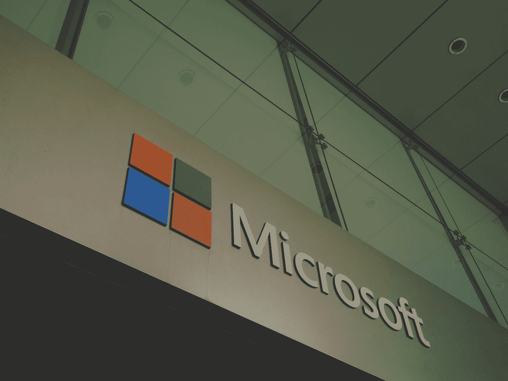

# 微软现在正在打造一些特别的东西。

> 原文：<https://blog.devgenius.io/microsoft-are-building-something-special-right-now-aaca526a66d0?source=collection_archive---------13----------------------->

在 [Unsplash](https://unsplash.com?utm_source=medium&utm_medium=referral) 上由 [Franck V.](https://unsplash.com/@franckinjapan?utm_source=medium&utm_medium=referral) 拍摄的照片

微软今年在 Windows、Xbox 和 Surface 系列上做了一些很棒的事情，而且还会有更多的事情发生，这是一个成为 Windows、Surface 或 Xbox 用户的非常有趣的时间。

从 5 月 19 日到 21 日，微软举行了他们的年度构建开发者大会，但由于当前的疫情，这一次都是在线的，这里有一些有趣的观点…

**微软将通过新项目 Reunion 统一 Windows 桌面和 UWP 应用。**

代替 Word、Excel 或 PowerPoint，该公司已经创建了在网络上运行的办公内容块。您在 office 文档中找到的表格、图形和列表正在转变为存在于传统文档之外的实时协作模块，并在过程中使 Office 现代化。

**微软将把 Linux GUI 应用程序引入 Windows 10。**

所有这些都是为了通过实时网络同步和开源将 Windows 推向未来，使 Windows 和 office 现代化，成为每个人的操作系统和生产力工具。

最后，在软件方面，流畅的用户界面设计是微软最新的设计语言，它看起来漂亮干净，颜色很棒。

Windows 10 流畅的用户界面图标

接下来让我们来谈谈这个假期将推出的 Xbox Series X 和微软的下一代游戏主机。

这个东西是一个野兽，它向后兼容所有以前的 Xbox 主机，这是一个很好的方式来保留你喜欢的旧游戏，但不希望那些巨大的旧主机占据空间。

具体来说，听起来它将是今年包括索尼 Playstation 5 在内的 2 款新游戏机中功能更强大的一款，这款经典的控制器再次进行了调整，但仍然保持了经典的外观。

这里有几个规格为铁杆玩家…

还不知道价格，但我预计大约 450-500 美元，但我们可能会在仲夏知道。

最后，我们有表面线。

Surface Go 2 和 Surface Book 3 本月刚刚发布，两者内部都有规格凸起，Go 2 的屏幕略大，这两款设备都很棒，Surface Book 3 是我目前最喜欢的设计，采用了令人惊叹的铰链设计。

Surface Book 3 独特的铰链。

和以前一样，Surface Book 3 配备了 13.5 英寸或 15 英寸的显示屏，当然还配备了可拆卸的平板电脑屏幕，13.5 英寸的机型起价为 1599 美元，基本机型采用了第 10 代英特尔酷睿 i5 处理器，英特尔 Iris Plus 显卡，8GB 内存和 256GB 存储空间。

Surface Go 2，Surface Book 3，Surface 耳塞和 Surface 耳机 2。

15 英寸机型在基本规格上有了很大的飞跃，包括第 10 代英特尔酷睿 i7 处理器、Nvidia GeForce 1660 Ti Max-Q GPU、16GB 内存和 256GB 固态硬盘。

另一方面，Surface Go 2 的起价为 399 美元，与之前的型号相同。Wi-Fi 基本型号从英特尔奔腾黄金 4425Y CPU、4GB 内存和 64GB eMMC 存储开始。你可以花 549 美元将内存翻倍至 8GB，存储提升至 128GB。

Surface Go 2 带配件。

我会推荐 629 美元的高端版本，配备第八代英特尔酷睿 m3-8100y CPU，8GB 内存和 128GB 固态硬盘，大多数评论显示这是一个很棒的设备，在 m3 芯片上运行得很好，在长期使用中更好。

这些价格不包括可选的(也是推荐的)type cover 键盘，基本版的价格为 99 美元，签名版为 129 美元，但你当然可以使用原始 Surface go 的 Type Cover 键盘，因为它的尺寸相同，只是屏幕更大。

Surface 耳塞和耳机 2 也发布了，它们看起来都很漂亮，耳塞的情况非常独特。

Surface 耳机 2 和耳塞。

我使用 AirPods Pro 和 Galaxy Buds，但我希望很快就会看到这些，因为我喜欢耳塞的独特外观，哑光黑色耳机 2 获得了很好的评论，耳塞 199 美元，耳机 2 比原版便宜 100 美元，售价 250 美元。一些你可能想知道的信息，耳塞没有降噪或无线充电功能，耳机 2 有一个麦克风静音按钮和 13 级降噪功能，这非常酷。

最后但同样重要的是 Surface Duo。

这两人运行的是带有微软 launcher 的 Android 10，并将很快获得 Android 11，据微软称，这是一款双屏折叠设备，将于今年夏天推出。

一些规格已经泄露，也许它们不是 2020 年的旗舰规格，但对于这款第一代设备来说应该足够了。

*   **显示屏:** 5.6 英寸 1800x1350p AMOLED 面板，宽高比为 4:3，展开时为 8.3 英寸平板电脑
*   **摄像头:** 11MP 前/后传感器
*   **处理器:**骁龙 855
*   **内存:** 6GB
*   **存储:** 64GB / 256GB
*   **OS:** 安卓 10
*   **安全**:内置指纹传感器
*   **端口:** USB-C，Nano SIM

因此，考虑到所有这些，我仍然认为这是目前最完美的可折叠手机，我理解有些人可能不喜欢中间分开，但这意味着没有塑料屏幕，它实际上可以支持 Surface Pen。

我们必须拭目以待，但这是微软对手机的一次很好的回归，使用 Android 和微软 launcher 意味着这次不会缺少主要应用程序，在 Windows 上结合使用[你的手机应用程序](https://www.microsoft.com/en-gb/p/your-phone/9nmpj99vjbwv?activetab=pivot:overviewtab),你会有一个美妙的 PC 用户体验，就像 iPhone 和 Mac 一样。

所以我们有它，2020 年上半年给了我们许多来自微软的产品，谁知道还会有什么。

激动人心的时刻。

*所有图片均来自微软*