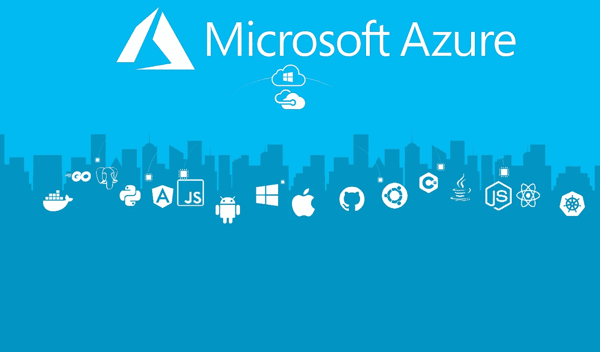
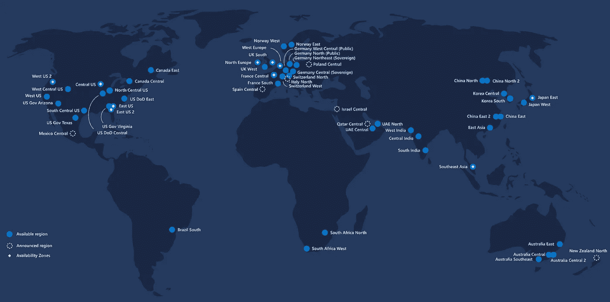

# 微软 Azure

> 原文：<https://blog.devgenius.io/microsoft-azure-d6030e922abc?source=collection_archive---------13----------------------->

# 什么是 Azure？

Azure 提供了 1000 多种云服务，让你可以做任何事情，从在虚拟机上运行现有的应用程序到探索新的软件范例。Azure 云提供了各种基础设施，用于支持构建云托管/云原生应用程序所需的计算、存储和网络资源。Microsoft Azure 提供了一个更加全球化的模型，它比任何其他云提供商都多，在全球分布着超过 54 个地区。

## 微软 Azure 服务

一些 Azure 云服务:

## **计算**

这些服务使用户能够部署和管理虚拟机。

## **数据库**

Azure 提供 SQL 和 NoSQL 数据库服务来集成您的各种首选应用服务。

## **身份**

这提供了控制谁可以访问服务和使用加密密钥保护云中敏感信息的方法。

## **联网**

这使得资源能够连接并管理流量和诊断、负载平衡、DNS 托管和网络保护

## **存储**

Azure 为持久存储提供高可用性、冗余、安全和可扩展的服务。

## **媒体和内容交付网络(CDN)**

CDN 服务包括点播流、数字、内容缓存权限保护、编码、媒体回放和索引。

## **人工智能和机器学习**

这些服务范围广泛，融合了人工智能、机器学习和认知计算能力

## **安全**

Azure 已经实现了各种服务，以确保在访问 Azure 资源时有适当的授权。

# **Azure 的好处**

随着技术的不断变化，本地大型机似乎将被云提供商数据中心所取代。这是因为云计算带来了很多好处，并寻求解决内部数据中心的麻烦。以下是云的一些优势:

**灵活性**

Azure 允许用户在几分钟内立即启动全球范围内的多个资源。相比之下，传统的静态数据中心可能需要硬件、人力资源和更多的时间。

**成本**

这可能是使用 Azure 的最大好处。Azure 计费采用的是**现收现付**模式。这给了用户在使用时为服务付费的好处。然后每月向客户开账单。对于传统的数据中心，会有巨大的**资本支出(CapEx)** 如物理服务器和基础设施设备，如路由器、负载平衡器和网络电缆，以及**运营支出(OpEx)** 如 IT 专业知识、电费和建筑租金。

**灾难恢复**

灾难总是有可能发生，重要数据可能会丢失。有了 MicrosoftAzure，这些数据可以变得高可用性、冗余和健壮。这可以在出现任何意外结果时保护您的数据。

**牢牢抓住核心**

Azure 围绕安全性构建了它的数据中心。安全性不是可有可无的，它是平台的核心。客户可以从广泛的安全工具、防火墙、加密和身份验证方法中进行选择，以保护他们的数据，他们甚至可以加密数据，使其只能由具有安全密钥的人访问。

# 核心 Azure 架构组件

*   地理
*   地区
*   可用性区域

**地理位置**

Azure 基于地缘政治或国家边界定义的地理分布其资源。

**地理优势**

*   确保低潜在数据符合数据驻留和法规遵从性要求。
*   确保满足数据驻留、主权、合规性和弹性要求
*   通过连接到专用的高容量网络基础设施，确保容错能力，以承受整个区域的故障

这可以包含两个或多个区域。用户可以选择存储数据的位置。

**美洲**、**欧洲**、**亚太**、**中东**和**非洲。**

**地理区域**

第一区

美国西部、美国东部和欧洲

**二区**

澳大利亚中部、日本西部和印度中部

**三区**

仅巴西南部

**DE Zone1**

德国中部和德国东北部

**地区**

这是地球上的一个地理区域，其中包含至少一个(但大多数是多个)数据中心，这些数据中心位于附近，并与低延迟网络紧密相连。地区的例子有美国西部、加拿大中部、西欧。

**区域配对**

每个地理区域有两个或更多的区域。每个区域都包含一个区域对。一个地区只能与同一地理区域内的另一个地区配对。这意味着如果一个区域被更新，则一对区域也被更新，并确保数据符合要求。

这有助于降低由于不可预见的事件(如自然灾害、内乱、停电或同时影响两个地区的物理网络中断)而导致中断的可能性。

**特殊地区**

Azure 有一些特殊的区域，出于合规或法律原因，您可能希望在这些区域构建您的应用程序。这些包括

*   美国政府

-各种美国政府区域

*   世纪互联控制

-中国(中国东部，中国西部)

*   T-Systems 德国数据受托人

-德国中部和德国东北部

**可用区域**

每个区域由多个可用地带组成。这些 az 是区域内物理上独立的数据中心。每注**az 并非在所有地区都可用。**区域内的每个数据中心都有自己的冷却能力和网络。区域通过高速专用光纤网络连接。每个区域有三个区。当您实施 AZs 时，您是针对数据中心故障实施的。这是一个可选的服务，你需要实现它，将需要额外的费用。

az 主要用于虚拟机管理的磁盘、负载平衡和 SQL 数据库。支持 AZs 的 Azure 服务分为两类

**区域服务-** 将资源锁定到特定区域

**区域冗余服务—跨区域自动复制**

*这是关于理解微软 Azure 的系列博客的一部分*

1.  [微软 Azure](https://medium.com/dev-genius/microsoft-azure-d6030e922abc) ***<你在这里***
2.  [Azure 管理工具](https://medium.com/@ianodad/azure-management-tools-1ce9541dbbc9)
3.  [Azure Compute](https://medium.com/dev-genius/azure-compute-182e263008f4)
4.  [蔚蓝网络](https://medium.com/@ianodad/azure-network-148f23813d3c)
5.  [天蓝色储物](https://medium.com/@ianodad/azure-storage-395d44e99787)
6.  [Azure 数据库](https://ianodad.medium.com/azure-database-2cb4a99bf8c2)
7.  [Azure 安全、隐私、合规和信任第 1 部分](https://ianodad.medium.com/azure-security-privacy-compliance-and-trust-part-1-60a5ad3d9576?source=your_stories_page-------------------------------------)
8.  [Azure 安全性、隐私、合规性和信任第 2 部分](https://ianodad.medium.com/azure-security-privacy-compliance-and-trust-part-2-e3c94d498a5c)