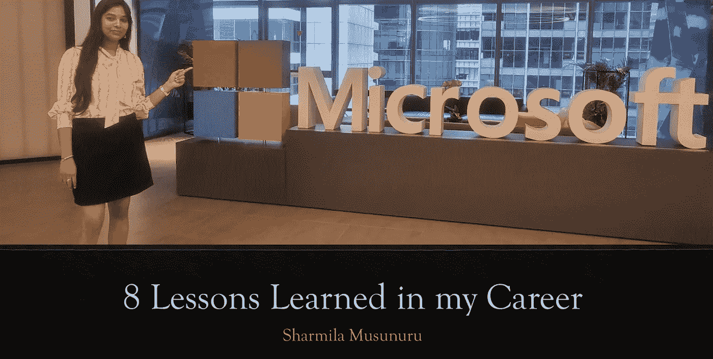
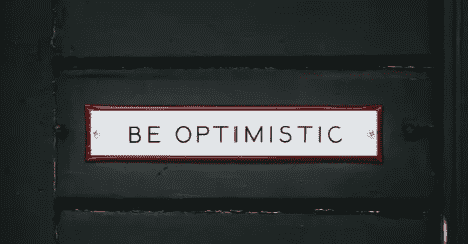

# 微软:云解决方案架构师@27- 8 我职业生涯中的经验教训

> 原文：<https://blog.devgenius.io/microsoft-cloud-solution-architect-27-8-lessons-learned-in-my-career-7dcf8e1a0740?source=collection_archive---------9----------------------->

作者照片

让我先简单介绍一下我自己:我叫 Sharmila，是微软的一名软件工程师，今年 **27 岁，是一名云解决方案架构师。**

2021 年，在工作 6 年后，我开始为**微软**工作。

我将分享**一些我希望在这篇文章**中早点知道的教训——我在整个职业生涯中学到的教训。这些见解来自我自己的经历和个人信念。希望对你有用。

## 1.如果你因为缺乏经验而不采取行动，你将永远不会获得经验。

艾琳在 [Unsplash](https://unsplash.com/photos/5d5DSRQ5dUc) 拍摄的照片

尽管有经验会有所帮助，但你不需要成为专家就能开始行动。与普遍的看法相反，应用你所学的东西可以帮助你积累经验。

不要让你对犯错误的恐惧或对不知道所有事情的担心阻碍你。

**行动起来，寻求帮助，做出努力。我相信你会设法把事情办好的。**

人们倾向于专注于他们的目标，但是你应该努力享受你的旅程。

> 目标会走到尽头，但你的学习之路永远不会。

## **2。你不需要有很好的英语。**

米格尔在 [Unsplash](https://unsplash.com/photos/RfiBK6Y_upQ) 上拍摄的照片

这是对上一课的补充，但它值得单独讨论。除了标题中所说的，这里没有太多要说的:你不需要把英语说得完美无缺，或者像一个以英语为母语的人一样。

在办公室没有人会注意到你的语法错误。不要误解我；我不是说如果你有机会就不应该努力提高你的英语水平；相反，我是说你不应该让你对不完美的恐惧阻止你迈出下一步。

## **3。你并不比 FMAANG 的工程师优越。**

内森在 [Unsplash](https://unsplash.com/photos/eZIzlTVgqNU) 上拍摄的照片

五大科技巨头脸书、微软、亚马逊、苹果、网飞和 Alphabet(G 代表 Alphabet 的主营业务谷歌)统称为首字母缩写 FAANG。

当我刚开始在微软工作时，我有点担心自己是否能和同事们平起平坐。

然而，我**很快意识到，FMAANGs 的每个人都是普通人**，他们对一些事情很了解，但对另一些却不了解。是的，我在微软交了一些非常好的朋友，但我也在我以前的一些雇主那里交过朋友。

> **最后，每个人在任何地方都有值得学习和教授的东西。**

即使我现在是一名工程师，也没人能和我相比。没人比我差。你不比我差也不比我好。我永远不会什么都知道，也不会什么都知道。

> **秘诀是愿意与他人分享知识。**

## **4。你不可能一蹴而就。**

布里吉蒂在 [Unsplash](https://unsplash.com/photos/EAay7Aj4jbc) 上的照片

不管是因为性格特征还是我的成长经历，我一直在努力不让事情半途而废。我倾向于立刻完成所有的事情，包括研究报告、叙述和说明书。

但这就是问题所在。设定优先顺序通常需要留下一些未完成的事情。此外，除了简单的工作，我还会优先考虑其他事情，比如睡眠、自理、创造力和人际关系。经过一番考虑，我决定不为工作牺牲自己。

生活比工作多得多，所以为了给那些事情创造时间，我需要愿意把完成任务推迟到第二天、下一周，甚至根本不做。

通过确保我完成必要的任务(**以及对我将交付和不会交付的东西的期望**)。

> **然而，因为我不是机器，也不是超人，所以我必须建立并坚持界限。**

## 5.这并不总是关于你

沙福尔勒在 [Pixabay](https://pixabay.com/illustrations/stone-push-overcoming-obstacle-2127669/) 拍摄的照片

认为所有的成就和失败都与个人有关的倾向很普遍。但是今年，我明白了，有时候，与我的想法不一致的选择与我无关，也与我做得有多好无关。

为什么这很重要？

这些知识使我能够更沉着地应对出现的问题。

这些选择不是个人的；它们经常反映出我无法控制的方法或目的。

## 6.注意你的健康

Logra 在 [Pixabay](https://pixabay.com/photos/yoga-fitness-exercise-health-body-3053487/) 拍摄的照片

你一天的大部分时间都坐在电脑前。长期的不良姿势会导致严重的背部问题，这些问题会非常痛苦，甚至无法治愈。

购买符合人体工程学的桌子、椅子、键盘和鼠标。保持良好的姿势。

**试着定时起床，消耗水分，得到足够的休息，去健身房。**

当我年轻的时候，我也有同样的想法。然而，随着年龄的增长，你的身体会开始感受到你不良行为的负面影响。

## 7.少说多听。

艾托夫在 [Pixabay](https://pixabay.com/photos/conversation-talk-bird-blue-tit-3513843/) 上的照片

我学到的最重要的一课是永远向别人学习。

我必须承认，我偶尔还是需要告诉自己“闭嘴，倾听”

事实上，房间里总有人比你更有知识。只要记住他们可能不总是广播它。

> 愿意调整自己的心态，乐于接受批评。

**与他人分享你的想法，让他们推动你，尤其允许他人挑战你。**谢天谢地，有很多方法可以帮助。

## **8。采用“跳出框框”的思维。**

佳伟在 [Unsplash](https://unsplash.com/photos/W-ypTC6R7_k) 上的照片

作为**开发团队和业务团队之间纽带的重要团队成员之一是架构师。**

> 为此，你应该尽可能多地了解这家公司和产品。

在此基础上，您将学习如何在考虑技术和业务因素的同时做出选择。

最终，你会意识到大多数决定都是基于风险和预期回报。

创建为人们提供价值的高质量软件的关键是理解你为之构建架构的业务，保持与业务团队和开发团队的联系，理解程序和产品的路线图，以及理解客户的抱怨和挫折。

> 敬请关注并关注 [me](https://medium.com/@musunurusharmila/) 获取更多更新。别忘了给我们你的👏如果你喜欢阅读这篇文章来支持你的作者。！！
> 
> *如果你想阅读更多的加入 Medium $5 会员优惠，请点击这里的链接。*

