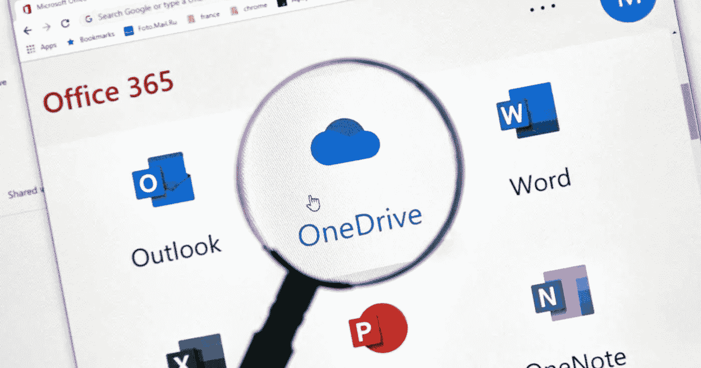

# 微软已经宣布，Windows 7 和 8 的 OneDrive 升级将于 3 月份停止。

> 原文：<https://blog.devgenius.io/microsoft-says-onedrive-clients-on-windows-7-8-or-8-1-c3f8a7293813?source=collection_archive---------8----------------------->

从 getsupport.co.uk 取回

微软表示，从 2022 年 3 月 1 日开始，Windows、7、8 或 8.1 上的 OneDrive 客户端将无法与云匹配，正如其技术社区聚会上的[博客条目所示。OneDrive 目前同样不会获得更新，以防在没有引入 Windows 10 或 Windows 11 的框架上运行。](https://techcommunity.microsoft.com/t5/microsoft-onedrive-blog/end-of-support-for-onedrive-desktop-application-on-windows-7-8/ba-p/2929066)

在任何情况下，文档都将从 OneDrive 应用程序中打开，无论您使用的是何种形式的窗口，它们在这一点上不会随后传输到云。为了避免 OneDrive 出现任何问题，微软规定在第二年 3 月之前升级到更新鲜的 Windows 版本。关于不能运行 Windows 10 或 Windows 11 的框架，微软表示，客户可以在任何情况下通过将记录转移到 OneDrive 网络应用程序来备份记录。

除了停止更新和同步功能，[Windows 7、8 和 8.1 上的 OneDrive 将于 1 月 1 日](https://support.microsoft.com/en-us/office/onedrive-sync-app-no-longer-supported-on-windows-7-8-or-8-1-a3bd41c7-5f82-42c3-aa46-de782581be2a)失去支持。正如微软所指出的，这种变化的理由是将资源集中在新的进展和工作框架上，并为客户提供最具前瞻性和最安全的见解。

随着微软在 2018 年和 2020 年结束 [Windows 8.1 和](https://docs.microsoft.com/en-us/lifecycle/products/windows-81) [Windows 7 的标准帮助，Windows 8 的](https://www.theverge.com/2020/1/14/21065122/microsoft-windows-7-end-of-support-lifecycle-millions-pcs)[生命周期于 2016 年](https://docs.microsoft.com/en-us/lifecycle/products/windows-8)结束。由于微软打算在 2025 年结束对 [Windows 10 的支持，这很可能是开始规划 Windows 11 升级的理想机会。](https://www.theverge.com/2021/6/14/22533018/microsoft-windows-10-end-support-date)

如果你喜欢这篇文章，并想支持我写更多这样的文章，考虑注册成为一个媒体成员。只需 5 美元，你就可以无限制地阅读媒体上的故事。

 [## 通过我的推荐链接加入 Medium—David Artykov

### 作为一个媒体会员，你的会员费的一部分会给你阅读的作家，你可以完全接触到每一个故事…

david-artykov.medium.com](https://david-artykov.medium.com/membership)