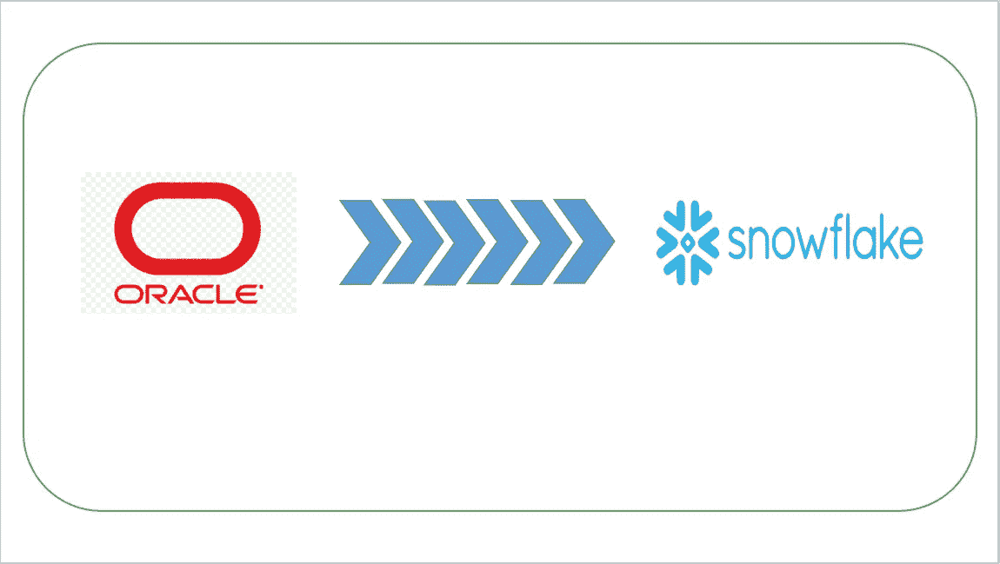
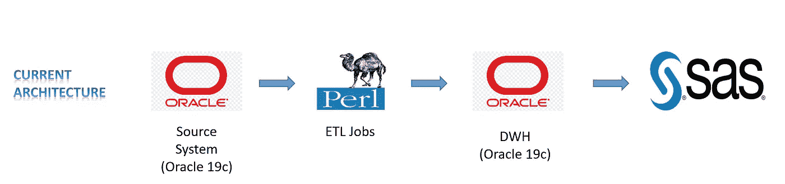

# 从 Oracle 2 雪花迁移:第 1 部分

> 原文：<https://blog.devgenius.io/migrating-from-oracle-2-snowflake-part-1-f0c2c3907202?source=collection_archive---------2----------------------->

在这篇博客中，我想分享我从 Oracle 迁移到雪花的 POC 体验。我将分享当前的架构和高层次的拟议架构师，并愿意分享我们为实现预期目标所采取的一步一步的行动。

**注意:这更多地是为了让人们了解在 Oracle 到雪花迁移过程中可能面临的挑战。所有建议都是我个人的，与我的雇主(过去/现在)无关。**

在我们进入真正的行动之前，我想设定一下背景，这样我们在项目范围方面就有了共识。

在本次概念验证中，我们将使用 Python、Azure 和雪花迁移现有的 Perl 脚本和 Oracle 19C 数据库。在现有的架构中，Perl 被用作 ETL 工具，从源系统获取数据，并调用 Oracle 数据库中编写的几个业务例程进行转换，最终插入到 Oracle DWH 中。然后，现有的 SAS 团队使用这些数据进行进一步处理。所有业务逻辑都驻留在 Oracle 数据库中。Perl 更多的是用于文件处理和过程调用。Perl 作为最古老的脚本语言之一，缺乏对现代应用程序的支持

如您所见，我们使用的是非常传统的工具集，有许多挑战我们无法使用当前的体系结构来应对。一些挑战如下:

1.  **缩放**
2.  **平台现代化开启未来机遇。**
3.  **减少维护开销**
4.  **降低成本**
5.  **性能**
6.  **云透视。**
7.  **许可负担**

让我们就每个挑战进行更多的讨论，以确定雪花与 Oracle 的不同之处以及选择雪花的原因。

**可伸缩性:**可伸缩性是大多数本地数据库的主要问题之一。考虑到有限的内部资源，本地数据仓库通常缺乏云数据仓库可以轻松提供的扩展能力。就 Oracle 而言，扩展只能局限于组织进行的硬件投资。然而，Snowflake 采用的是按使用付费的模式，这种模式可以让您在不增加任何资本支出的情况下立即无缝扩展。

**平台现代化:**由于我们的平台主要涉及旧的内部部署技术，我们缺乏开拓新的可能性来扩展我们的应用范围并与新一代工具集对话。来自雪花的 AI/ML 开箱即用的支持让我们在市场上占了上风。

**降低维护开销:**雪花作为云数据仓库**即服务**进行营销，管理我们作为 Oracle 数据库管理员必须完成的所有管理任务。HA & DR 随时可用，因为雪花自动同步到多个可用性区域。就 Oracle 而言，我们确实有多个高可用性灾难恢复选项，但我们必须购买硬件来进行设置。

**降低成本:**由于我们正在脱离传统的资本支出模式，转向 OPEX 模式，我们正在节省资本支出成本。此外，雪花是作为服务提供的，因此大多数管理工作都是现成可用的，我们不需要高薪管理团队。节省资源也很重要。

**性能:**在 Oracle 中，我们必须进行大量的性能调优、索引&统计数据维护以及其他许多工作，以满足性能需求。雪花通过内置的性能调整降低了复杂性，因此不需要手动查询优化。

**云视角:**云是一种新常态，它也为从多个数据源和多种数据格式中获取数据提供了可能性。雪花支持从多个数据源获取数据，并支持使用不同数据类型所有主要数据格式。在 Oracle 中，这些东西不是现成的，您必须编写很长的 PL SQL 来处理它们。

**许可负担:** Oracle 因其许可成本(人均)而闻名，由于 Oracle(如企业级数据仓库)不可用，大多数组织未能尽早获得使用 Oracle 的机会，现在都选择了雪花。Snowflake 没有任何许可费用，因为它工作在“按使用付费”模式。

很少有更多特征吸引我们去雪花:

**现有技术资源的再利用:**迁移到雪花的最大好处是，你不需要花费在提升你的内部资源上。来自 Oracle 后台的资源可以很容易地掌握雪花的技能集，因为雪花遵循 ANSI SQL 标准，并且除了少数 Oracle 专有语法之外，大多数 Oracle 语法看起来是相似的。因此，您可以重新利用世界上最广泛使用的编程技能，而不需要更多的开销，而转移到雪花。

**生态系统支持:**雪花拥有庞大的支持[生态系统](https://docs.snowflake.com/en/user-guide/ecosystem.html)数据集成、安全&治理、商业智能、ML &数据科学。这有助于满足应用程序增长的任何未来需求。

**数据共享&数据集市:**雪花有独特的数据共享&数据集市，可以帮助你营销你的数据或分享或获取任何数据。安全数据共享允许您的帐户与其他雪花帐户共享数据库中的选定对象。

**时间旅行:**雪花 [**时间旅行**](https://rajivgupta780184.medium.com/snowflake-time-travel-how-cool-is-this-62523ff81db) 可以在定义的时间段内的任何时间点访问历史数据(即已被更改或删除的数据)。它给了你通过 SQL 语句从过去获得任何数据的能力。不需要更多 DBA 路由。很酷吧。

**零拷贝克隆:**克隆也称为“ [**零拷贝克隆**](https://rajivgupta780184.medium.com/snowflake-zero-copy-clone-demo-ec1c8676bed4) ”创建数据库、模式或表的副本。创建克隆时，会拍摄源对象中存在的数据的快照，并将其提供给克隆的对象。克隆的对象是可写的，并且独立于克隆源。也就是说，对源对象或克隆对象所做的更改不属于另一个对象。克隆数据库将克隆该数据库中的所有模式和表。克隆一个模式将克隆该模式中的所有表。

在 Snowflake 中，有更多面向未来的现成特性，如**自动聚类、** [**表交换**](https://rajivgupta780184.medium.com/snowflake-table-swap-use-case-demo-67ae3af8723f) 等。

我们的 POC 当前架构如下所示:

现有架构

我们提议的概念验证架构如下:

1.  Perl → Python
2.  甲骨文 DWH → [Azure Blob + Snowpipe +雪花 DWH](https://rajivgupta780184.medium.com/real-time-iot-data-ingestion-using-snowflake-snowpipe-on-azure-4a113bc4092c)

以上选择不仅让我们摆脱了许可证/人员负担，还为我们提供了面向未来的现代云平台。还有助于我们克服当前架构中面临的所有挑战。

如需进一步阅读，请等待即将发布的关于从 Oracle 2 雪花迁移的博客:第 2 部分

希望这篇博客能帮助你理解为什么要从 Oracle 迁移到雪花。如果你对此有任何疑问，欢迎在评论区提问。如果你喜欢这个博客，请鼓掌。保持联系，看到更多这样的酷东西。谢谢你的支持。

**你可以找我:**

**跟我上媒:**[https://rajivgupta780184.medium.com/](https://rajivgupta780184.medium.com/)

**在推特上关注我:**【https://twitter.com/RAJIVGUPTA780 

【https://www.linkedin.com/in/rajiv-gupta-618b0228/】在 LinkedIn 跟我联系:

**订阅我的 YouTube 频道:**[https://www.youtube.com/channel/UC8Fwkdf2d6-hnNvcrzovktg](https://www.youtube.com/channel/UC8Fwkdf2d6-hnNvcrzovktg)

#坚持学习#坚持分享#每天学习。

# 参考资料:-

*   [https://www.snowflake.com/](https://www.snowflake.com/)