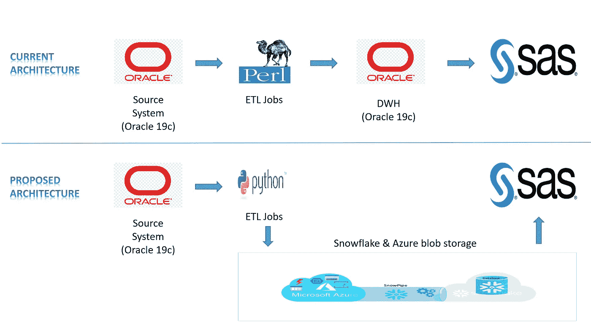
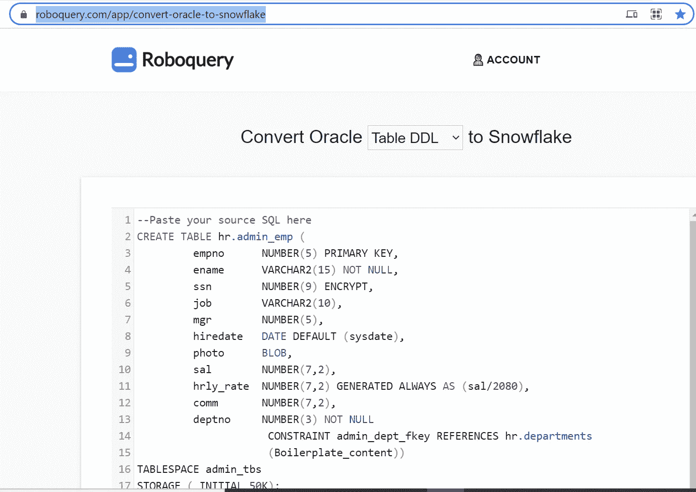

# 从 Oracle 2 雪花迁移:第 2 部分

> 原文：<https://blog.devgenius.io/migrating-from-oracle-2-snowflake-part-2-bfe8ca076ac8?source=collection_archive---------2----------------------->

这篇博客是我之前的博客 [**从 Oracle 2 雪花迁移:第一部分**](https://rajivgupta780184.medium.com/migrating-from-oracle-2-snowflake-part-1-f0c2c3907202) 的延续，我想继续分享我从 Oracle 迁移到雪花的经历。

**注意:这更多的是为了让人们了解在 Oracle 到雪花迁移过程中会面临哪些挑战。所有建议都是我个人的，与我的雇主(过去/现在)无关。**

在前一篇博客中，我分享了我现有的架构。现在，您可以看到当前架构和建议的架构图之间的比较。

现有和提议的架构

在提议的架构中，我们已经将所有用 Oracle 过程编写的业务逻辑转移到 Python 脚本中。Azure blob 存储用于将处理后的数据存储为外部阶段。当文件上传到 Azure blob 存储时，一个事件将被触发，并启动 Snowpipe 从 Azure 接收数据并插入到雪花中。在成功地将数据摄取到最终表中时，将从 blob 中清除所有原始数据以节省成本。然后，现有的 SAS 团队使用这些数据进行进一步处理。

到目前为止，您可能已经感受到了我们为了成功迁移而必须处理的范围和复杂性。因为我们触及了应用程序部分的中间部分，所以我们必须将源和目标系统作为一个结果来处理。此外，我们正在将本地 RDBMS 迁移到云数据仓库，并从古老的脚本语言迁移到具有云就绪支持的新时代脚本语言。我们已经将项目分成以下几个阶段。

1.  分析
2.  无线一键通
3.  关于现有对象迁移、海量数据迁移策略和差距填补(如果有)的决策
4.  设置新架构和测试
5.  启动

我们从第一步**分析开始了我们的旅程。**在这一阶段，我比较了当前架构中的所有东西，以及我们如何在提议的架构中融入这些东西。我们必须隔离的和我必须替换的都不能被移动到雪花。

我从 **Oracle 对象迁移分析开始了我的分析之旅，**考虑到我们当前的应用程序不是实时应用程序，我们经常批量获取数据，然后在所有转换&聚合之后，调度作业将数据泵入我们的数据库。我们的餐桌数量有限。

所有的表都使用了非常标准的数据类型，比如 Number、Varchar2、Date、char、Timestamp 等。我看不出将它们迁移到 Snowflake 有什么困难，因为它们要么已经可以编译了，要么只需要很少的关注。

在将 Oracle DDL 迁移到雪花之前，您需要注意几件事情。

1.  雪花中没有 Varchar2 数据类型，而是将所有的 Varchar2 转换为 Varchar。Char 可以按原样使用。
2.  雪花创建表不需要我们在 Oracle 中用来创建表的所有额外信息，如表空间名称、静态分区(如果是分区表)等等。由于雪花处理大部分管理工作，我们没有任何开销来提供或维护这些工作。
3.  Oracle 支持没有小数位数和精度的数据类型 NUMBER。如果不提供小数位数和精度，oracle 将不会出错，并按原样存储数据，包括十进制值。在雪花的情况下，你必须特别提供精度，否则它将被创建为 0。如果你不考虑这一点，你可能会在加载时遇到错误或者数据被截断。
4.  在 Oracle 中，日期数据类型以相同的数据类型存储日期和时间，但在雪花日期数据类型中仅存储日期。如果您在 Oracle 中的源数据类型为日期数据类型，并且同时具有日期和时间，请确保在雪花中创建时间戳 _NTZ 数据类型的列，以保留源日期和时间。
5.  在 Snowflake 中，您可以创建诸如 not null、主键、外键等约束。就像在 Oracle 中一样，但在雪花中只有 Not Null 是受尊重的。他们更多的是维护遗留数据模型。您必须确保在应用层处理主键和外键登录，这样才不会弄乱数据。
6.  关于雪花支持的数据类型的更多细节可以在 这里找到 [**。**](https://docs.snowflake.com/en/sql-reference/data-types.html)

现在我们开始分析其他 Oracle 对象，如**视图、函数、过程、包、行 ID 和杂项。**

1.  Oracle 视图与雪花视图没有什么不同。前提是您的 Oracle 视图不使用任何 Oracle 专有语法或内置函数，这在雪花中是不容易得到的。在这种情况下，您必须在迁移过程中在 Snowflake 中找到替代项并替换它。
2.  您不能迁移现有的 Oracle 函数& procedure，因为雪花函数& Procedure 是一个更倾向于 Java 的程序。
3.  雪花存储过程允许您通过将雪花 SQL 与 JavaScript 相结合来扩展雪花 SQL，以便您可以包含诸如分支和循环之类的编程结构。
4.  雪花存储过程细节可以在 这里找到 [**。**](https://docs.snowflake.com/en/sql-reference/stored-procedures.html)
5.  雪花功能详情可以在 [**这里**找到。](https://docs.snowflake.com/en/sql-reference/sql/create-function.html)
6.  雪花不支持该包。因此，如果您 Oracle 源数据库中有包，那么您必须将逻辑移动到雪花过程(Java)和函数(Java)中，或者需要将逻辑移动到应用层。
7.  如果你在你的代码中使用了 Oracle ROWID，那么你必须使用一些替代来替换它，因为雪花不支持 ROWID。
8.  你不能用减号运算符在雪花中扣除两个日期，这是我们在 Oracle world 中习惯做的。为了达到同样的目的，我们必须使用雪花中的 DATEDIFF 内置函数。
9.  我们不能在雪花 SQL 中使用 Oracle 提示。在将它们迁移到雪花时，您必须将它们从 SQL 中移除。雪花提供了非常有限的选项来调整，因为所有这些都是由雪花自动照顾，我们不必采取相同的开销。
10.  如果你来自 Oracle 背景，你必须精通著名的对偶表。雪花支持双表查询。因此，如果您有任何基于对偶表的逻辑，它可以随时编译，无需任何更改。
11.  雪花中没有**索引**的概念。在 Oracle 中，我们有各种各样的索引来处理性能问题。出于这样或那样的原因，大多数人都在表上创建了索引。可以说 index 是 Oracle world 中非常常见的性能调优工具，在每个项目中都有广泛的应用。
12.  在 Oracle 中，我们必须承担维护物化视图的开销，而在 Snowflake 中，这对我们来说是透明的。虽然，我们将以信用的形式收取所有由雪花完成的维护费用，但至少我们不必承担管理部分的费用。

如果你不想在手工或通过自动脚本转换 Oracle DDL 上投资太多，你也可以利用使用 [**ROBOQUERY**](https://roboquery.com/app/convert-oracle-to-snowflake) API。

由于我们只有有限数量的标准数据类型的表，我们看不出投资开发一个迁移 DDL 的工具有什么动机。我们选择编写一个自动化脚本，它由逻辑提供支持，通过读取 Oracle DDL 脚本来处理我们的源表数据类型，并通过读取数据类型映射元数据表来映射雪花数据类型。这解决了我们的问题，因为我们的源表没有保存任何需要特殊处理的特殊数据类型。

如需进一步阅读，请点击**从 Oracle 2 雪花迁移:第 3 部分**

希望这篇博客能帮助你了解我们如何从 Oracle 迁移到雪花。如果你对此有任何疑问，欢迎在评论区提问。如果你喜欢这个博客，请鼓掌。保持联系，看到更多这样的酷东西。谢谢你的支持。

**你可以找我:**

**跟我来中号:**[https://rajivgupta780184.medium.com/](https://rajivgupta780184.medium.com/)

**推特关注我:**[https://twitter.com/RAJIVGUPTA780](https://twitter.com/RAJIVGUPTA780)

**在领英与我联系:**[https://www.linkedin.com/in/rajiv-gupta-618b0228/](https://www.linkedin.com/in/rajiv-gupta-618b0228/)

**订阅我的 YouTube 频道:**[https://www.youtube.com/channel/UC8Fwkdf2d6-hnNvcrzovktg](https://www.youtube.com/channel/UC8Fwkdf2d6-hnNvcrzovktg)

#继续学习#继续分享#每天学习。

# 参考资料:-

*   [https://www.snowflake.com/](https://www.snowflake.com/)