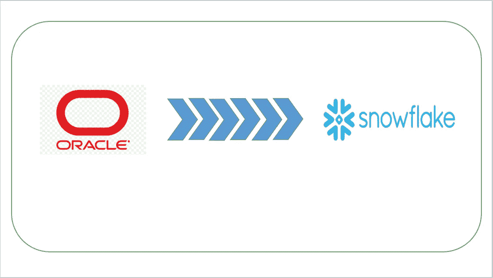
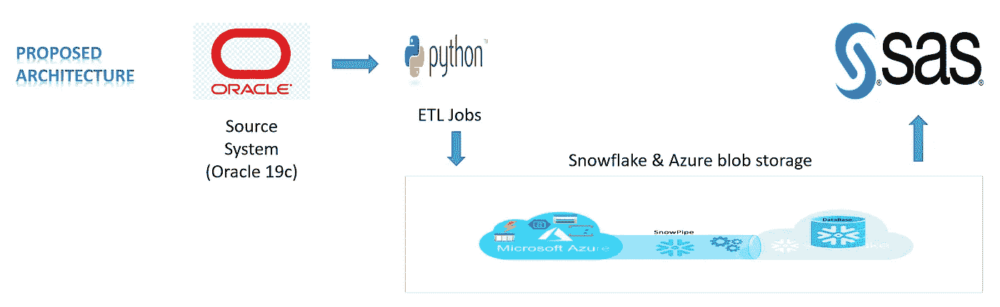

# 从 Oracle 2 雪花迁移:第 3 部分

> 原文：<https://blog.devgenius.io/migrating-from-oracle-2-snowflake-part-3-a11ece17e2d6?source=collection_archive---------2----------------------->

这篇博客是我之前的博客 [**从 Oracle 2 雪花迁移:第二部分**](https://rajivgupta780184.medium.com/migrating-from-oracle-2-snowflake-part-2-bfe8ca076ac8) 的延续，我想继续分享我从 Oracle 迁移到雪花的经历。

**注意:这更多的是为了让人们了解在 Oracle 到雪花迁移过程中会面临哪些挑战。所有建议都是我个人的，与我的雇主(过去/现在)无关。**

在我之前的博客中，我捕捉到了 Oracle DDL &对象迁移策略。在这篇博客中，我的分析将更侧重于从 Oracle 到 Snowflake 的数据迁移。

有两种方法进行数据迁移:

1.  本地方法。
2.  数据迁移产品。

今天，您可能会在市场上找到大量支持 Oracle 到雪花迁移的数据集成工具。所有工具都有利弊，适合您产品的工具可能基于成本、时间表、数据量、复杂性、速度、自动化与手动等因素。

你可以在这里 找到支持雪花生态 [**的整个数据集成工具。**](https://docs.snowflake.com/en/user-guide/ecosystem-etl.html)

今天我将更多地讨论本机方法，因为使用产品的数据迁移可以在他们的手册中很容易地找到。

由于我们的应用低于平均存储大小，我们选择本机方法，而不是现成的迁移产品。正如您在下面的架构中看到的:

提议架构

我们选择 Azure blob 存储作为未来应用流的外部平台。我们利用它来扩展我们的数据迁移路径。此外，我们在内部和 Azure cloud 之间建立了一个专用网络来传输我们的数据。我们根据 [**雪花数据负载考虑**](https://docs.snowflake.com/en/user-guide/data-load-considerations-prepare.html) **对数据进行了批处理。**我们使用 PYTHON 脚本，通过 CLI 批量自动将数据文件导出到 azure blob。

一次，数据被上传到各自容器中的 Azure blob 存储。我们已经设置了外部阶段、文件格式、安全性、使用 Python 批量运行的 copy 语句。

如果您没有大量的数据，并且没有时间压力在紧迫的时间内完成数据加载，上述方法是可行的。

如果您项目需要保持严格的期限和各种其他因素，而这些又不能用本地方法来涵盖，那么您可能会选择迁移产品。

我们选择了几个包含各种数据类型的表，这样我们就可以覆盖我们的应用程序表。还包括其他对象，如视图、过程等。因此，我们已经考虑了迁移到 POC 的所有因素，以做出最佳决策。

我们使用 DDL 迁移 python 脚本和本地方法将表 DDL 迁移到雪花和数据。

然后，我们使用 PYTHON 创建了一个数据验证实用程序来比较 Oracle 和雪花之间的数据。

现在，我们已经完成了我们的分析、概念验证和方法，这是我们在上线期间必须遵循的。是时候决定雪花的大小和设置了。

如需进一步阅读，请点击**从 Oracle 2 雪花迁移:第 4 部分**

希望这篇博客能帮助你了解我们如何从 Oracle 迁移到雪花。如果你对此有任何疑问，欢迎在评论区提问。如果你喜欢这个博客，请鼓掌。保持联系，看到更多这样的酷东西。谢谢你的支持。

**你可以找到我:**

**跟我上媒:**[https://rajivgupta780184.medium.com/](https://rajivgupta780184.medium.com/)

**在 Twitter 上关注我:**[https://twitter.com/RAJIVGUPTA780](https://twitter.com/RAJIVGUPTA780)

**在 LinkedIn 联系我:**[https://www.linkedin.com/in/rajiv-gupta-618b0228/](https://www.linkedin.com/in/rajiv-gupta-618b0228/)

**订阅我的 YouTube 频道:**[https://www.youtube.com/channel/UC8Fwkdf2d6-hnNvcrzovktg](https://www.youtube.com/channel/UC8Fwkdf2d6-hnNvcrzovktg)

#坚持学习#坚持分享#每天学习。

# 参考资料:-

*   [https://www.snowflake.com/](https://www.snowflake.com/)