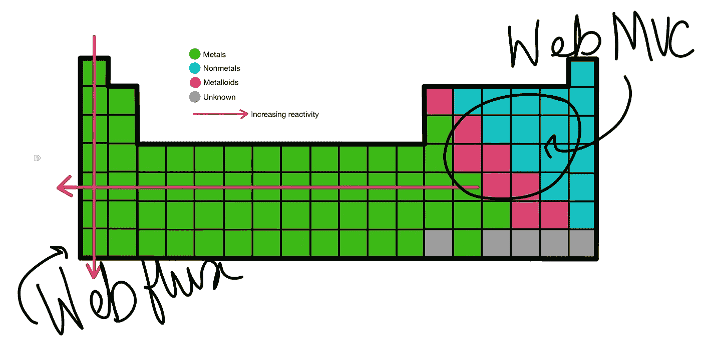
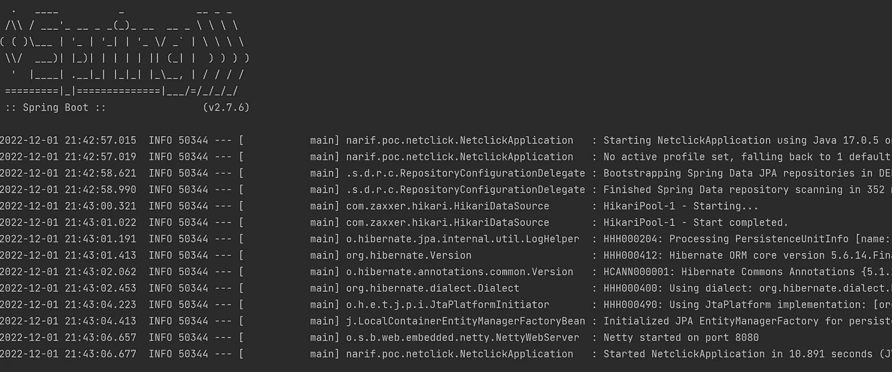
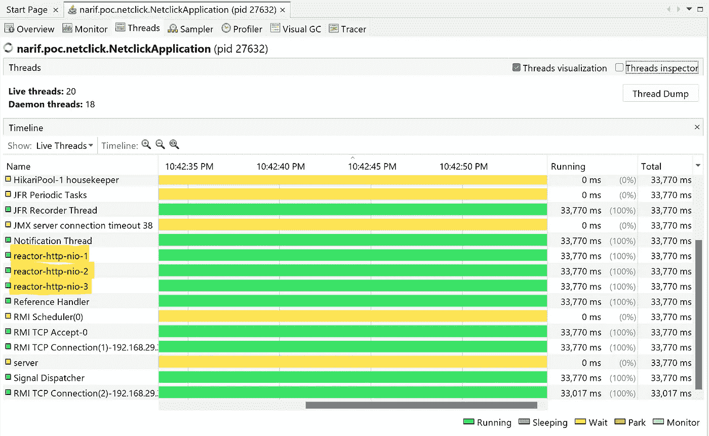
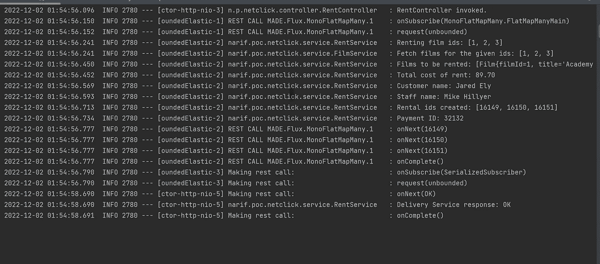

# 从 Spring Web MVC 迁移到 Spring Webflux

> 原文：<https://blog.devgenius.io/migrating-from-spring-web-mvc-to-spring-web-flux-dff8d82af759?source=collection_archive---------1----------------------->

## 从 Spring Web 到 Spring Reactive Web 的实践之旅



Spring 一直是构建 Java web 应用程序的首选框架。然而，随着反应式编程的兴起，出现了一种新的 web 框架，Spring WebFlux 就是其中之一。在本文中，我们将了解如何将现有的 Spring web MVC 应用程序迁移到 Spring WebFlux。Spring MVC 是一个传统的、同步的 web 框架，而 Spring WebFlux 是一个反应式的、非阻塞的 web 框架。这意味着在 Spring MVC 应用程序中，每个请求都由一个线程处理，而在 Spring WebFlux 应用程序中，可以使用多个线程来处理请求。接下来，我们将看看迁移到 Spring WebFlux 的一些好处。其中包括改进的可伸缩性和对异步和事件驱动处理的更好支持。最后，我们将介绍将现有的 Spring MVC 应用程序迁移到 Spring WebFlux 的过程。我们将看到如何改变您的项目结构，更新您的依赖项，并为反应式处理配置您的应用程序。

当从 Spring MVC 迁移到 Spring WebFlux 时，需要记住一些事情。首先，Spring MVC 使用基于 servlet 的架构，而 Spring WebFlux 使用非阻塞、反应式编程模型。这意味着，如果您在项目中使用任何基于 servlet 的依赖项，它们将需要被替换为非阻塞的等价物。此外，Spring MVC 中使用的 ThreadLocal 存储模型与 Spring WebFlux 中使用的反应式编程模型不兼容。因此，任何依赖于 ThreadLocal 存储的代码都需要重写。另一个要考虑的点是检查第三方库的兼容性——如果您使用任何与 Spring Web MVC 接口的第三方库，它们可能与 Spring Web Flux 不兼容。请务必咨询库的维护者或参考他们的文档，看看他们是否支持 Spring Web。最后，由于这两个框架处理请求和响应的方式不同，不修改代码就简单地从一个框架切换到另一个框架是不可能的。也就是说，迁移到 Spring WebFlux 的好处远远超过成本，而且迁移过程相对简单。所以，不要浪费任何时间，让我们开始吧。

## Netclick 应用程序

在这篇博客中，我将使用一个我用 Spring Web MVC 和 Spring Data JPA 编写的示例应用程序。这是一个 REST 应用程序，允许用户搜索电影和租借电影。该应用程序公开了可用于搜索电影的 API，然后使用客户电子邮件中的电影 id 来租赁一批电影。它本身的应用程序小而简单，是为了这个博客而特意编写的。它有一个控制器层、一个服务层和 Dao/存储库层。还有一个客户端层，它主要对其他系统进行 REST 调用。我正在使用一个 postman 模拟服务器来接受一个 REST 调用。至于 DB go，我在 docker 中使用 PostgreSQL，并导入了 dvd-rental 示例 PostgreSQL 数据存储。

[Github 库](https://github.com/NajeebArif/netclick/tree/blocking-bkp)

[样本数据库下载](https://www.postgresqltutorial.com/postgresql-getting-started/postgresql-sample-database/)

将 DB 导入 PostgreSQL 实例后，运行应用程序并点击/films API，您将看到分页的响应。我知道这里的 API 不是在 [Richardson 成熟度模型](https://martinfowler.com/articles/richardsonMaturityModel.html)上的 3 级 REST APIs。但出于演示的目的，它们是可以的。

## 添加 Webflux

与大多数 Spring MVC 应用程序一样，当你运行应用程序时，会启动一个嵌入式 tomcat，并在其上部署你的应用程序。当您第一次启动 netclick 应用程序时，情况也是如此。让我们来改变这一点，最简单的方法就是用 spring webflux 依赖关系替换 spring web 依赖关系。你也可以选择添加 blockhound，但是有一些事情需要小心。首先，blockhound 将[不能与 Java 17+](https://github.com/reactor/BlockHound/issues/291) 一起工作，其次，您还需要添加-XX:+allowerdefinitiontoadddeletemethods 作为您的 JVM 标志。

完成更改后，点击运行按钮并观察日志:



应用程序运行在 Netty 而不是 tomcat 上

之后，您可以点击 API，您将看到应用程序工作没有任何问题。这是不是意味着我们结束了？不。让我们检查日志，看看当我们改变类路径依赖时发生了什么？


一切都在 Reactor HTTP nio 线程上运行

如果你在这里，那么我想，你知道变得被动的西格玛规则。**绝不挡**。真的吗？是啊，算是吧。至少你不应该阻塞那些为 HTTP 请求服务的核心线程。



旨在服务 HTTP 流量的网状线程

查看日志，我们可以清楚地看到所有的操作都发生在 reactor-http-nio-3 线程上，并且它们本质上都是阻塞的(JDBC 或 REST 调用)。我们如何从 netty 线程中移走阻塞调用，并使应用程序具有反应性？为此，我们将开始使用 project reactor，它是一个 [Reactive Streams 规范的](https://www.reactive-streams.org/)实现，正在 Spring weblux 中使用(当然，我们正在从 spring web mvc 迁移到 spring webflux)。

## 诀窍是

这里的诀窍很简单:

*   慢慢来，也就是一层一层来。
*   你可以从任何一层开始。
    —从 DB 到 Rest 控制器层，即从最内层到最外层。
    —从 Rest 控制器层到 DB 层，即从最外层到最内层。
    ——或者任何命令你的东西；)

# 实施

主要思想和最重要的策略是一层一层地移动。但我更喜欢的方法是从最内层开始，然后慢慢向顶层发展。但是在这里，我不会考虑任何顺序，而是随机选择层，从阻塞代码转移到非阻塞代码。我只会将租借影片的流量转换为反应式，而不是整个应用程序。因为一旦我们完成了一个流程，我想你会准备好拿其他流程作为练习的例子。因此，分叉存储库并继续玩下去。

您可以随时检查分支“[*【Blocking-code-with logs】*](https://github.com/NajeebArif/netclick/tree/Blocking-code-with-logs)”，查看应用程序所有不同层的实际阻塞代码。

## 迁移远程客户端

可能有不同种类的远程客户端，如 RPC 客户端、REST 客户端等。在我们的 Netclick 应用程序中，我们有一个交付客户端。该客户负责将一批租赁 id 发送给送货服务提供商。服务提供商将接受 id 列表，然后负责交付。

阻塞世界中客户端的代码很简单:

```
@Service
public class MockDeliveryClientImpl implements DeliveryClient {

    public static final String MOCK_PSTMN_IO_DELIVER_FILMS = "https://4d0c5a98-5307-44ff-beda-dde64abe14a9.mock.pstmn.io/deliverFilms";
    private final BlockingQueue<Integer> deliveryQueue = new PriorityBlockingQueue<>();

    @Override
    public void deliverRentedFilms(List<Integer> rentalIds) {
        final var restTemplate = new RestTemplate();
        final var stringResponseEntity = restTemplate.postForEntity(MOCK_PSTMN_IO_DELIVER_FILMS, rentalIds, String.class);
        final var statusCodeValue = stringResponseEntity.getStatusCodeValue();
        if(statusCodeValue==200){
            final var body = stringResponseEntity.getBody();
            assert Objects.equals(body, "ok");
        }else {
            deliveryQueue.addAll(rentalIds);
        }
    }

}
```

这里我们使用 RestTemplate 进行 REST 调用。让我们首先用更新的(首选的)WebClient 替换 rest 模板。让我们创建一个名为 ReactiveDeliveryClient 的新实现，而不是直接对 DeliveryClient 的这个实现进行更改。我们将在交付客户端界面中再添加一个方法，它将是交付租赁电影的反应计数器部分。

```
public interface DeliveryClient {

    String MOCK_PSTMN_IO_DELIVER_FILMS = "https://4d0c5a98-5307-44ff-beda-dde64abe14a9.mock.pstmn.io/deliverFilms";

    String deliverRentedFilms(List<Integer> rentalIds);

    Mono<String> deliverRentedFilmsReactive(Flux<Integer> rentalIds);
}
```

是时候添加 deliverRentedFilmsReactive 的实现了。

```
@Service
@Primary
public class ReactiveDeliveryClientImpl implements DeliveryClient {

    final WebClient webClient = WebClient.builder().baseUrl(MOCK_PSTMN_IO_DELIVER_FILMS).build();

    @Override
    public Mono<String> deliverRentedFilmsReactive(Flux<Integer> rentalIds) {
        return webClient.post()
                .body(rentalIds, Integer.class)
                .retrieve()
                .onStatus(HttpStatus::is5xxServerError, clientResponse -> Mono.error(new RetryableException("ERROR While invoking the request")))
                .bodyToMono(String.class)
                .map(String::toUpperCase)
                .retryWhen(getRetryBackoffSpec())
                .log("Making rest call: ")
                .subscribeOn(Schedulers.boundedElastic());
    }

    private static RetryBackoffSpec getRetryBackoffSpec() {
        return Retry.backoff(3, Duration.ofSeconds(3))
                .jitter(0.75)
                .filter(throwable -> throwable instanceof RetryableException)
                .onRetryExhaustedThrow((retryBackoffSpec, retrySignal) -> {
                    throw new RuntimeException("Failed to post rental ids to delivery client.");
                });
    }

    @Override
    public String deliverRentedFilms(List<Integer> rentalIds) {
        throw new UnsupportedOperationException();
    }
}
```

查看实现时，您会注意到一个非常重要的特征，即该方法在本质上完全是 ***声明性的*** *(我们不是指定如何做事情，而是指定需要做什么。)*。快速演练:我们正在创建一个 WebClient，然后在方法中，我们使用 body 作为租赁 id 进行 HTTP POST。接下来，我们将定义，如果上游以属于 500 内部服务器错误的状态代码的形式做出响应，那么我们希望拦截这些异常，并将这些异常作为可重试的异常(自定义应用程序异常)重新抛出。在这之后，我们定义了 body 应该被转换成单声道的字符串，并且应该大写。最后，我们定义了一个带有回退策略的重试逻辑，并建议如果订阅必须发生，那么它应该发生在*有界弹性线程池上。* [Github 链接](https://github.com/NajeebArif/netclick/tree/non-blocking-remote-client)进行了修改。

一旦你完成了，在服务层使用新的反应方法。您会注意到，rest 调用从未进行过。这是因为无功规范中的另一个*适马法则*:***除非你订阅，否则什么都不会发生。***

因此，尽管您引入了反应式类型，(*Publishers =>Mono/Flux in project reactor*)您并没有添加订阅 Mono 的代码(*一个可以发出 0–1 项的反应式类型*，*可以看作是 java.util.Optional* )。关于 Mono 与 Optional 的一个简短说明——Optional 是数据的持有者，而 Mono 是数据的发布者。所以我们需要添加一个临时订阅，这对于*通知*数据发布者你需要数据是必要的，在服务层也是如此(不要爱上它，因为我们最终会删除它)。您会注意到订阅和实际的阻塞调用发生在不同的线程上。


阻止调用移动到不同的线程

当订阅发生时调用 onSubscribe()，当线程等待来自 rest 服务的响应时，请求方法是阻塞调用。当 API 返回 onNext()信号时，就调用 onComplete()信号，最后用信号通知 publisher 已经完成。

此外，请注意为 REST 调用添加弹性有多方便，

*   我们将在回退的情况下执行*重试 3 次，每次 3 秒，抖动为 0.75。*
*   只有当错误属于特定类型时，我们才会重试。
*   一旦重试失败，我们将简单地抛出一个错误。

## 迁移控制器层

接下来，我将更改应用程序的控制器层。我这样做是为了证明这样一个事实，你应该能够选择一个层，并在其上工作。为了简单起见，我们将坚持使用更方便和传统的方法来创建控制器=> @RestController。如果你愿意，你可以用[功能端点](https://docs.spring.io/spring-framework/docs/current/reference/html/web-reactive.html#webflux-fn)去掉 Rest 控制器类，但是你必须创建处理程序等等。同样的类，同样的方法，但是让我们改变它的签名。不是返回一个整数列表，而是返回一个整数流，不是直接获取一个体，而是没有体的 mono。现在简单了。就像我们应该使用 java.util.Optional 的方式一样，同样，我们将使用 body 的 Mono。返回一个整数。在此之后，运行代码，你会看到事情会像以前一样。


你可能会想——但是等一下，你刚才不是说除非你订阅，否则什么都不会发生，那么订阅在哪里呢？不要担心，spring webflux 负责订阅并调用代码，否则没有明确的订阅什么都不会发生。这是 Spring Webflux 的黄金法则->你应该让 Spring 做订阅(大部分时间)。注:这是一种黑。我们在控制器中从可迭代变量创建通量的方法仍然在被急切地执行。我们通过使下一层反应来解决这个问题。

## 迁移服务层

在服务层，hibernate 进行大量的阻塞 JDBC 调用。稍后我会详细讨论它，但是现在让我们只关注代码的当前状态。

```
......
  @Transactional
  public List<Integer> rentFilm(RentMovieDto rentMovieDto) {
      log.info("Renting film ids: "+rentMovieDto.getFilmIds());
      final var filmList = filmService.findAllByIds(rentMovieDto.getFilmIds());
      log.info("Films to be rented: "+filmList);
      final var totalCost = calculateTotalCostOfRent(rentMovieDto, filmList).orElseThrow(RuntimeException::new);
      log.info("Total cost of rent: "+totalCost);
      final var customer = customerRepository.findByEmail(rentMovieDto.getCustomerEmail()).orElseThrow(RuntimeException::new);
      log.info("Customer name: "+customer.getFirstName()+" "+customer.getLastName());
      final var staff = staffRepository.findById(1).orElseThrow(RuntimeException::new);
      log.info("Staff name: "+staff.getFirstName()+" "+staff.getLastName());
      final Payment payment = getPayment(totalCost, customer, staff);
      final var rentals = filmList.stream().map(getFilmRentalFunction(rentMovieDto, customer, payment, staff)).collect(Collectors.toList());
      for (Rental ren : rentals) {
          payment.setRental(ren);
      }
      final var rentalIds = rentalRepository.saveAll(rentals).stream().map(Rental::getRentalId).collect(Collectors.toList());
      log.info("Rental ids created: "+rentalIds);
      final var save = paymentRepository.save(payment);
      if(save.getPaymentId()==null)
          throw new RuntimeException("Payment Failed!");
      log.info("Payment ID: "+save.getPaymentId());
      final var deliverRentedFilms = deliveryClient.deliverRentedFilmsReactive(Flux.fromIterable(rentalIds));
//        Don't do this. you will get an error because of the explicit call to block()
//        log.info("Delivery Service response: "+deliverRentedFilms.block());
//        If you really want to block you can delegate it to a different thread.
//        new Thread(()->log.info("Delivery Service response: "+deliverRentedFilms.block())).start();
      deliverRentedFilms.subscribe(s -> log.info("Delivery Service response: "+s));
      return rentalIds;
  }

.....
```

哇哦！这是一大堆阻塞代码。我们究竟怎样才能做到这一点呢？不要担心 Project Reactor 有方便的文档，每个人在深入研究 webflux 之前都应该参考这些文档，以便充分利用它。

[将任何阻塞调用转换为非阻塞调用](https://projectreactor.io/docs/core/release/reference/#faq.wrap-blocking)将阻塞代码包装在 Mono.fromCallable()中。例如，让我们假设我们的服务必须是现在的样子。因此，我们可以使用方便的方法使其具有反应性:将阻塞的 rentFilm 包装在 Mono.fromCallable()中。

```
public Flux<Integer> rentFilmReactive(RentMovieDto rentMovieDtoMono){
  return Mono.fromCallable(()->rentFilm(rentMovieDtoMono))
          .subscribeOn(Schedulers.boundedElastic())
          .flatMapMany(Flux::fromIterable);
}
```

运行应用程序并点击 RentController rent API。这是可行的，你会看到一切都在有界弹性 TP 上运行。**注意** : *如果您遇到任何与 hibernate 相关的问题，比如:未能延迟获取任何依赖项= >，那么请将获取类型更改为 Eager。*这种变化的代码可以在分支 [*非阻塞服务层温度*](https://github.com/NajeebArif/netclick/tree/non-blocking-service-layer-temp) *中找到。*



所有阻塞调用都在有界弹性线程池中执行

好吧，这是可行的。但是我们能做得更好吗？是的，我们可以。如果您愿意，也可以重构服务方法来使用反应类型。但是请注意，如果不将 DB 层迁移到 R2DBC 或 Hibernate Reactive，这可能会有风险。这是因为“联合行动计划”。因此，一旦我们完成了数据库层的迁移，我们将再次使用这个方法。现在，您可以使用 Project Reactor 团队的建议:将您的阻塞封装在 Mono.fromCallable()中，用于显式的 DB 调用。我强烈建议您熟悉 Project Reactor 和函数式编程。因为这些技能会是你的救星。一旦完成，服务方法应该看起来像:

```
....
public Flux<Integer> rentFilm(RentMovieDto rentMovieDto) {
    final var filmFlux = Mono.fromCallable(()->filmService.findAllByIds(rentMovieDto.getFilmIds()))
            .flatMapMany(Flux::fromIterable)
            .subscribeOn(Schedulers.boundedElastic());
    final var totalCostMono = calculateTotalCostOfRent(rentMovieDto, filmFlux);
    final var customerMono = Mono.fromCallable(()-> getCustomer(rentMovieDto));
    final var staffMono = Mono.fromCallable(this::getStaff);
    final var paymentMono = getPaymentMono(totalCostMono, customerMono, staffMono)
            .subscribeOn(Schedulers.boundedElastic());
    final var rentalFlux = filmFlux
            .flatMap(filmToRentals(rentMovieDto, customerMono, staffMono, paymentMono))
            .subscribeOn(Schedulers.boundedElastic());
    return Flux.zip(rentalFlux.collectList(), paymentMono)
            .flatMapIterable(tuple-> processRentals(tuple.getT1(), tuple.getT2()));
}

private List<Integer> processRentals(List<Rental> rentals, Payment payment){
    for (Rental ren : rentals) {
        payment.setRental(ren);
    }
    final List<Integer> rentalIds = saveRentalsToDb(rentals);
    savePaymentToDb(payment);
    sendRentalIdsToDeliveryClient(rentalIds);
    return rentalIds;
}

private void sendRentalIdsToDeliveryClient(List<Integer> rentalIds) {
    final var deliverRentedFilms = deliveryClient.deliverRentedFilmsReactive(Flux.fromIterable(rentalIds));
    deliverRentedFilms.subscribe(s -> log.info("Delivery Service response: "+s));
}
....
```

直到这些变化的代码可以在分支中找到:“ [*【非阻塞服务层】*](https://github.com/NajeebArif/netclick/tree/non-blocking-service-layer) *”。*在 processRentals 方法中，我们还剩下一点命令性代码，我们可以更进一步，使其仍然是反应性/功能性/声明性的。但是，让我们首先解决房间里的大象。

## 迁移数据库层

将整个 JPA 项目迁移到 Spring Data R2DBC 并不容易。现在 Hibernate 也发布了 Hibernate Reactive 项目，也可以使用。但在这一部分中，我们将重点关注 Spring 数据 R2DBC。从零开始建造。这里的挑战在于，您已经在项目中拥有了数据 JPA 依赖项和实体，以及它们各自的存储库和相应的服务。为了保持向后兼容性，我们将使 Spring 数据 JPA 和 Spring 数据 R2DBC 共存于同一个项目中(仅用于演示目的)。一个依赖项将管理我们旧的 Hibernate 实体和它们各自的库，另一个将支持反应库。对于反应式存储库，我们将使用 Java 记录将表映射到 Pojos。

该变更的代码存在于分支“ [*非阻塞-r2dbc*](https://github.com/NajeebArif/netclick/tree/non-blocking-r2dbc) ”中。

T **何准备工作**:首先，让我们创建一个 FilmRecord(别忘了来自 spring data 的 **@Table** 和 **@Id** 注解**)。现在在 build.gradle 中添加 spring 数据 r2dbc 依赖项。Spring boot 通过为我们自动配置来为我们完成繁重的工作。但是在添加了这个之后，我们可能会遇到找不到实体管理器工厂的情况。所以现在我们必须掌握在自己手中。如果您只有 Spring Data JPA 或 Spring Data r2dbc，那么只需在 application.yml 文件中添加一些属性就可以了。但是现在我们必须明确确保所需的 beans 在 Spring 上下文中注册。**

用 Enable JPA 和 R2DBC 存储库注释主类。

```
@SpringBootApplication
@EnableJpaRepositories
@EnableR2dbcRepositories(excludeFilters = @ComponentScan.Filter(type = FilterType.ANNOTATION, classes = NonReactiveTypes.class))
public class NetclickApplication {

 public static void main(String[] args) {
  BlockHound.builder().install();
  SpringApplication.run(NetclickApplication.class, args);
 }
}
```

创建一个 config 类来配置 R2DBC 并注册两个 beans

*   连接工厂
*   数据库客户端

```
@Configuration
public class R2dbcConfig {

    @Bean
    public ConnectionFactory connectionFactory() {
        return new PostgresqlConnectionFactory(
                PostgresqlConnectionConfiguration.builder()
                        .host("localhost")
                        .database("dvdrental")
                        .username("narif")
                        .password("password")
                        .build()
        );
    }

    @Bean
    DatabaseClient databaseClient(ConnectionFactory connectionFactory) {
        return DatabaseClient.builder()
                .connectionFactory(connectionFactory)
                .namedParameters(true)
                .build();
    }
}
```

创建 JPA 配置并注册 4 个 beans:

*   数据源
*   EMF 的 localcontainereentitymanagerfactory-->
*   TM 的 PlatformTransactionManager-->
*   PersistanceExceptionTranslationPostProcessor

```
 @Configuration
@EnableTransactionManagement()
public class JpaConfig  {

    private static final Logger log = LoggerFactory.getLogger(JpaConfig.class);

    @Bean
    public DataSource dataSource(){
        DriverManagerDataSource dataSource = new DriverManagerDataSource();
        dataSource.setDriverClassName("org.postgresql.Driver");
        dataSource.setUrl("jdbc:postgresql://localhost:5432/dvdrental");
        dataSource.setUsername( "narif" );
        dataSource.setPassword( "password" );
        return dataSource;
    }

    @Bean
    public LocalContainerEntityManagerFactoryBean entityManagerFactory() {
        LocalContainerEntityManagerFactoryBean em
                = new LocalContainerEntityManagerFactoryBean();
        em.setDataSource(dataSource());
        em.setPackagesToScan(new String[] { "narif.poc.netclick.model.entity" });
        JpaVendorAdapter vendorAdapter = new HibernateJpaVendorAdapter();
        em.setJpaVendorAdapter(vendorAdapter);
        em.setJpaProperties(additionalProperties());

        return em;
    }

    @Bean
    public PlatformTransactionManager transactionManager() {
        JpaTransactionManager transactionManager = new JpaTransactionManager();
        transactionManager.setEntityManagerFactory(entityManagerFactory().getObject());

        return transactionManager;
    }

    @Bean
    public PersistenceExceptionTranslationPostProcessor exceptionTranslation(){
        return new PersistenceExceptionTranslationPostProcessor();
    }

    Properties additionalProperties() {
        Properties properties = new Properties();
//        properties.setProperty("hibernate.hbm2ddl.auto", "create-drop");
        properties.setProperty("hibernate.dialect", "org.hibernate.dialect.PostgreSQL91Dialect");

        return properties;
    }
}
```

可选:

*   创建一个名为 NonReactive 的注释
*   用这个注释所有的 JPA 存储库
*   并在您的 EnableR2DBCRepository 声明中添加一个排除过滤器

现在，是时候创建一个反应式存储库了，创建一个反应式胶片存储库，它将扩展反应式胶片存储库。创建一个测试用例来注入这个 repo，并编写一些步骤验证器来验证一旦执行了某个查询，是否发布了正确的数据。现在，在电影控制器中，autowire ReactiveFilmRepository 和 expose 端点根据几个 id 返回几个电影记录。运行应用程序，点击电影控制器中新的反应式 api。点击旧的分页 API。两者都应该有效。现在不是添加剩余的 Java 记录和它们各自的 Spring 数据反应库的时候了。

直到这些变化的代码都出现在“[非阻塞-r2dbc](https://github.com/NajeebArif/netclick/tree/non-blocking-r2dbc) ”中。

现在，一旦准备工作完成，我们就继续租赁服务。检查 RentalService，您将会看到租赁电影的一般策略。注:我知道你有疑问，他究竟为什么要这样做？但这是故意这样写的，以模仿一些复杂性。我们需要胶片的流量，然后用它来计算总成本。然后，我们需要客户，员工和支付的 mono。现在，我们使用上一步刚刚创建的 Monos 将胶片流量映射到租赁流量。然后将租金保存到数据库，将付款保存到数据库，将租金 id 发送到交付客户。

因此，让我们为客户、员工和支付以及他们的反应库创建记录。我们还需要租赁和库存的记录和存储库，所以现在也是创建这些记录和存储库的好时机。

我建议不要直接更改租赁服务，而是创建一个新的服务类别，它将是反应式租赁服务。

首先用 R2DBC 调用替换所有的 JPA 调用。那些电话会给你带来出版商。记住这一点:它们返回出版商，而不是实际的数据。当某人或某物订阅它们时，实际数据由这些发布者返回或发布。我尽量不把所有的东西都链接在一个调用/处理器链中，这样你就可以把事情是如何联系在一起的想法联系起来。现在让我们快速看一下代码。

我不能再强调这样一个事实，你需要熟悉 [Project Reactor](https://projectreactor.io/docs/core/release/reference/) 才能成功地用 Spring Webflux 编写真正无阻塞的异步代码。

```
....
public Flux<Integer> rentFilm(RentMovieDto rentMovieDto){
      final var customerRecordMono = getCustomerRecordMono(rentMovieDto);
      final var staffRecordFlux = getStaffRecordMono();
      final var filmRecordFlux = getFilmRecordFlux(rentMovieDto);
      final var costMono = getCostMono(rentMovieDto, filmRecordFlux);
      final var rentalRecordFlux = createRentalRecordFlux(filmRecordFlux, customerRecordMono, staffRecordFlux);
      final var savedRentalRecordIdFlux = saveRentalRecordsAndGetIds(rentalRecordFlux)
              .doOnNext(rentalIds::add)
              .doOnComplete(this::deliverRentals);
      final var paymentRecordFlux = createPaymentRecordFlux(costMono, customerRecordMono, staffRecordFlux, savedRentalRecordIdFlux);
      final var savedPaymentRecordFlux = savePaymentRecords(paymentRecordFlux);
      return savedPaymentRecordFlux.map(PaymentRecord::rentalId);
  }
....
```

在分支中有完整的代码:"[非阻塞 r2dbc-租赁](https://github.com/NajeebArif/netclick/tree/non-blocking-r2dbc-rentals)"

我们正在做的第一件事是获得客户的 mono。该函数返回一个 mono of customer，当订阅该函数时，将发出零个或一个客户详细信息。您可以看到下面的函数，它调用反应式客户存储库来获取客户详细信息，最后一条语句建议，无论何时在底层发布服务器上发生任何订阅，都应该在有界弹性线程池上发生。

```
private Mono<CustomerRecord> getCustomerRecordMono(RentMovieDto rentMovieDto) {
    return reactiveCustomerRepository
            .findByEmail(rentMovieDto.getCustomerEmail())
            .subscribeOn(Schedulers.boundedElastic());
}
```

接下来，五线谱记录的单声道和电影的通量以完全相同的方式获取。

```
private Flux<FilmRecord> getFilmRecordFlux(RentMovieDto rentMovieDto) {
    return reactiveFilmRepository
            .findAllById(rentMovieDto.getFilmIds())
            .subscribeOn(Schedulers.boundedElastic());
}

private Mono<StaffRecord> getStaffRecordMono() {
    return reactiveStaffRepository
            .findById(Mono.just(1))
            .subscribeOn(Schedulers.boundedElastic());
}
```

现在来了 fancy 和 getCostMono 函数。

```
private static Mono<Double> getCostMono(RentMovieDto rentMovieDto, Flux<FilmRecord> filmRecordFlux) {
    return Mono.zip(filmRecordFlux.collectList(), Mono.just(rentMovieDto))
            .flatMap(t -> hypotheticalCostCalculation(t.getT2(), t.getT1()));
}
```

这个函数在开始时可能看起来有点复杂，但是如果仔细观察，它看起来像是一个简单的操作。基本上 Mono.zip 是将两个 Mono 合并成一个 Mono of Tuple 的实用函数(在理想情况下，Tuple 应该只包含两个值，如 x-y 坐标或一个点)。)或者单声道<tuple2>。tuple 后面的数字指定它将包含多少个元素，并且可以通过 tu ple 2 . get 1()和 tu ple 2 . get 2()访问各个元素。这里需要注意的重要一点是，Mono.zip 可以组合两个 Mono，并等待所有源发出一个元素，然后将这些元素组合成一个输出值。我们利用它将大量记录与实际数据结合起来。当我们在一个 flux 上执行 collectList()时，它基本上将记录缓存在一个列表中，并对其进行 Mono。然后对于第二个参数，我们使用工厂方法直接创建一个 mono 形式的值。在平面图处理器节点上:我们获得一个 tuple，在这里命名为“t ”,然后使用该 tuple 获得 List <filmrecord>和实际的 rentMovieDto 作为数据。为什么这是必要的？记得我们有一个通量<filmrecord>不是名单<filmrecord>。换句话说，我们有一个发布者，我们想要这个发布者*在某个时间*生成的数据。该函数还返回一个发布者。请记住，当有人订阅发布者时，将调用在平面图或地图或任何处理节点中定义的逻辑。</filmrecord></filmrecord></filmrecord></tuple2>

之后，在代码中，我们会发现我们正在创建一个租赁记录的流量。其功能如下所述:

```
private Flux<RentalRecord> createRentalRecordFlux(Flux<FilmRecord> filmRecordFlux, Mono<CustomerRecord> customerRecordMono, Mono<StaffRecord> staffRecordFlux) {
    return filmRecordFlux.flatMap(filmRecord -> {
        final var inventoryRecordFlux = getInventoryRecordFlux(filmRecord);
        return Mono.zip(customerRecordMono, staffRecordFlux, Mono.from(inventoryRecordFlux))
                .map(tuple -> createRentalRecord(tuple));
    });
}
```

这看起来又有点复杂了。但是原理是一样的。我们不是组合 2 个 monos，而是组合 3 个 monos，然后可以使用 tuple3 来获取所有三个值。这里更有趣的一点是，在 flatMap 函数中，我们也在查询 DB。这个 DB 调用返回一个通量，这个通量首先被转换成一个单声道，这样它就可以与另外两个单声道合成。同样，这里没有订阅，没有阻塞，我们只是创建发布者，链接它们，组合它们，并为这些发布者定义处理节点。因此，当数据发布时，这些链或组合将变得生动，并按照定义的处理过程开始处理数据。

现在，一旦我们有了租赁记录的流量，我们就将它传递给另一个函数，该函数会负责将它保存到 DB 中。

```
final var savedRentalRecordIdFlux = saveRentalRecordsAndGetIds(rentalRecordFlux)
                .doOnNext(rentalIds::add)
                .doOnComplete(this::deliverRentals);
```

这样做的时候，你会注意到多了几行。这些也是处理节点，但它们有点像钩子，我们建议发布者需要为每个发出的元素做什么，以及当发布者完成发出时需要做什么。在这里，当保存租金时，返回的发布者只是插入的 id 的 id，所以我们“有点”临时缓冲它，然后在完成时通过将租金 id 发送到交付客户机来刷新缓冲区。

那么剩下的代码应该看起来很熟悉。我们使用租赁发布者创建一个支付发布者，然后保存发送到 db 的支付数据，db 最终会在保存支付后返回一个保存的支付发布者，该发布者返回到控制器层，然后控制器层将该发布者交给 spring。

当请求进来时，Spring 订阅了这个发布者，由于我们定义了一个完整的发布者链，一切都变得简单明了。让心智模型把它想象成倒下的多米诺骨牌。最后运行代码，你应该会看到一切正常。


注意:我同意在上面的程序中可以使用更多的函数式编程技术，但是我有目的地保持代码的非重函数性。因为对于少数人来说，大量的函数组合和函数代码可能会非常混乱。

这样，您就将一个流转移到了非阻塞 API。现在你应该开始搜索电影流程。相信它会比这简单得多，并且会成为一个好的起点。随意叉代码玩。您可以下载最终版本，然后开始将电影服务迁移到反应式服务。

需要永远记住的几件事:

1.  您不会从 Project Reactor 获得性能优势。所以不要仅仅为了获得一些性能优势而进行迁移。
2.  从不阻止
3.  除非你订阅，否则什么都不会发生。
4.  去声明。
5.  加强你的函数式编程技能。
6.  阅读 Project Reactor 的文档。不要跳过附录。