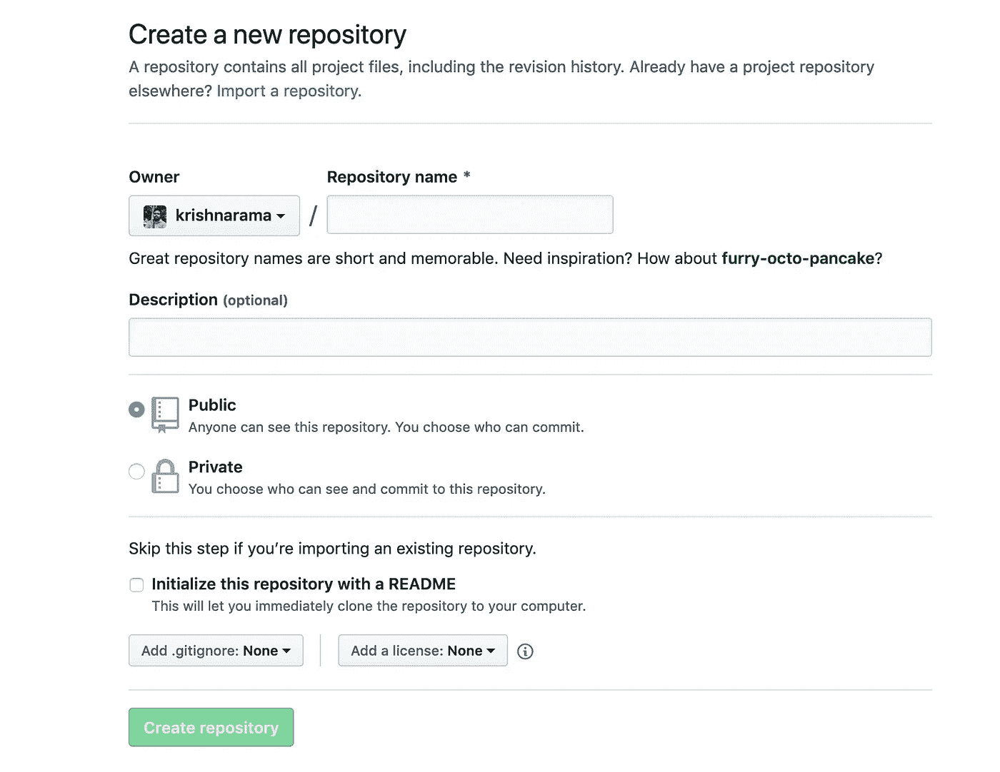
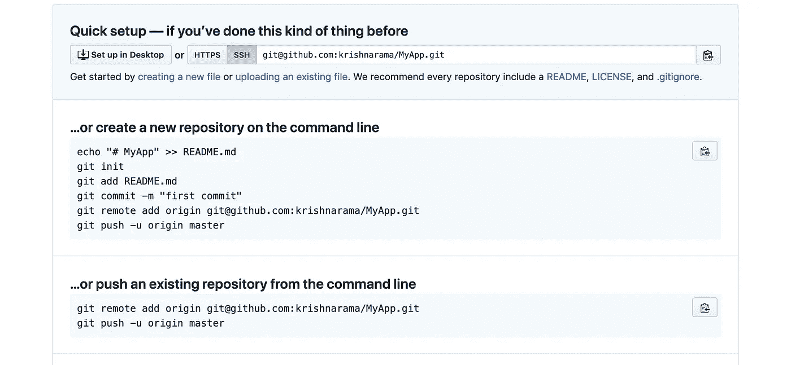

# 在基于 git 的系统之间迁移项目。

> 原文：<https://blog.devgenius.io/migrating-projects-between-git-based-systems-51eadb082c22?source=collection_archive---------0----------------------->


本文描述了在不同的基于 git 的系统之间迁移项目的步骤。出于演示目的，让我们将 gitlab 项目迁移到 github(个人或组织)。在进入问题的关键之前，稍微回顾一下`git remote`将会简化对迁移步骤的理解。

当您在基于 git 的项目下的 shell 中执行`git remote -v`时会发生什么。您会看到如下所示的内容。

```
origin ssh://git@git.corp.xyz.com:10022/apps/MyApp.git (fetch)origin ssh://git@git.corp.xyz.com:10022/apps/MyApp.git (push)
```

这几行代码表明，每当我们执行 git pull 或 push 时，将分别从远程获取代码或从本地存储库将代码推送到服务器上的远程项目。

> 这意味着所有 git 命令都在内部引用该信息来执行任何远程操作。因此，如果你想从基于 git 的版本控制系统迁移到 github.com，你需要做的就是改变项目的遥控器。

现在，问题是你如何得到这个 github.com 的远程网址？这很简单，只要登录 github.com，并按照以下步骤。



创建新存储库



存储库详细信息

一旦你在 github.com 上创建了新的存储库，你就可以找到遥控器的详细信息，如上图所示。

现在，在现有的基于 git 的项目下的 shell 中添加新的 remotes，如下所示。

```
git remote add github git@github.com:krishnarama/MyApp.git
```

完成上述步骤后，`git remote -v`的输出应该如下所示。

```
origin ssh://git@git.corp.xyz.com:10022/apps/MyApp.git (fetch)origin ssh://git@git.corp.xyz.com:10022/apps/MyApp.git (push)github ssh://git@github.com:krishnarama/MyApp.git (fetch)
github ssh://git@github.com:krishnarama/MyApp.git (push)
```

现在，我们已经在 github.com 上创建了空的存储库，我们所需要的就是将本地代码推送到远程存储库。

要推动您正在处理的当前分支，只需执行以下操作。

```
git push github master
```

要推动包括工作分支在内的所有分支，请执行以下操作。

```
git push --mirror github master
```

这将推动当前项目中到目前为止存在的所有分支和提交。

最后，如果你觉得这篇文章有用，请随意鼓掌，鼓励我写作。中上保持高(呵呵…)