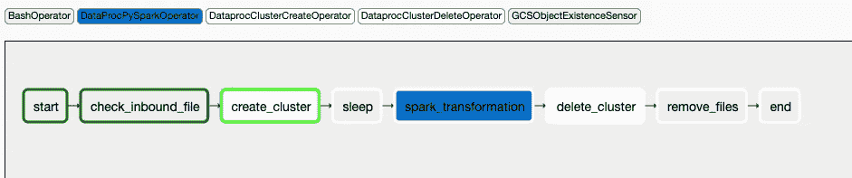

# 将 Spark 作业迁移到 Google 云和文件事件传感器，以动态创建 Spark 集群(DataProc)

> 原文：<https://blog.devgenius.io/migrating-spark-jobs-to-google-cloud-file-event-sensor-to-dynamically-create-spark-cluster-7eff2c75423d?source=collection_archive---------3----------------------->

谷歌云分析的主要方面是**分离存储和计算**和**为你使用的**付费。本地 Hadoop 和 Spark 应用程序让服务器始终运行，无论您是否在使用，这意味着您实际上也在为空闲时间付费。

Google 想出了一种思想(**创建-运行-删除**)来创建短暂的 spark 集群，每当需要运行 ETL 批处理作业时，完成作业后杀死集群。有了这种方法，就不会有任何 Hadoop 和 Spark 集群永远运行，您也不会有巨大的行政和管理成本。为了实现这一点，在迁移 spark 和 Hadoop 应用时要记住两件事。

1)将 HDFS 数据加载到 GCS

2)将 Spark 作业替换为 hdfs://到 gs://

GCS 默认与 Hadoop 文件系统兼容。我们可以将 HDFS 数据复制并存储到 GCS 桶中。与 HDFS 相比，GCS 有很多优势，它便宜，可扩展，几乎没有管理开销。更重要的是，GCS 与所有 GCP 产品(Biquery、DataProc、Dataflow、DataFusion)无缝集成..等等)

一旦 HDFS 的数据被放入 GCS，下一步就是将 spark 的工作转移到 GCP。根据执行频率(每天、每周、每小时)定义和分割现有的 ETL 批处理作业。需要时触发火花作业。在批处理作业执行时创建 spark 集群。将 spark 作业迁移到 GCP 需要进行更改，将 HDFS 路径替换为 GCS 存储桶路径。

让我们开始实际地做这件事吧。

***文件监视事件:在任何 ETL/大数据世界中，当一个新文件到达时，必须立即触发 ETL 作业来处理该文件。ETL 作业不断极点并检查新文件*和**

**议程:**将一个入站文件放入 GCS 存储桶，该存储桶会在一分钟内触发 spark 集群，处理该文件并将结果存储回 GCS 存储桶并自动销毁集群。

1.  将文件摄取到 GCS 存储桶
2.  动态触发 ETL 火花作业
3.  创建火花簇
4.  处理文件
5.  删除火花簇
6.  存档已处理的文件

使用的技术:GCS、pyspark、Airflow(Composer)

***入站文件*** :公开的犯罪 2020 CSV 数据集


犯罪公共数据集

***火花作业*** :非常简单的改造。读取入站 CSV 文件并转换为拼花文件，然后保存回 GCS bucket 出站文件夹

```
from pyspark.sql import SparkSession
from pyspark.sql import Row
from pyspark.sql.functions import *#Define inbound and outbound folders
inbound_file='gs://inbound/Crimes2020.csv'
outbound_file='gs://outbound/crimes_modified'#Create Spark Session
spark = SparkSession.builder.appName('DataProc-PySpark-Test').getOrCreate()#Read inbound file
df = spark.read.format('csv').load(inbound_file)#Transform and save df.write.mode('append').format('parquet').save(outbound_file)
```

***Composer(Airflow)编排工作:ETL 管道构造为 Airflow DAG。*** 它把所有的组件集合在一起，按顺序运行任务。让我们检查每个组件。

***文件传感器事件*** : Google 提供 GCS 对象传感器操作员来验证特定文件的存在。基本上，它查看特定的 GCS 路径和对象。如果找到了对象，它将返回 True。

```
check_inbound_file = GCSObjectExistenceSensor(task_id='check_inbound_file',bucket=inbound_bucket,object='Crimes2020.csv',dag=dag)
```

***创建 Spark Cluster*** : GCP 提供所有 DataProc 操作员，通过气流创建/管理和删除 Hadoop 生态系统和 Spark Cluster。下面的代码片段创建了包含 1 个主节点和 2 个工作节点的 Spark 集群。

```
create_cluster = dataproc_operator.DataprocClusterCreateOperator(task_id='create_cluster',
dag=dag,
region = models.Variable.get('dataproc_region'),
zone=models.Variable.get('dataproc_zone'),
project_id=models.Variable.get('project_id'),
cluster_name='dataproc-spark-pipeline-{{ds}}',
num_workers=2,
master_machine_type='n1-standard-2',
worker_machine_type='n1-standard-2'
)
```

***提交 spark 作业*** :在上面的步骤中，我们创建了 spark cluster，现在是时候向 spark cluster 提交 Spark 作业了。DataProcPySparkOperator 操作符允许您输入 spark 文件位置(GCS 路径)和集群，该集群将向集群提交 spark 作业。

```
spark_transformation = dataproc_operator.DataProcPySparkOperator(task_id='spark_transformation',
***main=spark_file,*** #Specify pyspark file location 
job_name='spark-transformations',
cluster_name='dataproc-spark-pipeline-{{ds}}',
dag=dag)
```

***删除集群*** :一旦 spark 作业完成，结果将被保存到 GCS bucket outbound 文件夹中，现在不需要保持 Spark 集群运行。我们可以摧毁 spark 集群，并免除空闲时间的计算成本

```
delete_cluster = dataproc_operator.DataprocClusterDeleteOperator(task_id='delete_cluster',dag=dag,
cluster_name='dataproc-spark-pipeline-{{ds}}',
project_id=models.Variable.get('project_id'))
```

***归档文件*** :归档或者您可以从 GCS 入站桶中删除已处理的入站文件。一个简单的 Bash 命令

```
remove_files = BashOperator(task_id='remove_files',
bash_command='gsutil rm gs://inbound/Crimes2020.csv',dag=dag)
```

让我们来看看完整的气流 dag 代码片段

```
import airflow
from airflow import DAG,models
from datetime import datetime,timedelta
from airflow.operators.bash_operator import BashOperator
from airflow.contrib.operators import dataproc_operator
from airflow.providers.google.cloud.sensors.gcs 
import GCSObjectExistenceSensor#Define pyspark file location and inbound bucket
spark_file = ('gs://spark-warehouse/Spark_Transformation.py')
inbound_bucket = models.Variable.get('inbound_bucket')#DAG default arguments
default_arguments = {'start_date':airflow.utils.dates.days_ago(1),
'retries':1,
'retries_delay':timedelta(minutes=1)
}#Define DAG
dag = DAG('dataproc_spark_pipeline',
description='DataProc-Spark-Pipeline',
schedule_interval=timedelta(days=1),
default_args=default_arguments)#File Sensor Event Task
check_inbound_file = GCSObjectExistenceSensor(task_id='check_inbound_file',
bucket=inbound_bucket,
object='Crimes2020.csv',
dag=dag)#Create DataProc Spark Cluster
create_cluster = dataproc_operator.DataprocClusterCreateOperator(
task_id='create_cluster',
dag=dag,
region=models.Variable.get('dataproc_region'),
zone=models.Variable.get('dataproc_zone'),
project_id=models.Variable.get('project_id'),
cluster_name='dataproc-spark-pipeline-{{ds}}',
num_workers=2,
master_machine_type='n1-standard-2',
worker_machine_type='n1-standard-2')#Submit Spark job 
spark_transformation = dataproc_operator.DataProcPySparkOperator(
task_id='spark_transformation',
main=spark_file,job_name='spark-transformations',
region=models.Variable.get('dataproc_region'),
zone=models.Variable.get('dataproc_zone'),
project_id=models.Variable.get('project_id'),cluster_name='dataproc-spark-pipeline-{{ds}}',
dag=dag)#Delete DataProc Spark Cluster
delete_cluster = dataproc_operator.DataprocClusterDeleteOperator(
task_id='delete_cluster',
dag=dag,
project_id=models.Variable.get('project_id'),
region=models.Variable.get('dataproc_region'),
zone=models.Variable.get('dataproc_zone'),
cluster_name='dataproc-spark-pipeline-{{ds}}')#Delete Processed files
remove_files = BashOperator(task_id='remove_files',
bash_command='gsutil rm gs://inbound/Crimes2020.csv',
dag=dag)start = BashOperator(task_id='start',
bash_command='echo date',
dag=dag)end = BashOperator(task_id='end',
bash_command='echo date',
dag=dag)sleep_process = BashOperator(task_id='sleep',
bash_command='sleep 30',
dag=dag)#ETL pipeline 
start>>check_inbound_file
>>create_cluster
>>sleep_process
>>spark_transformation
>>delete_cluster
>>remove_files
>>end
```

看看这是怎么回事

上传入站 CSV 文件


上传入站文件

文件传感器事件任务:识别犯罪 2020.csv 并触发下一个任务，即创建火花簇


文件传感器任务


文件传感器任务日志

Spark 集群创建:创建带有 1 个主节点和 2 个工作节点的 DataProc Spark 集群



创建 DataProc 火花簇


供应 Spark 集群

执行火花作业


向 Spark 集群提交 Spark 作业


火花作业结果保存到出站存储桶

删除火花簇


删除集群


删除集群

**结论** : *我们已经看到谷歌云中的文件传感器事件和短暂火花簇在降低成本方面非常有用*