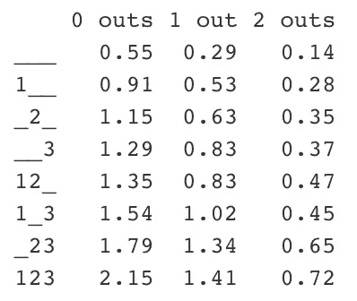
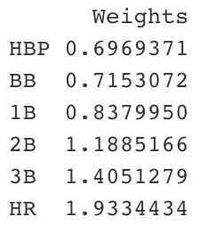

# MiLB 运行期望矩阵

> 原文：<https://blog.devgenius.io/milb-run-expectancy-matrix-65e01c52dc?source=collection_archive---------12----------------------->

## 概观

在这个项目中，我将小联盟的逐场比赛数据转换成一个跑垒期望矩阵，以确定加权平均跑垒数(wOBA)、加权平均跑垒数(wRAA)和加权创造跑垒数(wRC+)中使用的跑垒值。

## 介绍

今年夏天，我几乎没有 R 语言编程的经验，但我决心通过完成一个独立的、动手的棒球分析项目来磨练我的语言技能。同时，我在 Tacoma Rainiers 的前台办公室实习，这是西雅图水手队的 3a 分支机构。每天，我都会在 MiLB.com 的玩家页面上搜索，在游戏日志中寻找值得注意的指标或趋势，并把它们包含在我分发给教练和媒体成员的游戏笔记和统计包中。不幸的是，我对我所拥有的资源不感兴趣。在大联盟一级，存在着可供公众使用的看似无限量的数据。另一方面，次要级别的高级统计数据很少。这使得分析师更难跟踪球员的发展，估计潜在的交易价值，预测大联盟的表现等等。

由于缺乏信息，我决定创建并发布 MiLB wOBA、wRAA 和 wRC+统计数据，以及运行预期(RE24)矩阵。请注意:这是一个个人项目，并不是塔科马雷尼尔公司的知识产权。

## 数据收集

用于该项目的 MiLB 详细资料是通过 Bill Petti 的“baseballr”软件包获得的。为了获得这些数据，我使用了“lubridate”包来编译某一天的每个游戏 id。值得注意的是，levels_id 指定了逐场播放数据的给定级别。c(1)是 MLB 数据的代码，c(11)代表三 A，c(12)代表双 A，c(13)代表高 A，c(15)代表低 A，c(5442)代表新秀进阶，c(16)代表新秀球，c(17)代表冬季联赛。我在开业当天就开始了这个过程，对于这个案例来说，是 4 月 4 日 AAA 开业当天。然后，我每天循环往复，直到赛季结束。然而，这里是我遇到第一个问题的地方。在小联盟棒球赛中，周一是所有级别的休息日。因此，当循环到达某个日期(星期一)时，它将停止运行。为了解决这个问题，我实现了一个 if()语句，该语句将跳过星期一的日期，转到有游戏的星期二。这样做的一个限制是，在任何给定的小联盟级别，都有少量的周一比赛随机安排在赛程中。通过采用这种方法，我省略了这些游戏的运行预期数据。然而，在一个赛季的数据价值的大计划中，为了使代码有效运行而省略几场比赛的权衡是值得的。下一步是提取给定游戏 id 的逐场比赛数据，并将其添加到给定日期所有游戏的逐场比赛数据的数据框中。然后，我把每一个球的数据转换成每一场比赛的数据，除了最后一个球之外，从一个给定的击球手那里去掉所有的球。最后，我将这个合成的逐场播放数据添加到一个数据帧中，该数据帧包含了循环当前日期之前的所有逐场播放数据。

```
# Set j as the date on which games start. In this case, it is set as 
# Triple-A opening day
j <- as.Date("2022-04-05")# Creates play-by-play data frame
repeat {

  # Skips Monday (Monday's are MiLB off-days)
  if(weekdays.Date(j) == "Monday"){
    j <- j + 1
  }

  id <- mlb_game_pks(j, level_ids = c(11))
  game_id <- as.data.frame(id$game_pk) 

  i <- 1 
  for (i in 1:nrow(game_id)) {
    try( {

      # Resets the single_game_id variable for every different game
      single_game_id <- id$game_pk[i]

      # Gets play-by-play data for a single game on a single day
      single_game_data <- mlb_pbp(single_game_id)

      # Play-by-play data for an entire day
      single_day_pitch_data <- rbind(single_day_pitch_data, single_game_data, fill = TRUE) 

      # Creates inning.description to delete pitch-by-pitch data, keeping only 
      # one pitch per at-bat
      single_day_pitch_data$inning.description <- paste(single_day_pitch_data$about.inning, single_day_pitch_data$result.description)
      cleaned_day_plays <- distinct(single_day_pitch_data, inning.description, .keep_all = TRUE)

    }, TRUE
    )
  }

  # Goes to the next day
  j <- j + 1

  # Stops when the current date is reached
  if (j == "2022-10-01") { 
    break
  } 
}
```

接下来，我将完整的比赛数据编入索引，以使下面的计算更容易。

```
indexed_plays <- subset(cleaned_day_plays, result.description != "TRUE")
indexed_plays$index_number <- row.names(indexed_plays)# Chronologically sorted play-by-play data
final_plays <- indexed_plays[order(as.numeric(indexed_plays$index_number), decreasing = TRUE), ]
```

## 数据清理

虽然详细的比赛数据非常详细，但在小联盟级别，有许多变量没有记录或记录不正确。因此，需要广泛的数据清理过程来将刮擦的逐场播放数据转换成可以转变成运行预期矩阵的数据。第一步是在比赛前增加比赛的得分，这样就可以比较比赛前和比赛后的得分，以确定比赛中得了多少分。我使用了一个简单的 for 循环来实现这一点，该循环将给定游戏的游戏前得分设置为与前一次游戏的游戏后得分相等，除非前一次游戏与下一次游戏发生在不同的游戏中。

```
original_away_score <- rep(NA, nrow(final_plays))
original_home_score <- rep(NA, nrow(final_plays))# Creates accurate log of the score before each play
i <- 2
repeat{

  # Set the pre-play score equal to the post-play score of the previous play
  original_away_score[i] <- final_plays$result.awayScore[i-1]
  original_home_score[i] <- final_plays$result.homeScore[i-1]

  # If there is a new game, set both scores equal to zero
  if (isTRUE(final_plays$game_pk[i] != final_plays$game_pk[i - 1])){
    original_away_score[i] <- 0
    original_home_score[i] <- 0
  }

  # Stop the repeat when finished
  if (i == nrow(final_plays)){
    break
  }
  i <- i + 1
}# Update play-by-play data to include the score before every play
final_plays %>% 
  mutate(details.awayScore = original_away_score, 
         details.homeScore = original_home_score) -> final_plays
final_plays$details.awayScore[1] <-  0 
final_plays$details.homeScore[1] <-  0
```

收集到的数据包括比赛结束后跑垒员的位置，但没有指出跑垒员之前的位置。因此，下一步是用跑垒员复制得分过程。请注意，这一次跑步者为新的比赛和新的局重新设置。

```
# Create necessary variables
matchup.preOnFirst.id <- rep(NA, nrow(final_plays))
matchup.preOnSecond.id <- rep(NA, nrow(final_plays))
matchup.preOnThird.id <- rep(NA, nrow(final_plays))
matchup.preOnFirst.name <- rep(NA, nrow(final_plays))
matchup.preOnSecond.name <- rep(NA, nrow(final_plays))
matchup.preOnThird.name <- rep(NA, nrow(final_plays))# Create log player names and ids before each play
i <- 2
repeat{

  # Set the pre-play names and ids equal to the names equal to the post-play 
  # Names and ids of the previous play
  matchup.preOnFirst.id[i] <- final_plays$matchup.postOnFirst.id[i-1]
  matchup.preOnSecond.id[i] <- final_plays$matchup.postOnSecond.id[i-1]
  matchup.preOnThird.id[i] <- final_plays$matchup.postOnThird.id[i-1]
  matchup.preOnFirst.name[i] <- final_plays$matchup.postOnFirst.fullName[i-1]
  matchup.preOnSecond.name[i] <- final_plays$matchup.postOnSecond.fullName[i-1]
  matchup.preOnThird.name[i] <- final_plays$matchup.postOnThird.fullName[i-1]

  # If there is a new game, everything resets
  if (final_plays$game_pk[i] != final_plays$game_pk[i - 1]){
    matchup.preOnFirst.id[i] <- NA
    matchup.preOnSecond.id[i] <- NA
    matchup.preOnThird.id[i] <- NA
    matchup.preOnFirst.name[i] <- NA
    matchup.preOnSecond.name[i] <- NA
    matchup.preOnThird.name[i] <- NA
  }

  # If there is a new inning, everything resets
  if (final_plays$about.halfInning[i] != final_plays$about.halfInning[i - 1]){
    matchup.preOnFirst.id[i] <- NA
    matchup.preOnSecond.id[i] <- NA
    matchup.preOnThird.id[i] <- NA
    matchup.preOnFirst.name[i] <- NA
    matchup.preOnSecond.name[i] <- NA
    matchup.preOnThird.name[i] <- NA
  }

  # Stop the repeat when finished
  if (i == nrow(final_plays)){
    break
  }
  i <- i + 1
}# Update final plays data frame to include pre-play baserunners
final_plays %>% 
  mutate(matchup.preOnFirst = matchup.preOnFirst.id, 
         matchup.preOnSecond = matchup.preOnSecond.id,
         matchup.preOnThird = matchup.preOnThird.id,
         matchup.preOnFirst.name = matchup.preOnFirst.name,
         matchup.preOnSecond.name = matchup.preOnSecond.name,
         matchup.preOnThird.name = matchup.preOnThird.name) -> final_plays
```

这是我第一次遇到某些游戏登录方式的严重问题。出于某种原因，偶尔游戏会被错误地输入，跑垒员会在一局击球前出现在一垒。为了解决这个问题，如果在比赛中有一个跑步者在击球时在甲板上出现，那么整个比赛将从数据集中删除，以确保整个数据帧的准确性。

```
# There is an issue with the way some games are logged where the baserunners 
# Are displayed out of chronological order. This deletes those games
i <- 1 
repeat{ 
  if (isTRUE(final_plays$matchup.postOnFirst.id[i] == final_plays$matchup.batter.id[i + 1])) {
    final_plays <- final_plays %>% 
      filter(game_pk != game_pk[i])
  }
  if (i == nrow(final_plays)){
    break
  }
  i <- i + 1
}
```

## 跑步者目的地

我面临的下一个挑战是在一场比赛后确定击球手的目的地。这是必要的，因为跑垒期望矩阵的一个关键部分是在整个比赛中跟踪跑垒者，这样人们就可以比较比赛前的状态(跑垒者和出局者的组合)和比赛后的状态。

```
bat_d <- rep(NA, nrow(final_plays))
run1_d <- rep(NA, nrow(final_plays))
run2_d <- rep(NA, nrow(final_plays))
run3_d <- rep(NA, nrow(final_plays))# Log batter destinations
for (i in 1:nrow(final_plays)) {

  # If the batter id equals the post-play id of a runner on a certain base, 
  # The batter destination is that base
  if (isTRUE(final_plays$matchup.batter.id[i] == final_plays$matchup.postOnFirst.id[i])) { 
    bat_d[i] <- 1}
  if (isTRUE(final_plays$matchup.batter.id[i] == final_plays$matchup.postOnSecond.id[i])) { 
    bat_d[i] <- 2}
  if (isTRUE(final_plays$matchup.batter.id[i] == final_plays$matchup.postOnThird.id[i])) { 
    bat_d[i] <- 3}

  # If the batter homers, their destination will be home
  if (isTRUE(grepl("homers", final_plays$result.description[i]))) {
    bat_d[i] <- 4
  }
}
```

然而，可以清楚地看到，这仅跟踪击球手的目的地。为了找到跑步者的目的地，我必须首先确定哪些跑步者在给定的比赛中得分，为此我制作了一个单独的数据框，其中包含按句子划分的每场比赛的比赛描述。

```
scoring <- str_split(final_plays$result.description, ".   ", simplify = TRUE)
scoring <- sub("[0-9.]+$", "", scoring)
```

接下来，我浏览了每个句子，寻找单词“scoring”的实例，因为这显然表示跑步者得分的比赛。如果这个句子没有“分数”，我就把它从数据框中删除。如果是的话，我就把句子中除了得分球员的名字之外的所有内容都删除了。这个过程的一个限制是它需要很长时间来运行。我目前正在研究一种不使用 for 循环的替代方法，但在此之前，如果有人运行这段代码，他们应该通宵运行。

```
i <- 1
repeat {
  for (j in 1:ncol(scoring)){

    # Get rid of plays in which no one scores
    if (isFALSE(grepl("scores", scoring[i, j]))){
      scoring[i, j] <-  NA
    }

    # If it is a scoring play, delete everything except for the player's name
    if (isTRUE(grepl("scores", scoring[i, j]))){
      scoring[i, j] <- gsub(" scores", "", scoring[i, j])
      scoring[i, j] <- gsub("scores", "", scoring[i, j])
    }
  }

  # Delete unnecessary space 
  scoring <- gsub(" ", "", scoring)
  if (i == nrow(scoring)){
    break
  }
  i <- i + 1
}
# Delete unnecessary spaces
scoring <- gsub(" ", "", scoring)
```

一旦我知道每场比赛谁得分，我就可以确定每场比赛中每个跑垒员的赛后目的地。我通过比较赛前跑垒者和赛后跑垒者以及得分矩阵来做到这一点。例如，如果一个跑垒员在比赛开始前在一垒，如果他们在比赛结束后仍在垒上，那垒就是他们比赛的目的地。如果比赛结束后他们不在垒上，但他们得分了，那么他们的目的地就是家。

```
# Create final destination for runner on first
for (i in 1:nrow(final_plays)) {

  # If the runner on first id equals the post-play id of a runner on a certain base, 
  # The runner destination is that base
  if (isTRUE(final_plays$matchup.preOnFirst[i] == final_plays$matchup.postOnFirst.id[i])) { 
    run1_d[i] <- 1}
  if (isTRUE(final_plays$matchup.preOnFirst[i] == final_plays$matchup.postOnSecond.id[i])) { 
    run1_d[i] <- 2}
  if (isTRUE(final_plays$matchup.preOnFirst[i] == final_plays$matchup.postOnThird.id[i])) { 
    run1_d[i] <- 3}

  # If the runner on first scores, their destination will be home
  for (j in 1:ncol(scoring)) {
    if (isTRUE(final_plays$matchup.preOnFirst.name[i] == scoring[i, j])){
      run1_d[i] <- 4
    }
  }
}# Create final destination for runner on second
for (i in 1:nrow(final_plays)) {

  # If the runner on second id equals the post-play id of a runner on a certain base, 
  # The runner destination is that base
  if (isTRUE(final_plays$matchup.preOnSecond[i] == final_plays$matchup.postOnSecond.id[i])) { 
    run2_d[i] <- 2}
  if (isTRUE(final_plays$matchup.preOnSecond[i] == final_plays$matchup.postOnThird.id[i])) { 
    run2_d[i] <- 3}

  # If the runner on second scores, their destination will be home
  for (j in 1:ncol(scoring)) {
    if (isTRUE(final_plays$matchup.preOnSecond.name[i] == scoring[i, j])){
      run2_d[i] <- 4
    }
  }
}# Create final destination for runner on third
for (i in 1:nrow(final_plays)) {

  # If the runner on second id equals the post-play id of a runner on a certain base, 
  # The runner destination is that base
  if (isTRUE(final_plays$matchup.preOnThird[i] == final_plays$matchup.postOnThird.id[i])) { 
    run3_d[i] <- 3}

  # If the runner on third scores, their destination will be home
  for (j in 1:ncol(scoring)) {
    if (isTRUE(final_plays$matchup.preOnThird.name[i] == scoring[i, j])){
      run3_d[i] <- 4
    }
  }
}# Add batter and baserunner destination to plays data frame
final_plays %>% 
  mutate(bat_dest = bat_d, run1_dest = run1_d, run2_dest = run2_d, 
         run3_dest = run3_d) -> final_plays
```

## 创建运行预期矩阵

首先，我创建了一个新的数据框，用于创建运行预期矩阵。我这样做有两个原因。首先，如果我想将清理后的 final_plays 数据帧用于其他项目，我不希望在创建运行预期矩阵时对数据进行任何更改。第二，在最终矩阵的创建过程中涉及了大量的试验和错误，而不是每次在运行预期矩阵中遇到错误时都必须重新进行 final_plays 数据的整个清理过程，每次从头开始要容易得多。

```
# Create necessary data frames
re24_plays <- data_frame()
RUNS_1 <- data_frame()
re24_plays <- final_plays# Set all NAs equal to 0, allows following code to run correctly
re24_plays[is.na(re24_plays)] <- 0
```

接下来，我必须为后面的计算进行基本的数据准备。这包括创造一个运行，运行得分，并在发挥变量，这是自我描述。另一个是半局变量，我通过组合游戏标识号、局号和半局(上半局或下半局)来创建这个变量，以便为一个赛季中每场游戏的每半局创建一个惟一的标记。

```
# Creates essential variables for the calculation of run-expectancy
re24_plays %>% 
  mutate(
    # RUNS equals the total number of runs in the game
    RUNS = details.homeScore + details.awayScore,

    # Create HALF.INNING so that the plays can be grouped by half inning 
    # later
    HALF.INNING = paste(game_pk, about.inning, about.halfInning),

    # OUTS.ON.PLAY is the number of outs recorded on the play
    OUTS.ON.PLAY = count.outs.end - count.outs.start,

    # Create RUNS.SCORED variable to track runs scored every play
    RUNS.SCORED = 
      (bat_dest > 3) + (run1_dest > 3) + 
      (run2_dest > 3) + (run3_dest > 3)) -> re24_plays
```

我创建了独特的半局标记，这样我就可以确定在给定的半局中的最大得分。这在跑预期的计算中很重要，因为它允许我确定在一个给定的事件之后还有多少次跑可以得分，从而给出该事件的个人跑预期。我是用“跑步”来做的。ROI”，它代表了在半局中得分的总得分与在计算期望得分时得分的得分之间的差值。

```
# Group by half inning (run expectancy matrices look at each half inning as 
# independent events)
re24_plays %>%
  group_by(HALF.INNING) %>%

  # Create crucial variables in the creation of the matrix
  summarize(Outs.Inning = sum(OUTS.ON.PLAY), 
            Runs.Inning = sum(RUNS.SCORED),
            Runs.Start = first(RUNS),
            MAX.RUNS = Runs.Inning + Runs.Start) -> half_innings
# Add half innings groups back to main data frame
# RUNS.ROI is the difference between the maximum runs scored in the inning 
# and the number of runs that have already been scored
re24_plays %>%
  inner_join(half_innings, by = "HALF.INNING") %>%
  mutate(RUNS.ROI = abs(MAX.RUNS - RUNS)) -> re24_plays
```

一旦我有了必要的跑垒和回合信息，我就可以用出局数和垒上人数来标记每一场比赛前和赛后的情况。这就是所谓的戏剧的“状态”。举例来说，如果比赛前有一个跑者在一垒和三垒上，状态将是“1_3 1”如果发生的比赛是一次牺牲飞行，三垒上的跑者将得分，一垒上的跑者将留在那里，给出“1__ 2”的“新状态”我通过评估垒上每个人的跑垒员目的地以及击球手来创建这个新状态。

```
# Creates the state (or situation) prior to the play
re24_plays %>% 

  # BASES represents which runners are currently on which base
  mutate(BASES = 
           paste(ifelse(matchup.preOnFirst > 0, 1, 0),
                 ifelse(matchup.preOnSecond > 0, 1, 0),
                 ifelse(matchup.preOnThird > 0, 1, 0), sep = ""),

         # STATE adds the number of outs to BASES
         STATE = paste(BASES, count.outs.start)) -> re24_plays# Create the state (or situation) following  the play
re24_plays %>%

  # Find which runners end up where
  mutate(NRUNNER1 = 
           as.numeric(run1_dest == 1 | bat_dest == 1),
         NRUNNER2 = 
           as.numeric(run1_dest == 2 | run2_dest == 2 | 
                        bat_dest == 2),
         NRUNNER3 = 
           as.numeric(run1_dest == 3 | run2_dest == 3 |
                        run3_dest == 3 | bat_dest == 3),

         # Find the resulting outs on the play
         NOUTS = count.outs.start + OUTS.ON.PLAY,

         # Create new bases and state variables to reflect the results of the play
         NEW.BASES = paste(NRUNNER1, NRUNNER2, 
                           NRUNNER3, sep = ""),
         NEW.STATE = paste(NEW.BASES, NOUTS)) -> re24_plays
```

最后，在计算运行预期之前，我必须进行最后一轮数据清理。第一步是删除没有得分的相同状态的比赛，因为这些比赛很可能被错误地记录，因此会影响预期得分矩阵的准确性。第二步是取消少于三次出局的半局，因为这些局是以保送结束的。我这样做是因为在这些情况下，球队是为了赢得比赛而比赛，而不是像在其他情况下一样最大化他们的得分，所以半局保送不能准确反映真实的得分预期。

```
# Filter out plays that have the same state with no runs scored
re24_plays %>% 
  filter((STATE != NEW.STATE) | (RUNS.SCORED > 0)) -> re24_plays# Filter out innings that end with less than three outs
re24_plays %>%
  filter(Outs.Inning == 3) -> re24_plays_final
```

一旦所有必要的步骤都完成了，我就可以计算运行期望矩阵了。我这样做是通过确定每个状态的平均运行预期，然后将它们组合成一个易于阅读的矩阵。

```
# Final calculations for run-expectancy matrix
re24_plays_final %>% 
  group_by(STATE) %>%

  # Each state recieves its corresponding run expectancy
  summarize(Mean = mean(RUNS.ROI)) %>%
  mutate(Outs = substr(STATE, 5, 5)) %>%
  arrange(Outs) -> RUNS_1# Create run expectancy matrix
re24 <- matrix(round(RUNS_1$Mean, 2), 8, 3)# Give matrix appropriate row and column names
dimnames(re24)[[2]] <- c("0 outs", "1 out", "2 outs")
dimnames(re24)[[1]] <- c("___", "__3", "_2_", "_23", 
                         "1__", "1_3", "12_", "123")
```



2022 年三 A 运行预期矩阵

## 创建运行值

下一步是计算每个击球事件的运行值。跑垒值是击球队在给定的击球事件后得分的预期跑垒的增加。例如，如果球队总是因为一次单打而得 1 分，那么一次单打的未换算得分就是 1 分。要做到这一点，我首先必须确定每个剧本的单个运行值。

```
# Preparation work for finding run values
re24_plays %>%

  # Concentrate run values by state
  left_join(select(RUNS_1, -Outs), by = "STATE") %>%
  rename(Runs.State = Mean) %>%
  left_join(select(RUNS_1, -Outs), 
            by = c("NEW.STATE" = "STATE")) %>%
  rename(Runs.New.State = Mean) %>%
  replace_na(list(Runs.New.State = 0)) %>%

  # Find run value of each play
  mutate(run_value = Runs.New.State - Runs.State +
           RUNS.SCORED) -> re24_plays
```

然后，我通过确定与每个 out 相关的平均游程值来计算 out 的游程值。如您所见，out 的游程值是负的，这在逻辑上非常合理。

```
# Create necessary variable
outs <- rep(0, nrow(re24_plays))# Find plays that resulted in outs
re24_plays %>% 
  filter(OUTS.ON.PLAY > 0) -> outs# Find run value of outs
outs %>%
  summarize(mean_run_value = mean(run_value)) -> mean_outs
```

接下来，我计算了每种上垒方式的平均值(1B、2B、3B、HR、BB 和 HBP)，除了到达一个错误。其中每一个的过程都是相同的，这里有一个例子说明我是如何计算单个。请注意代码行，其中未缩放的单个游程值减去 out 的游程值以“缩放”它。这是必要的，因为我们对上垒的方式产生多少跑垒不感兴趣，我们感兴趣的是上垒的方式比出局多产生多少跑垒。以之前的单个为例，如果单个的未缩放游程值是 1，而 out 的游程值是-.25，则单个的真实或“缩放”游程值将是 1.25。

```
# Create necessary variable
single <- rep(0, nrow(re24_plays))# Find all instances of a single
for (i in 1:nrow(re24_plays)){
  if (isTRUE(grepl("singles", re24_plays$result.description[i]))) {
    single[i] <- 1
  }
}# Select plays with a single
re24_plays %>% 
  mutate(singles = single) %>% 
  filter(singles == 1) -> singles# Find run value of singles by finding the mean run values of all plays with
# a single
singles %>%
  summarize(mean_run_value = mean(run_value)) -> mean_singles# Find the run value of a single to that of an out
SINGLE <- mean_singles - mean_outs
```

## 计算线性权重

为了确定用于计算 wOBA 的线性权重，必须首先对联盟平均 wOBA 进行缩放，使其等于联盟平均 OBP，这可以通过逐场比赛数据来完成。为了做到这一点，我首先必须在数据中找到所有牺牲苍蝇和有意行走的实例。

```
# Create necessary variable
sf <- rep(0, nrow(re24_plays))
ibb <- rep(0, nrow(re24_plays))# Find all instances of a sacrifice fly
for (i in 1:nrow(re24_plays)){
  if (isTRUE(grepl("sacrifice fly", re24_plays$result.description[i]))) {
    sf[i] <- 1
  }
  if (isTRUE(grepl("intentionally walks", re24_plays$result.description[i]))) {
    ibb[i] <- 1
  }
}# Select plays with a sacrifice fly
re24_plays %>% 
  mutate(sf = sf, ibb = ibb) -> re24_plays
```

一旦我有了这些值，我就可以计算“wOBA 乘数”，这是未缩放的 wOBA 联盟，以及 OBP 联盟。

```
# Create "wOBA Multiplier" by calculating the league wOBA figure
woba_multiplier <- 
  (HBP*nrow(hbp) + BB*nrow(walks) + SINGLE*nrow(singles) + DOUBLE*nrow(doubles) 
   + TRIPLE*nrow(triples) + HR*nrow(home_runs))/(nrow(re24_plays) - sum(ibb) - sum(sf))# Calculate the league OBP figure
league_obp <- 
  (nrow(hbp) + nrow(walks) + nrow(singles) + nrow(doubles) + nrow(triples) 
   + nrow(home_runs))/(nrow(re24_plays) - sum(ibb))
```

接下来，我用 OBP 联盟除以 wOBA 乘数来计算 wOBA 规模。然后，我将 wOBA 等级乘以游程值，使得 wOBA 联盟等于 OBP 联盟。

```
woba_scale <- league_obp / woba_multiplier# Multiply the play run values by the wOBA scale to obtain the weights used in
# the wOBA calculation
woba_weights <- c(woba_scale*HBP, woba_scale*BB, woba_scale*SINGLE, 
                  woba_scale*DOUBLE, woba_scale*TRIPLE, woba_scale*HR)
```

在正确缩放权重后，我通过创建一个显示权重的简单数据表来完成这个项目。

```
# Create an easily readable table containing the wOBA weights
linear_weights_table <- as.data.frame(woba_weights)# Ensure the table is named correctly
rownames(linear_weights_table) <- c("HBP", "BB", "1B", "2B", "3B", "HR")
colnames(linear_weights_table) <- c("Weights")
```



2022 三 A 运行值权重

# 线性权重表

从这里，我们可以使用权重来计算玩家的个人 wOBA、wRAA 和 wRC+指标。这是有价值的，因为这些统计数据在评估前景时比传统的击球率、上垒率和击球率更有价值。

另一个潜在问题是 wRC+计算中停车因素的影响。公园因素作为一种试图消除击球手在“击球手公园”或“投手公园”打球的影响的方法被包括在内然而，由于体育场和条件的广泛多样性，小联盟公园因素存在着极大的差异。例如，要在切尼体育场(3 A 级塔科马雷尼尔队的主场)击出全垒打，击球手必须避开距离本垒板 425 英尺的 29 英尺击球手的视线。这个问题是，他们对 wRC+数字的影响比在大联盟级别大得多，因为一个球员可能不会在给定的级别上打完所有的比赛。假设，如果一个双 A 的球员被召到三 A 一个月左右，并且在高得分环境下的大部分比赛中表现得非常好。如果他们主场的公园系数低于 1，那么即使他们在客场打了不成比例的比赛，他们的数据也会被人为夸大。

在未来，我希望将这些权重应用于击球数据，以创建 xwOBA。不幸的是，只有有限数量的小联盟体育场有必要的设备来有效地测量击球数据。然而，每个 3a 太平洋海岸联盟体育场可以记录击球数据，所以也许我的项目将仅限于这个联盟。这仍然是有价值的，因为考虑到预测小联盟成功的难度，球队和公众获得的信息越多越好。