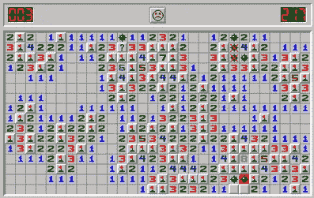

# 扫雷舰和 LRM

> 原文：<https://blog.devgenius.io/minesweeper-and-lrm-3f621d28ed59?source=collection_archive---------2----------------------->

这个游戏有趣的部分是识别地雷位置的方法，不要点击它们。这是一个如何识别[最后责任时刻](/to-decide-or-not-to-decide-thats-the-question-f186d5858aba)的完美例子。

[https://en . Wikipedia . org/wiki/minesweaver _(video _ game)](https://en.wikipedia.org/wiki/Minesweeper_(video_game))

这个故事开始于几天前，当时我在女儿们的电脑上安装了扫雷软件。她八岁了，她很喜欢，就在我们谈论她在游戏中的策略的几天后，她描述了最后一个负责任的时刻。

她向我解释说，要开始这个游戏，她只需点击其中一个无遮蔽的方块。这是因为她没有足够的关于地雷在哪里的信息，但她需要开始游戏，如果她失败了，重新开始游戏的成本非常低(只是一次点击)。

一旦她从游戏中得到了与显示的数字相近的地雷数量的反馈，她就选择那些更明显没有地雷的未遮盖的方块。你掌握的信息越多，做决定的成本就越低(风险就越小)。因此，她推迟了那些有很大风险的决定，而更喜欢根据收到的反馈做出更清晰的决定。

这不是我和我女儿谈过的事情，但是如果你经常玩这个游戏(任何游戏)，你会开始识别一些模式，这些模式会给你快速知道点击哪里的方法。所以，在最后一个负责任的时刻之后练习做决定，会让你更快地知道下一步该做什么，哪些事情需要澄清。

## 软件

玩扫雷比做软件容易，但我觉得这个例子有很好的借鉴意义。我们倾向于在信息很少的情况下做出非常重要且不可逆转的决定。但是反过来也是正确的，我们有时花费大量的时间试图选择最佳的可能决策，而不开始游戏(编写代码)。

所以如果我们需要开始游戏，就用你认为的任何决定开始游戏，但是要降低风险。让我们做一些在接下来的几周内可以轻易改变的小事情，并对其进行评估。避免了[分析瘫痪](https://en.wikipedia.org/wiki/Analysis_paralysis)的问题。不做决定的成本高于推迟决定的成本，这是最后负责任的时刻。

如果我们有积压的事情要做，让我们做那些更清晰的事情，推迟那些不够清晰的事情。如果你在所有要做的事情上都有很多不确定性，那就缩小范围，试着摆脱不确定性。创建其他故事，或将来要完成的任务(推迟决策)。因为在这里，做出决定的成本高于推迟决定的成本，我们还没有到最后负责任的时刻。

## 编码

如果在编码时有些事情不清楚，不要做任何决定，只是推迟它(如果这不是一个在未来可以很容易改变的琐碎决定)。我们可以询问我们的团队或利益相关者，所以让我们推迟我们的决定，因为它比采取一个(那可能是错误的)更便宜。
这是提供 [TDD](/inverted-scientist-method-aka-tdd-e7848c3fd982?sk=b6234b6d1a4170a8939d9aebcea25157) 的最伟大的事情之一，在 TDD 中，我们必须在编写代码之前编写测试。如果你不能创建一个测试，因为你没有足够的信息知道系统应该做什么，你有一个方法来识别那些不清楚的事情，所以你没有在最后负责任的时刻为那个场景写代码。
TDD 给我们的另一个遵循 LRM 的教训是重构的时刻，就在事情工作的时候，你想在编写下一个测试之前降低复杂性(当你看到你的问题时重构会更便宜，你知道这将是你的下一步)。

[YAGNI](https://en.wikipedia.org/wiki/You_aren%27t_gonna_need_it) 是那些让你遵循最后负责时刻的原则之一，这基本上是如果你对当前的问题不需要它就不要做。遵循这个原则使我们决定在真正需要的时候做某事，所以在最后负责任的时刻。过早的优化是不遵循 YAGNI 原则的后果之一。

> “我们应该忘记小的效率，比如说 97%的时候:过早的优化是万恶之源。然而，我们不应该错过这关键的 3% "
> [https://en . Wikipedia . org/wiki/Program _ optimization # When _ to _ optimize](https://en.wikipedia.org/wiki/Program_optimization#When_to_optimize)