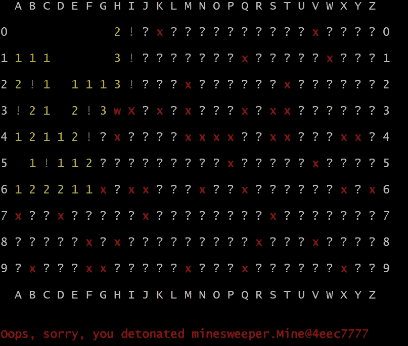

# 命令行扫雷是 Java 中面向对象设计的一个很好的练习

> 原文：<https://blog.devgenius.io/minesweeper-on-the-command-line-is-a-good-exercise-for-object-oriented-design-in-java-64d7f24b5237?source=collection_archive---------1----------------------->


乔治·帕拉维西尼在 [Unsplash](https://unsplash.com?utm_source=medium&utm_medium=referral) 上的照片

Java 初学者经常会要求好的项目，用这些项目来学习 Java 和面向对象设计的原理。游戏通常被作为一个答案。游戏的程序要求很容易解释，学生可以通过玩游戏获得对他们程序的即时反馈。

在这里，我特别建议在命令行上进行扫雷，作为 Java 初学者学习面向对象编程和将内容与表示分离的好处的一个很好的练习。

由于著名的微软 Windows 扫雷游戏的主要目的是让用户熟悉鼠标左键和右键，以及如何使用它们来指示屏幕上的项目，大多数人只知道扫雷是一个具有图形用户界面(GUI)的游戏。

但是当然可以用命令行界面来制作游戏，甚至是仅限于 ASCII 字符的界面。比如，“！”可以指示标记的位置，“X”可以指示引爆的地雷等。

我将快速描述一下 GUI 版本，以防你只是模糊地回忆起它，或者如果你从未玩过它。你会看到一个长方形的正方形。每个方格要么有地雷，要么没有，但在游戏开始时，你不知道哪个是哪个。

我通常从左键点击角上的方块开始。它可以被开采，但通常不会。并且，在简单或中等设置中，地雷倾向于远离角落。在这种情况下，多个没有地雷的方块可能会同时出现。


在扫雷游戏的早期。

一个方块中的数字让我知道相邻方块中有多少个地雷(包括“对角线”邻居，它们只接触一个角而不是边缘)。

在本例中，我看到三个位置肯定有地雷，所以我通过右键单击它们来标记它们。我发现了一些我确信没有被开采的位置。


在扫雷游戏的早期，在标记了三个位置后。

事后看来，很容易看出我的下一步应该是什么。但在那一刻，我赌了一把，边缘附近没有地雷。这是一个错误，你可以在下面的截图中看到:


哎呀。

还有一个滴答作响的时钟:如果你花的时间太长，地雷就会爆炸。也可能你只是一直玩下去，就看执行情况了。

你可以标出每个位置。我想这是一种策略。但这并没有停止时钟。让我们现在不要担心时钟。

当然有许多不同的方式来编写扫雷程序，它不一定是面向对象的。当然有可能用旧的 BASIC 来编写游戏，比如 GW-BASIC 或 QBasic，用二维数组来记录所有的东西。

但是通过精心选择和设计的对象，我们可以创建一个游戏，它可以很容易地适应任何用户界面，并且，再多花一点力气，也可以适应不同的变体，比如用三角形瓷砖代替正方形瓷砖。

我想让你启动你最喜欢的集成开发环境(IDE)并创建一个新项目，名为 MineSweeper。确保项目有一个源包文件夹(src)和一个测试包文件夹(Test)。

在源码包中，确保有一个`minesweeper`包(或者如果你愿意，可以将其命名为`org.example.minesweeper`)和一个`ui`包(或者将其命名为`org.example.ui`)。

在`ui`包中制作两个“子包”:`ui.graphical`和`ui.text`。在其中的每一个中创建一个`Game`类。这些只是暂时的占位符。我们将认真开始我们的工作。

对我来说，`minesweeper`包应该有一个`Mine`类，这似乎很明显。

```
package minesweeper;

public class Mine {

    private boolean detonated = false;

    public boolean hasBeenDetonated() {
        return this.detonated;
    }

    public void detonate() {
        this.detonated = true;
    }

    Mine() {
        //
    }}
```

我想这是一个好的开始。我放入了一个“空”的包私有构造函数，因为我相信这个构造函数不应该在`minesweeper`包之外被调用。我以后会改变主意的。

两次引爆地雷应该是不可能的。如果一个`Mine`实例已经调用了`detonate()`，那么第二次调用`detonate()`会导致一个异常，比如`IllegalStateException`。

不要只是把那个加进去，先写个测试。如果您使用的是 JUnit 5，您可以使用`assertThrows()`来检查。

然而，这不应该直接影响游戏。我认为显示几个相邻空间的能力与扫雷游戏更直接相关。

似乎早期的扫雷舰游戏没有这个功能，揭示一个空方块会导致邻近的空方块也被揭示。现在它被认为是游戏的一个重要特征。

下面的插图跳过了两个中间步骤，但是它仍然应该让您对这个概念有一个很好的了解。


揭示一个空仓往往会导致其他空仓被揭示。

使用像 QBasic 这样的语言，这可以实现为一个二维数组。在 Java 中，我们可以将数组作为一个`Board`或`MineField`对象的字段(使用对您更有意义的名称)。

但我认为这种方法将我们过多地束缚在游戏的方块版本上，并且要求我们传递成对的整数来引用棋盘上的位置。

我认为我们需要一个`Position`类，只负责描述一个职位。大概是这样开始的:

```
package minesweeper;public class Position {

    private final int coordX, coordY;

    public Position(int x, int y) {
        this.coordX = x;
        this.coordY = y;
    }

}
```

我认为提供一个`getNeighbors()`函数属于`Position`的单一职责，该函数提供一个实例的近邻列表。通过将这种逻辑移出`Board`(或`MineField`)，让游戏适应其他变体变得更加容易。

如果您遵循正确的测试驱动开发(TDD)方法，JUnit 将在您之前玩这个游戏。但是一般用非常简单的关卡，比如一个 10 × 10 的棋盘，所有的地雷都在第四列。

然后，如果 JUnit 单击第一列或第二列中的任何方块，这两列都将显示为空，第三列也将显示为空，但其中有数字(大多数是 3)。

一旦你让`minesweeper`包中的所有东西都正常工作了，就该做一个用户界面了。最好从命令行界面开始，因为您可能已经很好地理解了如何使用`System.out.println()`过程。

不过，这里有一个小问题:根据操作系统和您使用的控制台程序，以不同的颜色写入控制台要么是使用 ANSI 重置代码的简单问题，要么是编写使您的程序不太容易移植的“本机方法”的复杂问题。

只为我自己说，扫雷是一个非常困难的游戏，没有至少一点点颜色编码来指导我。

我发现在 Windows 上，ANSI 重置代码对命令提示符 codes 不起作用，但在 Git Bash 中却非常好用。下面是我尝试在 cmd.exe 上用 ANSI 重置代码玩游戏的截图:


Windows 命令行上的扫雷游戏。获取颜色的 ANSI 重置代码按字面理解，对字体颜色没有影响。

正如你可能已经猜到的，在标记 E3 之后，我没有坚持多久。

另一方面，在 Git Bash 上，我不能责怪缺乏颜色编码导致游戏结束得太快。



Git Bash 上的扫雷游戏。ANSI 重置代码对字体颜色有影响。

我通常使用 cmd.exe 的 Git，而不是 Git Bash 的，我注意到它显示了与 Git Bash 相同的颜色编码。我想弄清楚它是如何做到这一点的，但这对我来说并不重要。

所以目前我只是在`ui.text.Game`、“-colors”中放了一个命令行选项，除了“-easy”、“medium”或“-hard”之外，你还可以使用它来选择你想如何玩游戏。

```
package ui.text;import minesweeper.*;import java.util.Optional;
import java.util.Scanner;public class Game { private static boolean useANSIColors = false;

    private static final String ANSI_RESET = "\u001B\u005B0m";
    private static final String ANSI_RED = "\u001B\u005B31m";
    private static final String ANSI_GREEN = "\u001B\u005B32m";
    private static final String ANSI_YELLOW = "\u001B\u005B33m"; public static void main(String[] args) {
        // ...
        if (args.length > 0) {
            useANSIColors = args[0].startsWith("-c");
        }
        // ...
    }}
```

现在，“-colors”(如果您愿意，也可以是“-c”)必须是第一个命令行选项。让它变得更灵活是我的第二要务。

一旦你让游戏的命令行版本运行良好，GUI 版本可能仍然令人望而生畏。但至少挑战将是与游戏引擎无关的 GUI 特有的问题。

如果你发现自己被卡住了，请随意参考[我的 GitHub 库](https://github.com/Alonso-del-Arte/minesweeper)。看看我是怎么做的，可能会启发你想出一个更好的解决方案。我当然有兴趣看看你们是如何解决某些问题的，所以也请在评论中随意张贴 GitHub 链接。