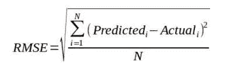
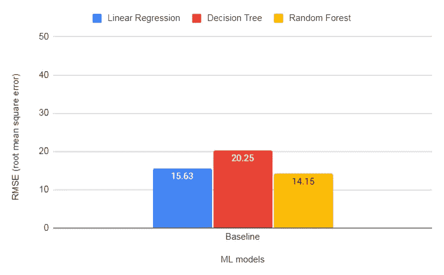
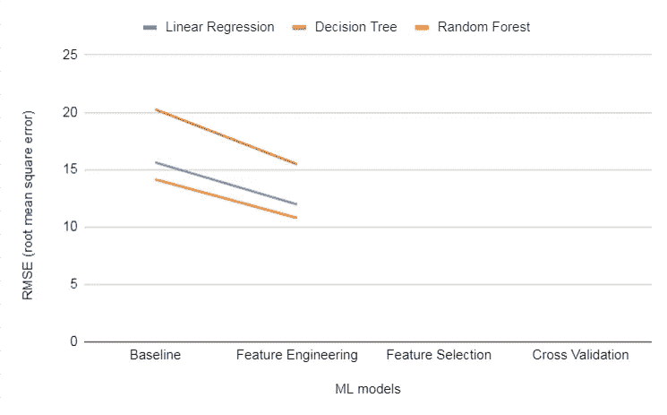
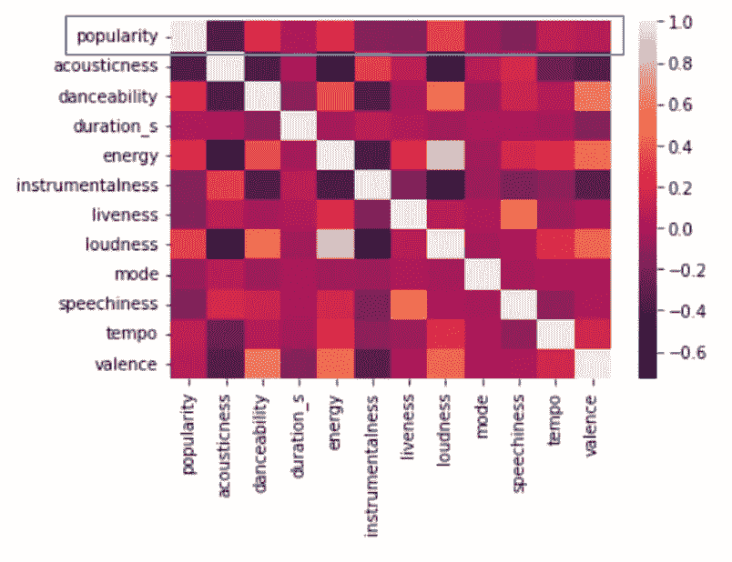
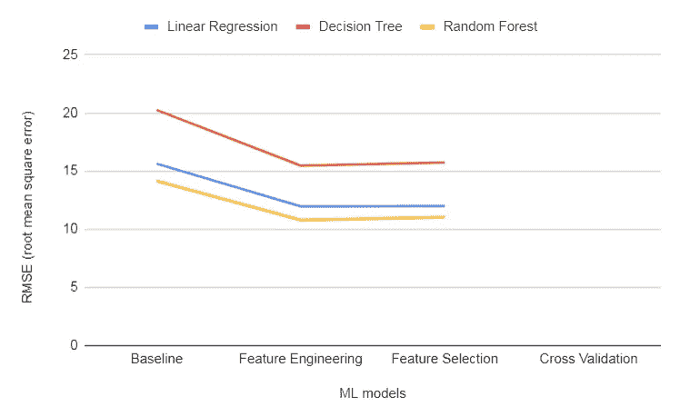
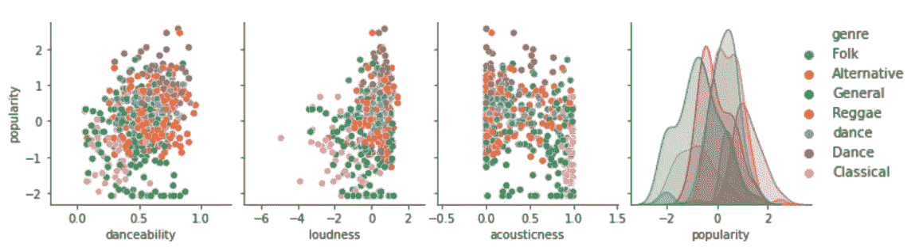
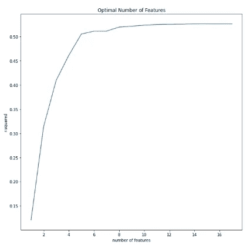
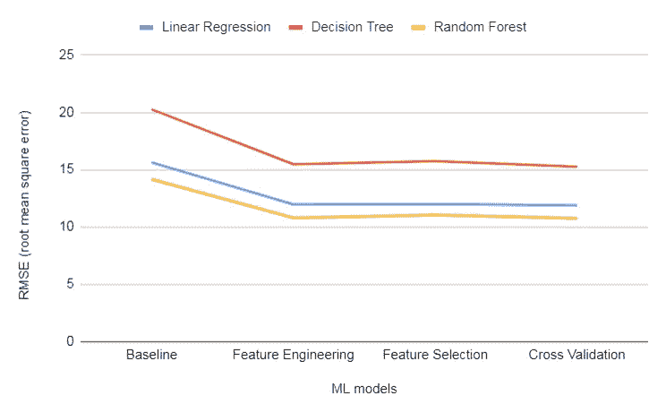
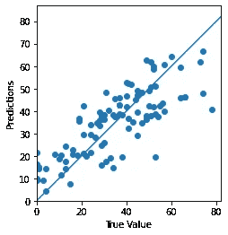
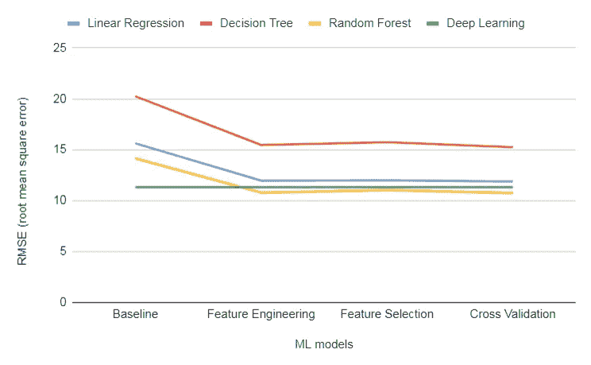

# 迷你 ML 项目-预测 Spotify 歌曲的受欢迎程度。第二部分

> 原文：<https://blog.devgenius.io/mini-ml-project-predicting-spotify-songs-popularity-part-2-1c8f501a109a?source=collection_archive---------5----------------------->


*照片由 Pexels 的 Stas Knop 拍摄

**重述**

在之前的 [**博文**](/mini-ml-project-predicting-spotify-songs-popularity-part-1-ec1c906b8ff8) 中，我使用了 Spotify 的歌曲数据集，试图根据各种特征预测歌曲的流行度评分。实现了三种模型——线性回归、决策树和随机森林。

当前的帖子将描述通过使用各种技术，如特征工程、选择和交叉验证，来提高模型准确性的尝试。在每一次改进模型精度的尝试之后，都给出了一个可视化的比较。

最后一节详细介绍了实施深度学习模型的贡献以及审查该项目的领域专家的见解。

非常感谢机器学习工程师 Erez Tison 和音乐制作人 Gal Petel 的专业建议和见解。

**第一阶段—基线**

在实施任何进一步的改进之前，我将评估当前模型的预测准确性。这将通过计算均方根误差(RMSE)来进行，该误差计算模型的估计预测和实际受欢迎程度得分之间的差异。

较低 RMSE 代表模型对歌曲流行度得分预测准确性。下面概述了 RMSE 公式:



计算均方根误差的方式

下图描述了实施任何更改之前模型的准确性。 ***随机森林*** 模型展示了最低的预测误差。



**第二阶段—特征工程**

第二阶段是测试是否有可能从数据集中提取额外的有意义的数据。以前，我选择忽略一些可能对评估歌曲流行度评分至关重要的分类特征:这些特征是:歌曲的流派和时间签名。

看看歌曲的类型，可以看到有 22 种不同的类型。这个分类变量可以通过为每个类型创建一个虚拟变量来处理，但是这会导致相当多的特征，这会影响计算时间。因此，我选择将流派分为 6 个主要类别:舞蹈，民间，雷鬼，另类，古典和一般。

```
***# create dummy variables - genre*** genre_df=pd.get_dummies(df["genre"])
df = pd.concat([df,genre_df],axis=1)***# create dummy variables - time signature*** time_signature_df=pd.get_dummies(df["time_signature"])
df = pd.concat([df,time_signature_df],axis=1)***# remove old variables*** df.drop(['genre','time_signature'],axis=1, inplace=True)
```

下图显示了使用新功能重新训练模型后模型的得分。可以看出，与基线相比，这三个模型显示了改进:



**阶段 3——特征选择和多元可视化**

作为这个阶段的一部分，我检查了基于特征与流行度分数的相关性来减少特征的数量是否会导致模型准确性的提高。为了评估它，我生成了一个热图，可视化了所有特征之间的关联矩阵。

```
**# Visualization**
correlation_mat = df.corr()
sns.heatmap(correlation_mat)
```



最后，所有相关性的受欢迎程度分数为 0.1 或更低的变量都被删除。这些变量包括:歌曲的时长、调式、节奏和效价。

```
df.drop(['duration_s','mode','tempo','valence','5/4','Reggae'],axis=1, inplace=True)
```

下图显示了修正模型的准确性:



人们可以证明当前的特征选择没有导致显著的改进。因此，我决定研究一种称为网格搜索的替代方法，这将在下一阶段介绍。

**多变量可视化突破！**

使用成对散点图对 500 首歌曲进行采样和绘图。选择 3 对与受欢迎程度得分相关性最高的变量。

```
sample = df.sample(500)
sns.pairplot(sample[["danceability","loudness", "acousticness", "popularity"]],diag_kind="kde")
```

可以看出，歌曲的颜色代表了它们的音乐类型。例如，大多数古典音乐歌曲(粉红色的点)的特点是低可舞性和流行评分。



成对散点图。圆点的颜色代表歌曲的类型

**第 4 阶段——网格搜索交叉验证**

在穷尽了低挂果实后，进行网格搜索交叉验证。标准的交叉验证方法旨在通过将数据分成 K 个集合来防止过度拟合。使用迭代过程，ML 模型在 K-1 个集合上训练，然后在剩余的维持折叠上测试。人们可以认为这是一种更有效的利用数据的方式，因为所有的观察结果都用于训练和测试模型。

与标准交叉验证相比，网格搜索被认为是一种相当先进的方法，因为它利用了超参数优化。这种优化方法评估各种特征的所有可能组合，以便识别最佳组合。为了这篇文章，我应用了网格搜索来训练线性回归模型。

```
folds = KFold(n_splits = 10, shuffle = True)
hyper_params = [{'n_features_to_select': list(range(0,X.shape[1]))}] 
rfe = RFE(model_regression)
model_cv = GridSearchCV(estimator = rfe,
                        param_grid = hyper_params,scoring= 'r2',
                        cv = folds,
                        verbose = 1,
                        return_train_score=True)***# fit the model*** model_cv.fit(X_train, y_train)
cv_results = pd.DataFrame(model_cv.cv_results_)**# visualize the results**
plt.figure(figsize=(10,10))
plt.plot(cv_results["param_n_features_to_select"], cv_results["mean_test_score"])
plt.xlabel('number of features')
plt.ylabel('r-squared')
plt.title("Optimal Number of Features")
plt.legend(['test score'], loc='upper left')
```

格网搜索结果的可视化方式将反映模型在越来越多的要素上的精度提高。很明显，在添加到模型中的第 10 个特征之后有一个平台。



模型的准确性。观察到轻微的改善:



**第 5 阶段——实施深度学习模型**

实现了上述改进后，我对深度学习算法的潜在性能改进感到好奇:

```
def build_model():
    model = keras.Sequential([
        layers.Dense(64, activation=tf.nn.relu,
        input_shape= [X.shape[1]]),
        layers.Dense(64, activation = tf.nn.relu),
        layers.Dense(1)
    ])optimizer = tf.keras.optimizers.RMSprop(.001)
model.compile(loss="mse",optimizer=optimizer,metrics=['mae','mse']) *return* modelmodel = build_model()
```

随后，模型被训练，并添加了一个早期停止。早期停止是当模型的性能达到设定的特定阈值标准时自动停止模型训练的功能。

```
**# add dots in order to visualize the model's progress**
class PrintDot(keras.callbacks.Callback):
    def on_epoch_end(self,epoch,logs):
        if epoch % 100==0: print("")
        print('.',end="")EPOCHS = 500**# early stop**
early_stop = keras.callbacks.EarlyStopping(monitor='val_loss',patience=10)**# fit the model**
history = model.fit(X,y, epochs = EPOCHS,validation_split = 0.2, verbose = 0,callbacks = [PrintDot()])
```

下图说明了深度学习模型的预测以及它们与真实受欢迎程度分数的距离。直线下方的点代表其流行度被高估的歌曲。



深度学习模型的预测与地面事实的比较

深度学习 RMSE 与其他模型的比较:



**领域专家评审**


获得成功的数据科学项目的一个关键方面是理解我们工作的环境。我们可能倾向于过于关注优化我们的模型，而忽略了我们旨在实现的真正意义。

最终，我们训练的 ML 模型对所表示的数据的真实含义视而不见，并且在这个过程中领域专家的参与非常重要。领域专家可以监控、解释和提供他或她的关于在训练过程中包括或排除的特性的意见。

我很幸运地认识了 Gal Petel，她是一位才华横溢的音乐制作人。我感兴趣的是他对歌曲流行原因的见解，以及我添加到模型中的功能是否真的相关。

根据 Gal 的说法，尽管给定的特征似乎是相关的，但是有一些特征可能有助于模型的准确性并且非常有趣，下面是一些例子:

(1)这首歌有没有钩？一个音乐元素通常结合了我们无法从头脑中取出的旋律、歌词和节奏。

(2)歌曲结构——是经典的韵文合唱结构还是比较复杂的？

(3)歌曲的演唱者——是乐队、女歌手还是男歌手等。

(4)是翻唱的歌吗？

我所知道的最好的音乐挂钩之一

这种洞察力使我明白，真正有趣和有意义的不一定是财政歌曲的特点，而是歌曲的内容，这反过来又使它独特和流行。尽管一些建议的特征提取和集成起来更复杂，但是在分析过程中考虑它们仍然是有益的

**结论**

在这篇文章中，我试图描述实现的各种改进。主要的收获是，虽然 ML 模型可以很容易地被训练，但提高它的性能是一项具有挑战性的任务。

***参考文献***

深度学习实现—[https://www.youtube.com/watch?v=-vHQub0NXI4](https://www.youtube.com/watch?v=-vHQub0NXI4)