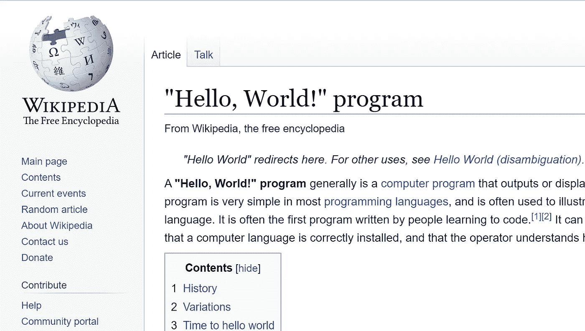

# 最低“你好，世界！”WPF 的节目在。网络核心

> 原文：<https://blog.devgenius.io/minimum-hello-world-program-for-wpf-on-net-core-af448fa5e51f?source=collection_archive---------11----------------------->

我知道这对于平台上的任何语言来说都是一个太老的话题了。

但是我想从几个不同的角度来探索它，因为它不再是简单的编程语言了。WPF 是建立在托管代码系统上的。NET 平台上运行。还有更多的涉及。对于我们的任务，我们将使用 C#和。NET Core 3.x 或。NET 5.0。

众所周知，用一种特定的语言来说很简单，那就是“你好，世界！”程序，它通常只显示一行文本“Hello，World！”在控制台上。



在我们的例子中，WPF 是一个现代的 Windows UI 设计范例，它由两类组件组成:XAML 和代码，其中 XAML 只是一种标记语言，以更好的 UI 表示来组织支持的类型，代码部分通常被称为动作和状态更改的代码隐藏，以支持 XAML 设计和其他任务。对于 XAML 纯粹主义者来说，他们希望将他们的设计尽可能多地推向 XAML，而那些刚从 WinForms 之类的网站搬到 WPF 的人，只要有代码来完成手头的任务，就会感觉很自在。

## 目标

因为我们试图减少我们的“你好，世界！”WPF 计划，我们应该在深入设计之前设定指导方针的目标，看看我们将在哪里着陆:

1.我们应该使用。NET SDK 尽可能多，而不是试图推倒重来；

2.一种语言只有“你好，世界！”是在控制台上显示一个文本行，但是对于我们的设计来说，更重要的是在屏幕上显示一个设计窗口或视觉部分，不管它有多简单，它应该隐含地向世界展示问候。如果我们坚持在屏幕上显示窗口中的文本，这不应该被认为是有任何意义的，而是一个窗口一旦显示的琐碎任务。

3.XAML 和代码隐藏都使用 WPF 支持的类型。它们应该是可互换的，因此我们将把它推向两个不同的方向，以产生我们项目设计的两个版本:

*   WPF·XAML 只说了一句“你好，世界！”
*   WPF 电码只有“你好，世界！”

## 设置

我们假设您已经安装了。NET Core 3.x 或。NET 5.0，在这里我们将坚持使用。NET SDK 5.0.100-preview.4

如果运行 dotnet:

```
$dotnet — version5.0.100-preview.4.20258.7
```

并得到结果显示它是。NET Core 3.x 或。NET 5，你已经准备好了。

## 设计

我们将创建两个框架项目，一个仅用于 XAML，另一个仅用于代码:

```
$mkdir c:\projects\wpf$cd c:\projects\wpf$dotnet new wpf -n xamlmin$dotnet new wpf -n codemin
```

**1。XAML 只有“你好，世界！”项目**

让我们先从 XAML 唯一的程序开始，我们的目标是摆脱一切”。cs”文件以及其他文件，以最小化每个文件的项目组件和内容。

```
$cd c:\projects\wpf\xamlmin$dir368 App.xaml340 App.xaml.cs604 AssemblyInfo.cs493 MainWindow.xaml659 MainWindow.xaml.cs<DIR> obj224 xamlmin.csproj6 File(s)    2,688 bytes
```

*   我们有 6 个文件和一个目录
*   “obj”目录是保存构建过程的临时文件，我们可以去掉它
*   “AssemblyInfo.cs”是用于 ThemeInfo 的，这不是必需的，我们也可以删除它
*   我们现在有两个 XAML 文件，两个 C#文件和一个项目文件。我们希望去掉两个 C#文件，简化两个 XAML 文件，如果可能的话，甚至尝试合并它们。我们需要项目文件来构建和运行我们的程序，所以有必要保留它；
*   我们来看看“App.xaml.cs”文件:

```
using System;using System.Collections.Generic;using System.Configuration;using System.Data;using System.Linq;using System.Threading.Tasks;using System.Windows;namespace xamlmin{ /// <summary> /// Interaction logic for App.xaml /// </summary> public partial class App : Application { }}
```

嗯，只是包含了一个空的部分类 App 需要填充。在“App.xaml”中，应用程序已准备好进行实例化。所以，我们可以摆脱它。

*   我们现在在哪里？完成上述步骤后，项目文件夹中还剩下 4 个文件:

```
$dir368 App.xaml493 MainWindow.xaml659 MainWindow.xaml.cs224 xamlmin.csproj4 File(s)    1,744 bytes
```

*   有了上面的文件，还运行吗？让我们试一试:

```
$dotnet run
```

非常好！它仍然运行，你应该看到一个空白的 WPF 窗口显示在你的屏幕上。

*   我们的项目中仍然有一个 C#文件“MainWindow.xaml.cs ”,我们能否以某种方式删除它，程序仍然运行？让我们来看看:

```
using System;using System.Collections.Generic;using System.Linq;using System.Text;using System.Threading.Tasks;using System.Windows;using System.Windows.Controls;using System.Windows.Data;using System.Windows.Documents;using System.Windows.Input;using System.Windows.Media;using System.Windows.Media.Imaging;using System.Windows.Navigation;using System.Windows.Shapes;namespace xamlmin{ /// <summary> /// Interaction logic for MainWindow.xaml /// </summary> public partial class MainWindow : Window { public MainWindow() { InitializeComponent(); } }}
```

我们有一个从 Window 类派生的分部类 MainWindow，并且在构造函数中只有一行代码。我们知道“MainWindow.xaml”已经准备好实例化“MainWindow”类，现在的问题是，我们是完全删除代码，还是将代码移到 xaml 文件中的某个位置。

我们真的不能去掉代码，因为程序需要被触发才能运行。幸运的是，我们知道 XAML 文件可以有内联代码，尽管这是有限的，也不鼓励这样做。但出于我们的目的，我们将尽一切努力来实现我们的设计目标。

让我们将内联代码插入“MainWindow.xaml”并删除“MainWindow.xaml.cs”文件:

```
<Window x:Class="xamlmin.MainWindow"   xmlns:x="http://schemas.microsoft.com/winfx/2006/xaml" xmlns:d="http://schemas.microsoft.com/expression/blend/2008" xmlns:mc="http://schemas.openxmlformats.org/markup-compatibility/2006" xmlns:local="clr-namespace:xamlmin" mc:Ignorable="d" Title="MainWindow" Height="450" Width="800"> <Grid> </Grid> <x:Code><![CDATA[ public MainWindow() { InitializeComponent(); } ]]></x:Code></Window>
```

好吧，让我们试一试:

```
$del mainwindow.xaml.cs$dir368 App.xaml595 MainWindow.xaml224 xamlmin.csproj3 File(s)    1,187 bytes$dotnet run
```

你看到屏幕上弹出的空白窗口了吗？如果你做到了，恭喜你！

*   我们的下一个问题是:“两个 XAML 文件可以合并吗？”不幸的是，答案是“不”。[1]微软公司在“WPF XAML 概况”一文中指出:

> XAML 文件必须只有一个根元素，才能既是格式良好的 XML 文件，又是有效的 XAML 文件

我们的程序需要两个类:窗口和应用程序。他们将不得不分别生活在自己的 XAML 文件中。

*   现在，我们只有 3 个文件用于 XAML 项目:App.xaml、MainWindow.xaml 和 xamlmin.csproj，这是我们构建和运行程序的最低要求。
*   我们最后的工作是修剪 3 个文件，看看我们能压缩多少。

对于“xamlmin.csproj”:

```
<Project Sdk="Microsoft.NET.Sdk.WindowsDesktop"> <PropertyGroup> <OutputType>WinExe</OutputType> <TargetFramework>netcoreapp5.0</TargetFramework> <UseWPF>true</UseWPF> </PropertyGroup></Project>
```

你能碰的真的不多。每一行对于我们成功构建和运行程序都是必不可少的。你唯一能玩的就是把“netcoreapp5.0”换成“net5.0”，应该还能用。

对于“App.xaml”:

```
<Application x:Class="xamlmin.App"   xmlns:x="http://schemas.microsoft.com/winfx/2006/xaml" xmlns:local="clr-namespace:xamlmin" Startup Uri="MainWindow.xaml"> <Application.Resources> </Application.Resources></Application>
```

“应用程序”中是空的。我们可以摆脱的资源。我们还可以删除“xmlns:local”行。我们有了最终版本:

```
<Application x:Class="xaml2009.App"   xmlns:x="http://schemas.microsoft.com/winfx/2006/xaml" StartupUri="MainWindow.xaml"></Application>
```

对于“MainWindow.xaml ”,我们可以删除,因为它是空的。我们也可以删除“标题”行，因为程序将不带标题运行。在删除了另外 3 行之后，我们得到了“MainWindow.xaml”的最终版本，如下所示:

```
<Window x:Class="xaml2009.MainWindow"   xmlns:x="http://schemas.microsoft.com/winfx/2006/xaml"> <x:Code><![CDATA[ public MainWindow() { InitializeComponent(); } ]]></x:Code></Window>
```

所以，在这里你有它:3 个文件在我们的 XAML 只有 WPF“你好，世界！”程序。

*   如果你坚持，我们可以加“<textblock>你好，世界！”</textblock>"要么在内联代码上面，要么在下面，运行它，我们会看到:


**2。代码只有“你好，世界！”**

*   由于我们只处理 WPF 的代码，我们可以删除 XMAL 文件和“obj”目录。
*   有了以上更详细的分析，我们还可以删除“AssemblyInfo.cs”和“MainWindow.xaml.cs”:

```
$cd c:\projects\wpf\codemin$del *.xaml AssemblyInfo.cs MainWindow.xaml.cs$rmdir /q/s obj$dir340 App.xaml.cs224 codemin.csproj2 File(s)   564 bytes
```

让我们看看“App.xaml.cs”文件:

```
using System;using System.Collections.Generic;using System.Configuration;using System.Data;using System.Linq;using System.Threading.Tasks;using System.Windows;namespace codemin{ /// <summary> /// Interaction logic for App.xaml /// </summary> public partial class App : Application { }}
```

我们的应用程序是从应用程序类派生的，因为我们删除了窗口类及其初始化，所以我们需要引入程序入口点并创建一个窗口对象。

让我们将以下代码添加到 C#文件中:

```
public static void Main() { var win = new Window(); win.Show();}
```

和修剪“使用”列表，然后我们有:

```
using System;using System.Windows;namespace codemin{ /// <summary> /// Interaction logic for App.xaml /// </summary> public partial class App : Application { public static void Main() { var win = new Window(); win.Show(); } }}
```

当我们运行项目时:

```
$dotnet run
```

什么也没有发生，也没有错误或警告！让我们来构建项目:

```
$dotnet buildMicrosoft (R) Build Engine version 16.7.0-preview-20220-01+80e487bff for .NET CoreCopyright (C) Microsoft Corporation. All rights reserved.Determining projects to restore...All projects are up-to-date for restore.You are using a preview version of .NET. See: https://aka.ms/dotnet-core-previewcodemin -> C:\projects\codemin\bin\Debug\netcoreapp5.0\codemin.dllBuild succeeded.0 Warning(s)0 Error(s)Time Elapsed 00:00:00.71
```

一切都构建成功。这是怎么回事？

原来，微软决定在他们最初的设计决策中为 WPF 使用“单线程”模型:[2]

> “最终，WPF 的线程模型与现有的 User32 线程模型保持同步，该模型支持线程关联的单线程执行。”

所以我们需要在 Main()方法上设置属性[STAThread]。

*   现在我们可以运行程序了。然而，你需要非常仔细地观察你的屏幕，看一个空白的窗口闪烁然后消失。
*   为了让程序持续运行，我们需要为应用程序添加几行代码来连接窗口并循环运行。

```
using System;using System.Windows;namespace codemin{ /// <summary> /// Interaction logic for App.xaml /// </summary> public partial class App : Application { [STAThread] public static void Main() { var app = new App(); var win = new Window(); win.Show(); app.MainWindow = win; app.Run(); } }}
```

*   如果你真的想看到问候:“你好，世界！”在窗口中，请在“赢”之前添加以下三行。Show()":

```
var tb = new TextBlock();tb.Text="Hello, World!";win.Content = tb;
```

和

```
using System.Windows.Controls;
```

在程序的顶部。

还有许多其他的方式来显示它。

仅此而已。

在本文中，我们并不提倡纯粹用 XMAL 或代码来设计，我们只是想通过这个练习更好地理解 WPF。

在现实世界中，最好的方法是同时使用 XAML 和代码来设计最优的产品。

最终的项目代码可以从[3]下载

# **参考**

[1][https://docs . Microsoft . com/en-us/dot net/desktop-wpf/fundamentals/xaml](https://docs.microsoft.com/en-us/dotnet/desktop-wpf/fundamentals/xaml)

[2][https://docs . Microsoft . com/en-us/dot net/framework/wpf/advanced/wpf-architecture](https://docs.microsoft.com/en-us/dotnet/framework/wpf/advanced/wpf-architecture)

[https://github.com/huobur/MinWPFProgram](https://github.com/huobur/MinWPFProgram)