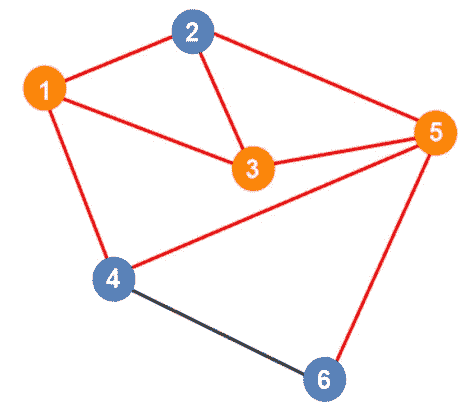

# 最小顶点覆盖直观解释

> 原文：<https://blog.devgenius.io/minimum-vertex-cover-visually-explained-497d23bd7f?source=collection_archive---------13----------------------->

当试图找到最小顶点覆盖时，你将试图找到包含所有边的最小顶点数。

我们可以从图上最密集的顶点开始，希望我们运气好。

接下来我们可以选择顶点 3。通过一些反复试验，你会发现无论你下一步选择哪个点，你都必须从点 1、2 和 3 中选择 2 个点。

接下来我们可以选择顶点 1 来获得连接 1 和 2 以及 1 和 4 的边。

最后，我们必须选择顶点 4 或顶点 6。我们会选择顶点 4。因为现在所有的边都包括在内了，这就完成了最小顶点覆盖。最小顶点覆盖由顶点 1、3、4 和 5 组成。

*如果你喜欢你所读的，看看我的书，***算法说明性介绍。**

**

*迪诺·卡希奇目前是 [LSBio(寿命生物科学公司)](https://www.lsbio.com/)、[绝对抗体](https://absoluteantibody.com/)、 [Kerafast](https://www.kerafast.com/) 、[珠穆朗玛生物科技](https://everestbiotech.com/)、[北欧 MUbio](https://www.nordicmubio.com/) 和[艾阿尔法](https://www.exalpha.com/)的 IT 主管。他还担任我的自动系统的首席执行官。他有十多年的软件工程经验。他拥有计算机科学学士学位，辅修生物学。他的背景包括创建企业级电子商务应用程序、执行基于研究的软件开发，以及通过写作促进知识的传播。*

*你可以在 [LinkedIn](https://www.linkedin.com/in/dinocajic/) 上联系他，在 [Instagram](https://instagram.com/think.dino) 上关注他，或者[订阅他的媒体出版物](https://dinocajic.medium.com/subscribe)。*

*阅读 Dino Cajic(以及 Medium 上成千上万的其他作家)的每一个故事。你的会员费直接支持迪诺·卡吉克和你阅读的其他作家。你也可以在媒体上看到所有的故事。*