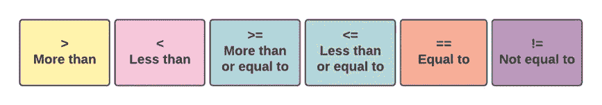
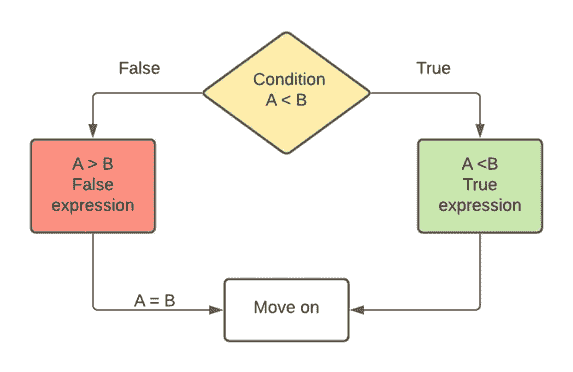
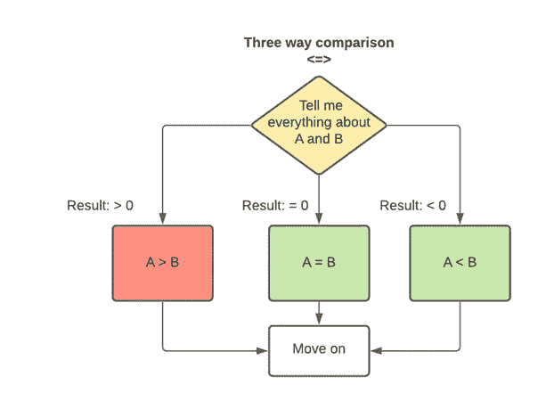

# 墙上的魔镜魔镜，谁是最伟大的(或最小的或相等的)？(第一部分)

> 原文：<https://blog.devgenius.io/mirror-mirror-on-the-wall-whos-the-greatest-or-smallest-or-equal-of-them-all-part-one-ec9416a56aad?source=collection_archive---------19----------------------->

## 你知道那个直到 10 岁才开口说话的男孩的故事吗？C++20 标准中出现的新的三向比较运算符< = >有点像这个小男孩——如果这个介绍没有任何意义，那么对于许多 C++开发人员来说，新的< = >运算符也没有意义。在这两个系列的文章中，我将解开并解释您需要了解的关于新的< = >操作符(又名飞船操作符)的一切，这样您就可以轻松地进行比较了。

你知道那个直到 10 岁才开口说话的男孩的故事吗？他的父母带他去看了最好的专家:语言治疗师、儿童发展专家、医生和心理学家——都没有用。这个男孩一句话也没说，没有人，甚至是最好的专家，能解释为什么。直到有一天，男孩的妈妈给他端上了一些热巧克力。“太热了！”男孩说。“我的好主人！你会说话！”，母亲哭了，擦着喜悦的眼泪，“你怎么到现在才说？”，她问男孩。“到目前为止一切都很好”，男孩回答…

就像这个小男孩的故事一样，C++比较运算符一切都很好，它们是从 C 继承来的。比较运算符和方法多年来一直保持不变，它们的角色很清楚，并有一套简单明了的使用规则。

图 1 在 C++中使用了很多年的比较运算符，它们继承自 C。

直到有一天，事情不再顺利，需要一种新的方法来支持对象之间的三向比较。这就是三向比较运算符 **< = >** (也称为飞船运算符)作为新 C++20 标准的一部分的由来。

但是缺少了什么呢？我们真的需要另一种方法来比较物体吗？到底什么是三方比较？如果多年来一切都很好，为什么会突然改变？

为了回答所有这些问题，我们首先需要看看到目前为止 C++中的事情是如何完成的。

# 最好是你认识的魔鬼？

在编程中，当我们需要比较两个元素时，我们通常需要一个布尔值(是/否):

一个比另一个大/小/相等/不可比。

因此，流程将是:is **A < B** ，并且基于结果，check 是 **A > B** 。如果这些选项都不为真，我们可以说 **A == B** ，但这超出了我们的查询范围，因为我们的查询只返回“真”或“假”。结论是我们需要*两个*查询来检查*三个*可能的结果。图 2 展示了在 C++20 之前两个操作数比较的流程。

图 2 比较运算符在两个操作数之间执行比较，并根据真或假的结果做出决定。在这种情况下，如果 A **B 为假，那么 A=B。**

全新的三方比较 **< = >** ，由于其类似宇宙飞船的形状，也被称为*宇宙飞船操作符*，是在新的 C++20 标准中引入的。这个操作符可以返回重载到它的三个比较的结果:小于操作符 **'** < **'** 、等于操作符 **'** = '和大于操作符“>”，它们组合在一起构成了这个: **< = >** 。

如果你已经对 C++有所了解，你可能知道在引入 spaceship 操作符之前，程序员有时会使用继承自 C 时代的 **memcmp()** 和 **strcmp()** 函数。作为现代 C++一部分的基本 **string::compare()** 过去是(现在仍然是)也是一个比较选项。当比较两个字符串时，这些函数能够提供三种结果之一，并且它们将返回一个整数来指示正值或负值。虽然，这些方法有点混乱和复杂，直到三向比较操作符，它们实际上是进行这种类型比较的唯一方法——这就是 **< = >** 操作符诞生的原因。

# 宇宙飞船操作员——这不是火箭科学

对于许多 C++开发人员，尤其是 C++新手来说，三向比较运算符乍一看有些令人困惑。许多开发人员很难理解这艘宇宙飞船是从哪里“着陆”的，为什么一开始就需要它，特别是因为，直到现在，就像小男孩的故事一样，一切似乎都很好。在这一节中，我们将解释到底是什么让飞船操作员变得更好，以及为什么需要它。但是，请注意，本节中的解释是不全面的，仅涉及什么是三向比较及其基本逻辑。在这一节中，我们不教如何在您的代码中实际使用这个操作符。

> 在我们的书 [*Learning C++*](https://www.manning.com/books/learning-c-plus-plus) 的第 3 章和第 6 章中，作者是 Michael Haephrati 和 Ruth Haephrati，由 [Manning Publications](https://www.manning.com/) 出版，我们深入探讨了这个概念的实际属性，以及如何在您的代码中秘密地使用它。

那么比较运算符是什么呢？让我们再看一下图 2:您可以看到，使用常规操作符，我们在问一个问题。比如*是 A <比 B* ？虽然我们有三种可能的结果，但我们只能从这三种结果中得到两种。这意味着我们需要进行另一个查询。让我们看看在这种情况下我们需要问什么:

***问题 1:***A 大于 B？

然后根据答案，你问第二个问题:

***问题二:***A 等于 B 吗？

新的 spaceship 操作符允许我们用一个*查询进行同样的压缩。每当使用<、>、< =、> =比较值时，我们都可以使用它。这就像去相亲，然后问:“**告诉我我需要知道的关于你的一切..**。”*

<=>就像“**告诉我我需要知道的关于你的一切** …”

三向比较允许你得到关于这个问题的答案:“你能告诉我关于 A 和 b 之间的关系吗？”

使用三向压缩，您只需问一个问题，就会得到三种结果之一:

**A > B**

**B > A**

**甲=乙**

图 3 展示了三向比较背后非常基本的逻辑。如你所见，在 A **B 的情况下，该函数将返回一个大于 0 的数字。**

图 3 图 3.10 三向比较返回 3 个可能的结果，而旧时间比较只会从 3 个结果中返回 2 个可能的结果。

除了这个非常酷的昵称之外，这个新操作符的巨大价值在于，通过使用它，我们将全部三个条件合并到一个简单的查询中。三分法又称*三分法*——分为三类。我们并不总是需要在代码中使用三分法，但当我们这样做时，飞船操作符非常方便，可以大大简化我们的代码。由于代码比文字更强大，让我们看看下面的两个代码片段。

**样本 1:** A<= B&&B<= A

在这个样本中，我们问:A 小于等于 B 吗，B 小于等于 A 吗？

**样品 2:** ！(A<B&&！(B < A)

在这个例子中，我们问:A 不小于 B，B 不小于 A 吗？

现在，我们可以将所有这些混乱合并成一个简洁的语句:

**A < = > B**

多酷啊！

# 三向比较法的实际应用

虽然在本文中，我们使用简单的例子来简化对复杂概念的解释，但是您可能会猜到在实际代码中，我们不会使用<=>来比较简单的对象或整数。在 C++20 中添加三向比较操作符的逻辑是为了简化复杂类型之间的比较，比如字符串、列表、序列和容器——我们将在本文的第二部分讨论这个问题。

在下一篇文章中，我们将更深入地研究 spaceship 操作符，并学习如何在我们的代码中使用它，使用一种可以替换 memcmp()、strcmp()和 compare()的方法。

> C *++是一种重要软件的严肃编程语言，30 年来一直是顶级编程语言之一——而且它的速度并没有减慢。到处都是 C++的指纹。学习它永远不会是一个糟糕的时间，我的新书***，与* [*迈克尔·海弗拉蒂*](https://www.linkedin.com/in/michaelhaephrati/) *合著并由曼宁出版社出版，将帮助你做到这一点——即使你没有任何编程或计算机科学经验。**