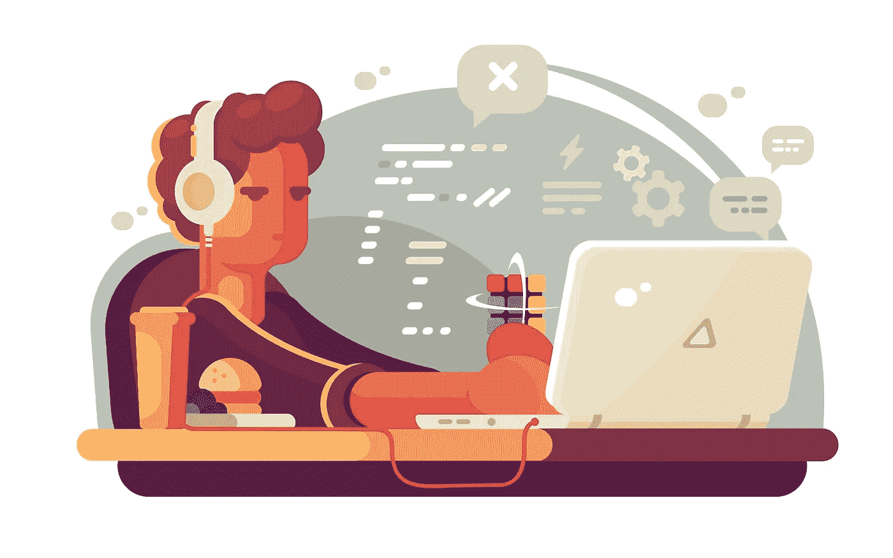

# 对软件工程师的误解

> 原文：<https://blog.devgenius.io/misconceptions-about-software-engineers-dfa9c321c67b?source=collection_archive---------18----------------------->

照片由 google.com 提供

在 twitter 上的一次随机访问中，我遇到了这个话题，关于人们对软件工程师或软件开发人员有什么误解(*我不知道关于头衔的喧嚣，但那是改天的故事……*)

我是肯尼亚的一名软件工程师，在过去的两年里，我不得不向几乎所有人解释我的工作。我确实理解这种困惑，尤其是来自 X 世代的人，也就是我的父母，他们只知道医学、教学和会计这些职业。他们不得不随着技术发展的步伐艰难地学习它。然而，几千年来，如果你不知道软件工程师是做什么的，那完全是无知。花几分钟时间“谷歌”一下，谢谢！☺️

在我职业生涯的大部分时间里，人们最大的误解是**我是 IT 人**(或者在这种情况下是女士)。当人们的电话坏了，他们的闪存盘无法读取，或者他们需要一个新笔记本电脑的报价时，你是他们第一个求助的人。对于一些人来说，这可能是一个商机，但不是！当你因为忘记插显示器线而无法打开电脑时，你可以打电话给我们。我们是设计、开发、维护您使用的网站和应用程序的人。你知道你用的脸书软件吗？有人创造了它。那个人是软件工程师。

我不介意修理电话和笔记本电脑，但当我的能力被放在一个不属于我的工作的天平上时，我会介意。当我们不知道你的机器有什么问题时，请原谅我们。我们尽了最大努力，但这并不意味着我们得到了您的计算机问题的所有解决方案。

第二个误解是，**我是黑客，** lol！

我每次听到这个都觉得越来越好笑。好莱坞和科幻电影对你们做了什么！？我尊重黑客，尤其是那些旨在提高网络安全意识的有道德的黑客，但并不是所有人都是黑客。我们中的一些人几乎不知道如何冒充用户，更不用说侵入系统或创建间谍软件了。我们的工作包括尝试为您的应用程序实施最佳的安全策略，而不是为非法行为窃取他人的密码。

我听到的最后一个误解是**我们总是在编码**。

gif 由 giphy.com 提供

我们确实热爱我们的工作，这是我们的激情所在，但我们也有自己的生活和其他兴趣！如果你了解我们，你会知道我们在代码之外有着完全不同的生活。我们的生活并不围绕着代码，但它确实占据了我们的大部分时间。

这是我听到的关于我职业生涯的三个常见误解。我确信还有很多我没有提到的，但是在一天结束的时候，不管人们认为你做了什么，从你的工作中找到快乐。