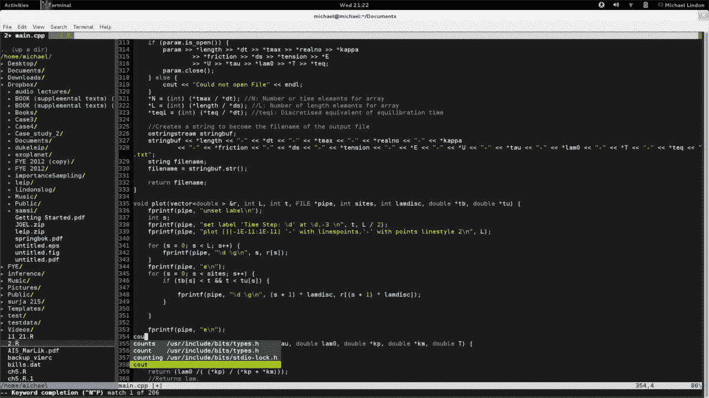
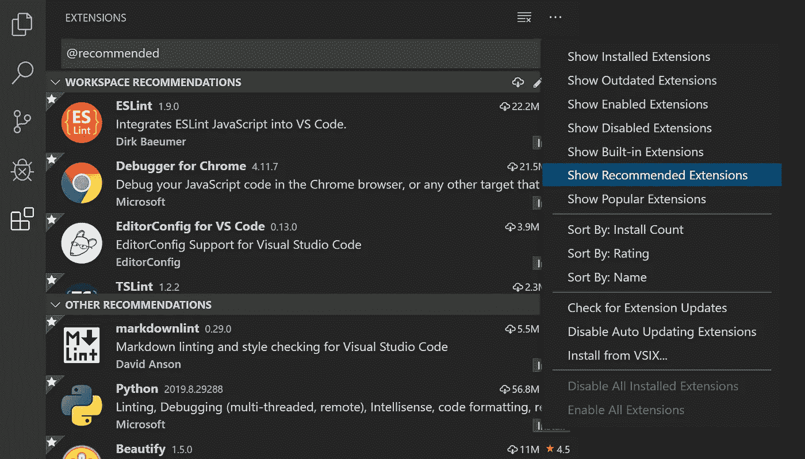

# 我在用文本编辑器编程时犯过的错误

> 原文：<https://blog.devgenius.io/mistakes-ive-made-when-coding-with-text-editors-1979d3dbe161?source=collection_archive---------9----------------------->

所有搞笑和愚蠢的错误及其相应的解决方案。

我们在编码时都会犯愚蠢的错误。其中一些与文本编辑器直接相关。现在，我将概述我在使用文本编辑器时所犯的错误，以及如何避免这些错误。以下是细节。

## **下载我从未用过的扩展**

我在下载我的第一个文本编辑器时犯了这个错误。无论我在这一刻学到了什么，我只是添加了扩展，甚至没有使用它们。这时我下载了 python，HTML，CSS，JavaScript 环境。直到今天，我只在实际使用中使用了我的带有 JavaScript 和 Solidity 的文本编辑器。

**如何避免？**

当这个错误可以很容易地避免时，实际上是令人惊讶的。首先，选择语言并了解让语言在文本编辑器上工作所需的扩展。事情是这样的。您需要过滤掉您将使用的扩展名。剩下的就舒服多了，因为没有多余的扩展。

## 不使用扩展名

编程的大罪是花了几个月才意识到我做错了什么。它阻止你的程序产生输出。更糟糕的是，你可能不得不从头开始重新调整一切。除非您正在使用 Anaconda Navigator 流行的 python 和 R 的文本编辑器；这是你想避免的错误，以使你的程序工作。

**如何避免？**

通过简单地学习编程语言的扩展名来使它工作。不要忘记所有的文件扩展名都是在程序名的末尾用一个点和编程语言名来命名的(例如 financialstatement.py。py =一个 python 程序)。使它更容易理解；我们的计划被命名为财务报表和。py 声明它是用 python 语言编写的。

*你怎么看待文字编辑器犯的错误？在下面的评论区分享你的想法。*