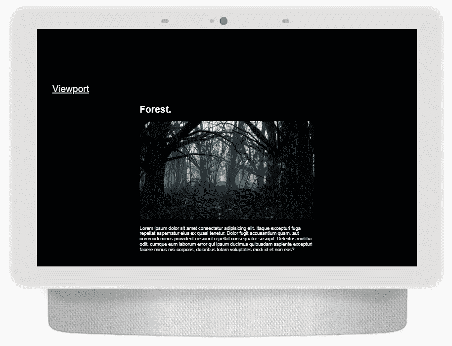
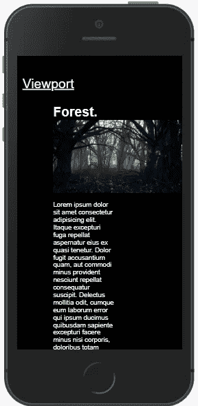
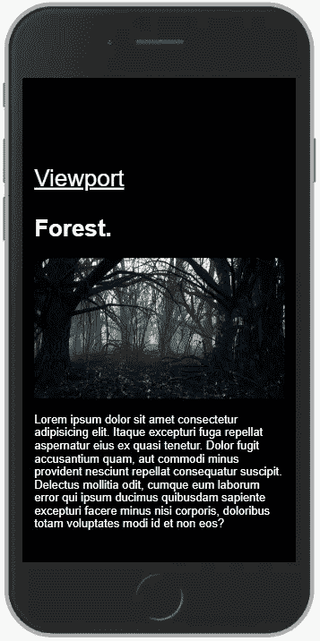
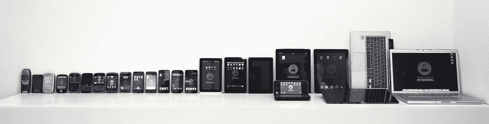
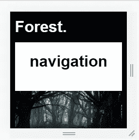
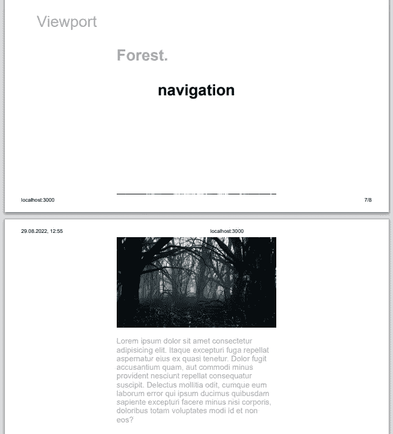
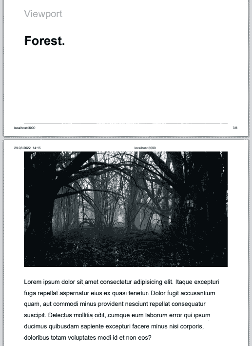
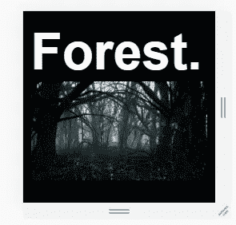

# 你在 CSS 媒体查询中犯的错误。

> 原文：<https://blog.devgenius.io/mistakes-that-you-make-in-css-media-query-6b0078401bed?source=collection_archive---------10----------------------->


*视口，@media，max-height，min-width，@supports，only，screen* 和**其他无用的东西**。如果我们有这个，我们还需要它做什么？

```
@media screen and (max-width: Npx) {}
```

> T4:我见过的大多数媒体提问都是这样的。

你可能使用 **DevTools** 进行响应式设计，当你测试你的布局时，你会使用 finding ***break*** 元素算法。

> ***Break*** 是一个在不需要时为当前屏幕增加 **y 滚动**的元素。

# 真实的例子。



在 ***Nest Hub Max*** 中，我们的站点在这个屏幕上看起来就像我们预期的那样。让我们缩小寻找 **break** 元素的屏幕尺寸。



## 行动组。

设计师说，在手机上，我们必须将内容放大到全屏。我们怎样才能做到呢？添加一个**@媒体目录**。



## 魔法🔮

我们增加了这个**媒体查询**。

```
@media screen and (max-width: 376px) {
   width: 100%;
}
```

这是作品。

# 总的来说:

1.  您创建了一个应用程序/站点
2.  您为其他显示添加了断点。
3.  你喝咖啡。

但是确实有不同的展示。在某些显示器上，**中的**高度大于**宽度，另一个宽度小于 200px** 或**宽度大于高度**和**等**。



这真的是个问题，你会失去很多用户和金钱。在这篇文章中，我想谈谈关于 ***视图端口/媒体查询*** 和 ***响应式布局*** 的不同主题，正如你所理解的，这是我写过的最长的介绍。

# 媒体提问简介。

***视口*** 是当前帧，无需额外的 x 或 y 滚动。
如果你的应用程序高度是 2340 像素，显示器尺寸是 1600 像素，你的视窗是 1600 像素。

**媒体查询**是样式更新的 CSS 规则，取决于设备设置。

**断点**是我们在媒体查询中声明的宽高比。

# 让我们看看基本的媒体查询。

```
@media screen and (max-(width/height): 1200px) {}
```

当前显示**大于/长于** 1200px 时应用样式。

```
@media screen and (min-(width/height): 1200px) {}
```

当前显示**小于/小于** 1200px 时应用样式。

```
@media screen and (max-(width/height): 1200px)
```

我们可以将这种风格应用到任何显示小于 1200 像素的设备上。

```
@media (orientation: "portrait" | "landscape")
```

应用的样式取决于设备的方向。

```
@media speech/all/print
```

如果当前设备是 ***打印机*** 或 ***语音*** ， ***全部*** 表示除**打印机**之外的一切。

有简单和受欢迎的媒体查询。有时你可以使用:**和**、**号、**和**等关键词创建一个困难的查询。**

```
@media screen and (max-width: 1200px)
```

这个**媒体查询**的语法是:

1.  **@ media**at-rule
2.  **屏幕**是媒体类型
3.  **最大宽度**为媒体特征

## 现在我们来谈谈陷阱。

# 陷阱和不明显的错误。

# a)想想身高。这真的很有必要。

你可能认为用户会在*台式机/笔记本电脑/手机/平板电脑*上使用你的应用。但这真的很有必要考虑一下另一个框架。**例如**:越来越多的人每天使用智能手表。智能手表默认尺寸是 240/240px。



在智能手表中，我们的站点是这样的。对于此尺寸，导航块太大-让我们更改此屏幕和此媒体查询的导航高度:

```
@media screen and (max-height: 240px) {} 
```


您可以看到，我们将应用升级到了智能手表。

## **结论**:

想想每个框架，当你看到带显示屏的设备时，你必须明白我们可以在上面运行你的应用。

# b)尽可能将“仅”用于“屏幕”

当我们创建媒体查询并想要为当前显示应用样式时，我们使用 ***媒体类型*** 关键字，但是旧浏览器不理解它，我们必须只使用**关键字**。

## 结论:

当使用**屏幕**关键字时，仅使用**。**

# c)不要忘记打印机。

不要忘记打印机。当我们在浏览器中看到一个应用程序时，浏览器使用 RGB 颜色模式，但打印机不使用。打印机使用 CMYK 模式，如你所知，在 CMYK -黑色往往会褪色。正如你所看到的，默认情况下，浏览器从灰色变成黑色。



**“Lorem…”**是灰色的，我们将在现实生活中打印它，灰色会更难看到。让我们为打印机更改一些样式:



我为导航块添加了 ***显示:无*** ，因为导航仅用于桌面，并且我将打印机的默认颜色改为黑色。

# d)考虑你使用的单位

如果你不考虑屏幕阅读器和随时随地使用像素，你可以跳过这一节。但是如果你仔细想想——你可能会使用 *rem* 来改进 UI。而正如你所理解的， ***雷姆打破了你的 UI*** *。*



## 为什么会这样？

1 红色是 HTML 的默认字体大小。默认情况下，1 像素为 16px。在本例中，*森林*为 2 rem——在桌面上，这与我们预期的一样，但是在另一个设备 ***上，例如智能手表*** 上，它不能正常工作。要解决这个问题，请尝试在其他装置上更换 **rem** 。

# e)使用百分比和 em

尝试使用*百分比、em* 和其他可缩放单位进行响应式设计，例如边距、填充、宽度。

> 但是当你使用可缩放的字体单位时，考虑一个响应性的设计。

# d)使用图片标签制作响应图像

我在[的这篇文章](/react-lazy-load-images-using-intersection-observer-60b6cc8790ff)中写到了它。

## Thx 阅读。

如果你能跟着我，我会很开心的！