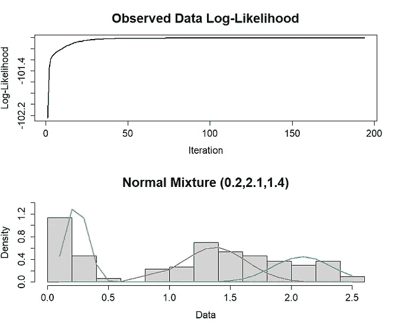
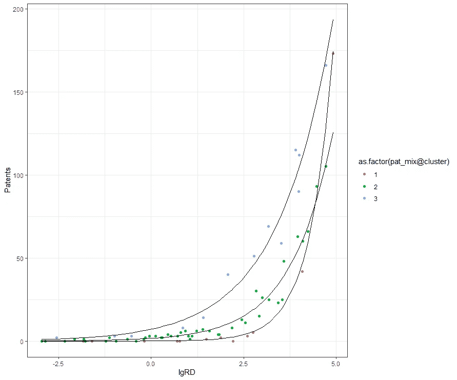

# 混合物、成分、零膨胀和栅栏模型

> 原文：<https://blog.devgenius.io/mixture-component-zero-inflated-and-hurdle-models-44c5e6fe5d7f?source=collection_archive---------4----------------------->

## 当单一分布不再足够时

我一直对组合分布或者混合模型很着迷。我的第一个混合模型是[负二项分布](https://medium.com/@marc.jacobs012/analysis-of-repeated-count-data-in-r-the-poisson-quasi-poisson-negative-binomial-e62aff528309)，也就是伽玛-泊松分布。然后，当然，我很快就遇到了零膨胀泊松模型(由于某种原因，常规泊松似乎永远不会在计数数据上完成交易)和障碍模型。它们都是由至少两种成分组成的模型。有些人甚至有更多，他们是必要的，以适应分布的颠簸，你没有足够的变量来解释颠簸(例如，当绘制男性和女性的长度没有性别变量)。

让我们使用可用的 R 和数据集来仔细看看这些混合模型。

首先，我们加载所有必要的库，然后从混合正态分布开始。模拟这种成分或混合物模型实际上很容易。你只需从不同的正态分布中抽取三个样本，然后将它们合并成一个向量。这将导致类似骆驼驼峰的分布。

下面，你会看到我用多种方法来做，最后拟合出一个三组件模型。

```
rm(list = ls())
library(mixtools)
library(extraDistr)
library(flexmix)
library(tidyverse)
library(mixR)
library(INLA)
library(gridExtra)
library(MASS)
library(fitdistrplus)
library(actuar)
library(compounding)
library(gamlss)
library(iZid)
library(glmmTMB)
library(bbmle) 
library(GLMMadaptive)### LETS SIMULATE MIXTURE MODELS #### 
x <- rmixnorm(1e5, c(0.5, 3, 6), c(3, 1, 1), c(1/3, 1/3, 1/3))
hist(x, 100, freq = FALSE)
curve(dmixnorm(x, c(0.5, 3, 6), c(3, 1, 1), c(1/3, 1/3, 1/3)),
      -20, 20, n = 500, col = "red", add = TRUE)hist(pmixnorm(x, c(0.5, 3, 6), c(3, 1, 1), c(1/3, 1/3, 1/3)))
plot(ecdf(x))
curve(pmixnorm(x, c(0.5, 3, 6), c(3, 1, 1), c(1/3, 1/3, 1/3)),
      -20, 20, n = 500, col = "red", lwd = 2, add = TRUE)norm1<-normalmixEM(x, 
                   lambda = c(0.3,0.3,0.3), 
                   mu = c(0.5,3,6), 
                   sigma = c(3,1,1))
par(mfrow = c(2, 1))
plot(norm1, density=TRUE, cex.axis=1.4, cex.lab=1.4, cex.main=1.8,
     main2="Mixture of Normal Distributions (0.5, 3, 6)")
mod1 = mixfit(x, ncomp = 3); mod1
plot(mod1, title = 'Mixture of Normal Distributions (0.5, 3, 6)')
```


图片作者。


图片作者。

这并不难，是吗？您可以通过硬编码或使用许多已有的软件包和内置函数来创建正态分布的混合模型。

现在，让我们建立一个来自泊松的混合模型。我会试着用一个正常的混合物来解释我所看到的。

```
y <- rmixpois(1e5, c(5, 12, 19), c(1/3, 1/3, 1/3))
plot(density(y))xx <- seq(-1, 50)
plot(prop.table(table(y)))
lines(xx, dmixpois(xx, c(5, 12, 19), c(1/3, 1/3, 1/3)), col = "red")
hist(pmixpois(y, c(5, 12, 19), c(1/3, 1/3, 1/3)))xx <- seq(0, 50, by = 0.01)
plot(ecdf(x))
lines(xx, pmixpois(xx, c(5, 12, 19), c(1/3, 1/3, 1/3)), col = "red", lwd = 2)mod1 = mixfit(y, ncomp = 2); mod1
plot(mod1, title = 'Mixture of Normal Distributions (4.8, 14.7)')
```


你可以看到泊松的微观分布，包括经验 CDF 函数。混合泊松线似乎没有重叠。图片作者。


然后，自动两组分正态分布混合在混合泊松之上。正态分布是一个真正的变色龙，所以尝试这个并不奇怪，也不会完全失败。但我也不认为这是一个合适的选择。图片作者。

接下来，我将展示我模拟混合分布的多个例子，然后通过各种库和工具拟合它们。这是有点相同的，但最后，你应该得到它的窍门。

```
mix.dist.alt2 <- function(n, mix.par, mu1, sigma1, mu2, df) {
  k <- rbinom(1, n, mix.par)
  sample(c(rnorm(k, mu1, sigma1), mu2+rt(n-k, df))) #shuffle the values
}
y<-mix.dist.alt2(1000,0.6,10,5,15,30)
plot(density(y))
norm1<-normalmixEM(y, 
                   lambda = 0.5, 
                   mu = c(10,15), 
                   sigma = c(10,5))
par(mfrow = c(2, 1))
plot(norm1, density=TRUE, cex.axis=1.4, cex.lab=1.4, cex.main=1.8,
     main2="Mixture of Normal Distributions (10, 15)")
summary(norm1)
plot(norm1)
mod1 = mixfit(y, ncomp = 2); mod1
plot(mod1, title = 'Mixture of Normal Distributions (10, 15)')
```


图片作者。

```
set.seed(100)
n <- 500
lambda <- rep(1, 2)/2
mu <- c(0, 5)
sigma <- rep(1, 2)
mixnorm.data <- mixtools::rnormmix(n, lambda, mu, sigma)
hist(mixnorm.data)
mod1 = mixfit(waiting, ncomp = 2); mod1
plot(mod1, title = 'Mixture of Normal Distributions (0, 5)')
```


图片作者。

```
attach(faithful)
hist(waiting, main="Time between Old Faithful eruptions",
xlab="Minutes", ylab="", cex.main=1.5, cex.lab=1.5, cex.axis=1.4)
wait1 <- normalmixEM(waiting, lambda = .5, mu = c(55, 80), sigma = 5)summary(wait1)
summary of normalmixEM object:
         comp 1   comp 2
lambda  0.36085  0.63915
mu     54.61364 80.09031
sigma   5.86909  5.86909
loglik at estimate:  -1034.002par(mfrow = c(3, 1))
plot(wait1, density=TRUE, cex.axis=1.4, cex.lab=1.4, cex.main=1.8,
     main2="Time between Old Faithful eruptions", xlab2="Minutes")
wait2 <- spEMsymloc(waiting, mu0 = c(55, 80))
plot(wait2, lty = 2, newplot = FALSE, addlegend = FALSE)
wait2a <- spEMsymloc(waiting, mu0 = c(55, 80), bw = 1)
wait2b <- spEMsymloc(waiting, mu0 = c(55, 80), bw = 6)
plot(wait2a, lty = 1, addlegend = FALSE, cex.axis = 1.4,
       cex.lab = 1.4, cex.main = 1.8, xlab = "Minutes",
       title = "Time between Old Faithful eruptions")
plot(wait2b, lty = 2, newplot = FALSE, addlegend = FALSE)mod1 = mixfit(waiting, ncomp = 2); mod1

Normal mixture model with 2 components
        comp1      comp2
pi  0.3608973  0.6391027
mu 54.6152288 80.0913054
sd  5.8715381  5.8674987EM iterations: 15 AIC: 2078 BIC: 2096.03 log-likelihood: -1034plot(mod1, title = 'Mixture of Normal Distributions (55, 80)')
```


图片作者。

```
m1 <- 0
m2 <- 50
sd1 <- sd2 <- 5
N1 <- 100
N2 <- 10
a <- rnorm(n=N1, mean=m1, sd=sd1)
b <- rnorm(n=N2, mean=m2, sd=sd2)
x <- c(a,b)
plot(density(x))
class <- c(rep('a', N1), rep('b', N2))
data <- data.frame(cbind(x=as.numeric(x), class=as.factor(class)))
p <- ggplot(data, aes(x = x)) + 
  geom_histogram(aes(x, ..density..), binwidth = 1, colour = "black", fill = "white") +
  geom_vline(xintercept = m1, col = "red", size = 2) + 
  geom_vline(xintercept = m2, col = "blue", size = 2)+theme_bw()
p
set.seed(0)
mo1 <- FLXMRglm(family = "gaussian")
mo2 <- FLXMRglm(family = "gaussian")
flexfit <- flexmix(x ~ 1, 
                   data = data, 
                   k = 2, 
                   model = list(mo1, mo2))
plot(flexfit)
plot_mix_comps <- function(x, mu, sigma, lam) {
  lam * dnorm(x, mu, sigma)
}
lam <- table(clusters(flexfit))
c1 <- parameters(flexfit, component=1)[[1]]
c2 <- parameters(flexfit, component=2)[[1]]
ggplot(data) +
  geom_histogram(aes(x, ..density..), binwidth = 1, colour = "black", fill = "white") +
  stat_function(geom = "line", fun = plot_mix_comps,
                args = list(c1[1], c1[2], lam[1]/sum(lam)),
                colour = "red", lwd = 1.5) +
  stat_function(geom = "line", fun = plot_mix_comps,
                args = list(c2[1], c2[2], lam[2]/sum(lam)),
                colour = "blue", lwd = 1.5) +
  ylab("Density") +theme_bw()
flex1 <- normalmixEM(data$x, 
                     lambda = .5, 
                     mu = c(0, 50), 
                     sigma = c(5,5))
par(mfrow = c(2, 1))
plot(flex1, density=TRUE, cex.axis=1.4, cex.lab=1.4, cex.main=1.8,
     main2="Normal Mixture (0,50)")
mod1 = mixfit(x, ncomp = 2); mod1
plot(mod1, title = 'Mixture of Normal Distributions (0, 50)')
```


图片作者。

```
m1 <- 20
m2 <- 40
sd1 <- 5
sd2 <- 10
N1 <- 100
N2 <- 100
a <- rnorm(n=N1, mean=m1, sd=sd1)
b <- rnorm(n=N2, mean=m2, sd=sd2)
x <- c(a,b)
class <- c(rep('a', N1), rep('b', N2))
data <- data.frame(cbind(x=as.numeric(x), class=as.factor(class)))
p <- ggplot(data, aes(x = x)) + 
  geom_histogram(aes(x, ..density..), binwidth = 1, colour = "black", fill = "white") +
  geom_vline(xintercept = m1, col = "red", size = 2) + 
  geom_vline(xintercept = m2, col = "blue", size = 2) +theme_bw();p
mo1 <- FLXMRglm(family = "gaussian")
mo2 <- FLXMRglm(family = "gaussian")
flexfit <- flexmix(x ~ 1, data = data, k = 2, model = list(mo1, mo2))
print(table(clusters(flexfit), data$class))
c1 <- parameters(flexfit, component=1)[[1]]
c2 <- parameters(flexfit, component=2)[[1]]
lam <- table(clusters(flexfit))
ggplot(data) +
  geom_histogram(aes(x, ..density..), binwidth = 1, colour = "black", fill = "white") +
  stat_function(geom = "line", fun = plot_mix_comps,
                args = list(c1[1], c1[2], lam[1]/sum(lam)),
                colour = "red", lwd = 1.5) +
  stat_function(geom = "line", fun = plot_mix_comps,
                args = list(c2[1], c2[2], lam[2]/sum(lam)),
                colour = "blue", lwd = 1.5) +
  ylab("Density") +theme_bw()
flex1 <- normalmixEM(data$x, 
                     lambda = .5, 
                     mu = c(20,40), 
                     sigma = c(5,10))
par(mfrow = c(2, 1))
plot(flex1, density=TRUE, cex.axis=1.4, cex.lab=1.4, cex.main=1.8,
     main2="Normal Mixture (20,40)")
mod1 = mixfit(data$x, ncomp = 2); mod1
plot(mod1, title = 'Mixture of Normal Distributions (20, 40)')
```


图片作者。

```
data(iris);attach(iris)
p <- ggplot(iris, aes(x = Petal.Width)) + 
  geom_histogram(aes(x = Petal.Width, ..density..),
                 binwidth = 0.1, colour = "black", fill = "white") + theme_bw();p
set.seed(0)
mo1 <- FLXMRglm(family = "gaussian")
mo2 <- FLXMRglm(family = "gaussian")
mo3 <- FLXMRglm(family = "gaussian")
flexfit <- flexmix(Petal.Width ~ 1, 
                   data = iris, 
                   k = 3, model = list(mo1, mo2, mo3))
c1 <- parameters(flexfit, component=1)[[1]]
c2 <- parameters(flexfit, component=2)[[1]]
c3 <- parameters(flexfit, component=3)[[1]]
lam <- table(clusters(flexfit))
ggplot(iris) +
  geom_histogram(aes(x = Petal.Width, ..density..), binwidth = 0.1, colour = "black", fill = "white") +
  stat_function(geom = "line", fun = plot_mix_comps,
                args = list(c1[1], c1[2], lam[1]/sum(lam)),
                colour = "red", lwd = 1.5) +
  stat_function(geom = "line", fun = plot_mix_comps,
                args = list(c2[1], c2[2], lam[2]/sum(lam)),
                colour = "blue", lwd = 1.5) +
  stat_function(geom = "line", fun = plot_mix_comps,
                args = list(c3[1], c3[2], lam[3]/sum(lam)),
                colour = "green", lwd = 1.5) + theme_bw() +  ylab("Density")
flex1 <- normalmixEM(iris$Petal.Width, 
                     lambda = c(0.333,0.320,0.347), 
                     mu = c(c1[[1]],c2[[1]],c3[[1]]), 
                     sigma = c(c1[[2]],c2[[2]],c3[[2]]))
par(mfrow = c(2, 1))
plot(flex1, density=TRUE, cex.axis=1.4, cex.lab=1.4, cex.main=1.8,
     main2="Normal Mixture (0.2,2.1,1.4)")
mod1 = mixfit(iris$Petal.Width, ncomp = 3); mod1
plot(mod1, title = 'Mixture of Normal Distributions (0.2,2.1,1.4)')
```



图片作者。

好了，现在您已经阅读了模拟正态分布混合模型和拟合混合模型的几个示例，以评估每个分布的组成部分——它们的比例、平均值和标准偏差。

接下来是一些不同的东西——包含多项式回归的混合模型，用于处理泊松数据。在这里，我使用了 [flexmix 包](https://cran.r-project.org/web/packages/flexmix/index.html)。我也看了一下[的 mixtools 包。](https://www.rdocumentation.org/packages/mixtools/versions/1.2.0/topics/normalmixEM)

```
par(mfrow = c(1, 1))
data("patent")
plot(density(patent$Patents))
plot(density(patent$RDS))
plot(density(patent$lgRD))
plot(patent$Patents, patent$RDS)
plot(patent$Patents, patent$lgRD)pat_mix <- flexmix(Patents ~ lgRD,
                   k = 3, data = patent,
                   model = FLXMRglm(family = "poisson"),
                   concomitant = FLXPmultinom(~RDS))
summary(pat_mix);plot(pat_mix, mark = 3)
fitted<-as.data.frame(predict(pat_mix))
combined<-cbind(patent,fitted,pat_mix@cluster)g1<-ggplot(combined, aes(x=lgRD))+
  geom_point(aes(y=Patents,col=as.factor(pat_mix@cluster)))+
  geom_line(aes(y=Comp.1))+
  geom_line(aes(y=Comp.2))+
  geom_line(aes(y=Comp.3))+theme_bw()c1 <- parameters(pat_mix , component=1)
c2 <- parameters(pat_mix , component=2)
c3 <- parameters(pat_mix , component=3)

flex1 <- normalmixEM(patent$lgRD, 
                     lambda = c(pat_mix@prior[1],
                                pat_mix@prior[2],
                                pat_mix@prior[3]), 
                     mu = c(c1[[1]],c2[[1]],c3[[1]]), 
                     sigma = c(c1[[2]],c2[[2]],c3[[2]]))summary(flex1)
summary of normalmixEM object:
          comp 1   comp 2   comp 3
lambda  0.114638 0.626038 0.259324
mu     -2.130172 0.922172 3.774489
sigma   0.576514 1.378248 0.685054
loglik at estimate:  -145.4764par(mfrow = c(2, 1))
plot(flex1, density=TRUE, cex.axis=1.4, cex.lab=1.4, cex.main=1.8,
     main2="Normal Mixture (0.6,-1.3,0.12)")
plot(refit(pat_mix), bycluster = FALSE)
mod1 = mixfit(patent$lgRD, ncomp = 3, max_iter=2000); mod1
plot(mod1, title = 'Mixture of Normal Distributions (0.6,-1.3,0.12)')
```


包括几个变量的分布。



混合物模型的组成部分和观测值之上的预测值。


使用正态分布模型建模的数据。如您所见，该分布可以用正态分布来近似，但最好还是看一看泊松混合。我以后会做那件事。图片作者。

让我们通过添加一个集群组件来稍微改变一下模型。然后，我们可以重新调整模型，看看事情是否发生了变化，并看看来自模型的预测。

```
pat_mix2 <- flexmix(Patents ~ 1,
                    concomitant = FLXPmultinom(~RDS),
                    data = patent, cluster = Post_1,
                    model = Model_2)
summary(pat_mix2)
parameters(pat_mix2 , component=1)
c(M_1 = BIC(pat_mix), M_2 = BIC(pat_mix2))
plot(refit(pat_mix))
fitted2<-as.data.frame(predict(pat_mix2))
combined<-cbind(patent,fitted,pat_mix2@cluster)
g2<-ggplot(combined, aes(x=lgRD))+
  geom_point(aes(y=Patents,col=as.factor(pat_mix2@cluster)))+
  geom_line(aes(y=Comp.1))+
  geom_line(aes(y=Comp.2))+
  geom_line(aes(y=Comp.3))+theme_bw()
grid.arrange(g1,g2)
```


改装部件及其系数，以及新旧型号的新旧拟合线。图片作者。

让我们继续使用混合模型来模拟数据。下面，您会看到一个新的数据集、图和包含多项式的混合模型。我试图为连续数据拟合一个双组分混合模型。

```
data("NPreg")
plot(density(NPreg$yn))
ggplot(NPreg)+
  geom_density(aes(x=yn))+
  geom_density(aes(x=yp))+
  geom_density(aes(x=yb))+
  theme_bw()
plot(NPreg$x, NPreg$yn)m1 <- flexmix(yn ~ x + I(x^2), data = NPreg, k = 2)
plot(m1)
parameters(m1, component = 1)
parameters(m1, component = 2)
table(NPreg$class, clusters(m1))rm1 <- refit(m1)
summary(rm1)
plot(rm1)mod1 = mixfit(NPreg$yn, ncomp = 2); mod1
plot(mod1, title = 'Mixture of Normal Distributions (7.3,33.4)')
```


向量的分布和散点图表明需要多项式。


图片作者。


一个双组分正态混合模型。图片作者。

现在，让我们来拟合一个混合泊松分布。

```
m2 <- flexmix(yp ~ x, data = NPreg, k = 2,
              model = FLXMRglm(family = "poisson"));summary(m2)Call:
flexmix(formula = yp ~ x, data = NPreg, k = 2, model = FLXMRglm(family = "poisson"))prior size post>0 ratio
Comp.1 0.532  112    197 0.569
Comp.2 0.468   88    200 0.440'log Lik.' -440.6424 (df=5)
AIC: 891.2849   BIC: 907.7765m3 = flexmix(~x, data=NPreg, k=2,
             model=list(FLXMRglm(yn~.+I(x^2)),
             FLXMRglm(yp~., family="poisson")));summary(m3)Call:
flexmix(formula = ~x, data = NPreg, k = 2, model = list(FLXMRglm(yn ~ . + I(x^2)), 
    FLXMRglm(yp ~ ., family = "poisson")))prior size post>0 ratio
Comp.1 0.507  104    137 0.759
Comp.2 0.493   96    139 0.691'log Lik.' -1044.768 (df=13)
AIC: 2115.535   BIC: 2158.414plot(m3)ggplot(NPreg,aes(x,yn,color=as.factor(id2)))+
  geom_point() + theme_bw() + theme(legend.position = "none")mod1 = mixfit(NPreg$x, ncomp = 2); mod1Normal mixture model with 2 components
       comp1     comp2
pi 0.4869582 0.5130418
mu 2.5944372 7.3432475
sd 1.5526815 1.5401136EM iterations: 53 AIC: 963.38 BIC: 979.87 log-likelihood: -476.69plot(mod1, title = 'Mixture of Normal Distributions (2.5,7.3)')
```


右边的正态混合物非常努力地去拟合泊松，它实际上非常接近，但是它可以做得更好。图片作者。

几个模型之后，并尝试逐步选择，我们可以绘制预测值，以覆盖他们的观察。如您所见，flexmix 包在处理离散数据方面非常灵活(正如它的名字一样)。

```
m4 <- flexmix(yn ~ x + I(x^2) | id2, data = NPreg, k = 2)
summary(m4)Call:
flexmix(formula = yn ~ x + I(x^2) | id2, data = NPreg, k = 2)prior size post>0 ratio
Comp.1   0.5  100    100     1
Comp.2   0.5  100    100     1'log Lik.' -561.5651 (df=9)
AIC: 1141.13   BIC: 1170.815plot(m4)
fitted<-as.data.frame(predict(m4))
combined<-cbind(NPreg,fitted,m4@cluster)
ggplot(combined, aes(x=x))+
  geom_point(aes(y=yn, col=as.factor(m4@cluster)))+
  geom_line(aes(y=Comp.1))+
  geom_line(aes(y=Comp.2))+theme_bw()
```


图片作者。

Flexmix 也有一个逐步选择工具，但它的表现不如我所愿。我不喜欢逐步选择的方法。

```
m7 <- stepFlexmix(yp ~ x + I(x^2) | id2, data = NPreg,
                  control = list(verbose = 0), k = 1:5, nrep = 20);m7
summary(m7)1 : * * * * * * * * * * * * * * * * * * * *
2 : * * * * * * * * * * * * * * * * * * * *
3 : * * * * * * * * * * * * * * * * * * * *
4 : * * * * * * * * * * * * * * * * * * * *
5 : * * * * * * * * * * * * * * * * * * * *Call:
stepFlexmix(yp ~ x + I(x^2) | id2, data = NPreg, control = list(verbose = 0), k = 1:5, 
    nrep = 20)iter converged k k0    logLik      AIC      BIC      ICL
1    2      TRUE 1  1 -462.7772 933.5544 946.7477 946.7477
2   16      TRUE 2  2 -434.6688 887.3376 917.0224 924.9417
3   52      TRUE 3  3 -427.1162 882.2324 928.4088 936.5170
4  104      TRUE 4  4 -421.2285 880.4569 943.1250 957.5175
5  113      TRUE 5  5 -417.6660 883.3320 962.4916 970.0022plot(m7)
m7_select<-getModel(m7, "BIC")
summary(m7_select)Call:
stepFlexmix(yp ~ x + I(x^2) | id2, data = NPreg, control = list(verbose = 0), k = 2, 
    nrep = 20)prior size post>0 ratio
Comp.1 0.471   96    196 0.490
Comp.2 0.529  104    176 0.591'log Lik.' -434.6688 (df=9)
AIC: 887.3376   BIC: 917.0224fitted<-as.data.frame(predict(m7_select))
combined<-cbind(NPreg,fitted,m7_select@cluster)
ggplot(combined, aes(x=x))+
  geom_point(aes(y=yn, col=as.factor(m7_select@cluster)))+
  geom_line(aes(y=Comp.1))+
  geom_line(aes(y=Comp.2))+theme_bw()
```


图片作者。

如果我们谈论混合，我们就谈论分布，R 有这么多很酷的软件包来为你的数据寻找合适的分布，以及组合分布。让我们仔细看看！

```
library("MASS")
data(geyser)
summary(geyser)
attach(geyser)
plot(waiting,duration)
plot(duration,waiting)
plot(density(waiting))
plot(density(duration))
idx1 <- geyser$duration <=3
ggplot(geyser,aes(x=duration, col=idx1))+
  geom_density()+theme_bw()
mod1 = mixfit(duration, ncomp = 2); mod1
plot(mod1, title = 'Normal Mixture Model (1.95, 4.23)')
```


一个简单的正态混合模型。图片作者。

上面是一个简单的正态混合模型的重复例子，但下面我们会发现新的分布。[威布尔](https://en.wikipedia.org/wiki/Weibull_distribution)、[伽玛](https://en.wikipedia.org/wiki/Gamma_distribution)、[对数正态](https://en.wikipedia.org/wiki/Log-normal_distribution)。不一定是混合物(虽然它们可以混合)，但对其余部分来说是一个很好的提升。

```
library("fitdistrplus")
options(digits = 4)
set.seed(1234)
data("groundbeef", package = "fitdistrplus")
str(groundbeef)
plotdist(groundbeef$serving, histo = TRUE, demp = TRUE)
descdist(groundbeef$serving, boot = 1000)
fw <- fitdist(groundbeef$serving, "weibull")
fg <- fitdist(groundbeef$serving, "gamma")
fln <- fitdist(groundbeef$serving, "lnorm")
par(mfrow = c(2, 2))
denscomp(list(fw, fln, fg), legendtext = c("Weibull", "lognormal", "gamma"))
qqcomp(list(fw, fln, fg), legendtext = c("Weibull", "lognormal", "gamma"))
cdfcomp(list(fw, fln, fg), legendtext = c("Weibull", "lognormal", "gamma"))
ppcomp(list(fw, fln, fg), legendtext = c("Weibull", "lognormal", "gamma"))
```


使用威布尔、对数正态和伽玛模型来尝试和拟合观察到的数据。图片作者。

让我们来看看更奇特的分布:[伯尔](https://en.wikipedia.org/wiki/Burr_distribution)、[帕累托](https://en.wikipedia.org/wiki/Pareto_distribution)和[对数逻辑分布](https://en.wikipedia.org/wiki/Log-logistic_distribution)。下面的代码看起来很长，但它们是我上面所做的重复——查看一个发行版，并试图适应许多可能看起来合适的版本。

```
data("endosulfan", package = "fitdistrplus")
ATV <- endosulfan$ATV
fendo.ln <- fitdist(ATV, "lnorm")
library("actuar")
fendo.ll <- fitdist(ATV, "llogis", start = list(shape = 1, scale = 500))
fendo.P  <- fitdist(ATV, "pareto", start = list(shape = 1, scale = 500))
fendo.B  <- fitdist(ATV, "burr", start = list(shape1 = 0.3, shape2 = 1, rate = 1))par(mfrow = c(1, 1))
cdfcomp(list(fendo.ln, fendo.ll, fendo.P, fendo.B), xlogscale = TRUE,ylogscale = TRUE, legendtext = c("lognormal", "loglogistic", "Pareto", "Burr"))quantile(fendo.B, probs = 0.05)
quantile(ATV, probs = 0.05)gofstat(list(fendo.ln, fendo.ll, fendo.P, fendo.B),
        fitnames = c("lnorm", "llogis", "Pareto", "Burr"))
bendo.B <- bootdist(fendo.B, niter = 1001)summary(bendo.B)
plot(bendo.B)
quantile(bendo.B, probs = 0.05)fendo.ln.ADL <- fitdist(ATV, "lnorm", method = "mge", gof= "ADL")
fendo.ln.AD2L <- fitdist(ATV, "lnorm", method = "mge", gof = "AD2L")cdfcomp(list(fendo.ln, fendo.ln.ADL, fendo.ln.AD2L),
        xlogscale = TRUE, ylogscale = TRUE,
        main = "Fitting a lognormal distribution", xlegend = "bottomright",legendtext = c("MLE", "Left-tail AD", "Left-tail AD 2nd order"))(HC5.estimates <- c(
  empirical = as.numeric(quantile(ATV, probs = 0.05)),
  Burr = as.numeric(quantile(fendo.B, probs = 0.05)$quantiles),
  lognormal_MLE = as.numeric(quantile(fendo.ln, probs = 0.05)$quantiles),lognormal_AD2 = as.numeric(quantile(fendo.ln.ADL, probs = 0.05)$quantiles),lognormal_AD2L = as.numeric(quantile(fendo.ln.AD2L,probs = 0.05)$quantiles)))
data("danishuni", package = "fitdistrplus")str(danishuni)
fdanish.ln.MLE <- fitdist(danishuni$Loss, "lnorm")
fdanish.ln.MME <- fitdist(danishuni$Loss, "lnorm", method = "mme", order = 1:2)cdfcomp(list(fdanish.ln.MLE, fdanish.ln.MME), 
        legend = c("lognormal MLE", "lognormal MME"), 
        main = "Fitting a lognormal distribution",
        xlogscale = TRUE, datapch = 20)fdanish.P.MLE <- fitdist(danishuni$Loss, "pareto", 
                         start = list(shape = 10, scale = 10), 
                         lower = 2+1e-6, 
                         upper = Inf)memp <- function(x, order) sum(x^order)/length(x)
fdanish.P.MME <- fitdist(danishuni$Loss, "pareto", method = "mme", order = 1:2, memp = "memp", start = list(shape = 10, scale = 10), 
                         lower = c(2+1e-6, 2+1e-6), 
                         upper = c(Inf, Inf))
par(mfrow = c(1,2))
cdfcomp(list(fdanish.ln.MLE, fdanish.ln.MME), 
        legend = c("lognormal MLE", "lognormal MME"), main = "Fitting a lognormal distribution",xlogscale = TRUE, datapch = 20)
cdfcomp(list(fdanish.P.MLE, fdanish.P.MME), legend = c("Pareto MLE", "Pareto MME"), main = "Fitting a Pareto distribution",xlogscale = TRUE, datapch = 20)par(mfrow = c(1, 1))
cdfcomp(list(fdanish.P.MLE, fdanish.P.MME), 
        legend = c("Pareto MLE", "Pareto MME"), 
        main = "Fitting a Pareto distribution", xlogscale = TRUE, datapch = ".")gofstat(list(fdanish.ln.MLE, fdanish.P.MLE,fdanish.ln.MME, fdanish.P.MME),fitnames = c("lnorm.mle", "Pareto.mle", "lnorm.mme", "Pareto.mme"))fdanish.ln.QME1 <- fitdist(danishuni$Loss, "lnorm", method = "qme", 
                           probs = c(1/3, 2/3))
fdanish.ln.QME2 <- fitdist(danishuni$Loss, "lnorm", method = "qme", 
                           probs = c(8/10, 9/10))cdfcomp(list(fdanish.ln.MLE, fdanish.ln.QME1, fdanish.ln.QME2), 
        legend = c("MLE", "QME(1/3, 2/3)", "QME(8/10, 9/10)"), 
        main = "Fitting a lognormal distribution", xlogscale = TRUE, datapch = 20)cdfcomp(list(fdanish.ln.MLE, fdanish.ln.QME1, fdanish.ln.QME2), 
        legend = c("MLE", "QME(1/3, 2/3)", "QME(8/10, 9/10)"), main = "Fitting a lognormal distribution",xlogscale = TRUE, datapch = 20)
```


图片作者。

适合的发行版列表几乎是无止境的，您甚至可以构建自己的发行版。但是，让我们回到传统的离散分布——泊松分布和负二项分布。如你所见，[和计数数据的常见情况](/power-analysis-for-categorical-data-in-sas-multinomial-ordinal-binary-binomial-beta-poisson-9398888491da)，负二项式比泊松更适合。

```
data("toxocara", package = "fitdistrplus")
str(toxocara)
ftoxo.P <- fitdist(toxocara$number, "pois"))
ftoxo.nb <- fitdist(toxocara$number, "nbinom"))plot(ftoxo.P)cdfcomp(list(ftoxo.P, ftoxo.nb),
        legendtext = c("Poisson", "negative binomial"))gofstat(list(ftoxo.P, ftoxo.nb),
        fitnames = c("Poisson","negative binomial"))Chi-squared statistic:  31257 7.486 
Degree of freedom of the Chi-squared distribution:  5 4 
Chi-squared p-value:  0 0.1123 
   the p-value may be wrong with some theoretical counts < 5  
Chi-squared table:
      obscounts theo Poisson theo negative binomial
<= 0         14     0.009014                 15.295
<= 1          8     0.078237                  5.809
<= 3          6     1.321767                  6.845
<= 4          6     2.131298                  2.408
<= 9          6    29.827829                  7.835
<= 21         6    19.626224                  8.271
> 21          7     0.005631                  6.537Goodness-of-fit criteria
                               Poisson negative binomial
Akaike's Information Criterion    1017             322.7
Bayesian Information Criterion    1019             326.6
```


图片作者。

同样重要的是，让我们转向零膨胀和障碍模型。根据定义，它们是混合模型，因为它们有两个组件来处理具有单一问题(太多零)的单一分布。当计数数据有太多的 0 时，将不可避免地出现下降，因此你需要建立两个驼峰的模型。

模拟零膨胀或栅栏模型没有那么难，然后可以附加到泊松、负二项、[贝塔-二项](https://en.wikipedia.org/wiki/Beta-binomial_distribution)和[贝塔-负二项](https://en.wikipedia.org/wiki/Beta_negative_binomial_distribution)模型。

[零充气](https://en.wikipedia.org/wiki/Zero-inflated_model)和[跨栏](https://en.wikipedia.org/wiki/Hurdle_model)模型的区别在于:

1.  零膨胀模型将模拟两个部分——零的概率和 x 的概率。
2.  栅栏模型还将模拟两个部分——零概率和≠ 0 概率。

与零膨胀模型相反，栅栏模型将零计数和非零结果视为两个完全独立的类别，而不是将零计数结果视为结构零和采样零的混合。因此，在某些场景中，他们可能看起来一样，行为也一样，但他们并不相同。

让我们用 [iZid](https://cran.r-project.org/web/packages/iZID/index.html) R 软件包来模拟分析这些模型。首先，我会模拟。

```
t1=sample.h(N=2000,phi=0.2,distri='Poisson',lambda=5)          ##hurdle poisson random values
t2=sample.h(N=2000,phi=0.2,distri='nb',r=10,p=0.6)             ##hurdle negative binomial
t3=sample.h(N=2000,phi=0.2,distri='bb',alpha1=8,alpha2=9,n=10) ##hurdle beta binomial
t4=sample.h(N=2000,phi=0.2,distri='bnb',r=10,alpha1=8,alpha2=9)##hurdle beta negative binomial.
t5=sample.zi(N=2000,phi=0.2,distri='Poisson',lambda=5)  ##zero-inflated poisson random values
t6=sample.zi(N=2000,phi=0.2,distri='nb',r=10,p=0.6)   ##zero-inflated negative binomial
t7=sample.zi(N=2000,phi=0.2,distri='bb',alpha1=8,alpha2=9,n=10)   ##zero-inflated beta binomial
t8=sample.zi(N=2000,phi=0.2,distri='bnb',r=10,alpha1=8,alpha2=9) ##zero-inflated beta negative binomial
DF<-as.data.frame(cbind(t1,t2,t3,t4,t5,t6,t7,t8))g1<-ggplot(DF)+
  geom_density(aes(x=t1, fill="Hurdle Poisson"), alpha=0.5)+
  geom_density(aes(x=t2, fill="Hurdle Negative-Binomial"), alpha=0.5)+
  geom_density(aes(x=t3, fill="Hurdle Beta-Binomial"), alpha=0.5)+
  geom_density(aes(x=t4, fill="Hurdle Beta-Negative-Binomial"), alpha=0.5)+
  geom_density(aes(x=t5, fill="Zero-Inflated Poisson"), alpha=0.5)+
  geom_density(aes(x=t6, fill="Zero-Inflated Negative-Binomial"), alpha=0.5)+
  geom_density(aes(x=t7, fill="Zero-Inflated Beta-Binomial"), alpha=0.5)+
  geom_density(aes(x=t8, fill="Zero-Inflated Beta-Negative-Binomial"), alpha=0.5)+
  guides(fill=guide_legend(title="All Zero-Inflated and Hurdle Distributions"))+
  theme_bw()g2<-ggplot(DF)+
  geom_density(aes(x=t1, fill="Hurdle Poisson"), alpha=0.5)+
  geom_density(aes(x=t2, fill="Hurdle Negative-Binomial"), alpha=0.5)+
  geom_density(aes(x=t3, fill="Hurdle Beta-Binomial"), alpha=0.5)+
  geom_density(aes(x=t4, fill="Hurdle Beta-Negative-Binomial"), alpha=0.5)+
  guides(fill=guide_legend(title="All Hurdle Distributions"))+
  theme_bw()g3<-ggplot(DF)+
  geom_density(aes(x=t5, fill="Zero-Inflated-Poisson"), alpha=0.5)+
  geom_density(aes(x=t6, fill="Zero-Inflated-Negative-Binomial"), alpha=0.5)+
  geom_density(aes(x=t7, fill="Zero-Inflated-Beta-Binomial"), alpha=0.5)+
  geom_density(aes(x=t8, fill="Zero-Inflated-Beta-Negative Binomial"), alpha=0.5)+
  guides(fill=guide_legend(title="All Zero-Inflated Distributions"))+
  theme_bw()grid.arrange(g1,g2,g3)
```


因为我使用了相同的参数，所以不容易发现不同之处。然而，分布并不相同。图片作者。

现在，让我们采用模拟的零膨胀泊松分布( *t5* )，拟合它，并使用基本泊松和零膨胀泊松进行分析。如你所见，零膨胀泊松做得更好，这是我所期望的。

```
t5_fit<-poisson.zihmle(t5,type ="zi", lowerbound = 0.01,upperbound = 10000)
dis.kstest(t5,nsim=100,bootstrap=TRUE,
           distri="zip")$pvaluefitp <- fitdist(t5,"pois")
summary(fitp)
plot(fitp)fitzip <- fitdist(t5, "ZIP", 
                  start=list(mu=4.9, sigma=0.9),
                  lower=c(-Inf, 0.001), 
                  upper=c(Inf, 1), 
                  optim.method="L-BFGS-B")
plot(fitzip)
cdfcomp(list(fitzip, fitp))
gofstat(list(fitzip, fitp))Goodness-of-fit statistics
                              1-mle-ZIP  2-mle-pois
Kolmogorov-Smirnov statistic  0.1875014   0.2246594
Cramer-von Mises statistic   11.0954874  25.6150375
Anderson-Darling statistic   74.4086567 221.9835926Goodness-of-fit criteria
                               1-mle-ZIP 2-mle-pois
Akaike's Information Criterion  9023.328    10483.1
Bayesian Information Criterion  9034.530    10488.7
```


图片作者。

我们再来看看一个跨栏模型！我要做的是使用 [glmmTMB](https://cran.r-project.org/web/packages/glmmTMB/index.html) 软件包，拟合一个负二项式跨栏模型，和一个零膨胀泊松模型。如您所见，正如所料，跨栏模型最合适。

```
plot(density(DF$t2))
t2_fit<-nb.zihmle(t2,
                   r=8,
                   p=0.6, 
                   type ="h", 
                   lowerbound = 0.01,
                   upperbound = 10000)
summary(t2_fit)
fit_t2_nbh <- glmmTMB(t2~1,
                      ziformula=~.,
                      data=DF,
                      family=truncated_nbinom1)
summary(fit_t2_nbh)Family: truncated_nbinom1  ( log )
Formula:          t2 ~ 1
Zero inflation:      ~.
Data: DFAIC      BIC   logLik deviance df.resid 
 10298.3  10315.1  -5146.1  10292.3     1997Dispersion parameter for truncated_nbinom1 family (): 0.737Conditional model:
            Estimate Std. Error z value Pr(>|z|)    
(Intercept)  1.90854    0.01276   149.6   <2e-16 ***
---
Signif. codes:  0 ‘***’ 0.001 ‘**’ 0.01 ‘*’ 0.05 ‘.’ 0.1 ‘ ’ 1Zero-inflation model:
            Estimate Std. Error z value Pr(>|z|)    
(Intercept) -1.44029    0.05683  -25.34   <2e-16 ***
---
Signif. codes:  0 ‘***’ 0.001 ‘**’ 0.01 ‘*’ 0.05 ‘.’ 0.1 ‘ ’ 1fit_t2_nb <- glmmTMB(t2~1,
                      ziformula=~1,
                      data=DF,
                      family=poisson)
summary(fit_t2_nb)AICtab(fit_t2_nbh, fit_t2_nb)dAIC  df
fit_t2_nbh   0.0 3 
fit_t2_nb  272.9 2
```


图片作者。

让我们使用 [sjPlot](https://strengejacke.github.io/sjPlot/) 包做一个更好的比较。正如你所看到的，这两种模型实际上都很合适。这也表明，仅仅在一个发行版上应用这样的模型有点矫枉过正。

```
tab_model(fit_t2_nbh,fit_t2_nb,p.val = "kr", show.df = TRUE)
```


图片作者。

我希望这被认为是一个很好的介绍混合物，组件，零膨胀和跨栏模型。现在你自己试试，如果有什么地方不对劲，请告诉我！