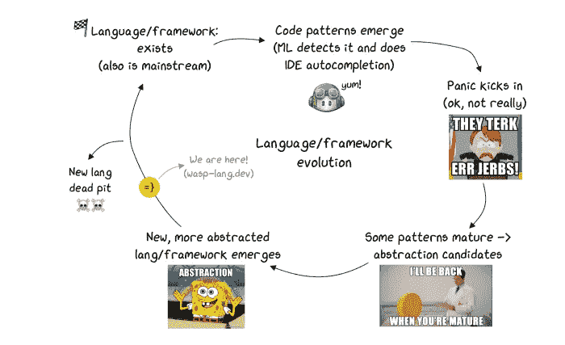
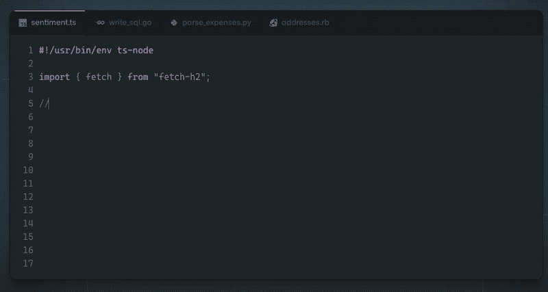

# ML 代码生成与手工编码——未来的假设

> 原文：<https://blog.devgenius.io/ml-code-generation-vs-coding-by-hand-a-hypothesis-of-the-future-1ae1cc405d86?source=collection_archive---------7----------------------->



我们正在开发一种[配置语言/ DSL，用于构建与 React & Node.js 集成的 web 应用](https://wasp-lang.dev/)。我们多次被问到"*你为什么要费心为 web 应用开发创建一种新的语言？Github Copilot*不是很快就会为您生成所有代码吗？*”。

这是我们对形势的看法，以及我们对未来的看法。

# 为什么要生成(ML)代码？

为了让开发更快，我们想到了 IDE 自动完成功能——例如，如果你正在使用 React 并开始输入`componentDid`，IDE 会自动提供给`componentDidMount()`或`componentDidLoad()`来完成。除了保存击键，也许更有价值的是能够看到在当前范围内哪些方法/属性对我们可用。IDE 知道项目结构和代码层次结构，这也使得重构更加容易。

虽然这已经很棒了，但我们如何才能更上一层楼呢？传统的 IDE 支持基于人类编写的规则，例如，如果我们想让 IDE 能够为我们实现常见的功能，那么就有太多的规则需要手工编目和维护。

如果有一种方法可以让计算机分析我们迄今为止编写的所有代码，并自己学习如何自动完成我们的代码，以及对人类做些什么，而不是我们做所有的艰苦工作——哦，等等，…


什么？每个人都喜欢一块美味的蛋糕，这是人类众所周知的事实。尤其是上面有樱桃的时候。

除了美味和潮湿的蛋糕，我们实际上有这个工作！ide 现在可以做一些非常酷的事情，比如根据函数的名称和附带的注释，提出函数的完整实现:



GitHub Copilot 根据评论和签名生成一个完整的函数

这真是太神奇了！上面的例子是由 [Github Copilot](https://copilot.github.com/) 驱动的——它本质上是一个基于大量公开可用代码训练的神经网络。我不会深入它是如何工作的技术细节，但是有很多伟大的文章涵盖了它背后的科学。

看到这里，问题出现了——这对编程的未来意味着什么？这仅仅是类固醇上的 IDE 自动完成还是其他什么？如果我们可以在评论中输入我们想要的，就这样，我们还需要继续手动编写代码吗？


我就知道——那些讨厌的开发人员会收到我的来信的！(“将所有评估减半”)

# 蛋糕是一个谎言——一旦代码生成，谁来维护它？

** *参考* [*传送门*](https://en.wikipedia.org/wiki/Portal_(video_game)) *，这是一款著名的视频游戏，其中人工智能在人类身上进行实验，同时假装善意，并承诺如果他们坚持到底，就给他们一个蛋糕。人工智能最终会嵌入土豆中。*

当考虑 ML 代码生成如何影响整个开发过程时，有一件事情需要考虑，当看到令人敬畏的 Copilot 示例时，它通常不会立即浮现在脑海中。

出于本文的目的，我不会深入探讨代码质量、[安全](https://www.theinsaneapp.com/2021/09/github-copilot-generated-40-percent-insecure-code.html)、[法律&隐私问题](https://fosspost.org/github-copilot/)、定价以及 ML 代码生成早期经常出现的类似问题。让我们假设这一切都已经解决了，然后看看接下来会发生什么。

**问题是——代码生成后会发生什么？谁来负责，以后谁来维护重构？**


首相在角落里尖声喊叫(“点燃吉拉还原所有削减预算”)

虽然 ML 代码生成有助于编写初始代码，但除此之外它不能做太多——如果将来要维护和更改代码(如果有人使用它，它就是)，开发人员仍然需要完全拥有和理解它。

想象一下，我们只有一种汇编语言，但是 IDE 完成功能非常适合它，你可以说“实现一个对数组进行升序排序的函数”，它就会完美地生成所需的代码。当你将来需要把你的排序改为降序时，你还会想回到这个问题上来吗😅？

换句话说，这意味着 Copilot 和类似的解决方案并没有降低代码的复杂性，也没有减少构建功能所需的知识量，它们只是帮助更快地编写初始代码，并使知识/示例更接近代码(这真的很有帮助)。如果开发人员盲目地接受生成的代码，他们只是在制造技术债务并推动它前进。

# 迎接大 A——抽象👆

如果 Github Copilot 和其他人不能解决我们学习如何编码和通过 JWT 详细理解会话管理如何工作的所有麻烦，还有什么能解决呢？

抽象——这是程序员几十年来处理代码重复和降低复杂性的方式——通过创建库、框架和语言。这就是我们如何从普通的 JS 和直接 DOM 操作发展到 jQuery，并最终发展到诸如 React 和 Vue 这样的 UI 库。

引入抽象不可避免地意味着放弃一定的能力和灵活性(例如，当在 Python 中对数字求和时，您不能精确地指定哪些 CPU 寄存器将被使用)，但关键是，如果做得正确，您在大多数情况下不需要也不想要这样的能力。


本大叔实际上的意思是:逃避责任是抽象的主要好处！(不幸的是，彼得完全没有抓住重点，他没有学习如何编码，而是成为了蜘蛛侠)

**不为一段代码负责的唯一方法是它根本就不存在。**

因为一旦屏幕上的像素改变了颜色，你就要担心了，这就是为什么所有框架、语言等的主要好处。就是*少码* == *少决策* == *少责任。*

减少代码的唯一方法是做出更少的决定，并向计算机提供更少的关于如何完成某项任务的细节——理想情况下，我们只需陈述我们想要什么，我们甚至不会关心它是如何完成的，只要它在我们拥有的时间/内存/成本范围内(所以我们可能也需要陈述这些)。

让我们来看看 web 应用程序世界中非常常见的(也是每个人最喜欢的)特性——身份验证(yaay ☠️🔫)!它的典型代码如下所示。

Node.js 中的后端验证—示例:

这只是后端代码的一部分(仅适用于电子邮件和密码方法)！如您所见，我们在这里有很大的灵活性，可以做/指定以下事情:

*   选择身份验证的实施方法(例如，基于会话或 JWT)
*   选择我们希望用于令牌(如果使用 JWT)和密码管理的确切 npm 包
*   解析 auth 头并为每个值(`Authorization`、`Bearer`、…)指定如何响应
*   为每个可能的结果选择返回代码(如 401、403)
*   选择密码的解码/编码方式(base64)

一方面，在我们的代码中拥有这种级别的控制和灵活性真的很酷，但另一方面，要做出相当多的决定(==错误)，尤其是对于像身份验证这样常见的事情！

如果有人后来问“*那么你为什么选择安全密码 npm 包，或者为什么选择 base64 编码？*“我们或许应该用别的东西来回答这个问题，而不是”*好吧，2012 年有一个 SO 帖子看起来很合法，它有将近 50 张赞成票。嗯，现在找不到了。另外，它的名字中有“安全”，听起来不错，对吗？*

另一件要记住的事情是，我们还应该跟踪事情如何随时间变化，并确保几年后我们仍在使用最佳实践，并且软件包定期更新。


一切都很好(仍在寻找 2012 年的 SO 帖子)

如果我们尝试应用上面的原则(更少的代码，更少的详细说明，陈述我们想要什么而不是需要如何做)，auth 的代码可能看起来像这样:

```
auth: {
    userEntity: User,
    methods: [ EmailAndPassword, LinkedIn, Google ],
    onAuthFailedRedirectTo: "/login",
    onAuthSucceededRedirectTo: "/dashboard"
}
```

基于此，计算机/编译器可以处理上面提到的所有东西，然后根据抽象级别，提供某种接口(例如表单组件或函数)来“挂钩”我们自己的代码，例如 React/Node.js 代码(顺便说一下，这就是 T4 在 Wasp 中的实际工作方式)。

我们不需要关心具体使用了什么样的包或加密方法——这是我们委托给抽象层作者和维护者的责任，就像我们相信 Python 最知道如何在汇编级对两个数字求和，并且它与该领域的最新进展保持同步一样。当我们依赖内置的数据结构或者依靠垃圾收集器来很好地管理程序的内存时，也会发生同样的情况。

# 但是我美丽的代码生成😿💻！接下来会发生什么？

不要担心，它仍然在这里，你可以生成所有你想要的代码！这里要理解的要点是，ML 代码生成和框架/语言开发是互补的，而不是相互替代的，并且会一直存在下去，这最终将是开发人员社区的一个巨大胜利——它们将使我们的生活变得更加简单，并允许我们做更多有趣的事情(而不是第 n 次实现 auth 或 CRUD API)！

我将这里的演变视为一个循环(或者实际上是一个向上的螺旋，但这超出了我的绘画能力):

1.  **语言/框架存在**，是主流，并且有很多人在使用它
2.  **模式开始出现**(例如实现 auth，或进行 API 调用)→ ML 捕获它们，通过自动完成提供
3.  **那些模式中的一些成熟了**并且变得稳定了→成为抽象的候选者
4.  新的、更抽象的语言/框架出现了
5.  **回到步骤 1。**


这是(语言)生命的循环，它感动了我们所有人——Ingonyama nengw ' ENA Bala，…

# 结论

这意味着我们双方都是赢家——当语言成为主流时，我们可以从 ML 代码生成中受益，帮助我们更快地编写代码。另一方面，当我们不想重复/处理的代码模式出现并变得稳定时，我们得到了一种全新的语言或框架，允许我们编写更少的代码，关心更少的实现细节！


未来就是现在，老头。

* *不偏不倚，也有其他提供类似功能的解决方案——例如*[*【TabNine】*](https://www.tabnine.com/)*[*Webstorm 有自己的*](https://www.jetbrains.com/help/webstorm/auto-completing-code.html#ml_completion)*[*Kite*](https://www.kite.com/)*[*GPT Code Clippy(OSS attempt)*](https://github.com/CodedotAl/gpt-code-clippy)*等，但 Github Copilot 最近引起了最大的轰动****

# **这篇文章的写作**

*   **[GitHub 副驾驶是福是祸？(fast.ai)](https://www.fast.ai/2021/07/19/copilot/) —对 GitHub Copilot 的一个客观且写得非常好的概述，带有真实世界的例子**
*   **[你应该避免使用 Github Copilot 而使用“Fly Solo”的 6 个理由](https://betterprogramming.pub/6-reasons-why-you-should-avoid-github-copilot-and-fly-solo-instead-8a948665433f) —提出并质疑 ML 代码生成和 GitHub Copilot 的潜在缺点**
*   **[Github Copilot 想下棋而不是写代码](https://dagshub.com/blog/github-copilot-not-code/)——Github Copilot 的一种新方法，它被用作对话伙伴而不是写代码！**
*   **[对话式编程](https://jessmart.in/articles/copilot)——一个前瞻性的帖子，提出了一个未来，人工智能将作为“陪练”，帮助我们通过迭代达到最佳解决方案，而不是程序员自己做所有的工作。**

# **感谢审稿人**

**[杰瑞米·霍华德](https://twitter.com/jeremyphoward)，[马克西·孔蒂里](https://twitter.com/mcsee1)，[马里奥·科斯特拉克](https://twitter.com/mariokostelac)，[弗拉迪米尔·布拉戈耶维奇](https://twitter.com/vladblagoje)，[伊多诺夫](https://twitter.com/idonov8)，[王南钧·萨夫扬](https://github.com/izikeros)，[福格·凯尔文](https://twitter.com/fakela6)，[菲利普·索迪奇](https://twitter.com/filipsodic)，[谢恩·切兹夫斯基](https://twitter.com/shayneczyzewski)和[马丁·索西奇](https://twitter.com/MartinSosic) —感谢你们慷慨的评论、想法和建议你把这篇文章写得更好了，并确保我不会沉迷于迷因:)**

**页（page 的缩写）S: [*Wasp 是一种配置语言*](https://wasp-lang.dev/) *(DSL)，用于使用更少的代码和最佳实践构建全栈 web 应用程序，与 React 和 Node.js 一起工作。我们的使命是简化 web 应用程序开发，同时使开发人员能够继续使用代码的力量和他们喜欢的工具。我们得到了 Y Combinator 和来自 Airbnb、脸书和 Lyft 的工程师的支持。***

**[**我们在 Alpha(试用)！**](https://e44cy1h4s0q.typeform.com/to/ycUzQa5A) → [**加入我们的社区**](https://discord.gg/rzdnErX) → [**与我们一起工作**](https://wasp-lang.notion.site/Founding-Engineer-at-Wasp-402274568afa4d7eb7f428f8fa2c0816)**