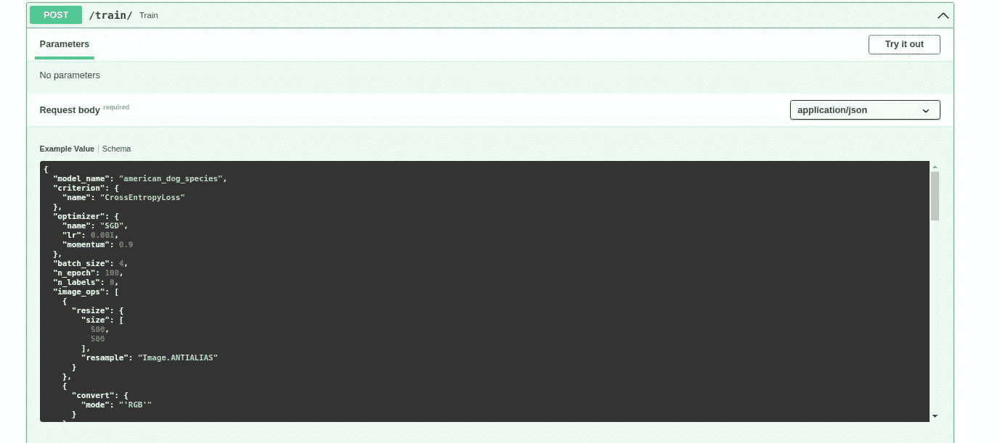
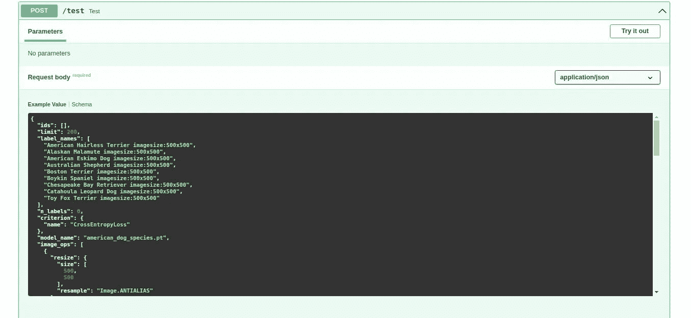

# 具有自动创建的 ML 模型

> 原文：<https://blog.devgenius.io/ml-model-with-automated-creation-4d787155ca16?source=collection_archive---------16----------------------->

这是与自动创建机器学习模型和用于训练算法的数据集相关的系列博客帖子的一部分。如果你对这个故事的背景感兴趣，你可以滚动到文章的底部，找到以前博客文章的链接。你也可以前往[使用 SERP 数据建立机器学习模型页面](https://serpapi.com/use-cases/machine-learning-and-artificial-intelligence)来清楚地了解你可以创建什么样的自动化机器学习模型。

在上周，我们展示了如何利用 [SerpApi 的谷歌图像刮刀 API](https://serpapi.com/images-results) 来获得清晰的数据集，以减少训练机器学习模型中的噪声，以及如何自动使用`chips`参数。本周我们将讨论如何自动创建用于机器学习模型训练的算法。就像前几周一样，优化训练将不是主要关注的问题。我们的目标是尽可能接近自动化机器学习。

# ML 可以自动化吗？

是的，有可能在规模上创建一个清晰的数据集，用不同的超参数自动创建机器学习模型，测试它们，并比较结果，以获得最佳优化的最佳算法。

这个过程与数据科学家和软件工程师的工作的可解释性，以及训练过程、神经网络和指标的有效可视化密切相关。由于一个基本问题，通用自动化受到限制。为数据科学编写的库并没有进行优化来大规模自动化这个过程。还有其他的解决方案比如 automl，局限于自己的范围。具有多个库支持和自动干净数据集创建的通用自动机器学习还没有出现。我们的目标是让这项工作成功，并让它成为一个面向数据科学家、软件工程师和所有对此感兴趣的人的开源项目。

# ML 模型的主要 3 种类型是什么？

二元分类、多类分类和回归是三种主要的 ML 模型。二元分类代表具有两种结果的模型，通常用于决策制定。多类分类用于在不同的标记对象之间进行分类。回归用于通过使用回归优化器来预测未来事件。

这三个将是我们塑造清晰数据集创建、自动创建机器学习模型及其优化的主要行动路线。当然，支持开源深度学习算法的微调超参数是另一个目标。这样我们就可以把自己设计的机器学习模型和大公司设计的机器学习模型进行比较，有更好的对比。

# 模型设置

在前几周，我们已经实现了一种从 POST 请求到端点自动配置优化器和标准的方法。算法自动化的方法没有实现。Pytorch 有一个相当有用的功能可以让我们建立这个。

我首先将负责 CNN 算法的类转移到一个名为`models.py`的单独文件中，这对将来手动添加很有用。

现在，我们如何编写所有这些，只使用有限的有序变量，不会扰乱超参数的工作方式？这就是`Sequential`功能实现流程自动化的原因:

你可以看到，超参数在机器学习模型中被保留，而变量较少，我们只用一个变量来描述这个过程。下一步，就是利用这一点，使它完全可定制。让我们初始化它:

该模型将由 TestCommands 或 TrainCommands 中的一组命令构成。这将告诉机器学习模型如何塑造自己。

数据集有逐层使用的要求，预处理后必须使用合适的一定大小。正如前几周所解释的，我们通过只获取清晰的训练数据来减少耗时的预处理。但是这个要求是模特训练中必须的。神经网络中前几层的出口尺寸必须与当前节点的入口尺寸一致，以便进行矢量计算。例如，出口为 5 的卷积层必须再次连接到下一个入口为 5 的卷积层，以便迭代过程有效。对于这种情况，我们将使用层的索引、层的名称和层数组来自动计算这些数字。

该功能将返回最后一层的出口，并实时自动调整层的尺寸。

我们将利用 Python 的`eval`功能，用训练命令创建模型:

这将在我们开始机器学习过程之前创建一个名为`CNNSeq`的类。

最后我们调用负责迭代过程的函数:

# 你如何用机器学习实现自动化？

你可以通过训练一个负责自动化的模型来实现机器学习的自动化。大规模创建机器学习模型是衡量模型优化程度的好方法。这样，您可以将结果与传统方法进行比较，以获得您想要的指标。

对于这个过程，我们将使用`/train`和`/test`端点。

如果用下面的字典请求`/train`端点(优化无效):

它将创建一个名为`american_dog_species`的深度学习模型，标准为`CrossEntropyLoss`，优化器为`SGD`，优化器的学习速率和动量分别为 0.1 和 0.9。它将在每个时间间隔从图像数据集中提取 4 幅图像，用指定的图像操作和张量变换训练算法 100 次。它将使用图层字典进行模型构建，并将名称标注为数据。

您可能会注意到，在机器学习模型中，最后一个 Conv2d 层之后的线性层的入口大小尚未自动计算。这是接下来几周另一个教程要做的事情。

现在，为了测试机器学习模型以查看它是否能够对数据集进行分类，我们需要使用以下字典向`/test`端点发送请求:

这将创建与我们训练的相同的机器学习算法，以便给我们一个验证结果。正如我之前提到的，我没有对超参数进行任何优化，所以验证结果对我们来说没有任何用例。

最后，让我们通过类名或层字典来改进端点，以获得深度学习模型:

我们还删除了 GPU 中的模型，以节省每次机器学习过程之间的时间。您也可以在 models.py 中手动添加一个模型，并通过省略自动机器学习过程中的层字典来调用它的名称。

您可能会观察到，您可以轻松定制层数、超参数、模型选择，并获得模型性能的结果，而不是来回使用 Python 代码来尝试优化机器学习模型。这对于一般的 mlops 来说是特别好的实践。它可以减少神经结构搜索、数据准备、新数据的使用以及模型开发、超参数优化所必需的时间，而不会做出任何让步。此外，您可以轻松地放大或缩小功能选择，而无需创建耗时的繁忙工作流程。

# 结论

我感谢读者们的关注，也感谢 SerpApi 的聪明人们让这些系列成为可能。在接下来的几周里，我们将看看前端可视化培训过程数据，添加缺失的部分，如支持迁移学习的能力，以及解释时间序列。我们还将讨论深度神经网络可能的特征工程和元学习角度，这些角度可以为具有更多真实世界用例的人工智能开辟道路。我们还将讨论如何实现对其他库的支持，如 tensorflow、强大的 scikit-learn(又名 sklearn)、与 Microsoft Azure 等云服务集成的能力。我们还将自动化一些机器学习模型，以解决医疗保健领域的小规模现实问题。