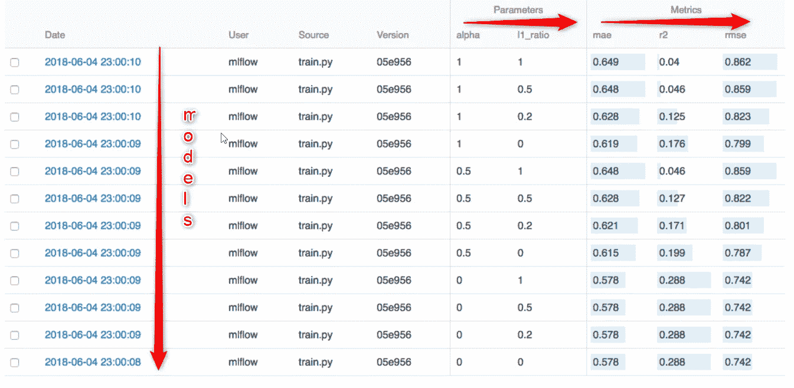

# 模型监控的 MLflow

> 原文：<https://blog.devgenius.io/mlflow-for-model-monitoring-cb8b2177b67a?source=collection_archive---------18----------------------->

**简介**

**MLOps** 是数据科学家和运营专业人员之间协作和沟通的一套实践。换句话说，当 Data Scientist 用数据解决问题，回答和理解业务问题时，当模型足够好并准备好投入生产时，就有了一套如何部署和监控它的程序。

应用这些实践可以提高质量，简化管理流程，并在大规模生产环境中自动部署机器学习和深度学习模型。

因此，在设计阶段完成大量数据工程后，当模型经过测试和验证后，就应该将模型投入生产。应根据新要求开发 CI/CD 管道，并确保质量检查流程，还应监控模型。但是为什么呢？通常情况下，现实中的模型行为与测试数据之间存在一些偏差。有各种各样的原因。与真实情况相比，用于模型训练的数据可能会有一些*无法预见的偏差*。还有就是*数据漂移*的情况。一段时间后，由于现实中可能发生的变化和熵过程，模型开始恶化，预测精度下降。因此，对模型的监控至关重要。

MLflow 是用于模型监控、模型生命周期的开源平台，包括实验、可复制、部署和注册。下面我们就来说说。

**核心**

当 data scientist 完成模型训练阶段并且模型以 pickle 格式保存时，它可以通过 MLFlow 上传，投入生产和监控。假设我们的应用程序收到了一些新的数据请求:

```
import mlflow
logged_model = 'runs:/8996b5cec1324f00a1b721a3d5b51c59/model'

# Load model as a PyFuncModel.
loaded_model = mlflow.pyfunc.load_model(logged_model)

# Predict on a Pandas DataFrame.
import pandas as pd
loaded_model.predict(pd.DataFrame(data))
```

如果我们希望将特定指标作为日志，那么我们必须使用 mlflow.log 函数来指定它们:

```
with mlflow.start_run():

        lr = ElasticNet(alpha=alpha, l1_ratio=l1_ratio, random_state=42)
        lr.fit(train_x, train_y)

        predicted_qualities = lr.predict(test_x)

        (rmse, mae, r2) = eval_metrics(test_y, predicted_qualities)

        print("Elasticnet model (alpha=%f, l1_ratio=%f):" % (alpha, l1_ratio))
        print("  RMSE: %s" % rmse)
        print("  MAE: %s" % mae)
        print("  R2: %s" % r2)

        mlflow.log_param("alpha", alpha)
        mlflow.log_param("l1_ratio", l1_ratio)
        mlflow.log_metric("rmse", rmse)
        mlflow.log_metric("r2", r2)
        mlflow.log_metric("mae", mae)

        tracking_url_type_store = urlparse(mlflow.get_tracking_uri()).scheme

        # Model registry does not work with file store
        if tracking_url_type_store != "file":

            # Register the model
            # There are other ways to use the Model Registry, which depends on the use case,
            # please refer to the doc for more information:
            # https://mlflow.org/docs/latest/model-registry.html#api-workflow
            mlflow.sklearn.log_model(lr, "model", registered_model_name="ElasticnetWineModel")
        else:
            mlflow.sklearn.log_model(lr, "model")
```

让我们深入研究一下代码。首先，我们对预测运行模型，并将它们保存为*预测质量*。然后我们收集评价指标，均方根误差，平均绝对误差和决定系数(R2)。然后，我们通过其 *log_param* 和 *log_metric* 函数为 MLflow 跟踪分配特定的超参数和度量。

代码的另一部分是处理模型到 MLFlow 注册表的注册。然后你可以通过浏览器的 API 来监控所有的模型。这应该是这样的:



MLflow API

每次新运行时，模型的新版本都会按照上图中的分配进行保存和记录。

需要以 pickle 格式发布模型，requirement.txt 用于环境，可选工件用于在 MLflow 平台中运行的模型。您可以在注册表中存储几个模型，并并行监视它们。在这里你可以看到。

**结论**

如果你已经非常熟悉 ML 模型训练的步骤，MLflow 很容易学习。它兼容多种云平台，包括 Spark、GCP、Azure。缺点是，当我们希望我们的平台上有不同的用户组时，很难处理认证需求。

希望这是有用的文章。享受吧。