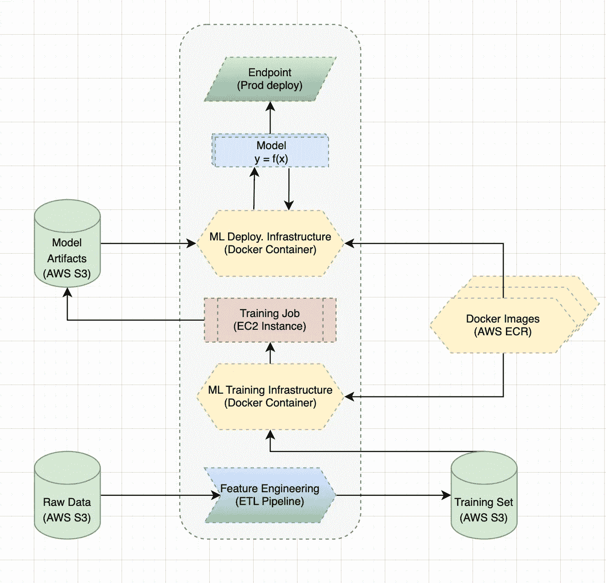
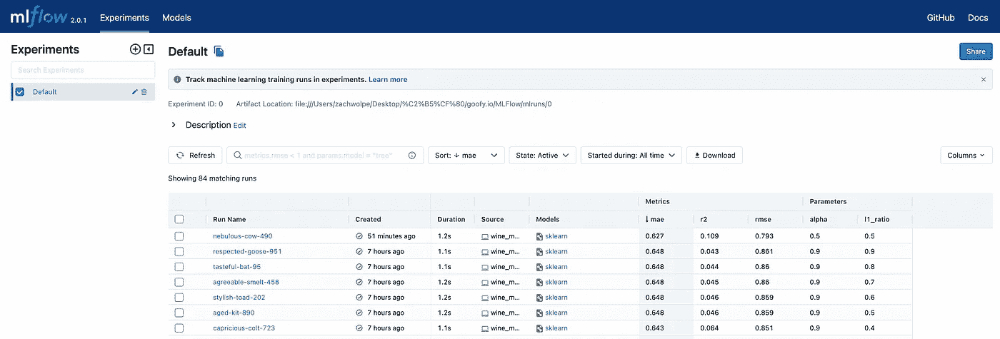

# 带 MLFlow 的 MLOps

> 原文：<https://blog.devgenius.io/mlops-with-mlflow-f6fd6069a527?source=collection_archive---------15----------------------->

## 强大的机器学习工程。



**机器学习工作流**:以 AWS 服务为例的典型 ML 工作流。

# 机器学习工程

部署生产级软件比玩具项目和研究代码更不稳定。虽然机器学习可以解决复杂的问题，但它的脆弱性和复杂性需要合理的 MLOps 来确保快速开发/部署健壮的模型。

标准的机器学习架构如下:

*   ***特征工程*** :处理原始数据，清理&提取特征。
*   ***训练模型*** :建立并评估模型。
*   ***在线服务预测*** :通过一些产品/端点服务模型。

自由(超)参数的数量是产品复杂性的指数。因此，成功的应用数据科学依赖于执行 3 个功能:

> (1)构建健壮、高效、直观的**数据工程管道**；(2)智能**特征工程** & (3) **超参数调谐**。

因此，生产培训循环包含:

```
for hp in HyperParameter:
  for f in featureSet:
    for p in Parameters:
      model.fit()
      model.pkl()
      config.store()
```

超参数搜索通常是通过一系列经过充分研究的优化程序完成的，如`*Bayesian Optimisation*`；特征工程是编码理论(特定领域)抽象和模型拟合/降维的结合；参数由标准优化协议拟合。

> 很容易看到自由参数/实验的空间是如何随着任何非平凡的 ML 应用程序而爆炸的。因此，有效的实验和配置记录系统对于在生产中提供健壮可靠的 ML 模型是必不可少的。

*理论注*:考虑可能模型的总空间:可能超参数的空间(*HP*)；特征集空间(*f*)；模型空间( *m* ) &参数空间 *(p)* 。由此产生的 VC-dimension 爆炸，需要严格的规范和样本外性能检查`D <- f(hp,f,m,p)`。


VC-dimension 在 D(近似自由度)中是指数的。

## 数据摄取

行业规范是 it 依赖第三方 API 进行数据摄取，像 ***Kafka*** (数据流)&***Apache Spark***(大数据摄取)这样的工具可以轻松集成到任何云 ML 工作流中。虽然这些工具可以用来直接执行特征工程和 ML，但是假设我们使用 Apache 工具获取&干净的原始数据，然后将数据转储到某个中央低延迟桶中，以供下游分析。

***特征工程*** & ***建模*** 可以解耦成独立的模块，两者遵循相同的流程，我们可以定义为:

> 有些集合的任意运算 **f()** 对输入数据**X** 这样才能返回一些可取的**y** *。*我们感兴趣的是上菜功能***f()***的制作。**

# **工作流程问题**

**虽然理论上这很简单，但实际上我们会遇到很多问题:**

## **工作流程**

*   *****配置日志&元分析*** :当务之急是正确地跟踪和分析这一大套实验，以易于查询的方式进行。**
*   *****计算成本*** :拟合大型模型/处理大型数据需要计算成本高昂的作业，通常需要将作业拆分到本地和云实例上。**
*   *****算法复杂度:*** 鉴于参数空间的复杂度，应该通过检查记录的实验结果来彻底检查模型的鲁棒性。**
*   *****工作流复杂性*** :贡献者、环境和外部依赖的数量增加了开发周期的复杂性。工程师需要无缝的机制来共享代码、测试和检查更新以及在代码库之间跳转。**

## **部署**

*   ***:版本控制&依赖管理需要容器化来保证软件在生产中的可靠性。***
*   ******监控*** :新模型应缓慢推出，并仔细注意监控数据分布偏离样本性能&。***

# ***解决办法***

***为了缓解上述问题，当部署机器学习模型时，必须 ***记录实验配置*** 和 ***容器*** 函数。***

## *****集装箱化*****

******Docker*** 是集装箱化的行业标准，ML 也不例外。它已经很好地通过了确保与所有云平台的生产集成所需的临界质量，因此现在是 ML 工作流的标准部分。希望利用可以与码头集装箱耦合的实验测井解决方案。***

## ***实验测井***

***出于以下几个原因，记录实验是一种很好的做法:***

*   ***找到最佳的模型配置。***
*   ***分享、复制和建立实验。***
*   ***检查点&恢复大型计算任务。***

***为此，许多生产就绪的 ML 框架(Keras、pyTorch、TensorFlow 等)包括内置的检查点和日志协议，然而在现实中，ML 解决方案可能不仅仅包含模型，而是采取某种函数序列的形式(包括程序和模型)。因此，谨慎的做法可能是实现一种可以记录实验配置&(超)参数的解决方案，这些参数是对程序序列的抽象:输入 ***权重&偏差*** 和 ***MLFlow*** 。***

# ***MLFlow***

***我们使用 MLFlow 来保持实验、配置、参数和结果的整洁簿记。下面是一个简单的例子，说明在部署 Python (Keras)模块时如何集成 MLFLow。***

```
***import mlflow
import mlflow.sklearn
...

with mlflow.start_run():
  train_model()
  mlflow.log_param("alpha", alpha)
  ...

mlflow.sklearn.log_model(lr, "model")***
```

> ***瞧啊。***

***就这么简单，MLFlow 现在会在一个自己创建的目录中记录实验。***

*****命令行界面(CLI)** :通过多做一点设置工作，可以从 MLFlow 中获得更多。如果基本目录包含一个`MLproject` ( `yaml`文件)配置文件，用户可以明确指定运行时配置。***

***例如，这里我们的`MLproject`文件包含默认参数值、我们的 conda/pip yaml 文件的名称(`conda.yaml`，以及要运行的 python 命令。***

```
***name: mflow-example
python_env: conda.yaml

entry_points:
  main:
    parameters:
      alpha:  {type: float, default: 0.5}
      beta:   {type: float, default: 0.2}
    command: "python wine_model.py {alpha} {beta}"***
```

***人们现在可以直接从命令行界面运行 T4。这将创建一个新的 conda 环境，并安装`conda.yaml`中描述的所有依赖项，然后执行`bash`命令。***

*****实验元分析:**运行`mlflow ui`将启动 *gunicorn* 并在本地端口上提供一个 mlflow 仪表板，描述所有的实验运行。可以提取这些数据以找到最佳模型，执行模型敏感性分析并共享实验、配置和结果&作业。***

******

***MLFlow 指标和配置仪表板。***

*****装箱**:最后，一个人可以装箱一个特定的配置，以便为生产中的模型服务。虽然 MLFlow 可以直接与 SageMaker (AWS ML)等工具集成，但是您可以简单地将配置写入 docker 映像，然后根据需要进行部署。只需提供所选实验`$path`的路径并运行:***

```
***mlflow models build-docker \
  -m $path \
  -n my-docker-image \
  --enable-mlserver***
```

> ***瞧啊。高效、可审计、可共享、可复制、用户友好、生产就绪的机器学习:)。***