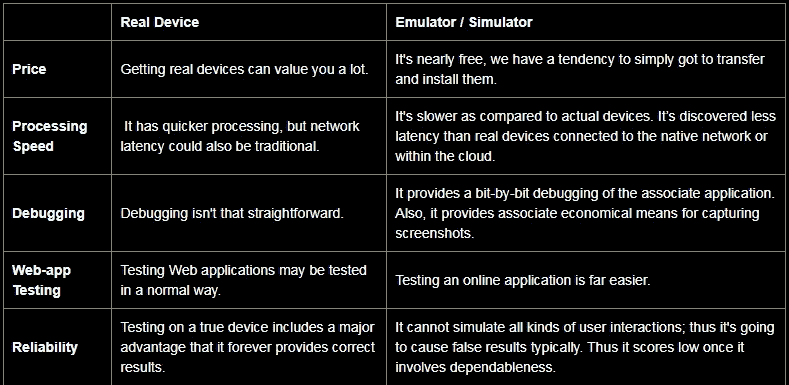

# 移动应用测试——仿真器与模拟器和真实设备

> 原文：<https://blog.devgenius.io/mobile-application-testing-emulators-vs-simulators-vs-real-devices-c380309268c0?source=collection_archive---------4----------------------->

移动应用程序测试一个简单的定义应该是这样的“移动应用程序测试可以是一种技术，通过对为手持移动设备开发的相关应用程序代码的实用性、可用性和一致性进行测试。移动应用程序测试也可以是自动或人工的合理测试。”

假设要测试一个在线机票预订系统的移动应用程序，我们需要注意以下几点。

功能测试
兼容性测试
本地化测试
实验室测试
性能测试
压力测试
安全测试
内存泄漏测试
功耗测试
中断测试
可用性测试
安装测试
卸载测试
更新测试
认证测试

# 移动测试——仿真器与模拟器和真实设备

假设我们倾向于为机票价格预订系统开发一个关联应用程序。一旦产品完全开发出来，作为[移动应用程序测试服务](https://www.bugraptors.com/mobile-app-testing-services.php)的一部分，我们希望看到应用程序是否确实能在所有主要使用的设备上运行，如 automaton 手机、iOS 和其他不同类型的平板电脑和 iPads。

为了进行这种类型的测试，我们希望获得每一个设备，因此我们将测试应用程序是否按照预期运行。肯定！！！你想得没错，作为一个产品所有者，你可能会叛逆地注意到，为了获得如此多种多样的移动设备并进行测试，你需要支付非常高的价格。因此，有什么好的选择吗？

当前缺点的解决方案是使用[移动模拟器和](https://www.bugraptors.com/blog/emulator-and-simulator-a-comparison-guide)移动仿真器。这些主要是软件程序，旨在为智能手机的重要选项提供模拟。它们在本质上非常相似，因此通常可以互换使用。

让我们比较一下，但是在相关仿真器/模拟器上的测试与在真实设备上的测试完全不同

模拟器/仿真器不能模仿随后的选项。

移动设备电池
移动设备的摄像头
难以模拟来电和短信等干扰。
·不是最真实的移动设备内存使用模拟。

让我们目前了解许多关于移动仿真器和移动模拟器。下面的表格列出了模拟器和移动设备模拟器在测试上的最大区别。

那么，手机 app 测试最有效的选择是什么呢？最佳遵循表明，尽管实际开发是当前的，但我们必须始终使用一个相关的仿真器或模拟器来进行移动测试。在最终确定产品之前，应该对选择的真实设备进行健全性检查。例如，automaton 智能手机用户种类繁多，因此最好的选择是对最新的 automaton 设备进行健全性检查，并且可以通过模拟器进行回归。

原帖:[bug 迅猛龙](https://www.bugraptors.com/blog/mobile-application-testing-emulators-vs-simulators-vs-real-devices)