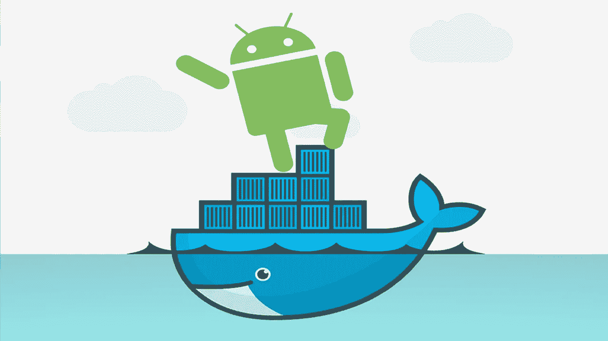

# 使用移动开发工具缩短应用程序开发生命周期

> 原文：<https://blog.devgenius.io/mobile-devops-reducing-the-app-development-life-cycle-22b5599ace8e?source=collection_archive---------18----------------------->

> 本文旨在概述 DevOps 文化，并展示应用程序开发人员如何利用它来缩短他们的开发生命周期。DevOps 对于现代应用开发和交付至关重要。然而，大多数移动应用程序没有完全的持续集成，也没有持续部署实践。移动应用程序开发和 IT 运营应该合作创建一个更加可靠和有用的移动环境。两个主要的移动操作系统(iOS 和 Android)之间的奇点使得很难有一个唯一的解决方案。我们将提出在移动应用程序两端应用 DevOps 文化的替代方案。

来源:[https://www . tecmundo . com . br/software/129096-Android-x-IOs-7-diferencas-basicas-criacao-apps-infografico . htm](https://www.tecmundo.com.br/software/129096-android-x-ios-7-diferencas-basicas-criacao-apps-infografico.htm)

# **简介**

我们越来越依赖智能手机。根据 Digitalks[1]的一项研究，2017 年，几乎 80%的互联网接入是通过移动设备完成的。这个数字，2012 年是 40%，2016 年是 68%。随着移动使用的增加，我们看到了这些设备的应用程序数量的激增。像 Instagram 和 Airbnb 这样的公司专注于移动使用，这在过去是不可想象的。交付高质量的软件，倾听并不断向用户学习，为他们提供新的资源已经成为一种竞争优势。对于一个移动开发者来说，要赢得移动用户的忠诚，就必须在正确的时间向正确的客户交付正确的应用。在这种情况下，DevOps 文化会有很大的帮助。除了展示移动开发运维的概念，我们还将展示在移动应用上应用开发运维文化的替代方案。

# 什么是移动 DevOps？

DevOps 是一种文化运动，包含一系列促进开发、测试和 IT 操作之间协作的实践。人们常说，开发方应该只关注创建和测试，而运营方必须关注维护软件服务在交付后始终可用。这最终造成了不能交互的孤岛，限制了开发和维护过程。DevOps 文化正是为了刺激合作而来。这种协作支持软件应用程序的快速开发和部署。在 DevOps 文化使用的主要概念中，我们可以强调持续集成(CI)和持续交付(CD)。

CI 是一种软件开发实践，旨在通过自动化构建和测试来提高代码集成的效率。敏捷方法建议软件开发过程以更频繁的交付来执行。因此，在中央存储库中收集、集成和测试团队开发的所有代码所需的工作也变得更加频繁。持续集成的出现减少了代码集成过程中所需的手工工作。此外，有了测试自动化，修复 bug 变得更加容易，确保软件在每次更改后都能正常工作。

CD 是另一种软件工程实践，在这种实践中，软件开发团队在短周期内产生一个可交付的产品，确保软件可以在任何时候安全地发布。简单且可重复的部署流程对于持续交付非常重要。目标是以更高的速度和频率创建、测试和发布软件。这种实践有助于降低成本、时间和变更风险，允许对生产中的应用程序进行增量更新。

来源:[https://blog . impulso . network/integra Cao-continua-com-git lab-ci/](https://blog.impulso.network/integracao-continua-com-gitlab-ci/)

Mobile DevOps 是使用这些概念来加速和让步移动应用程序开发质量的想法。在最近一段时间，移动应用程序的开发已经成为一个不断变化和快节奏的环境。随着开发团队从一个版本转移到另一个版本，其他团队不同步的可能性对公司来说总是一个迫在眉睫的威胁。在这种情况下，使用 CI/CD 流程会有很大帮助。应用像 DevOps 这样的经过测试的方法的想法，试图将应用程序开发生命周期中涉及的几个团队聚集在一起共同工作，是这一移动运动中的一条美丽的道路。

# 移动开发的有用工具

一些服务可以帮助移动 DevOps 文化。其中之一是浪子。据官网介绍，浪子是一个开源平台，旨在简化 Android 和 iOS 部署。**让你自动化开发和发布工作流程的每一个方面。它还允许您用一种简单的语言管理两种操作系统的应用程序。它包含 3 个主要文件:**

*   ****Appfile:** 包含关于你的应用的属性和元数据**
*   ****Fastfile:** 配置自动化流程的内容和方式**
*   ****Gemfile:** 用来定义你对浪子的依赖。**

**为了方便应用分发，我们可以突出显示 [**Firebase 应用分发**](https://firebase.google.com/docs/app-distribution) 。这是一个 Google 平台，它提供了一些工具，可以让应用程序轻松地分发给可信的测试人员。通过将你的应用程序快速下载到测试人员的设备上，你可以更早、更频繁地获得反馈。如前所述，iOS 和 Android 的开发不可能在所有方面都是标准的。为了开发适用于 iPad 和 iPhone 的应用程序，苹果需要使用其软件工具和公司自己销售的硬件。Android 开发完全不同的东西。在其中，我们有更大的发展自由。**

**即使有这种自由，我们也可以指出一些在开发过程中广泛使用的 Android 工具。 [**Gradle**](https://docs.gradle.org/current/userguide/userguide.html) 是一个非常强大的开源构建工具，它保证标准配置并控制您的 Android 项目中使用的依赖关系。Gradle 自动获取所有源文件，应用适当的工具，并将它们组合成一个压缩文件(我们心爱的 APK ),我们可以从 Play Store 下载。在测试过程中，获得一个与开发中使用的环境具有相同特征的隔离环境有很大的帮助。在这种情况下， [**Docker**](https://www.docker.com/why-docker) 是一个容器化工具，它允许开发人员将应用程序打包成它需要的所有部分。**

****

**来源:[https://www . coma keit . com/blog/devo PS-for-mobile-application-development/](https://www.comakeit.com/blog/devops-for-mobile-application-development/)**

# **iOS 应用的移动开发**

**iOS 应用的开发很大程度上是由苹果定义的。为 iPad 和 iPhone 开发本地应用程序需要使用其软件工具和苹果出售的硬件。在这种情况下，我们将重点介绍两种将移动 DevOps 应用于您的项目的方法。您将能够为您的 CI/CD 流程使用基于云的服务。最主要的是使用基于云的服务，比如**。该服务专用于移动 DevOps 流程，并且具有非常简单的配置系统。值得突出的是 [**圈 CI**](https://circleci.com/enterprise/?utm_source=Google&utm_medium=SEM&utm_campaign=%28Alpha%29%20Search%20Signup%20Non%20Branded&utm_content=%28Alpha%29%20Search%20Signup%20Non%20Branded-Eng-NonBranded-B&gclid=Cj0KCQjwrIf3BRD1ARIsAMuugNtUUNetYsyB2rL9hgYbTP72MhgPMWi1LxOGdrAllaVmapmNCjXeyjMaAoaeEALw_wcB)[**AWS**](https://aws.amazon.com/pt/mobile/mobile-application-development/native/ios/)[**Azure**](https://docs.microsoft.com/en-us/azure/devops/pipelines/ecosystems/xcode?view=azure-devops)等公司的服务。在幕后，这些云服务使用由 [**MacStadium**](https://www.macstadium.com/) 开发的 [**Orka**](https://www.macstadium.com/orka) 等软件或自己的苹果数据中心来构建并部署到苹果商店。****

****另一种方法是管理您的构建和部署机器。内部构建和部署解决方案将减少与第三方服务的交互，对代码提供更多的控制和安全性。为这项工作创建专门的[**git lab Runners**](https://docs.gitlab.com/runner/)将是一个很好的方法。****

# ****Android 应用的移动开发****

****如前所述，与 iOS 相比，Android 应用的构建和部署过程更加开放。虽然可以使用已经列出的所有服务来创建 Apple 应用程序，但我们决定展示我们针对 CI/CD 的环境提案。我们创建了一个 Docker 映像，目标是在 Bitbucket 和 GitLab 等平台上的 Android 项目中使用，git lab 使用 Docker 容器。该图像包含了 Android 项目中使用的所有必要功能。这些特征是:****

*   ****格拉德勒****
*   ****Android SDK 管理器****
*   ****浪子****
*   ****红宝石****
*   ****NodeJS 和 Yarn(对于还包含 React 本地部件的项目)****

****这个提议与 DevOps 文化是一致的。该映像可以应用于任何环境，也可以根据项目的具体特征进行配置。我们可以更改 Android 的版本，Gradle，还可以安装您的项目需要的所有 SDK。您可以通过这个[链接](https://github.com/matheusroleal/docker-library/tree/master/android_build)访问与图像相关的所有数据。****

********

****来源:https://morioh.com/p/824c9d0b3314****

# ****结论****

****DevOps 是一种文化运动，包含一系列促进开发、测试和 IT 操作之间协作的实践。在最近一段时间，移动应用程序的开发已经成为一个不断变化和快节奏的环境。Mobile DevOps 是使用这些概念来加速和让步移动应用程序开发质量的想法。我们展示了一些有助于移动 DevOps 文化的服务。iOS 和 Android 的开发不可能在所有情况下都是标准的。o 为 iPad 和 iPhone 开发本地应用程序需要使用苹果公司销售的软件工具和硬件。我们决定展示我们的 CI/CD Android 应用环境提案。e 创建了一个 Docker 映像，目标是在 Bitbucket 和 GitLab 等平台上的 Android 项目中使用。****

# ****参考****

****[1]比安卡·博尔赫斯。comscore 的研究揭示了移动数字消费的重要性。[https://digitalks . com . br/indicadores-do-Mercado/pesquisa-da-comscore-revela-importancia-do-mobile-no-coti diano-dos-consumidores-digita is/](https://digitalks.com.br/indicadores-do-mercado/pesquisa-da-comscore-revela-importancia-do-mobile-no-cotidiano-dos-consumidores-digitais/)****

****[2]谷歌云。DevOps 是什么？研究和解决方案[https://cloud.google.com/devops](https://cloud.google.com/devops)****

*****你也可以在这里看到 android 构建环境*[*Github repo*](https://github.com/matheusroleal/docker-library/tree/master/android_build)****