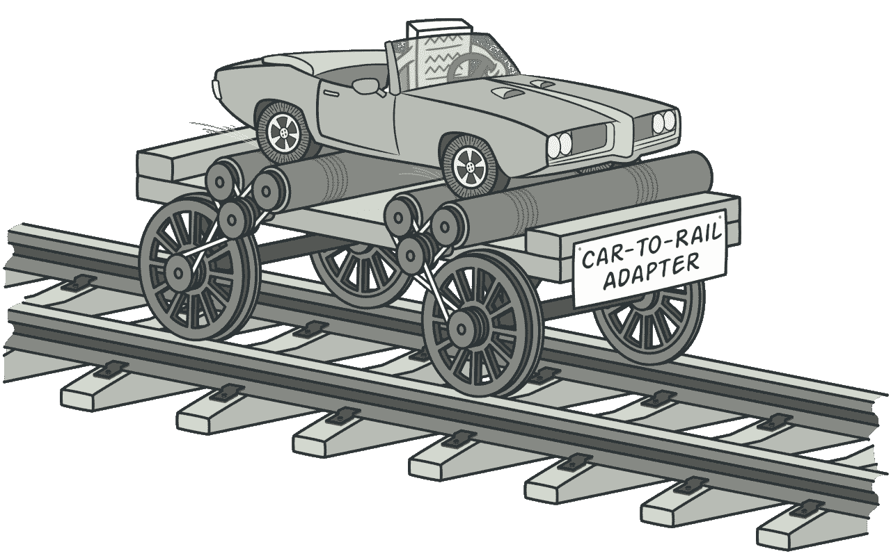
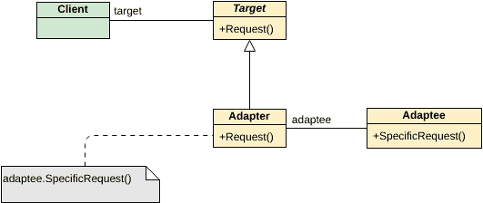

# 使用适配器设计模式实现移动平台 MQTT

> 原文：<https://blog.devgenius.io/mobile-platform-mqtt-implementation-using-adapter-design-pattern-4223d4b4d022?source=collection_archive---------15----------------------->

当谈到移动开发时，我们面临的一个主要问题是第三方库的麻烦，这有时会令人头疼，因为我们的核心功能依赖于它们。在本文中，我将重点关注使用适配器模式的方法，以避免这种对一个库的直接依赖，并为极端场景提供我们的选择。在这里，我想展示我用来避免第三方库依赖 MQTT 库的解决方案。解决方案同时适用于 android 和 iOs 平台。

**什么是 MQTT**

说到 MQTT，它是世界上最轻量级的通信机制之一。MQTT 的关键部分是多个设备之间的集中式通信，其中代理充当通信的中心枢纽。但是 MQTT 的问题是当涉及到例子时，材料的数量较少。因此，我将尝试给出我的理解，以及如何使用适配器设计模式在移动应用程序中实现 MQTT。

**什么是适配器设计模式**

适配器模式是指适配器方便两个不兼容的接口相互交互。因此，adaptee 可以是任何类似的类，可以很容易地用类似的接口实现的对象来替换。

【https://refactoring.guru/design-patterns/adapter 

上图完美地说明了车对轨适配器可以用在任何带轮子的车辆上，而不是只需少量调整就可以轻松用在汽车上。

类似地，我们将研究使用适配器模式来分离 MQTT 客户机实现的第三方库使用。

**适配器模式的 UML 图**

[https://online . visual-paradigm . com/repository/images/2e 728499-b25b-4b5b-9cb 8-1b3b 3e 059966/class-diagram-design/GoF-design-patterns-adapter . png](https://online.visual-paradigm.com/repository/images/2e728499-b25b-4b5b-9cb8-1b3b3e059966/class-diagram-design/gof-design-patterns-adapter.png)

**使用适配器模式在 android(Java)中实现 MQTT。**

首先，让我们看看适配器模式的 android 实现，这样我们将使用的第三方库就无关紧要了。

如果您在 Android MQTT 上做过一点点 R&D 的例子，那么您肯定会遇到 eclipse Paho 库，这可能是最常用的第三方库。例如，在这种情况下，我将使用 Paho 库和 HiveMQ 库。

因此，首先创建具有核心功能方法的接口类，这些方法包括连接、断开、订阅和发布等 MQTT 的基本功能。为了简化，我们只使用 connect。

然后，我们为一个第三方类实现我们的客户端实现类，在本例中是 Paho

因此，如该类所示，Paho“connect”的特定实现可以在这里实现，以创建与代理的连接。类似地，任何第三方库都可以通过覆盖特定方法来实现相关功能。例如，如果我们将 HiveMQ 实现为第三方库，它看起来会像下面这样，

然后，我们用它的接口类实现适配器类，该接口类将实现类似于 MQTTInterface 类的功能。

这里再次，所有的功能都必须介绍，将像订阅和发布使用。

那么适配器实现必须使用适配器类来完成。它将包含一个构造函数，该构造函数接受一个 MQTTInterface 实例，该实例将成为适配器。

然后，无论何时需要 MQTT 实现，您都可以创建您喜欢的任何第三方库的实例，并连接、断开、订阅或发布到 MQTT 代理。

输出

*HiveMQ 连接*

**使用适配器模式在 iOs(swift)中实现 MQTT。**

同样，在 swift 中，我们使用协议 MQTT 接口，该接口同样具有所有连接、断开、订阅和发布功能。

谈到 Swift MQTT 库，最常用的是 CocoaMQTT 和 SwiftyMQTT。根据所使用的代理方，这将是非常谨慎的。因此，即使在选择第三方库时，也要考虑服务器端使用的代理客户端。

然后，在选择了适当的客户端之后，可以如下所示完成这些实现。

同样，与 java 非常相似，适配器也必须用一个协议来实现，该协议中有一个 MQTT 接口实例，它将从构造函数中启动。

然后，使用下面的实现方式，通过选定的第三方客户端实现最终解决方案。

输出

*适配器:CocoaMQTT 连接*

完整的解决方案和完整的功能示例代码可以在下面的资源库中找到

Android java MQTT 适配器

[https://github.com/PriyanJayalath/Android-MQTT-Adapter](https://github.com/PriyanJayalath/Android-MQTT-Adapter)

iOs Swift MQTT 适配器

[https://github.com/PriyanJayalath/Swift-MQTT-Adapter](https://github.com/PriyanJayalath/Swift-MQTT-Adapter)