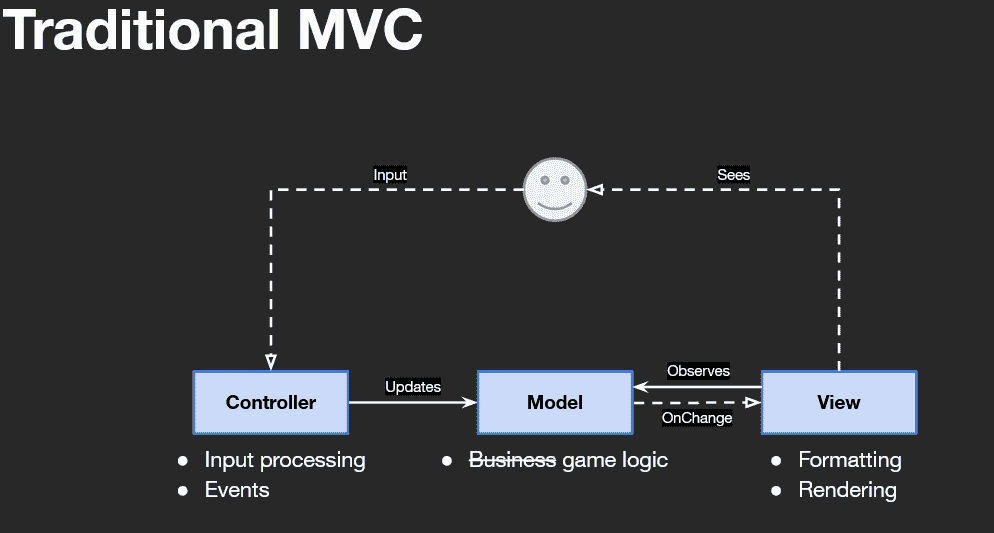
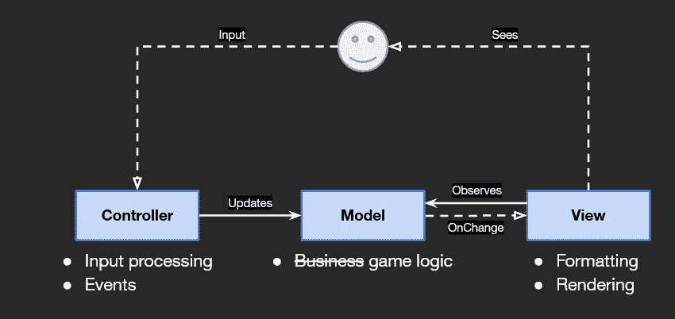
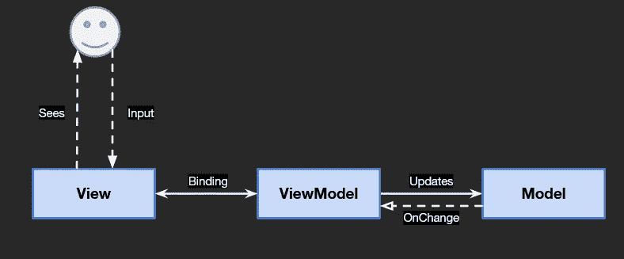

# 模型视图控制器系列

> 原文：<https://blog.devgenius.io/model-view-controller-family-3a0d869d81ea?source=collection_archive---------2----------------------->

## MVC，MVP，MVVM 有什么区别。

模型视图控制器通常用于开发用户界面。它将相关的程序逻辑分成三个独立但又相互联系的部分。这允许游戏的不同方面彼此分离，允许我们回到单一责任。目前，这种模式有几种不同的实现方式:传统的模型视图控制器(MVC)、模型视图呈现器(MVP)和模型视图视图模型(MVVM)。三者都使用基本概念，措辞略有不同，交流方式也略有不同。

# 传统模型视图控制器(MVC)

传统模型视图控制器(MVC)

1.  模型——商业逻辑，或者在游戏开发中，游戏逻辑。
2.  视图—用户看到的内容。这负责格式化和渲染。它观察模型并对变更事件做出响应(观察者模式)。
3.  控制器——控制用户与游戏/应用交互的方式。接受用户输入并更新模型。

# 模型视图演示者(MVP)

模型视图演示者(MVP)

这是通常在 Unity 和一些 web HTML 中使用的。这和 MVC 的最大区别是责任被转移了，我们有一个演示者而不是一个控制者。最大的原因是因为我们不能对视图做太多，渲染是在内部或幕后处理的。我们可以用 Unity 的 UI 系统改变游戏中元素的渲染，该系统内置了与视图交互的事件，获取输入事件。

1.  视图—用户看到的内容(呈现)并接受用户的输入。由演示者更新，并将输入事件发送给演示者。Unity 已经在为我们做这件事了。
2.  Presenter 响应来自视图的输入事件(观察者模式)，并根据接收到的输入事件更新模型(输入处理)。当一个 On Change 事件来自模型(观察者模式)时，它也更新视图(格式)。
3.  模型——游戏逻辑由演示者控制。向演示者发送更改事件(观察者模式)。

# 模型视图视图模型(MVVM)

模型视图视图模型(MVVM)

如果使用新的 UI，则在 Unity 中使用。当用 UXML 构造 UI 时，也在一些 Windows 窗体应用程序和 Web 应用程序中使用

这与 MVP 是一样的，唯一的区别是我们有一个视图模型，而不是一个演示者。视图和视图模型通过数据绑定进行通信。

1.  视图—用户看到的内容，并接受用户的输入。由 ViewModel 更新，并通过数据绑定将输入事件发送到 ViewModel。
2.  ViewModel 用于视图和模型之间的通信。使用数据绑定与视图通信。Model On Change 事件将导致绑定到视图的变量更新。当视图中的一个输入绑定发生变化时，绑定到它的一个变量也发生变化，然后视图将更新模型。
3.  模型——游戏逻辑由视图模型控制。在更改事件时发送 ViewModel a(观察者模式)。

# 结论

MVC——模型游戏逻辑从控制器中处理的视图逻辑和输入逻辑中分离出来。

MVP——MVC 的发展。演示者处理输入逻辑和视图逻辑。视图更加被动，只处理渲染和事件管理。

MVVM —类似于 MVP，但是在视图和视图模型之间使用绑定。

互联网上有大量关于模型-视图-控制器模式的文章。这种模式一开始对我来说很难理解，直到我意识到 MVC、MVP 和 MVVM 都是同样的模式。它们之间的区别在于，它们是如何基于您正在使用的系统中的限制来实际实现的。了解这一点，如果您正在使用 Unity 并且已经实现了 MVP，并且希望在使用 UXML 的项目中使用新的 UI 系统，您所要做的就是将 Presenter 复制为 ViewModel，然后使用绑定在视图和视图模型之间进行通信。