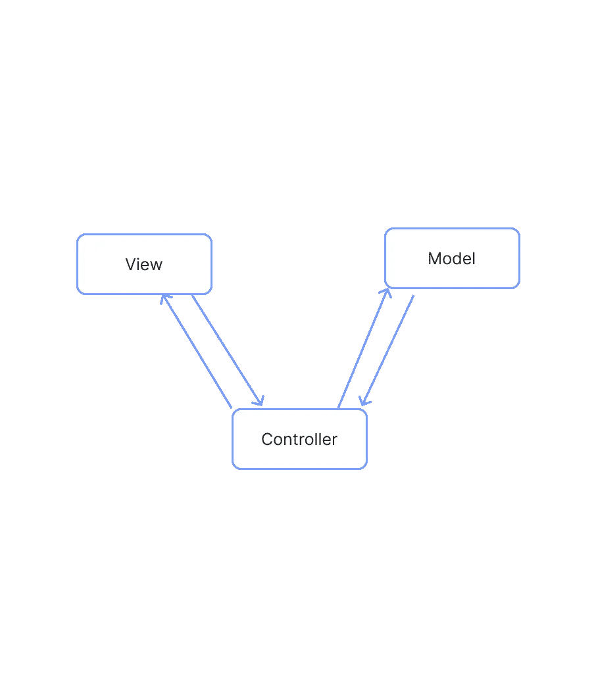
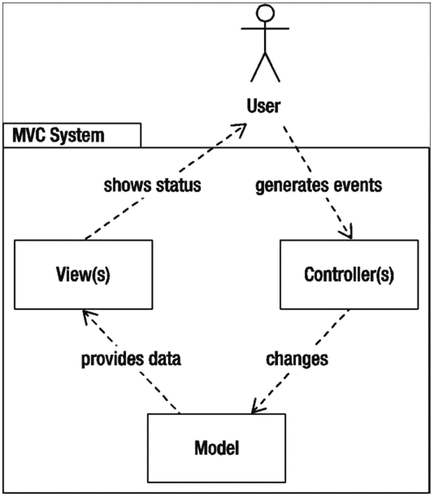
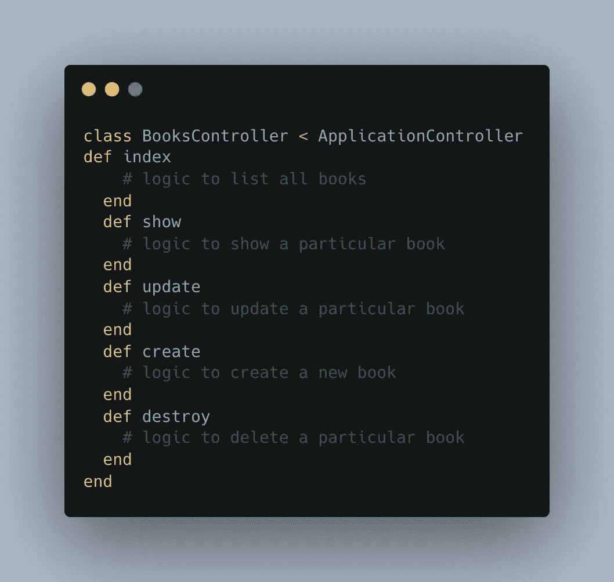

# 模型视图控制器(MVC)

> 原文：<https://blog.devgenius.io/model-view-controller-mvc-20c80126cab0?source=collection_archive---------15----------------------->

❤️的基本原理和铁路

在本文中，我们将回顾 MVC 的基本原理以及它们如何应用于 Rails。

在我们进入 MVC 的 rails 方法之前，让我们首先定义 MVC。

# 手动音量调节

以前称为“事物模型视图编辑器”

**MVC** 是一种软件应用架构的设计模式。它将应用程序分为以下几个部分:

1.  **模型**用于处理数据和业务逻辑。
2.  **控制器**模型和视图之间交互的指挥者。
3.  **视图**用于处理图形用户界面对象和演示。

这种分离导致用户请求被如下处理:

1.  客户端向服务器上的控制器发送页面请求。
2.  控制器从模型中检索它需要的数据，以便响应请求。
3.  控制器将检索到的数据提供给视图。
4.  视图被呈现并发送回客户机供浏览器显示。

# 模型

它被称为最底层，因为它负责数据维护。从逻辑上处理数据，使其主要处理数据。模型实际上是与数据库相连的，所以你对数据做的任何事情。

模型组件是添加或检索数据的地方。它响应控制器的请求，因为控制器从不自己与数据库对话。该模型与数据库通信，然后向控制器提供所需的数据。

值得注意的是，模型**从未**与视图直接沟通。

# 视角

视图组件负责数据表示。它为用户创建一个用户界面(UI)。因此，当您想到 web 应用程序中的视图组件时，只需想到 HTML/CSS 部分。视图是由模型组件收集的数据生成的，但是这些数据是通过控制器间接获得的，所以视图只与控制器通信。

# 控制器

控制器被称为主要的人，因为它是允许视图和模型之间相互连接的组件，充当中介。控制器不必处理数据逻辑；它只是告诉模型该做什么。从模型接收到数据后，它会对数据进行处理，然后将其发送到视图，并向用户解释如何表示数据。视图和模型不能直接对话。

# **MVC 周期**

尽管 MVC 有多种风格，但控制流通常是按如下方式实现的:

MVC 周期——从 Rails 新手到专业人员

1.  用户与界面交互并触发对服务器的请求(例如，提交注册表单)。
2.  服务器将请求路由到控制器，传递用户请求发送的任何数据。
3.  控制器可以访问一个或多个模型，可能以某种方式操纵和保存数据(例如，通过用表单数据创建新用户)。
4.  控制器调用视图模板，该视图模板创建对用户请求的响应，该响应然后被发送回用户(例如，欢迎屏幕)。
5.  界面等待来自用户的进一步交互，并且循环重复。

# MVC 的发展之路

## **型号**

T4:Rails 中的模型层代表数据库。尽管整个层被称为模型，但是 Rails 应用程序通常由几个单独的模型组成，每个模型(通常)都映射到一个数据库表。按照惯例，一个名为 Book 的模型将映射到一个名为 books 的表。图书模型负责对图书表的所有数据库访问，包括创建、读取、更新和删除行。因此，如果您想使用这个表，比方说，按作者搜索一本书，您可以使用如下所示的模型:`Books.find_by author: 'Ali'`虽然很简单，但是这个代码片段在 books 表中搜索第一行的 author 列值 Ali，并返回结果。

Rails 内置的数据库抽象层**活动记录**就是用来完成这个的。

## **控制器**

控制器是 MVC 应用程序的导体。Rails ***中的控制器接受来自外界的请求，对其进行处理，然后将控制权传递给视图层，以显示结果*** 。控制器负责处理 web 请求，例如处理服务器变量和形成数据，查询模型，以及将信息发送回模型以保存在数据库中。尽管这是一个过于简化的问题，但控制器通常会响应用户的请求来创建、读取、更新或删除模型对象。在 Rails 的上下文中，这些术语经常被缩写为 CRUD。为了响应请求，控制器通常在模型上执行 CRUD 操作，创建在视图中使用的变量，然后在处理完成后呈现或重定向到另一个动作。

控制器通常负责应用程序的一个单独区域。例如，在图书应用程序中，您很可能有一个专门用于图书管理的控制器。您可以在 books 控制器中定义所谓的操作。动作定义了控制器的能力。如果希望能够创建、阅读、更新和删除图书，可以在图书控制器中创建适当命名的操作。一个基本的图书控制器应该是这样的:

## **视图**

MVC 中的视图层是应用程序的可见组件。Rails 中的视图是包含 HTML 标记的模板，这些标记将在浏览器中呈现。重要的是要记住，除了最基本的编程逻辑，视图应该是自由的。为了保持视图的整洁并与应用程序的业务逻辑分离，任何与模型层的直接交互都应该被**委托给**控制器层。

## **组成 Rails 的库**

Rails 是库的集合，每个库执行一个特定的功能。当这些单独的库组合在一起时，它们就形成了 Rails 框架。组成 Rails 的三个库直接映射到 MVC 模式:

*   ***活动记录*** *:* 一个用于处理(搬运)数据库抽象和交互的库。
*   ***动作视图*** *:* 一个生成 HTML 文档的模板系统，访问者通过 Rails 应用程序请求接收这些文档。
*   ***动作控制器*** *:* 一个库，用于在视图中显示时操作应用程序流和数据库中的数据。

# **胖模特，瘦控制器**

短语“胖模型，瘦控制器”指的是 MVC 的 M 和 C 组件应该如何完美地协同工作。具体来说，任何与响应无关的逻辑都应该包含在模型中，最好是以一种好的、可测试的方法的形式。同时,“skinny”控制器充当视图和模型之间的方便接口。

# 摘要

现在你已经掌握了基础知识，你可以探索 Rails 干净架构的奇妙世界，特别是如何将关注点与用例、实体和适配器分开。