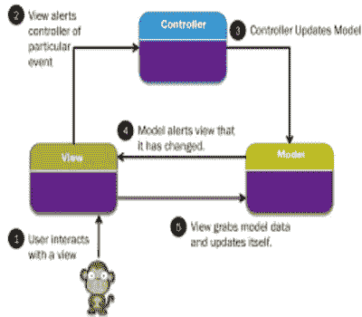

# 模型视图控制器(MVC)架构

> 原文：<https://blog.devgenius.io/model-view-controller-mvc-architecture-3fa1dc727d7d?source=collection_archive---------9----------------------->

大家好，很高兴为你写这个美丽的博客！

在这篇文章中，我们将会看到 web 开发中服务器端的处理机制——MVC(模型视图控制器)。

# 什么是 MVC？

MVC 是一个 web 开发框架，在其架构中有三个主要的逻辑组件，称为**模型、视图、控制器。**这三个组件非常有助于运行我们的 web 应用程序，也有助于创建可伸缩和可扩展的项目。

## 模型

模型组件用于与数据相关的活动。这可以表示为在**视图**和**控制器**组件之间传输的数据或其他业务逻辑。

**示例** : Student 对象将从大学数据库中检索学生信息。

## 视角

视图组件是关于应用程序的用户界面逻辑。它向用户提供任何数据的实际表示。这取决于型号。一旦模型发送了它的数据，那么只有视图组件可以显示这些数据。它可以用任何形式的数据来表示，如图表、表格等。

**示例**:以条形图的方式显示学生的详细信息，如分数详细信息。

## 控制器

控制器作为**模型**和**视图**组件之间的接口。这有助于使用模型处理数据，在视图组件中将这些数据显示为一个演示。

**示例**:学生详细信息控制器将处理来自学生视图的所有交互和输入。并在学生模型中更新学生数据库中的所有数据。

## **MVC 框架作品列表**

1.  姜戈
2.  蛋糕 PHP
3.  Ruby on Rails
4.  Spring MVC
5.  拉勒韦尔
6.  燃料 PHP
7.  交响乐
8.  轨道
9.  催化剂
10.  樱桃派

我希望你们对 MVC 架构有一些基本的了解。

谢谢大家！