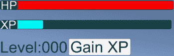
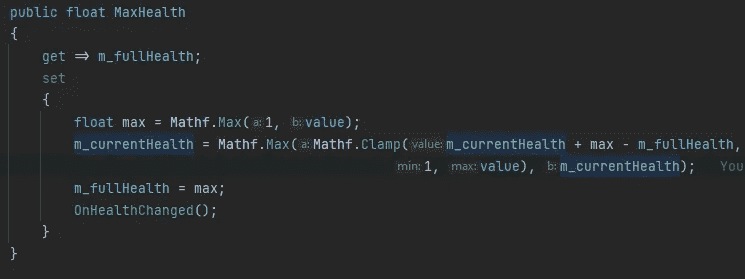

# Unity 中的模型视图控制器(MVC)模式

> 原文：<https://blog.devgenius.io/model-view-controller-mvc-pattern-in-unity-4ec9061dd0c?source=collection_archive---------1----------------------->

## 在 Unity 中被称为模型视图演示者(MVP)

我有一个好看的 UI 来显示我的健康、经验值和等级，来自我的[观察者模式文章](/the-observer-pattern-in-unity-4ee8e12100aa),[MVC 模式](/model-view-controller-family-3a0d869d81ea)非常依赖它。



健康 XP 级别用户界面

# Unity 中的模型视图演示者(MVP)

现在我需要将我的 UI 集成到我的项目中。有人可能会想说，嘿，我有控制升级的关卡和控制健康的健康，让我们把 UI 代码放在这里。很有道理。在演示一个概念的例子中，为了更容易地展示这个概念，或者在原型中，这样做的次数相当多。这样做打破了代码的模块化，同时也使代码做了不止一件事。它现在负责它要做的事情和更新 UI。更好的方法是使用[模型视图控制器(MVC)模式。在 Unity 中，实际使用的概念被称为模型视图呈现器(MVP ),它基于传统的模型视图控制器(MVC)。](/model-view-controller-family-3a0d869d81ea)


模型视图演示者(MVP)

# 履行

让我们看看如何在 Unity 中实现这一点。

支持这一概念所需的所有代码都在代码块中。如果代码是 pic 或 gif，那么它是不需要支持概念的代码。

```
public float CurrentHealth { get; set; }//Supports the Concept
```


不需要支持这个概念。

Unity 已经为我处理了视图部分。以画布的形式和你可以在画布上使用的所有元素(如按钮、文本、图像滑块等。).Unity 控制渲染部分，一些元素有事件(如按钮、滑块等)。)


查看 MVP 的部分

我已经完成了模型(游戏逻辑),为了使用 MVP，我必须添加变化事件。

这就剩下我和主持人了。这将负责接收来自视图的任何输入事件，并更新视图中使用的变量。

## 健康 MVP

在我的设计中，我将健康显示为一个条形。健康水平越高，该条越长，健康水平越低，该条越短。我可以创建自己的酒吧来做到这一点，但我会利用 Unity 的内置滑块。我确保滑球不是难以控制的(我不希望玩家用滑球改变他们的健康)。为了改变玩家的健康程度，我改变了滑块的值。


健康滑块作为健康视图

**模型** —当前我的健康有完全健康、当前健康、一种休息健康的方式、随着时间推移耗尽健康并观察升级事件的级别。


健康

演示者将需要知道健康的当前值、最大健康是什么以及这些值何时改变。

我要做的第一件事是为健康状况变化创建事件。我使用了一个操作来对当前健康值和最大健康值进行浮点运算。

```
*// <summary>
/// Every Time the Health Changes let observers know what the Current Health is and what the Max Health is.
/// </summary>* public Action<float, float> onHealthChanged;
```

接下来，我将创建一个调用该事件的方法。每次健康值变化的时候我都会用这个方法。

```
private void OnHealthChanged()
{
    if (onHealthChanged != null)
        onHealthChanged.Invoke(CurrentHealth, m_fullHealth);
}
```

我已经有了一个当前健康的属性，这是我用来设置当前健康值的。我将修改它以使用一个支持字段。这里重要的部分是让属性在当前运行状况改变时调用 On Change 事件。

将此行`public float CurrentHealth { get; private set; }`改为

```
private float m_currentHealth;public float CurrentHealth
{
    get => m_currentHealth;
    set
    {
        m_currentHealth;
        OnHealthChanged();
    }
}
```

如果当前健康小于或等于完全健康，我决定将当前健康限制在 0 和完全健康之间。否则，它确保健康不会低于 0。


我目前的健康状况

现在我需要一个最健康的属性。这里重要的部分是让属性在最大健康变化时调用 On Change 事件。

```
public float MaxHealth
{
    get => m_fullHealth;
    set
    {
        m_fullHealth = value;
        OnHealthChanged();
    }
}
```

当设置这个值时，我也改变了角色当前的生命值，所以它会随着生命值的增加而增加。我也把它固定在新的计算值和当前生命值之间的较大值上，这防止我从玩家身上减去生命值，这给了他们暂时的生命值提升，只要他们没有受到伤害，这种提升就会持续。



我最大的健康

主持人——现在我所需要的是健康主持人。在这个项目没有输入事件的情况下，它负责处理来自视图的输入事件。当模型发送 On Change 事件时，它需要更新视图的值来处理任何格式。

我首先创建一个名为 Heath Presenter 的新 MonoBehavior

```
public class **HealthPresenter** : MonoBehaviour
{

}
```

演示者需要知道它是哪个健康的演示者。

```
[SerializeField] private Health m_health;
```

所以我没有忘记设置这些，我现在会在统一中设置。我在画布上的健康 UI 中添加了一个健康展示者。


在 Unity 中添加健康演示者

我还要确保演示者有一个健康设置，这样我就不会出错了。


确保身体健康。

现在我需要观察它的变化事件的健康状况。良好的做法是在启用时注册事件，在禁用时取消注册。

```
private void **OnEnable**()
{
    m_health.onHealthChanged += OnHealthChanged;
}

private void **OnDisable**()
{
    m_health.onHealthChanged -= OnHealthChanged;
}

private void OnHealthChanged(float currentHealth, float maxHealth)
{
    // Update the View.
}
```

现在我需要做的就是更新视图。因为我使用一个滑块来显示我的健康状况，所以我需要得到一个对它的引用。

```
[SerializeField] private Slider m_healthSlider;
```

不要忘记 UI 的 using 语句。

```
using UnityEngine.UI;
```

我还确保演示者有一个滑块设置，这只是为了我以后不会出错。


确保有滑块

我现在也在检查器中分配它，这样我就不会忘记这样做了。


将健康滑块分配给健康演示者

现在，当 On Change 事件发生时，我需要更新视图。我有两种方法可以做到这一点。

1.  我可以将滑块最大值设置为最大健康值，并将滑块值设置为当前健康值
2.  或者我可以设置滑块值为当前健康/最大健康。

我会选择第二个选项。

```
private void OnHealthChanged(float currentHealth, float maxHealth)
{
    m_healthSlider.value = currentHealth / maxHealth;
}
```

最后，我想确保视图在游戏开始时更新。

```
private void **Start**()
{
    OnHealthChanged(m_health.CurrentHealth, m_health.MaxHealth);
}
```

## MVP 级别

**查看** —在我的设计中，我展示 XP 的方式与展示健康的方式相同。我也有一个按钮，增加了经验和显示当前水平的文本。


用户界面级别

**模型**——目前我的等级有每级点数，当前等级，一个等级提升单位事件和一个等级提升事件以及一个私人的获得经验的方法。它还运行一个获得经验的协程，我不再需要它了，因为我将使用 UI 来获得经验。

由于我不再需要启动协程，我将删除它。


从级别中删除开始方法

现在我还需要公开获得经验的方法。

将此行`private void GainExperience(int amountToGain)`改为

```
public void GainExperience(int amountToGain)
```

我需要知道最大体验是什么。

```
public int MaxExperiencePoints => m_pointsPerLevel * (CurrentLevel + 1);
```

现在我需要知道经验点什么时候变了。

```
public Action onExperienceChanged;
```

我确保在我增加经验点后调用这个。

```
public void GainExperience(int amountToGain)
{
    int previousLevel = CurrentLevel;
    ExperiencePoints += amountToGain;
    onExperienceChanged?.Invoke();// added
    if (CurrentLevel <= previousLevel) return;

    m_levelUpEvent?.Invoke();
    OnLevelUp?.Invoke(CurrentLevel);
}
```

模型现在可以由演示者更新，并发送所有需要的变更事件。

主持人——现在我只需要一个水平主持人。在这个项目中，当单击按钮时，它负责处理视图中的输入事件。当模型发送 On Change 事件时，它需要更新视图的值来处理任何格式。

我首先创建一个新的 MonoBehavior，名为 Level Presenter

```
public class **LevelPresenter** : MonoBehaviour
{

}
```

演示者需要知道它是哪个级别的演示者。

```
[SerializeField] private Level m_level;
```

所以我没有忘记设置这些，我现在会在统一中设置。我在画布上的关卡 UI 中添加了一个关卡演示者。


将级别演示者添加到用户界面

现在，我的演示者需要了解视图(滑块、文本和按钮)。

```
[SerializeField] private Slider m_xpSlider;

[SerializeField] private Text m_levelText;

[SerializeField] private Button m_gainXPButton;
```

在我忘记之前，我在检查器中分配这些。


在检查器中分配视图对象

当然，我确保所有必需的视图对象都已设置。


确定级别演示者已经在检查器中设定了所有需要的信息

现在我需要通过添加一个监听器，删除监听器来正确地注册到 Click Unity 事件上的按钮。当这个按钮被点击时，我告诉关卡去获得经验。

```
private void **OnEnable**()
{
    m_gainXPButton?.onClick.AddListener(OnGainExperienceClicked);
}

private void **OnDisable**()
{
    m_gainXPButton?.onClick.RemoveListener(OnGainExperienceClicked);
}

private void OnGainExperienceClicked()
{
    m_level.GainExperience(10);
}
```

我需要正确地注册到上一级的水平，甚至在经历了变化的行动。

```
private void **OnEnable**()
{
    m_gainXPButton?.onClick.AddListener(OnGainExperienceClicked);

    m_level.onExperienceChanged += OnExperienceChanged;
    m_level.OnLevelUp += OnLevelUp;
}

private void **OnDisable**()
{
    m_gainXPButton?.onClick.RemoveListener(OnGainExperienceClicked);

    m_level.onExperienceChanged -= OnExperienceChanged;
    m_level.OnLevelUp -= OnLevelUp;
}

private void OnExperienceChanged() { }

private void OnLevelUp(int currentlevel) { }
```

现在，当体验发生变化时，我需要更新视图。

```
private void OnExperienceChanged()
{
    m_xpSlider.value = (float)m_level.ExperiencePoints / m_level.MaxExperiencePoints;
}
```

接下来，当标高发生变化时，我将更新视图。

```
private void OnLevelUp(int currentlevel)
{
    m_levelText.text = $"{currentlevel}";
}
```

最后，我希望确保在启用演示者时视图得到更新。

```
private void **OnEnable**()
{
    OnExperienceChanged();// added
    OnLevelUp(m_level.CurrentLevel);// added

    m_gainXPButton?.onClick.AddListener(OnGainExperienceClicked);

    m_level.onExperienceChanged += OnExperienceChanged;
    m_level.OnLevelUp += OnLevelUp;
}
```

# 测试

现在，我要确保在游戏模式下，Unity 中的所有东西都能正常工作。


在 Unity 中测试

只是在完成健康 MVP 后的测试中，我发现我把我的健康水平公式倒过来了。


健康升级公式

当测试关卡时，我意识到当我设置滑块的值时，我忘记了将我的经验公式转换为浮点数，这使得它保持在 0，并且当我添加经验时，条没有增加。


等级 XP 滑块公式

# 获取代码

和往常一样，这方面的代码可以在我的 Git hub 上找到。

[](https://github.com/JamesLaFritz/Design-Patterns-For-Unity/tree/release-ModelViewController) [## GitHub-JamesLaFritz/Design-Patterns-For-Unity at release-ModelViewController

### 报告 Bug 请求特性展示了 Unity 中不同的编程设计模式。有许多不同的…

github.com](https://github.com/JamesLaFritz/Design-Patterns-For-Unity/tree/release-ModelViewController)