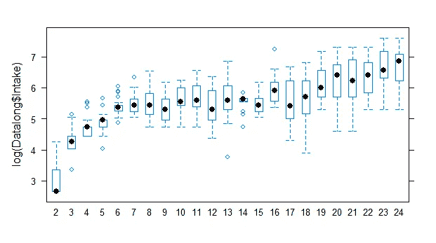
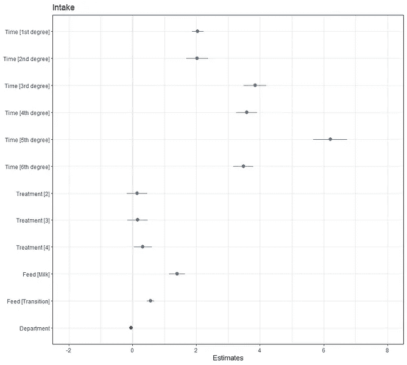
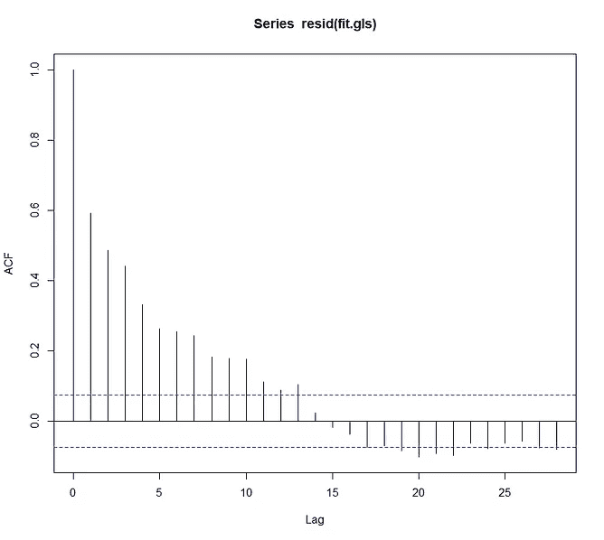

# 模拟猪的采食量数据

> 原文：<https://blog.devgenius.io/modelling-feed-intake-data-in-swine-1af3d72f263d?source=collection_archive---------18----------------------->

## 使用混合模型和 R

在动物研究中，生长的建模并不容易，但它有一些直截了当，因为它可以用 Gompertz 曲线来近似。我已经在这里展示过了。对于采食量数据，建模可能更困难，这也使它更具挑战性，这使它更有趣！

在这篇文章中，我将向你展示我如何从一个商业数据集中建模饲料摄入量数据。我不能添加数据集，但我可以引导您进行分析。您需要的只是包含时间成分的数据。

首先，我将加载数据。

```
rm(list = ls())#### LIBRARY ####
library(lme4)
library(splines)
library(parallel) # parallel computing 
library(ggplot2)
library(rms)
library(plyr)
library(reshape2)
library(boot)
library(sjPlot)
library(sjstats)
library(sjmisc)
library(gridExtra)
library(coefplot) 
library(coda)      
library(aods3)     
library(plotMCMC) 
library(bbmle)     
library(nlme)
library(merTools)
library(RLRsim) 
library(multcomp)
library(lsmeans)
library(multcompView)
library(lattice)
library(lmtest)
library(car)
library(corrplot)
library(PerformanceAnalytics)
library(eqs2lavaan)
library(mgcv)
library(gamm4)
library(robustlmm)
library(influence.ME)
library(readxl)
library(data.table)
library(HLMdiag)
library(grid)
library(fitdistrplus)
library(readr)
library(pbkrtest)
library(broom.mixed)
```

然后，最初的数据争论部分创建了许多融合的数据集。

```
Data <- read.csv("Data.csv");head(Data)
Datalong<- reshape(Data,
                   varying  = c("X2","X3","X4","X5","X6","X7","X8","X9","X10","X11","X12","X13","X14","X15","X16","X17","X18","X19","X20","X21","X22","X23","X24"),
                   v.names = "Intake",
                   timevar = "Time",
                   times = as.numeric(c("2","3","4", "5", "6", "7","8","9","10","11","12","13","14","15","16","17","18","19","20","21","22","23","24")),
                   direction = "long")
Datalong$id<-NULL
Datalong<-Datalong[order(Datalong$Sow),]
row.names(Datalong)<-NULL
Datalong$Time2<-Datalong$Time-2
Datalong$Treatment<-as.factor(Datalong$Treatment)
Datalong$LogIntake<-log(Datalong$Intake)
head(Datalong)### Add time varying predictors
Datalong$Feed<-ifelse(Datalong$Time<=13, "Milk", ifelse(Datalong$Time>=14&Datalong$Time<=16, "Transition", "Dry"))
## Feed-->1(Milk), 2(Transition),3(Dry)
Datalong$Feednum<-ifelse(Datalong$Time<=13, 1, ifelse(Datalong$Time>=14&Datalong$Time<=16, 2, 3))
Datalong<-Datalong[!Datalong$Intake==0,]
head(Datalong)### Create Baseline variable 
DatalongBaseline<-Datalong
DatalongBaseline<-DatalongBaseline[!DatalongBaseline$Time==2, ]
A<-list(DatalongBaseline, Data[, c("Sow", "X2")])
DatalongBaseline<-join_all(A)
colnames(DatalongBaseline)[12]<-"Baseline"
head(DatalongBaseline)### TREATMELT
TREATmelt<-ddply(Datalong, c("Time", "Treatment"), summarise,
                 N = sum(!is.na(Intake)),
                 Mis = sum(is.na(Intake)),
                 Mean = round(mean(Intake, na.rm=T),3),
                 Median = round(median(Intake, na.rm=T),3),
                 SD = round(sd(Intake, na.rm=T),3),
                 SE = round(sd(Intake, na.rm=T) / sqrt(N),5),
                 LCI = round(Mean - (2*SE),3), 
                 HCI = round(Mean + (2*SE),3))
TREATmelt## FEEDMELT
FEEDmelt<-ddply(Datalong, c("Time", "Feed"), summarise,
                 N = sum(!is.na(Intake)),
                 Mis = sum(is.na(Intake)),
                 Mean = round(mean(Intake, na.rm=T),3),
                 Median = round(median(Intake, na.rm=T),3),
                 SD = round(sd(Intake, na.rm=T),3),
                 SE = round(sd(Intake, na.rm=T) / sqrt(N),5),
                 LCI = round(Mean - (2*SE),3), 
                 HCI = round(Mean + (2*SE),3))
FEEDmelt## FEEDTREATMELT
FEEDTREATmelt<-ddply(Datalong, c("Time", "Feed", "Treatment"), summarise,
                N = sum(!is.na(Intake)),
                Mis = sum(is.na(Intake)),
                Mean = round(mean(Intake, na.rm=T),3),
                Median = round(median(Intake, na.rm=T),3),
                SD = round(sd(Intake, na.rm=T),3),
                SE = round(sd(Intake, na.rm=T) / sqrt(N),5),
                LCI = round(Mean - (2*SE),3), 
                HCI = round(Mean + (2*SE),3))
FEEDTREATmelt## AXMELT
AXmelt<-ddply(Datalong, c("Time", "AX"), summarise,
                N = sum(!is.na(Intake)),
                Mis = sum(is.na(Intake)),
                Mean = round(mean(Intake, na.rm=T),3),
                Median = round(median(Intake, na.rm=T),3),
                SD = round(sd(Intake, na.rm=T),3),
                SE = round(sd(Intake, na.rm=T) / sqrt(N),5),
                LCI = round(Mean - (2*SE),3), 
                HCI = round(Mean + (2*SE),3))
AXmelt$AX<-as.factor(AXmelt$AX)## CELLMELT
CELLmelt<-ddply(Datalong, c("Time", "CELL"), summarise,
                N = sum(!is.na(Intake)),
                Mis = sum(is.na(Intake)),
                Mean = round(mean(Intake, na.rm=T),3),
                Median = round(median(Intake, na.rm=T),3),
                SD = round(sd(Intake, na.rm=T),3),
                SE = round(sd(Intake, na.rm=T) / sqrt(N),5),
                LCI = round(Mean - (2*SE),3), 
                HCI = round(Mean + (2*SE),3))
CELLmelt$CELL<-as.factor(CELLmelt$CELL)
```

这些数据帧看起来会像这样


接下来是有趣的部分，图形，这将导致下面的情节。

```
theme_set(theme_bw())
myx<-scale_x_continuous(breaks=c(2,3,4,5,6,7,8,9,10,11,12,13,14,15,16,17,18,19,20,21,22,23,24))
myy<-scale_y_continuous(breaks = seq(0, 400, by = 50))
ggplot(Datalong, aes(x=Time, y=Intake, group=Sow))+
  myx+
  myy+
  geom_line(colour="grey80") +
  facet_grid(~Treatment, margins=T)+
  stat_summary(aes(group=1), fun.y=mean, geom="point", size=3.5)+
  stat_summary(aes(group=1), fun.y=mean, geom="line", lwd=1.5)### Per treatment - combined
theme_set(theme_bw())
myx<-scale_x_continuous(breaks=c(2,3,4,5,6,7,8,9,10,11,12,13,14,15,16,17,18,19,20,21,22,23,24))
myy<-scale_y_continuous(breaks = seq(0, 2000, by = 100))
ggplot(TREATmelt, aes(x=Time, y=Mean, colour=Treatment))+
  myx+
  myy+
  geom_line(lwd=1)+
  geom_ribbon(aes(ymin=LCI, ymax=HCI, fill=Treatment), alpha=0.1)+
  theme(axis.text.x=element_blank(),axis.ticks.x=element_blank(),panel.grid.major = element_blank(), panel.grid.minor = element_blank())### AX
theme_set(theme_bw())
myx<-scale_x_continuous(breaks=c(2,3,4,5,6,7,8,9,10,11,12,13,14,15,16,17,18,19,20,21,22,23,24))
myy<-scale_y_continuous(breaks = seq(0, 2000, by = 100))
ggplot(AXmelt, aes(x=Time, y=Mean, colour=AX))+
  myx+
  myy+
  geom_line(lwd=1)+
  geom_ribbon(aes(ymin=LCI, ymax=HCI, fill=AX), alpha=0.1)+
  theme(axis.text.x=element_blank(),axis.ticks.x=element_blank(),panel.grid.major = element_blank(), panel.grid.minor = element_blank())### CELL
theme_set(theme_bw())
myx<-scale_x_continuous(breaks=c(2,3,4,5,6,7,8,9,10,11,12,13,14,15,16,17,18,19,20,21,22,23,24))
myy<-scale_y_continuous(breaks = seq(0, 2000, by = 100))
ggplot(CELLmelt, aes(x=Time, y=Mean, colour=CELL))+
  myx+
  myy+
  geom_line(lwd=1)+
  geom_ribbon(aes(ymin=LCI, ymax=HCI, fill=CELL), alpha=0.1)+
  theme(axis.text.x=element_blank(),axis.ticks.x=element_blank(),panel.grid.major = element_blank(), panel.grid.minor = element_blank())### FEED
theme_set(theme_bw())
myx<-scale_x_continuous(breaks=c(2,3,4,5,6,7,8,9,10,11,12,13,14,15,16,17,18,19,20,21,22,23,24))
myy<-scale_y_continuous(breaks = seq(0, 2000, by = 100))
ggplot(FEEDmelt, aes(x=Time, y=Mean, colour=Feed))+
  myx+
  myy+
  geom_line(lwd=1)+
  geom_ribbon(aes(ymin=LCI, ymax=HCI, fill=Feed), alpha=0.1)+
  theme(panel.grid.major = element_blank(), panel.grid.minor = element_blank())### FEEDTREAT
theme_set(theme_bw())
myx<-scale_x_continuous(breaks=c(2,3,4,5,6,7,8,9,10,11,12,13,14,15,16,17,18,19,20,21,22,23,24))
myy<-scale_y_continuous(breaks = seq(0, 2000, by = 100))
ggplot(FEEDTREATmelt, aes(x=Time, y=Mean, colour=Feed))+
  myx+
  myy+
  geom_line(lwd=1)+
  geom_ribbon(aes(ymin=LCI, ymax=HCI, fill=Feed), alpha=0.1)+
  facet_wrap(~Treatment, ncol=2)+
  theme(panel.grid.major = element_blank(), panel.grid.minor = element_blank())### Check for best fit growth
sjp.poly(Datalong$Intake,Datalong$Time, 1)
sjp.poly(Datalong$Intake,Datalong$Time, 2) 
sjp.poly(Datalong$Intake,Datalong$Time, 3) # three would suffice, but probably not provide best results
sjp.poly(Datalong$Intake,Datalong$Time, 4)
sjp.poly(Datalong$Intake,Datalong$Time, 5)
```


然后，我想看看数据的可行性。让建模者的生活变得更轻松的最简单的方法之一就是转换数据。我不得不承认，我不喜欢它，因为你也失去了意义，不得不真正思考你在看什么。对于模型来说，这是减少横截面和纵向方差的一个很好的方法。使得对[混合车型](https://medium.com/mlearning-ai/introduction-to-mixed-models-in-r-9c017fd83a63)的需求不那么严格。

寻找合适变换的最简单方法是使用 Box-Cox 方法。Box-Cox 使用了一个转换阶梯。常见的 Box-Cox 变换都要经过 lambda 标准变换。

```
#   -2   -->  1/Y2
#   -1   -->  1/Y1
#   -0.5  -->  1/(Sqrt(Y))
#   0     -->  log(Y)
#   0.5   -->  Sqrt(Y)
#   1     -->  Y
#   2     -->  Y^2
```

使用 MASS 包，我们可以让 Box-Cox 做它的事情并绘制结果。任何 Box-Cox 的基础是一个模型，这里是一个线性回归，包括一个六节点样条。

```
## MASS package
fitlm<-lm(Intake~ns(Time,6)*Treatment+Department+Feed+as.factor(Sow), data=Datalong)
par(mfrow=c(2,2));plot(fitlm);dev.off()
boxcox(fitlm,lambda=seq(-2,2,by=0.1),plotit=T)
bc1<-boxcox(fitlm,lambda=seq(-2,2,by=0.1),plotit=T)
which.max(bc1$y)
LV<-bc1[1]$x[as.numeric(which.max(bc1$y))]
LV # 0.06060606 --> log transformhistogram(~log(Datalong$Intake)|Datalong$Time) # log transform makes data little bit more normal
bwplot(log(Datalong$Intake)~as.factor(Datalong$Time)) # still heterogeneity of variance## Compare different fits 
fitlm<-lm(Intake~ns(Time,6)*Treatment+Department+Feed+as.factor(Sow), data=Datalong)
fitlog<-lm(log(Intake)~ns(Time,6)*Treatment+Department+Feed+as.factor(Sow), data=Datalong)
fitsqrt<-lm(sqrt(Intake)~ns(Time,6)*Treatment+Department+Feed+as.factor(Sow), data=Datalong)
fitreciproc<-lm(Intake/1~ns(Time,6)*Treatment+Department+Feed+as.factor(Sow), data=Datalong)
fitpower2<-lm(Intake^2~ns(Time,6)*Treatment+Department+Feed+as.factor(Sow), data=Datalong)
fitpower13<-lm(Intake^1/3~ns(Time,6)*Treatment+Department+Feed+as.factor(Sow), data=Datalong)
par(mfrow=c(2,3))
plot(fitlm, which=2, main="BW")
plot(fitlog, which=2, main="BW_log") # solves the upper tail but not the lower tail --> fixating baseline probably would 
plot(fitsqrt, which=2, main="BW_sqrt")
plot(fitreciproc, which=2, main="BW_reciprocal")
plot(fitpower2, which=2, main="BW^2")
plot(fitpower13, which=2, main="BW^1/3")
```



一些转换显示出比原始数据更好的拟合，尽管原始数据本身并不坏。

因此，让我们开始构建一个没有任何转换的混合模型，看看它能带给我们多远。

```
fit.lmer<-lmer(log(Intake)~ns(Time,6)*Treatment+Feed+Department+
                 (ns(Time,3)|Sow),
               data=Datalong,
               control = lmerControl(optCtrl = list(maxfun=100000)))
summary(fit.lmer)
plot(fit.lmer) 
plot_model(fit.lmer)
plot_model(fit.lmer, type="re")
plot_model(fit.lmer, type="eff")
plot_model(fit.lmer, type="std")
plot_model(fit.lmer, type="slope")
plot_model(fit.lmer, type="resid")
histogram(resid(fit.lmer), breaks=20)
plot(acf(resid(fit.lmer)))
```


这个模型本身看起来并不坏。

现在，R 中最酷的函数之一是 *drop1* 函数。它是一个迭代预测器，用于观察 AIC 的变化。


它显示了删除交互项如何有利于模型拟合。它还显示了删除预测器**提要**肯定不会带来好处。

然后，我将创建几个迭代的模型，看看哪一个具有最低的 AIC。仅仅使用 AIC 是不够的，也是棘手的，但这是理解最大的预测因子在哪里影响谎言和/或方差分量的好方法。

```
fit.lmer2<-lmer(log(Intake)~ns(Time,6)*Treatment+Department+
                 (ns(Time,6)|Sow),
               data=Datalong,
               control = lmerControl(optCtrl = list(maxfun=100000)))
summary(fit.lmer2)
anova(fit.lmer, fit.lmer2) # fit.lmer2 not better
drop1(fit.lmer2)fit.lmer3<-lmer(log(Intake)~ns(Time,6)*Treatment+Feed+
                  (ns(Time,6)|Sow),
                data=Datalong,
                control = lmerControl(optCtrl = list(maxfun=100000)))
plot(fit.lmer3)
anova(fit.lmer, fit.lmer3) # Model 3 is better
KRmodcomp(fit.lmer, fit.lmer3)fit.lmer4<-lmer(log(Intake)~ns(Time,6)+Treatment+Feed+Department+
                  (ns(Time,6)|Sow)+
                  (1|Feed) + (1|Treatment),
                data=Datalong,
                control = lmerControl(optCtrl = list(maxfun=100000)))
summary(fit.lmer4)
anova(fit.lmer, fit.lmer3, fit.lmer4) # fit.lmer still the bestfit.lmer5<-lmer(log(Intake)~ns(Time,2)*Feed+Treatment+Department+
                  (ns(Time,2)*Feed|Sow)+
                  (1|Feed) + (1|Treatment),
                data=Datalong,
                control = lmerControl(optCtrl = list(maxfun=100000)))
summary(fit.lmer5)
plot(fit.lmer5)
anova(fit.lmer5, fit.lmer)fit.lmer6<-lmer(log(Intake)~ns(Time,10)+Feed+Treatment+Department+
                  (ns(Time,10)|Sow)+(1|Feed),
                data=Datalong,
                control = lmerControl(optCtrl = list(maxfun=100000)))
plot(fit.lmer6)
summary(fit.lmer6)fit.lmer7<-lmer(log(Intake)~ns(Time,2)*Feed*Treatment+Department+
                  (ns(Time,2)*Feed|Sow),
                data=Datalong,
                control = lmerControl(optCtrl = list(maxfun=100000)))
plot(fit.lmer7)fit.lmer8<-lmer(log(Intake)~ns(Time,4) +Feed*Treatment+Department+
                  (ns(Time,4)|Sow) + (Feed*Treatment|Sow),
                data=Datalong,
                control = lmerControl(optCtrl = list(maxfun=100000)))
plot(fit.lmer8)fit.lmer9<-lmer(log(Intake)~as.factor(Time)+Treatment+Feed+Department+
                  (1|Sow) + (1|Feed),
                data=Datalong,
                control = lmerControl(optCtrl = list(maxfun=100000)))
plot(fit.lmer9)
summary(fit.lmer9)
ICtab(fit.lmer,
       fit.lmer2,
       fit.lmer3,
       fit.lmer4,
       fit.lmer5,
       fit.lmer6,
       fit.lmer7,
       fit.lmer8,
       fit.lmer9)
```


从分析来看，6 型似乎是最好的。

现在，我不想对原始数据使用对数转换，而是想看看是否可以通过一个[广义线性混合模型](https://medium.com/@marc.jacobs012/generalized-linear-mixed-models-in-sas-distributions-link-functions-scales-overdisperion-and-4b1c767bb89a)将对数转换包含在模型中。成绩还不错。

```
fit.glmer<-glmer(Intake~ns(Time,6)+Treatment+Feed+Department+
                   (ns(Time,6)|Sow)+(1|Feed),
                 data=Datalong,
                 family=gaussian(link="log"),
                 control = glmerControl(optimizer = "bobyqa", nAGQ = 1))
summary(fit.glmer)
plot(fit.glmer)
plot_model(fit.glmer)
plot_model(fit.glmer, "diag")
```



另一种对数据建模的方法是使用一般的加性混合模型或 GAMM，而不是使用大的打结样条。在这里，我再次对数据而不是模型使用了对数变换，因为对数正态分布可能非常棘手。

```
Datalong$LogIntake<-log(Datalong$Intake)
fit.gamm4<-gamm4::gamm4(LogIntake~s(Time)+Feed+Treatment+Department,
 random=~(ns(Time,6)|Sow)+(1|Feed),
 family=gaussian(),
 data=Datalong)
dev.off()
plot(fit.gamm4$gam)
summary(fit.gamm4$gam)
summary(fit.gamm4$mer)
plot(resid(fit.gamm4$gam))
qqp(resid(fit.gamm4$gam))
histogram(resid(fit.gamm4$gam), breaks=50)
histogram(resid(fit.gamm4$mer), breaks=50)
plot(exp(fitted(fit.gamm4$gam)) — exp(fitted(fit.gamm4$mer)), col=c(1,2))
fit.gamm4$gam$var.summary
```


从模型的表格摘要以及下面突出显示残差的图来看，结果看起来不错。


除了 lme4 和 gamm4 之外，另一个很棒的软件包是 [lme](https://www.rdocumentation.org/packages/nlme/versions/3.1-152/topics/lme) 软件包，它可能是 r 中最古老的混合模型软件包。对于线性混合模型来说，它仍然非常重要，也仍然是最灵活的。

```
#### LME ####
fit.lme<-lme(log(Intake)~ns(Time,6)*Treatment+Feed+Department,
             random=~ns(Time,6)|Sow,
             #weights=varIdent(form=~1|Time),
             correlation=corAR1(form=~Time|Sow), 
             data=Datalong,
             method="REML",
             control=lmeControl(opt="optim", maxIter=10000, msMaxIter = 1000)) 
plot(fit.lme)
plot_model(fit.lme)
```


残差看起来不错。

lme 软件包中最灵活的部分之一是通过协方差结构对误差项建模的能力，这几乎是对 SAS 的补充。在这里，我将展示如何使用基础模型和应用几个协方差结构，并查看 AIC 的变化。

```
cp<-list(corCAR1, corExp, corAR1, corCompSymm, corLin,corGaus, corSpher)
z<-vector('list', length(cp))
for(k in 1:length(cp)){
  z[[k]]<-nlme::gls(log(Intake)~Baseline+ns(Time,6)*Treatment+Feed+Department, 
              data=DatalongBaseline, 
              correlation=cp[[k]](form=~Time|Sow))
}
anova(z[[1]], z[[2]], z[[3]], z[[4]], z[[5]], z[[6]], z[[7]]) # corSpher has lowest AIC
plot(z[[1]])
summary(z[[1]])
```


corAR1 似乎是最合适的，所以让我们在模型中使用它。

```
fit.gls<-Gls(log(Intake)~Baseline+ns(Time,10)*Treatment+Feed+Department
             ,correlation=corAR1(form=~Time|Sow), 
             data=DatalongBaseline) # this is probably what she realy did 
print(fit.gls, latex=TRUE)
v<-Variogram(fit.gls, form=~Time|Sow);plot(v) # looks like the autocorrelation is handling it nicely
summary(fit.gls)
AIC(fit.lme, fit.gls)
plot(acf(resid(fit.gls))) # shows huge amout of autocorrelation even after adding correlation function
plot(fit.gls)
qqp(resid(fit.gls))
```



残差看起来不错(中间和右边)，但是自相关协方差没有像我希望的那样降低相关误差。

我打算再试一次，让错误建模部分变得更简单。

```
fit.gls2<-gls(log(Intake)~Baseline+as.factor(Time)+Treatment, 
              correlation =corAR1(), 
             data=DatalongBaseline)## Model evaluation of GLS 
boxplot(resid(fit.gls)~DatalongBaseline$Time) # not constant variance
xyplot(resid(fit.gls)~exp(fitted(fit.gls)))  # not constant variance
anova(fit.gls)
```


不，对自相关没有帮助，尽管残差本身在时间上拟合得很好。

现在，如果我用总采食量来建模呢？这里要实现的另一个伟大工具是 [aVPlots(附加变量图)](https://www.rdocumentation.org/packages/car/versions/3.0-10/topics/avPlots)，它向你展示了一组预测因子对另一组预测因子的条件交互作用。

```
Data<-Data[order(Data$Treatment),]
Data$TI<-c(5114,5783,11794,6467,6724,4036,
                        8557,
                        5091,
                        4490,
                        13866,
                        11874,
                        7029,
                        9001,
                        14849,
                        5526,
                        4550,
                        18291,
                        10471,
                        3437,
                        9337,
                        14451,
                        6094,
                        4820,
                        11137,
                        13410,
                        6976,
                        14627,
                        7063,
                        14564,
                        7300,
                        7967)
Data$Treatment<-as.factor(Data$Treatment)
DataCOMPL<-Data[!Data$Sow==602,]
head(DataCOMPL)fit.lm2<-lm(TI~Treatment+Department, 
           data=DataCOMPL)
dev.off()
par(mfrow=c(2,2))
plot(fit.lm2)
dev.off()
Anova(fit.lm2, type=2)
residualPlots(fit.lm2)
avPlots(fit.lm2)
pairs(lsmeans(fit.lm2, ~Treatment))
plot(pairs(lsmeans(fit.lm2, ~Treatment)))
```


这些差异都不显著。

我想回到 Box-Cox 变换，看看我是否能找到一种方法，通过变换，使用 *fit.lm2* ，达到一个更好的模型。

```
boxcox(fit.lm2,lambda=seq(-2,2,by=0.1),plotit=T)
bc2<-boxcox(fit.lm2,lambda=seq(-2,2,by=0.1),plotit=T)
which.max(bc2$y)
bc2[1]$x[as.numeric(which.max(bc2$y))]fit.lm3<-lm(log(TI)~Treatment+Department, 
            data=DataCOMPL)
pairs(lsmeans(fit.lm3, ~Treatment))model<-aov(log(TI)~Treatment, 
           data=DataCOMPL)
summary(model)
plot(model)
plot(TukeyHSD(model))
```


```
fit.lmer.inf<-lmer(log(Intake)~ns(Time,5)+Treatment+Feed+Department+
                  (ns(Time,5)|Sow)+
                  (1|Feed),
                data=Datalong,
                control = lmerControl(optCtrl = list(maxfun=100000)))
inf.sow<-influence.ME::influence(fit.lmer.inf, "Sow") # fit.lmer won't do
plot(inf.sow)
plot(inf.sow, which="cook", sort=TRUE)
```


未检测到影响者

现在是时候看看有哪些模型能够预测感兴趣的结果了。当然，残差已经表明了这一点，但校准图仍然可以相当令人耳目一新。

```
ggplot(Datalong, aes(x=Intake, 
                     y=exp(fitted(fit.lmer, type="response")), 
                     colour=Intake-exp(fitted(fit.lmer,type="response"))))+
  geom_point()+
  geom_abline(intercept = 0, slope = 1, lty=2)+
  scale_colour_gradient2(low="red",mid="blue",high="red")+
  labs(title = "Calibration", y="Predicted", x="Observed", colour="Difference")+
  theme_bw()+
  theme(axis.text.x=element_blank(),axis.ticks.x=element_blank(),panel.grid.major = element_blank(), panel.grid.minor = element_blank())# The variance across time 
ggplot(Datalong, aes(as.factor(Datalong$Time),resid(fit.lmer), group=as.factor(Datalong$Time)))+
  geom_boxplot()+
  geom_hline(yintercept=0, col="red", linetype="dashed")+
  xlab("Time")+
  ylab("Residuals")+
  ggtitle("Residuals vs Time")+
  theme_bw()+
  theme(axis.text.x=element_blank(),axis.ticks.x=element_blank(),panel.grid.major = element_blank(), panel.grid.minor = element_blank())
```


预测还不错，但是一旦动物开始吃得更多，预测就变得更加困难。

就像我说的，残差也起作用

```
# QQplot residuals 
qqmath(~resid(fit.lmer),
       prepanel = prepanel.qqmathline,
       panel = function(x, ...) {
         panel.qqmathline(x, ...)
         panel.qqmath(x, ...)
       }) 
histogram(~resid(fit.lmer), breaks=30) # big left tail --> resids are quite low# Residuals stratified by Time
qqmath(~resid(fit.gamm4$mer)|Datalong$Time, aspect = "xy",
       prepanel = prepanel.qqmathline,
       panel = function(x, ...) {
         panel.qqmathline(x, ...)
         panel.qqmath(x, ...)
       })
```


看起来也不错，除了一个细胞和时间的开始。

通过 xy 图可以得到更好的预测图

```
xyplot(Intake ~ Time|Sow, data = Datalong, 
       strip = FALSE, aspect = "xy", pch = 16, cex=0.5, grid = TRUE,
       panel = function(x, y, ..., fit, subscripts) {
         panel.xyplot(x, y, ...)
         ypred <- exp(fitted(fit.lmer))[subscripts]
         panel.lines(x, ypred, lty=1, col = "orange")
         panel.loess(x, y, lty = 2, col="red")
       })
```


最后看看残差，一个更广泛的图。

```
## List of graphs for model evaluation
fit_augmented <- augment(fit.lmer)
g1<-ggplot(fit_augmented, aes(.fitted, .resid))+
  geom_point()+
  stat_smooth(method="loess")+
  geom_hline(yintercept=0, col="red", linetype="dashed")+
  xlab("Fitted values")+ylab("Residuals")+
  ggtitle("Fitted vs Residuals")+
  theme_bw()+
  theme(axis.text.x=element_blank(),axis.ticks.x=element_blank(),panel.grid.major = element_blank(), panel.grid.minor = element_blank())
g2<-ggplot(fit_augmented, aes(x=.resid))+
  geom_histogram(aes(y=..density..),colour="black", fill="white")+
  geom_density(alpha=.2, fill="#FF6666")+
  xlab("Residuals")+ylab("Density")+
  ggtitle("Histogram Residuals")+
  theme_bw()+
  theme(axis.text.x=element_blank(),axis.ticks.x=element_blank(),panel.grid.major = element_blank(), panel.grid.minor = element_blank())
vec<-resid(fit.lmer); y <- quantile(vec[!is.na(vec)], c(0.25, 0.75)); x <- qnorm(c(0.25, 0.75)); slope <- diff(y)/diff(x); int <- y[1L] - slope * x[1L]
g3<-ggplot(fit_augmented, aes(sample=.resid))+
  geom_qq()+
  geom_abline(slope=slope, intercept=int, col="red", lty=2, lwd=1)+
  xlab("Theoretical")+
  ylab("Empirical")+
  ggtitle("QQ-PLot Residuals")+
  theme_bw()+
  theme(axis.text.x=element_blank(),axis.ticks.x=element_blank(),panel.grid.major = element_blank(), panel.grid.minor = element_blank())
g4<-ggplot(fit_augmented, aes(x=exp(`log(Intake)`), y=exp(fitted(fit.lmer)), colour=`log(Intake)`-exp(fitted(fit.lmer))))+
  geom_point()+scale_colour_gradient2(low="red",mid="blue",high="red")+
  labs(title = "Calibration", y="Predicted", x="Observed", colour="Difference")+
  theme_bw()+
  theme(axis.text.x=element_blank(),axis.ticks.x=element_blank(),panel.grid.major = element_blank(), panel.grid.minor = element_blank())
g5<-ggplot(fit_augmented, aes(Datalong$Treatment,.resid, group=Datalong$Treatment))+
  geom_boxplot()+
  geom_hline(yintercept=0, col="red", linetype="dashed")+
  xlab("Treatment")+
  ylab("Residuals")+
  ggtitle("Residuals vs Treatment")+
  theme_bw()+
  theme(axis.text.x=element_blank(),axis.ticks.x=element_blank(),panel.grid.major = element_blank(), panel.grid.minor = element_blank())
g6<-ggplot(fit_augmented, aes(as.factor(Datalong$Time),.resid, group=Datalong$Time))+
  geom_boxplot()+
  geom_hline(yintercept=0, col="red", linetype="dashed")+
  xlab("Time")+
  ylab("Residuals")+
  ggtitle("Residuals vs Time")+
  theme_bw()+
  theme(axis.text.x=element_blank(),axis.ticks.x=element_blank(),panel.grid.major = element_blank(), panel.grid.minor = element_blank())
g7<-ggplot(fit_augmented, aes(as.factor(Datalong$Department),.resid, group=as.factor(Datalong$Department)))+
  geom_boxplot()+
  geom_hline(yintercept=0, col="red", linetype="dashed")+
  xlab("Department")+
  ylab("Residuals")+
  ggtitle("Residuals vs Department")+
  theme_bw()+
  theme(axis.text.x=element_blank(),axis.ticks.x=element_blank(),panel.grid.major = element_blank(), panel.grid.minor = element_blank())
g8<-ggplot(fit_augmented, aes(x=Datalong$Feed,y=.resid, group=Datalong$Feed))+
  geom_boxplot()+
  geom_hline(yintercept=0, col="red", linetype="dashed")+
  xlab("Feed")+
  ylab("Residuals")+
  ggtitle("Residuals vs Feed")+
  theme_bw()+
  theme(axis.text.x=element_blank(),axis.ticks.x=element_blank(),panel.grid.major = element_blank(), panel.grid.minor = element_blank())
g9<-ggplot(fit_augmented, aes(x=as.factor(Datalong$Sow),y=.resid, group=Datalong$Sow))+
  geom_boxplot()+
  geom_hline(yintercept=0, col="red", linetype="dashed")+
  xlab("Sow")+
  ylab("Residuals")+
  ggtitle("Residuals vs Sow")+
  theme_bw()+
  theme(axis.text.x=element_blank(),axis.ticks.x=element_blank(),panel.grid.major = element_blank(), panel.grid.minor = element_blank())
gh<-grid.arrange(g1,g2,g3,g4,g5,g6,g7,g8,g9, nrow=5,ncol=2,top=textGrob("Diagnostics Final Model",gp=gpar(cex=2)))
ggsave(gh,filename = "Model Evaluation.png", width=16, height=16, dpi=600)
```


相当广泛的一组图来观察模型的可行性

我一路做到这里已经是相当跑了。但是我想看看我是否能从数据中得到更多，因为我没有看到任何有意义的东西。记住，商业数据也会带来商业压力，这并不总是好的。

让我再看一看。

```
Datalong$fit<-exp(fitted(fit.lmer))
FEEDTREATMODELmelt<-ddply(Datalong, c("Time", "Feed", "Treatment"), summarise,
                     N = sum(!is.na(fit)),
                     Mis = sum(is.na(fit)),
                     Mean = round(mean(fit, na.rm=T),3),
                     Median = round(median(fit, na.rm=T),3),
                     SD = round(sd(fit, na.rm=T),3),
                     SE = round(sd(fit, na.rm=T) / sqrt(N),5),
                     LCI = round(Mean - (2*SE),3), 
                     HCI = round(Mean + (2*SE),3))
FEEDTREATMODELmelt## Summary Observed vs Fitted
theme_set(theme_bw())
myx<-scale_x_continuous(breaks=c(2,3,4,5,6,7,8,9,10,11,12,13,14,15,16,17,18,19,20,21,22,23,24))
myy<-scale_y_continuous(breaks = seq(0, 2000, by = 100))
ggplot(FEEDTREATmelt, aes(x=Time, y=Mean, colour=Feed))+
  myx+
  myy+
  geom_line(lwd=1, alpha=0.5)+
  facet_wrap(~Treatment, ncol=2)+
  geom_line(data=FEEDTREATMODELmelt, lwd=1)+
  theme(panel.grid.major = element_blank(), panel.grid.minor = element_blank())+
  geom_ribbon(data=FEEDTREATMODELmelt, aes(ymin=LCI, ymax=HCI, fill=Feed), alpha=0.1)+
  geom_ribbon(data=FEEDTREATmelt, aes(ymin=LCI, ymax=HCI, fill=Feed), alpha=0.1)
```


非平滑数据集之上的平滑数据集

当对时间数据建模时，即使是在实体实验中进行，开始时的差异也会影响后续过程。所以，我建立了一个模型来修正开头。看着顶部的情节，我并没有期望太多，比起修复，我更喜欢建模，但这是一个要求。

```
head(DatalongBaseline)
LME.model.1<-lme(Intake~1+Baseline+Time2+Department+Treatment+Feed, 
                 data=DatalongBaseline, 
                 random=~Time|Sow, 
                 correlation=corAR1(), 
                 method="ML", 
                 control=lmeControl(maxIter=10000, msMaxIter = 1000)) # ERROR message = singular convergence (7)
LME.model.2<-lme(Intake~1+Baseline+ns(Time,2)+Department+Treatment+Feed, 
                 data=DatalongBaseline, 
                 random=~Time|Sow,
                 method="ML", 
                 control=lmeControl(opt="optim", maxIter=10000, msMaxIter = 1000))
summary(LME.model.2)LMER.model.1<-lme4::lmer(Intake~1+Baseline+ns(Time,2)+Department+Treatment+Feed+(Time|Sow), 
                 data=DatalongBaseline, REML=FALSE, lmerControl(optimizer = "bobyqa")) # Model failed to converge: degenerate  Hessian with 1 negative eigenvalues
AIC(LME.model.2);AIC(LMER.model.1) # same AIC
VarCorr(LME.model.2); VarCorr(LMER.model.1) # approximately the same, so why LMER will not be able to fit a model that LME can fit i do not knowData_new<-groupedData(Intake~Time|Sow,
                      data=DatalongBaseline,
                      FUN=mean)
LME.model.3<-lme(Intake~1+Baseline+ns(Time,4)+Department+Treatment+Feed, 
                 data=Data_new, 
                 random=~ns(Time,3),
                 method="ML", 
                 control=lmeControl(opt="optim", maxIter=10000, msMaxIter = 1000))
summary (LME.model.3)
plot(LME.model.3)
res<-residuals(LME.model.3)
qqnorm(res); qqline(res)
plot(res)
plot(augPred(LME.model.3,level=0:3))
```


不完美。

另一种改进模型的方法是实际手动选择样条线的结。这需要基于生物学来完成，而不是基于你想要(过度)拟合数据的愿望。在这里，我在实际测量发生的日期打上了结。

```
LME.model.4<-lme(Intake~1+Baseline+ns(Time,knots=c(10,14,17,21))+Treatment+Feed+Department, 
                 data=Data_new, 
                 random=~ns(Time,knots=c(10,14,17,21)),
                 method="ML", 
                 control=lmeControl(opt="optim", maxIter=10000, msMaxIter = 1000))
plot(augPred(LME.model.4,level=0:1))
plot(ACF(LME.model.4))
plot(acf(resid(LME.model.4)))
```


看起来好多了！！

让我们看看结的位置是否正确。

```
# Test for splines
dev.off()
plot(Intake~Time, data=Datalong)
Intake.spl<-with(Datalong, smooth.spline(Time, Intake))
summary(Intake.spl)
lines(Intake.spl, col = "blue")
plot(residuals(Intake.spl) ~ fitted(Intake.spl))
abline(h = 0, col = "gray")
rcspline.eval(Datalong$Time, nk=4, inclx=TRUE) # 3, 10, 17, 23
```


rcspline.eval 函数选择 3、10、17 和 23 作为放置结的最佳位置。但是，因为我想让生物学在这里领先，我将坚持 9、14、17、19 和 21。

```
LME.model.5<-lme(Intake~1+Baseline+ns(Time,knots=c(9,14,17,19,21))+Treatment+Department, 
                 data=Data_new, 
                 random=~ns(Time,knots=c(9,14,17,19, 21)),
                 method="ML", 
                 control=lmeControl(opt="optim", maxIter=10000, msMaxIter = 1000))
anova(LME.model.4, LME.model.5)
plot(augPred(LME.model.5,level=0:1))
summary(LME.model.5)
plot(LME.model.5)
plot(ACF(LME.model.5))
resid<-residuals(LME.model.5)
qqline(resid)
plot(ranef(LME.model.5))
```


看起来不错！

同样，更多的模型。

```
LME.model.6<-lme(Intake~1+Baseline+rcs(Time,knots=c(9,14,17,19,21))+Treatment+Department, 
                 data=Data_new, 
                 random=~rcs(Time,knots=c(9,14,17,19, 21)),
                 method="ML", 
                 control=lmeControl(opt="optim", maxIter=10000, msMaxIter = 1000))
anova(LME.model.4, LME.model.5, LME.model.6) # Rcs is worse - although individual fits are very good!
plot(augPred(LME.model.6,level=0:1))
summary(LME.model.6)
VarCorr(LME.model.6)
```


```
LME.model.7<-lme(Intake~1+
                   Baseline+
                   I(Time*(Time<9))+
                   I(Time*(Time>=9&Time<14))+
                   I(Time*(Time>=14&Time<17))+
                   I(Time*(Time>=17&Time<21))+
                   I(Time*(Time>= 21))+
                   Treatment+Department,
                 data=Data_new, 
                 random=~I(Time*(Time<9))+
                   I(Time*(Time>=9&Time<14))+
                   I(Time*(Time>=14&Time<17))+
                   I(Time*(Time>=17&Time<21))+
                   I(Time*(Time>= 21)),
                 method="ML", 
                 control=lmeControl(opt="optim", maxIter=10000, msMaxIter = 1000))
anova(LME.model.6, LME.model.7) # broken line is worse fit
```


```
plot(LME.model.7)
qqnorm(resid(LME.model.7))
qqline(resid(LME.model.7))
plot(ranef(LME.model.7)) # same amount of parameters as RCS or NS, so does not make sense to do a piecewise linear fitLME.model.8<-lme(Intake~1+
                   Baseline+ns(Time, knots=13,17)+
                   Treatment+
                   Department,
                 data=Data_new, 
                 random=~ns(Time, knots=13,17),
                 method="ML", 
                 control=lmeControl(opt="optim", maxIter=10000, msMaxIter = 1000))
anova(LME.model.7, LME.model.8) # cubic spline has better fit
```


```
jtools::plot_summs(LME.model.2,
                   LME.model.8,
                   robust = "HC3", 
                   model.names = c("Model 2", "Model 8"))
```


模型 2 和模型 8 是唯一允许比较的。不知道为什么说实话。

```
# Influence diagnostics
library(influence.ME)
inf<-influence(fit.lmer, obs=TRUE) # a lot of warnings --> failures to converge
inf2<-influence(fit.lmer, group="Sow") # also here, failures to converge
plot(pchange(inf))
plot(inf)
sigtest(inf2)
plot(inf2, which="dfbetas")# Cooks distance
plot(inf2, which="cook", sort=TRUE) # cutoff is 2/sqrt(n) where n is the number of groups specified --> so here, cutoff is:
# is actually the cutoff for standardized beta 2/(sqrt(length(unique(Datalong$Sow))))
# Traditional cutoff value for cooks distance is 4/n, which is 4/(length(unique(Datalong$Sow))) --> but still the programm does not pcik it up apparantly..cd<-as.data.frame(cooks.distance(inf2))
cd$Sow<-rownames(cd)
ggplot(cd, aes(x=V1, y=Sow))+
  geom_point()+
  labs(x="Cooks Distance", y="Sow")+
  ggtitle("Influence Diagnostics: Cooks Distance")+
  theme_bw()+
  geom_vline(xintercept=2/(sqrt(length(unique(Datalong$Sow)))), colour="red", lty=2)
plot(inf2, which="cook", cutoff=4/(length(unique(Datalong$Sow))),sort=TRUE, xlab="Cook's Distance", ylab="Sow")
```


```
library(hnp)
half<-hnp(fit.lmer, sim=500, col.paint.out=TRUE, how.many.out=TRUE) 
```


统计极客的半正态分布图。

最后，对于任何商业数据集来说，这都是为了找到治疗的统计意义。这些 ls 均值(来自模型的处理均值，而不是来自数据的观察均值)需要一些审查。例如，在寻找差异时，不应该使用并列置信区间来进行比较。原因是因为均值的标准误和均值差异的标准误(SEs)不一样！事实上，当比较受试者内治疗的水平时，它们可以有很大的不同，其中平均值的 SEs 包括受试者之间的差异，但差异的 SEs 不包括受试者之间的差异。

```
comp1<-glht(fit.lmer, mcp(Treatment="Tukey")) # multcomp
comp2<-glht(fit.lmer, lsm(pairwise ~ Treatment))# lsmeans
comp1.cld<-cld(comp1)
par(mai=c(1,1.5,1,1), no.readonly=TRUE)
plot(comp1.cld)
par(mai=c(1,1.5,1,1), no.readonly=TRUE)
plot(comp1) # ugly but informative plot 
abline(v=0,lty=2,col="gray50")
```


**lsmeans** 包中的箭头来源于均值对之间差异的置信区间长度，以及这些区间与零的重叠程度。

```
fit.orig<-lsmeans::lsmeans(fit.gls2, ~Treatment|Time, cov.reduce=FALSE)
summary(fit.orig, type="response")
pairs(fit.orig, type="response")
fit.lsm<-lsmeans::lsmeans(fit.gls, ~Treatment|Time, cov.reduce=FALSE)
summary(fit.lsm, type="response") 
pairs(fit.lsm)
plot(fit.lsm, intervals = TRUE, int.adjust = "none", comparisons = TRUE)
```


最后，但并非最不重要的，一个预测图，看看模型是否有所作为。

```
datapredict<-augment(fit.lmer)
Datalong$fitted<-predict(fit.lmer)
ggplot(Datalong, aes(x=Time, group=Sow))+
  geom_point(aes(y=LogIntake)) + geom_line(aes(y=LogIntake))+
  geom_point(aes(y=fitted), color="red", alpha=0.5) + geom_line(aes(y=fitted), color="red", alpha=0.5)+
  facet_grid(~Treatment)+
  labs(title = "Predicted vs Observed from fit.lmer model")+
  theme_bw()
```


总而言之，采食量数据不容易建模，但肯定不是不可能的。我相信你能比我做得更好，所以请告诉我！