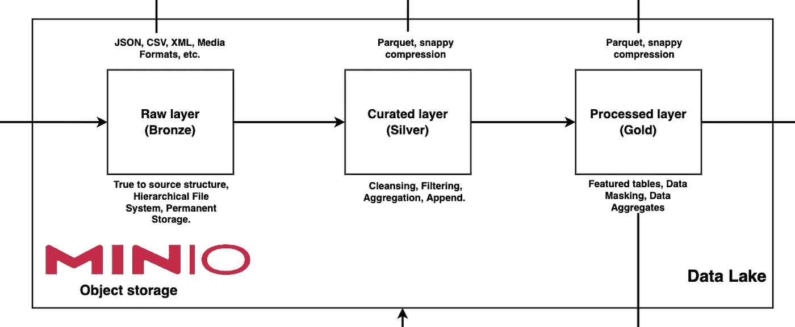
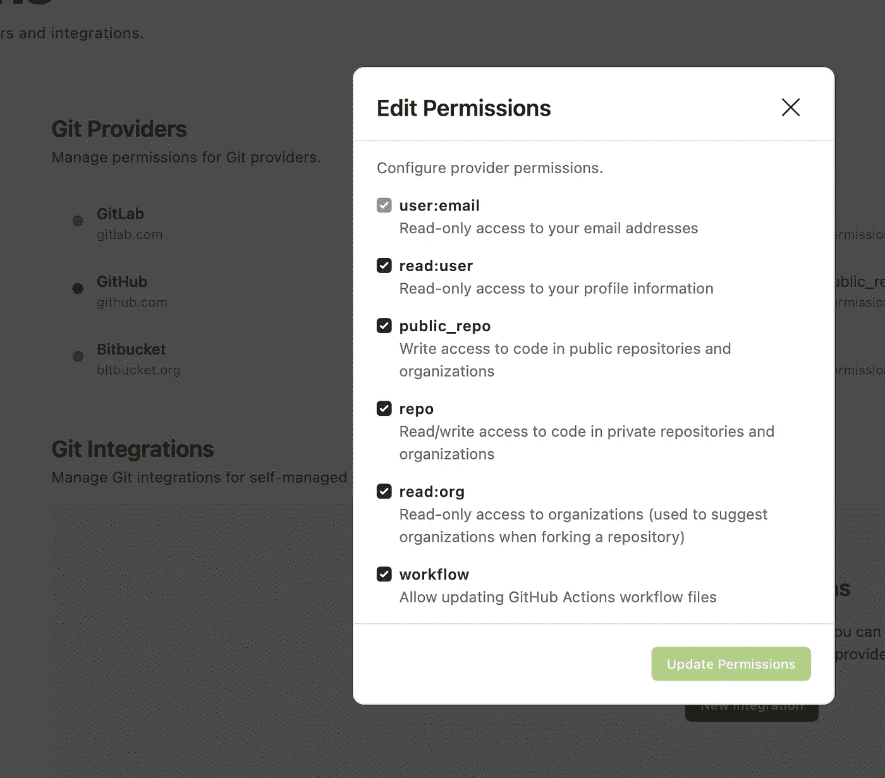
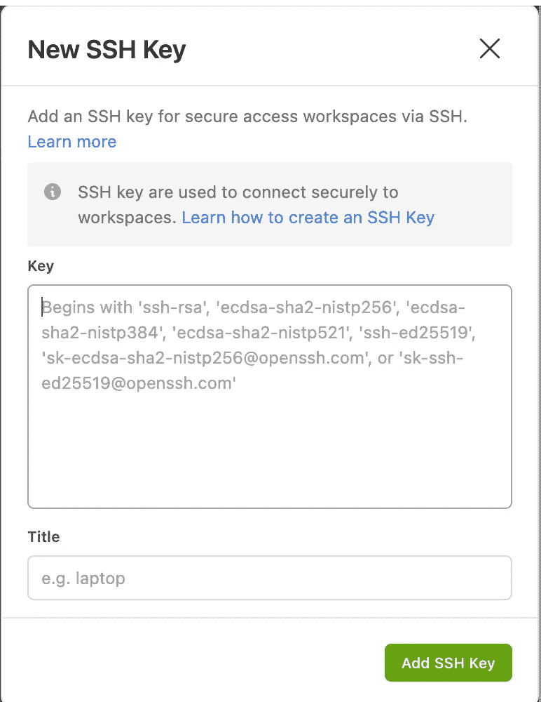

# 现代数据工程:用 Apache Spark 构建数据湖库—第 1 卷。

> 原文：<https://blog.devgenius.io/modern-data-engineering-building-a-data-lakehouse-with-apache-spark-vol-1-853f0882862b?source=collection_archive---------2----------------------->


数据湖房屋架构:[奥拉迪马吉奥拉德波](https://www.linkedin.com/in/dimeji-oladepo?miniProfileUrn=urn%3Ali%3Afs_miniProfile%3AACoAAB3RzTEBXllyinnGGxqlcQEEyb-2TOjpspU&lipi=urn%3Ali%3Apage%3Ad_flagship3_search_srp_all%3Bf0UpFqnuS5C2OtcEwqGpWg%3D%3D)。

欢迎乘坐绿洲航空公司航班的每一位乘客和机组人员，请让我们的数据专家做好准备，他们将系好安全带，踏上数据工程范式转变之旅。

# 先决条件

*   欢迎阅读这个两部分系列的第 1 卷。
*   在第一部分中，我们将介绍一种新的数据工程方法，包括传统的`*Enterprise Data Warehouse*`和`*Data Lake*`技术向新的`***Data Lakehouse***`范式的演变，这种范式结合了以前的架构和巨大的技巧。
*   接下来，我们将分解`***Data Lakehouse***`架构，以便您熟悉生态系统中的服务，以及它们将如何在项目的整体环境中使用。
*   最后，我们将通过向您展示如何设置用于开发项目的集成开发环境 [Gitpod](http://gitpod.io) 来结束第 1 卷。
*   在本系列的第 2 卷中，我们将解释如何在我们的数据工程生态系统中配置服务以相互通信，以及如何创建模板，通过这些模板，您可以在平台上实现自己的数据项目、概念验证和测试。
*   我们正在构建的数据湖库在很大程度上利用了 Apache Spark。 [Apache Spark](https://medium.com/@le.oasis/getting-started-with-apache-spark-sparksql-scala-with-mac-terminal-b9c9513c51f1) 是一个用于大规模数据处理的开源统一分析引擎，它为集群编程提供了一个接口，包括数据并行和容错。我们已经在这篇[文章](https://medium.com/@le.oasis/getting-started-with-apache-spark-sparksql-scala-with-mac-terminal-b9c9513c51f1)中介绍了 Apache Spark 的理论和应用。
*   在以前的文章中已经很好地记录了[数据湖](https://medium.com/@le.oasis/data-engineering-for-beginners-data-lake-and-data-warehousing-2440a91f5990)和[数据仓库后](https://medium.com/@le.oasis/data-engineering-for-beginners-data-lake-and-data-warehousing-2440a91f5990) se 的定义，请查看这些内容以了解本报告的“**什么**”&**为什么**”的要点。

简单来说；

*   `Data Warehouse`充当急需的中心`database`(通常是关系型的、非事务型的`database`)，在这里*数据分析师*或不同的人物角色将运行他们的商业智能查询并生成见解。我们将使用 PostgreSQL 作为我们的数据仓库。
*   `Data Lake`本质上是一个中央存储库，您可以在其中安全地存储各种规模的各种类型的数据，以便进行处理和分析。我们将使用`[Minio S3 Object Storage](https://min.io/)`作为我们的数据湖，即(我们孤岛式数据的中央存储库和真实来源)。
*   该解决方案的最终用户将是数据消费者，如数据分析师、数据科学家、商业智能工程师和组织内的任何其他数据消费者。
*   我将要与您分享的内容是数据工程实践所独有的，所以请耐心阅读本文。
*   完全实现和理解这个数据湖的发展需要时间，但你在这里的事实意味着你对洞察力持开放态度，感谢你的时间，让我们直奔主题。

# 根本性的变化

## 数据工程背后的动机

*   简单来说；我们将开发一个统一的数据分析平台，促进商业智能、数据分析、机器学习等。
*   想象一下一个本地数据工程沙箱，其中有服务从不同来源获取数据，将数据存储到一个中央存储库(数据湖)，执行转换，然后按照 **ETL** 流程的顺序将数据分组到不同的层。

# 介绍数据湖库范例

*   一个新的范式需要出现，这个范式的核心是*纪律严明，边缘是*。


数据湖+ EDW =数据湖。

*   一个架构完善的数据湖库提供了四个关键优势。

1.*它从结构化和非结构化数据中获得* ***洞察力*** *。*

2.*它迎合了*组织的 ***不同角色*** *:数据湖库迎合了一系列组织角色，满足了他们对洞察力的需求。一个数据科学家应该有一个测试他们假设的平台。分析师应该能够使用他们选择的工具来分析数据，而业务用户应该能够准确及时地获得他们的报告。它使数据民主化，便于分析。*

3.*它有助于采用健壮的* ***治理*** *框架*:数据湖库架构努力达到治理平衡。它寻求通过访问正确的利益相关者来实现正确数据类型的正确治理。

4.*它利用了* ***云计算*** :数据湖库架构需要敏捷和创新。该模式需要适应不断变化的组织需求，并减少数据到洞察的周转时间。为了实现这种敏捷性，采用云计算技术势在必行。云计算平台提供了所需的创新性。它提供了具有可扩展性和灵活性的适当技术堆栈，并满足了现代数据分析平台的需求。

# 乐建筑

我们已经讨论了一个`Data Lakehouse`系统环境。现在让我们开始开发一个逻辑数据仓库`Architecture`。一个逻辑架构关注于那些为满足特定的**功能需求** ( `**FRs**`)和**非功能需求** ( `**NFRs**`)而集成的组件。

*   它被抽象到一个与技术无关的层次，并专注于组件功能。
*   逻辑架构关注两种需求，如下所示:

`**FR**`是满足特定业务或领域驱动行为的需求。这些需求是由特定业务功能的任务和需求驱动的。

> 💡与业务相关的↔功能要求

一个`**NFR**`是一个需求，它指定了系统在特定的上下文中需要满足的标准。例如，典型的 NFR 包括特定查询预计完成的时间、数据加密要求等等。

> 💡与技术/开发人员相关的↔非功能性要求

一个**良好架构的系统**确保它的架构满足`NFR`而没有太多的折衷。下图描述了一个`Data Lakehouse`的逻辑架构:


# 技术堆栈

如上图所示，数据湖库体系结构有几个层，它们交织在一起形成一个架构良好的数据湖库。

现在让我们详细研究一下每一层。

## 数据接收层{ [Apache Nifi](https://hub.docker.com/r/apache/nifi) }

*   这一层是数据仓库的外部数据提供者之间的集成点。这个项目的摄取工具是 Apache Nifi。

## 数据湖层{ [MinIO](https://hub.docker.com/r/minio/minio/) }

*   一旦数据接收层接收了数据，就需要将数据放入存储中，并且需要对其执行各种转换，以转换数据供消费。最后，数据被锚定在数据湖中。
*   你知道苹果产品有 iCloud storage，Google Drive 云存储等等，Minio S3 对象存储的工作方式与此类似，它是亚马逊 S3 云的一个版本，不需要 AWS IAM 用户登录。
*   MinIO 将作为我们所有数据的中央存储库。

> `MinIO`提供高性能、S3 兼容的对象存储。也就是说，我们可以使用任何为 AWS S3 和 MinIO 开发的连接器。这允许我们在本地开发对象存储的概念验证——而不必在 AWS 上托管(并支付)实际的 S3 存储桶——如果我们愿意，以后可以用实际的 S3 存储桶无缝地替换连接。

数据湖层有三个重要的存储类别，如下所述:



**原始层**:

*   来自数据提供者(Nifi/外部来源)的数据存放在反映其出处(例如，时间和来源)的文件夹(**青铜**)中。
*   顾名思义，数据(`.csv` / `.json` / `.parq` )以其自然形式存储在原始数据存储中，因此数据忠于其源格式、结构和内容。有时也称为原始区或暂存区，用于存储原始的摄取数据。

**始乱终弃层**:

*   这一层(**银**)包含原始数据的净化、聚集、丰富和其他处理版本。
*   我们所有的转换都将被写入`Curated` 文件夹。

**处理过的图层**:

*   这一层(**金色**)表示它包含的数据已经可以生产，或者`cleansed`表示数据已经通过数据质量工具和/或监管流程运行，以清理(或清除)数据质量问题。

## 数据处理层{ [阿帕奇火花](https://hub.docker.com/r/bde2020/spark-master) & [阿帕奇气流](https://hub.docker.com/r/apache/airflow)

*   需要对数据进行转换或处理，以便用于洞察。数据处理服务执行的工作是将获取的数据转换成我们可以提供给利益相关者的形式。
*   从计算的角度来看， **Apache Spark** 是 Lakehouse 所有东西的黄金标准。它是一个多语言引擎，用于在单节点机器或集群上执行数据工程、数据科学和机器学习，在 Databricks 和 Synapse Analytics 中非常流行，通常为 Lakehouse 的计算提供支持。

> 由于其模块化的架构，Airflow 是可扩展的，并使用消息队列来编排任意数量的工作人员。它的管道是用 Python 编写的，这意味着它允许从代码中动态创建管道，并且可以通过自定义操作符进行扩展。它的 web 用户界面很实用，可以访问管道的所有部分:从源代码到日志。

您可以在下图中看到构成该图层的服务:


## 数据服务层{ [PostgreSQL](https://hub.docker.com/_/postgres/) }

*   我们将使用 PostgreSQL 作为一个对象关系数据库。
*   数据一经处理，就需要提供给下游消费。
*   PostgreSQL 是一个强大的开源对象关系数据库系统，它在可靠性、功能健壮性和性能方面享有盛誉。
*   为了支持下游消费，PostgreSQL 还将充当我们的**数据仓库**。

## 数据分析层{ [Jupyter 笔记本](https://hub.docker.com/r/jupyter/pyspark-notebook) }

*   数据分析层涉及从数据中提取洞察力的服务。
*   它们充当分析师、数据科学家和 BI 用户创建报告、执行分析和试验 AI/ML 模型的游乐场。
*   在这里，您可以使用 Spark 通过 dockerized Jupyter 笔记本实例连接到 Minio S3 和我们的 Postgres 实例。实现将在第 2 卷中显示。
*   您可以在下图中看到构成这一层的服务:


## 数据安全和治理层{ [Apache Ranger](https://ranger.apache.org/#:~:text=Apache%20Ranger%E2%84%A2%20is%20a,a%20true%20data%20lake%20architecture.) }

*   *垃圾入，垃圾出*的原理也适用于数据仓库。数据仓库中的数据需要得到适当的治理，这一层负责这一点。
*   我们将利用 Apache Ranger 作为框架来支持、监控和管理整个数据湖平台的全面数据安全。

很好，现在我们已经定义了系统架构，让我们开始进入我们的开发环境。

# 使用 Gitpod 的现代数据工程

*大家好，欢迎来到这个关于完美的基于云的数据工程解决方案的简短总结—* `[*Gitpod*](https://gitpod.io/)` *。*

 [## 仪表板- Gitpod

### 编辑描述

gitpod.io](https://gitpod.io/) 

# 什么是`Gitpod`？

*   `[Gitpod](https://gitpod.io/)`是一个在线集成开发环境，可以从任何 GitHub 页面启动。
*   几秒钟之内，`Gitpod`就为您提供了一个完整的工作开发环境，包括一个 VS 代码驱动的`IDE`和一个**基于云的** Linux 容器，它们是专门为手头的项目配置的。
*   `Gitpod`是一个开源的 Kubernetes 应用程序，在您的浏览器中提供预构建的协作开发环境——由`VS Code.`提供支持

# 问题陈述

*   **Oasis** **公司**的数据工程团队负责为一家石油&天然气客户开发内部数据仓库解决方案。
*   该项目包括使用`Docker`作为我们的主要开发环境。Docker 使用图像、卷和`Dockerfiles`来执行代码进行开发。
*   平均而言，一个数据湖和数据仓库环境的设置将占用笔记本电脑上至少 20 GB 的内存和超过 60%的系统 RAM。
*   添加更多的服务和容器将需要一个具有大量 RAM 和内存的健壮系统，而我们没有这些资源。
*   此外，在不同系统上运行`Docker`会导致操作系统不一致，我们注意到较新的 M1 Macbook Pros 有 docker 映像问题，并且`Docker`应用程序无法在开发环境中执行 Spark 作业。
*   我们使用 Airflow 作为我们的主要调度工具，在使用 Spark、Postgres、Minio 和其他扩展构建 airflow 服务的过程中，数据工程团队经历了 30–40 分钟的映像构建等待，这使得开发过程非常繁琐，调试非常困难。
*   当我们在彼此的笔记本电脑上部署代码时，我们还经历了系统过热、持续崩溃和操作系统不一致。
*   开发人员仍然在他们的本地机器上管理开发环境。他们经常花时间等待测试或构建完成，而不是编码。
*   如果有一个**加速开发**，更快地下载图像和服务，鼓励协作并防止操作系统不一致，会怎么样？

# 介绍`Gitpod`

*   从最纯粹的意义上来说，`Gitpod`是 Data Lakehouse 项目的一个基于云的 Docker 解决方案。
*   `Gitpod`是一个真正的开源和社区驱动的解决方案。它神奇地快速旋转，可以自托管，并且是唯一一个独立于供应商的解决方案，几乎可以与任何云提供商和代码托管平台一起工作，包括 [GitLab](https://gitlab.com/) 、 [GitHub](https://github.com/) 和 [Bitbucket](https://bitbucket.org/) 。
*   `[Gitpod](https://www.gitpod.io/)`消除了设置和管理复杂开发环境的繁琐耗时的任务。`Gitpod`将[开发环境的承诺作为代码](https://www.gitpod.io/blog/dev-env-as-code/)交付，并提供完全预构建的安全环境，因此个人开发人员和团队可以立即高效工作。
*   自从在数据仓库项目中采用`Gipod`以来，该团队的生产力和开发能力提高了 5 倍，我们已经能够成功地将 Spark 集成到我们的数据管道、Apache Nifi、Airflow、Minio、Postgres 和其他关键服务中。所有这些都在几分钟内完成。
*   `Gitpod`的采用让工程实习生更擅长调试错误，尝试新的数据仓库方法，并扩展他们对数据工程的一般知识。
*   `Gitpod`自带浏览器版 VS 代码，内部预建 Docker 设置，一举两得。
*   总的来说，它让开发人员在大型项目上的工作变得更加轻松。

# `Getting Started with Gitpod`。

# 第 0 步:登录。

*   要开始，请前往登录页面。

 [## 仪表板- Gitpod

### 编辑描述

gitpod.io](https://gitpod.io/login/) 

*   决定你想使用哪个平台，在本教程中，我们将使用 Github。


# 第一步:授予权限。

*   这一步将允许您直接从 Gitpod 工作区向 GitHub 发出推/拉请求。
*   导航到👉🏼

`Settings` → `Integrations` → `Git Providers` → `Github` → `Actions Button.`



# 步骤 2:设置 SSH 密钥。

*   这将使你能够在 VS Code Desktop 上工作，以防你厌倦了使用浏览器。
*   我们将在本地制作 SSH 密钥并匹配 Gitpod 上的密钥。下面有更多关于 SSH 的内容，但是如果你熟悉 Git，你应该会明白“ **why** ”我们正在使用 SSH 键。

[](https://docs.github.com/en/authentication/connecting-to-github-with-ssh/generating-a-new-ssh-key-and-adding-it-to-the-ssh-agent) [## 生成新的 SSH 密钥并将其添加到 ssh-agent - GitHub 文档中

### 您可以使用 SSH(安全外壳协议)访问和写入 GitHub.com 上的存储库中的数据。当您通过…连接时

docs.github.com](https://docs.github.com/en/authentication/connecting-to-github-with-ssh/generating-a-new-ssh-key-and-adding-it-to-the-ssh-agent) 

*   对于初学者来说，只需要把它看作一个证书，告诉你的 IDE，“*好了，你有权限远程访问这个工作区了*”。
*   要生成一个新的 SSH 密钥，请在本地。

```
ssh-keygen -t ed25519 -C "*your_email@example.com*"
```

*   按回车键，然后再次按回车键，将公钥/私钥对保存到所需的文件夹中。{ *如果你迷路了，你可以点击上面的*[*Github*](https://docs.github.com/en/authentication/connecting-to-github-with-ssh/generating-a-new-ssh-key-and-adding-it-to-the-ssh-agent)*链接*
*   导航到`.`文件夹，你保存你的密钥，对于 Mac 用户，前往你的个人文件夹🏡点击`shift 🔼 + cmd + .` 显示隐藏的文件夹{因此下面是灰色的}。


*   打开以结尾的 ssh 密钥文件{带有文本编辑}。pub { **public key}** ，然后复制该文件的内容，包括您的电子邮件地址。
*   前往👉🏼

`Gitpod` → `SSH Keys` → `New SSH Keys` 粘贴公钥。



# 第三步:开发环境。

*   太好了，到目前为止你都很棒，现在是重要的时候了。
*   前往 GitHub 并创建一个名为'`modern-datalake`'的新存储库


*   导航回👉🏼

`Gitpod` → `Workspaces` → `New Workspace`粘贴新建库的 URL。


*   等待它初始化。

# 第四步:全部完成！

*   瞧，我们的数据湖库有了一个全功能的集成开发，包含了 Docker 扩展和 VSCode 云实例。干净利落。


# 结论{Gitpod}

*   `Gitpod`不是又一个云 IDE，旨在替代桌面开发。
*   相反，`Gitpod`是 GitHub 的自然扩展。GitHub 有限的编辑能力经常迫使上下文切换到我们的本地机器。`Gitpod` **延长我们在 GitHub 上的寿命**。
*   `Gitpod`将工程团队从手动设置本地开发环境的摩擦中解放出来，节省了数十个小时，并实现了新水平的协作，从而比以往任何时候都更快地创建应用程序。
*   另外，`Gitpod`非常简单:您不需要使用铺天盖地的复杂仪表板来维护您的项目或工作区。相反，任何配置都安全地存储在 GitHub 上并进行版本控制。
*   要编辑您的代码，您可以使用浏览器中的 [**VS 代码**](https://www.gitpod.io/docs/ides-and-editors/vscode-browser) ， [**VS 桌面上的**](https://www.gitpod.io/docs/ides-and-editors/vscode) 代码，并通过[**JetBrains Gateway**](https://www.gitpod.io/docs/ides-and-editors/jetbrains-gateway)使用 JetBrains IDE

# 结束语

在本系列的这一部分中

1.  我们在数据工程中引入了一个新的范例。
2.  我们强调了数据湖库架构的关键部分。
3.  我们和`Gitpod`一起建立了一个基于云的开发环境，让我们的基础设施开始运行。

艰难的工作已经完成——在本系列的下一篇文章中，我们将介绍功能并开始开发一个数据工程生态系统，该生态系统支持不同数据服务通过共享网桥进行通信和交互。

## 与绿洲连接

[](https://github.com/le-oasis) [## 乐绿洲-概述

### 一个数据专家，擅长应用 Python 库，如 Numpy 和 Pandas，以实现标签化工程…

github.com](https://github.com/le-oasis) 

## 你喜欢这个报告吗？

[](https://www.buymeacoffee.com/le.oasis) [## 马哈茂德·奥因洛耶

### 数据科学家。作家。爱人。

www.buymeacoffee.com](https://www.buymeacoffee.com/le.oasis) 

💌[提交您的反馈](mailto:oyinlola14@gmail.com)

敬请关注我在[媒体](https://medium.com/@le.oasis)上的更多文章！