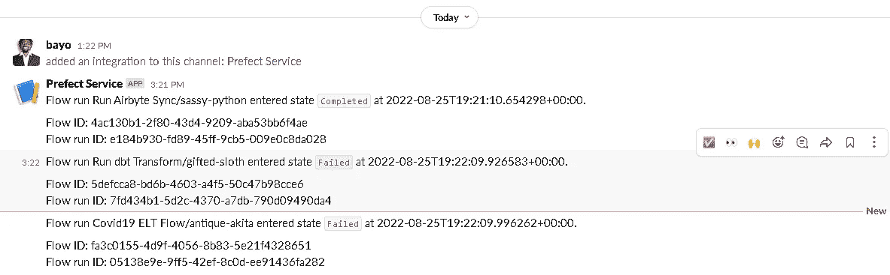

# 具有 Prefect 2.0、Airbyte 和 dbt 的现代数据编排堆栈

> 原文：<https://blog.devgenius.io/modern-data-orchestration-stack-with-prefect-2-0-airbyte-and-dbt-e7c0e9b27add?source=collection_archive---------2----------------------->

## 使用公开的新冠肺炎数据。

特伦斯·伯克在 [Unsplash](https://unsplash.com?utm_source=medium&utm_medium=referral) 上的照片

在上一篇文章中，我探索了一个包含 Airbyte、Snowflake 和 dbt 的现代数据集成堆栈。在本文中，我将通过引入**编排**来进一步探索现代数据堆栈。在这个更高层次的抽象层中，我集成了[perfect 2.0](https://www.prefect.io/opensource/v2/)，来处理 ELT 管道的工作流。因为这篇文章是上一篇文章的延续，所以我使用了相同的数据，公开可用的来自 Google BigQuery 公共数据集项目的[新冠肺炎数据。](https://console.cloud.google.com/marketplace/product/bigquery-public-datasets/covid19-public-data-program)

 [## 具有 Airbyte、Snowflake 和 dbt 的现代数据集成堆栈

### 使用公开的新冠肺炎数据

medium.com](https://medium.com/@adebayoadejare/modern-data-integration-stack-with-airbyte-snowflake-and-dbt-795fdecf2035) 

**设置**

在进入**流程**之前，我将描述整个编排的架构和设置。我使用 [Docker](https://www.docker.com/) 容器来为 Prefect 和 dbt CLI 安装 Airbyte 和 python pip。我用雪花做数据仓库。我使用 [Prefect 2.0 Orion 用户界面](https://docs.prefect.io/ui/overview/)来监控流的状态并配置相关的通知。主流程包含一个空气字节**提取和加载**增量同步子流程以及一个 dbt **转换**子流程。一旦流进入完成状态，它将发送一个松弛通知。

*   提督 2.0 版本 2 . 1 . 1；提督-air byte v 0 . 1 . 0；提督-dbt v0.2.0
*   Airbyte 版本 1.2.3
*   dbt CLI:dbt core v 1 . 2 . 0；dbt-雪花 1.2.0 版

作者图片

## **编排**

我将整合一个完美的流程与现有的 ELT 管道。完美的哲学是建立在最小化负面数据工程的基础上的。在工作流程中，这些都是失败的场景，通常是消耗主要“正面”数据工程目标的努力的意外事件。

> perfect Workflow Orchestration tool 是建立在提高数据工程生产力的基础上的，它可以更容易地减轻负面的工程失败场景。

这意味着使用 Prefect 工具实现防御性编程模式相对简单直接，通常采用单行代码或函数参数的形式。我实现的完美流将有两个子流，对于这两个子流，我都实现了完美集合。级长集合包含预定义的任务，通常由级长团队维护。

1.  提取和加载:我使用 [Airbyte 集合](https://prefecthq.github.io/prefect-airbyte/)定义了一个子流。这个流程将触发数据集的手动增量同步任务，我从流行病学数据集开始，因为这个特定的同步容易失败，可以很容易地重写以包括其他数据集。我将该任务设置为失败时重试 3 次，重试延迟为 300 秒。我还为任务添加了一个“sync”标签，在配置通知时可能会用到这个标签。
2.  转换:我使用 [dbt 集合](https://prefecthq.github.io/prefect-dbt/)定义了一个子流程，从下面的预定义 repo 运行 dbt 转换项目。该任务同样配置了 2 次重试和 30 秒重试延迟，同样，我添加了“transform”标签。

 [## GitHub-BayoAdejare/airbyte _ dbt _ covid 19:雪花数据仓库的 dbt 转换。

### 雪花数据仓库的 dbt 改造项目。对分段雪花数据执行基本转换…

github.com](https://github.com/BayoAdejare/airbyte_dbt_covid19) 

对于自定义的 Slack 通知，这将发送复制和转换任务的结果，并将在 Prefect Orion UI 上配置。目前，我对运行、挂起或其他状态不感兴趣，只关心完成或失败时的通知。

提督 2.0 任务状态(图片由提督提供)

## 定义流程

由于工作流很简单，python 脚本将使用函数而不是类来编写。我创建了一个编排文件`elt_flow.py`来处理流配置和定义。在这个文件中，我定义了前面描述的两个子流函数，并将它们添加到主流函数中。

编排 ELT 流程定义(按作者)

## 配置通知

`If a run of any flow with a sync or transform tag enters Completed or Failed state, send a notification to **Slack**`

我将为上面的语句实现通知或类似的东西，为了让通知工作，我首先需要生成一个 Slack webhook。我为一个 Slack 应用程序这样做，我将它配置为一个 Slack bot，在一个特定的工作空间上使用，允许访问一个通道，我省略了这个细节，因为这不是本文的重点。

我运行下面的命令`prefect orion start`来查看完整的仪表板 UI，从 UI 中，我能够导航到侧面板中的通知选项并配置 Slack 通知:

从 Prefect Orion UI 添加松弛通知(按作者)

我为 to Airbyte 复制和 dbt 转换流中的任务的`Completed`或`Failed`状态配置通知。这导致这些结果状态的以下松弛通信:

松弛频道中的完美服务通知(按作者)

**总之**

如图所示，Prefect 通过无缝轻松地实现负面工程模式节省了开发时间和精力。例如，我能够用 python decorators 在增量同步和转换任务上实现重试和延迟机制。此外，通过使用集合和标签，我能够轻松地从 Orion 的直观用户界面配置各种通知场景，从而最大限度地减少负面工程，让更多的资源专注于主要目标。

注意:

*   在[雪花数据交换这里](https://www.snowflake.com/news/starschema-brings-single-source-of-truth-for-covid-19-incidence-data-to-snowflake-data-exchange/)一个类似的[工作流编排与气流但是有更多公共数据源](https://github.com/starschema/COVID-19-data)的新冠肺炎案例由 [Starschema](https://starschema.com/) 完成。
*   如果您不熟悉完美编排，请查阅[完美文档](https://www.prefect.io/guide/blog/introducing-prefect-2-0)。
*   [示例教程](https://airbyte.com/tutorials/elt-pipeline-prefect-airbyte-dbt)来自 Airbyte，具有类似的工作流程编排。
*   完善关于[通知](https://docs.prefect.io/ui/notifications/)的文档。

***感谢*** *的阅读！如果你想与我取得联系，请随时联系我在 adebayo.adejare@gmail.com 或我的* [*领英简介*](https://www.linkedin.com/in/adebayoadejare/) *。也可以在我的*[*Github*](https://github.com/BayoAdejare)*中查看部分代码。*