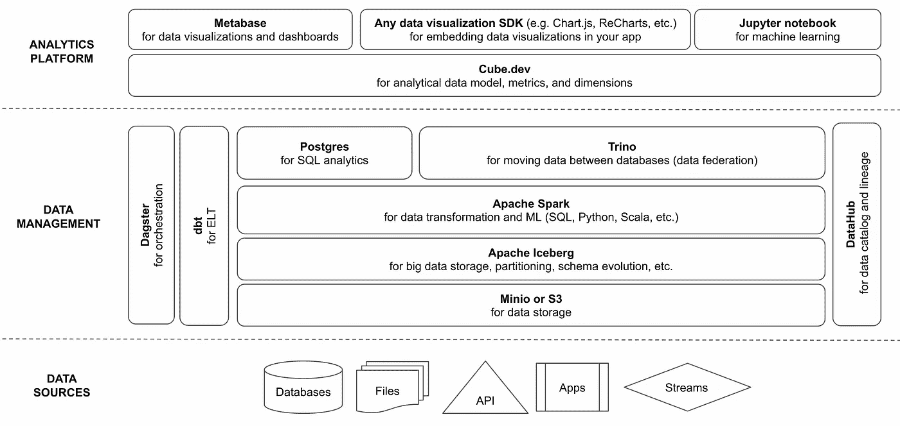
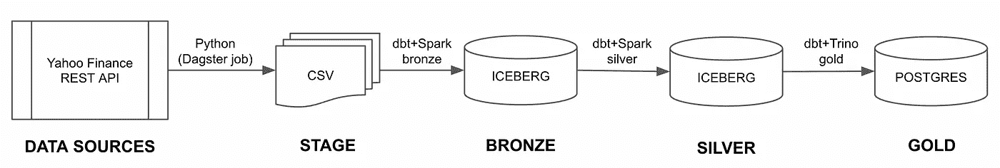
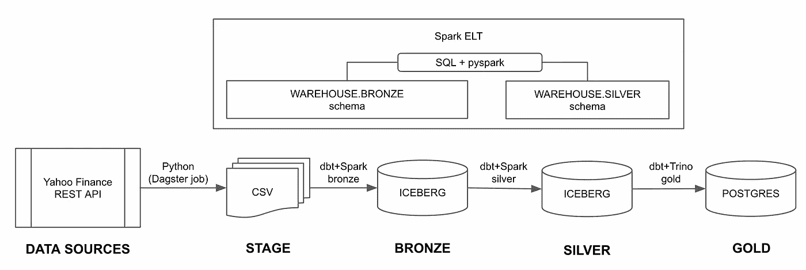
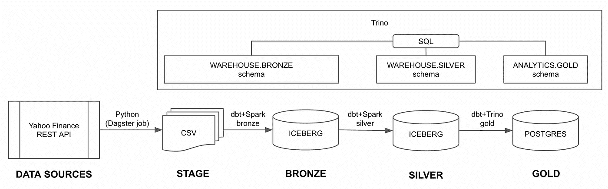
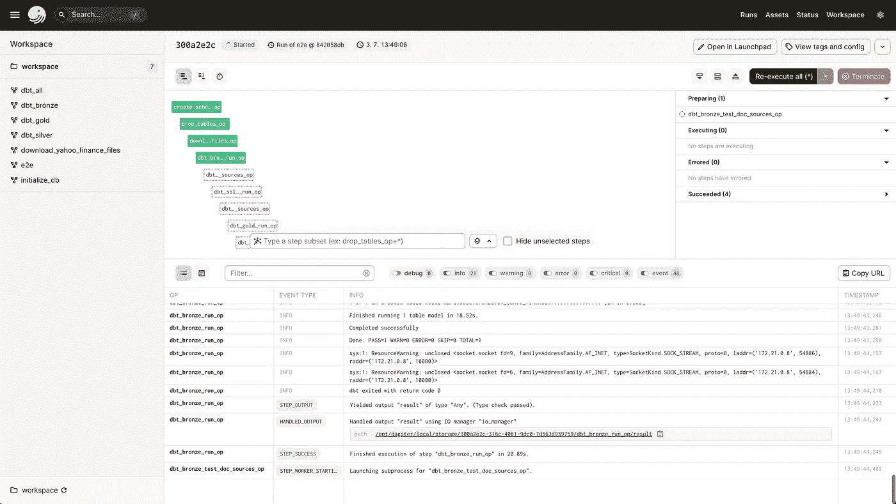
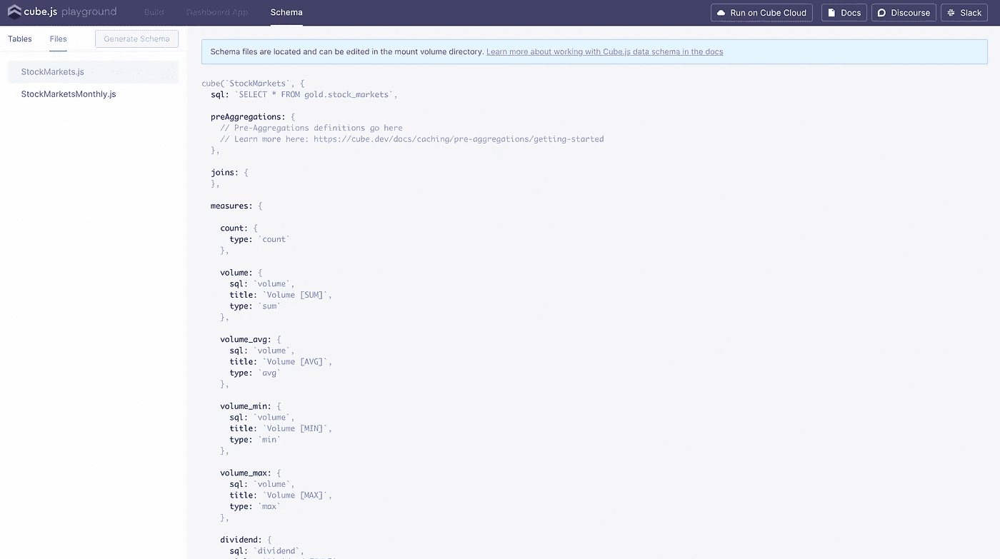
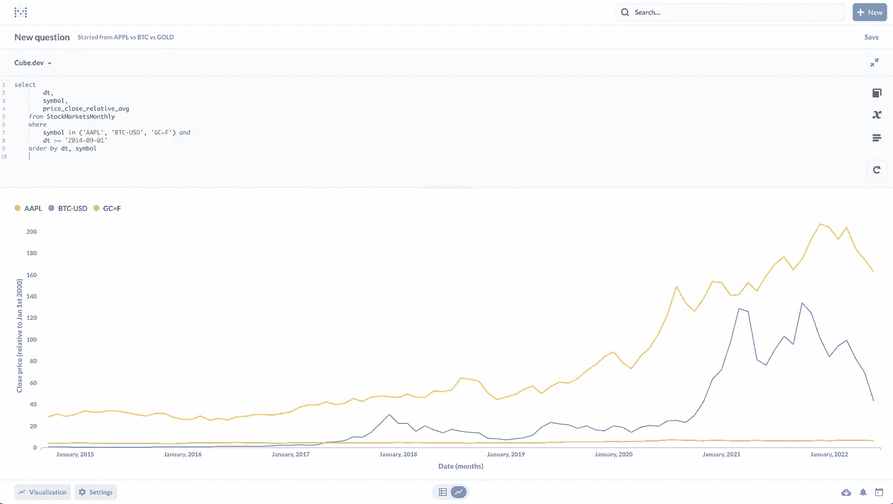
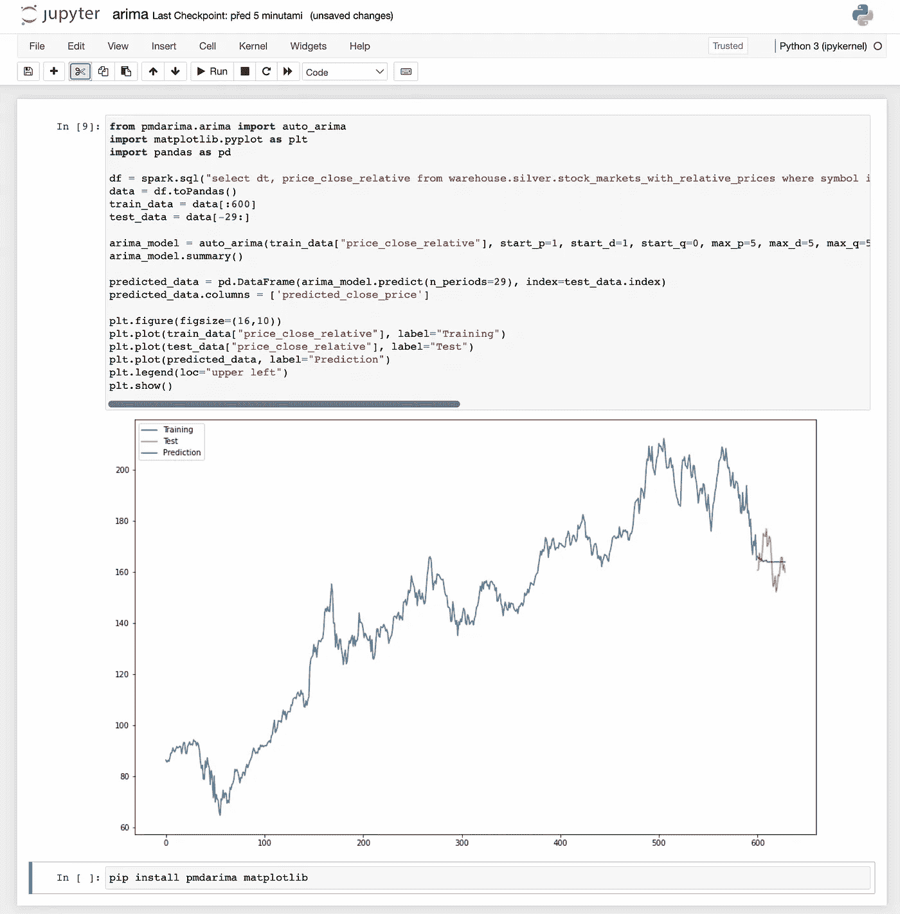

# Iceberg + Spark + Trino + Dagster:现代开源数据堆栈演示

> 原文：<https://blog.devgenius.io/modern-data-stack-demo-5d75dcdfba50?source=collection_archive---------0----------------------->

我在两个月前组装了这个**ngods**(**n**ew**g**generation**开源**dATA**s**tack)并在此后的两个项目中使用了它。

ngods 架构

我发现数据堆栈可以很好地从小数据(几 GB)扩展到中等大小的数据(几百 GB)。它也比基于使用定价的云数据栈便宜得多(例如，雪花、红移或 BigQuery)。

我创建了一个简单的演示来展示它的能力。您可以将它作为自己项目的起点。

这个演示可以在这个 [GitHub 库](https://github.com/zsvoboda/ngods-stocks)中找到。它从 Yahoo Finance API 中检索选定的股票代码数据历史，将其存储在数据仓库中，对其进行转换，并为机器学习预测和数据可视化提供分析模型。

该演示使用 [medallion 架构](https://databricks.com/fr/glossary/medallion-architecture)和三个数据阶段:青铜级、白银级和黄金级。

圆形建筑

*   **青铜**数据级以其原始数据源的形式存储数据。这个阶段使用 [Apache Iceberg](https://iceberg.apache.org/) 进行数据存储。
*   **银**数据阶段存储清理和转换后的数据，这些数据混合了来自铜阶段的原始数据。这个阶段也用[阿帕奇冰山](https://iceberg.apache.org/)。
*   **黄金**数据阶段实现分析模型(维度、事实等。).我决定在这个阶段使用 Postgres 数据库。

ngods 数据栈使用 [dbt](https://www.getdbt.com/) 进行数据转换。dbt 在 [Apache Spark](https://spark.apache.org/) 中执行 SQL，用于青铜级和白银级的数据转换。

Apache Spark 在青铜级和白银级数据阶段执行数据转换。

dbt 必须在白银和黄金数据阶段之间移动数据，因为黄金阶段使用 Postgres。我决定使用 [Trino](https://trino.io/) 将 Apache Iceberg 和 Postgres 中的所有 medallion 数据阶段映射到一个数据库中的模式。

Trino federates 访问所有 medallion 数据阶段。

ngods 使用 [Dagster](https://dagster.io/) 来编排数据仓库初始化、股票数据下载和 dbt 数据转换。我喜欢 Dragster 的 Python 代码的可扩展性。

Dagster 编排。

我用 [cube.dev](https://cube.dev/) 和 [Metabase](https://www.metabase.com/) 构建了分析层。Cube.dev 公开了一个具有维度和指标的无头分析模型。

Cube.dev 无头分析数据模型。

元数据库连接到此模型进行数据可视化(报告和仪表板)。

元数据库自助服务数据可视化。

我还用 [Jupyter 笔记本](https://jupyter.org/)进行未来股票走势的机器学习预测(ARIMA 时间序列模型)。

苹果(AAPL)股价走势预测与 ARIMA。

您可以通过几个 [**快速步骤**](https://github.com/zsvoboda/ngods-stocks) 运行此演示。