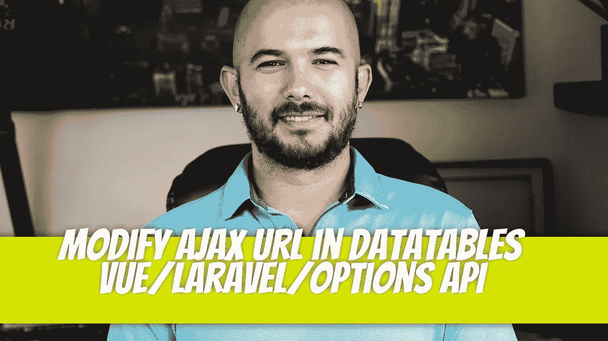

# 修改数据表中的 Ajax URL(Vue/Laravel/Options API)

> 原文：<https://blog.devgenius.io/modify-ajax-url-in-datatables-vue-laravel-options-api-fb0a9dc90576?source=collection_archive---------8----------------------->



一个并不完全不正常的请求进来了，但是却难倒了我几个小时。这不是什么革命性的东西。这是我以前用不同类型的实现做过的事情，但从来没有像这样。

请求是，“我们能不能添加一个下拉列表，这样当我们选择一个选项时，它只会将这些项目加载到数据表中。我们希望首先加载所有项目，然后如果我们需要进一步缩小范围，我们希望有这种能力。”

使用 Vue/jQuery 实现这一点非常简单。事实证明，用 Options API 实现它没有那么多好处。

 [## Vue3 组件

### 2022 年 11 月 11 日更新-为了与数据表 1.13 兼容，此处显示的组件已更新为…

datatables.net](https://datatables.net/blog/2022-06-22-vue) 

根据概述的文档，我们能够将数据表安装到我们的 Laravel/Vue 应用程序中。如果你想看的话，我写了一整篇文章。

[](/setting-up-laravel-9-x-with-vue-js-and-datatables-the-vue-approach-fb52dfc74f36) [## 使用 Vue.js 和数据表设置 Laravel 9.x 方法)

### 上次我们看了使用数据表 CDN 设置数据表。如果您阅读了数据表 Vue 文档…

blog.devgenius.io](/setting-up-laravel-9-x-with-vue-js-and-datatables-the-vue-approach-fb52dfc74f36) 

# 代码现在是什么样子

在我开始添加任何修改之前，这是代码的当前状态。

```
<template>
    <div class="p-6">
        <DataTable
            class="display"
            id="datatable"
            :columns="columns"
            ajax="api/users"
            ref="table"
            :options="{
                select: true,
                serverSide: true,
            }"
        >
            <thead>
            <tr>
                <th>ID</th>
                <th>Name</th>
                <th>Email</th>
                <th>Action</th>
            </tr>
            </thead>
            <tbody>
            </tbody>
        </DataTable>
    </div>
</template>

<script>
import DataTable from 'datatables.net-vue3'
import DataTablesLib from 'datatables.net';
import 'datatables.net-select';

DataTable.use(DataTablesLib);

export default {
    name: 'DataTableComponent',
    components: {DataTable},
    data(){
        return {
            columns: [
                {"data": "id"},
                {"data": "name"},
                {"data": "email"},
                {"data": "action", "sortable": false},
            ]
        }
    }
}
</script>

<style>
@import 'datatables.net-dt';
</style>
```

它从 api 加载数据，API 只从数据库表和编辑链接返回用户。


# 我们需要什么

读完这篇博文后，我意识到我需要使用`ajax.reload()`或者类似的东西。我发现可以用`ajax.url('api/route').load()`来改变数据内容。

文件指出:

```
let dt;
const table = ref(); // This variable is used in the `ref` attribute for the component

onMounted(function () {
  dt = table.value.dt();
});
```

他们有一个从数据表中删除一行的例子。类似的概念，我需要什么。我可以看到他们使用`dt.remove`。我只需要用`dt.ajax.url('api/route').load()`。

```
function remove() {
  dt.rows({ selected: true }).every(function () {
    let idx = data.value.indexOf(this.data());
    data.value.splice(idx, 1);
  });
}
```

整个事情中最大的问题是它是用组合 API 而不是选项 API 编写的。在 StackOverflow 甚至 DataTables 的论坛上花了一些时间才拼凑出一个答案。我将与你分享的答案。

简单的测试是一个名为 Change It 的按钮，当按下该按钮时会改变 ajax 端点，并将数据重新加载到数据表中。

# 解决方案

需要进行的修改包括:

*   将`ref()` 替换为`this.$refs`
*   使用`mounted()`方法代替`onMounted()`
*   在`mounted`方法中，使用`this.dt = this.$refs.table.dt()`。我在`data()`中添加了`dt`变量，这就是我需要使用`this.dt`的原因。
*   创建一个名为 changeIt 的方法，它可以导致 url 发生变化，`this.dt.ajax.url(‘api/users/user’).load()`。
*   创建一个按钮。

代码:

```
<template>
    <div>
        <h1>Simple table</h1>
        <button @click="changeIt">Change It</button>

        <DataTable
            class="display"
            id="datatable"
            :columns="columns"
            ajax="api/users"
            ref="table"
            :options="{
                select: true,
                serverSide: true,
            }"
        >
            <thead>
            <tr>
                <th>ID</th>
                <th>Name</th>
                <th>Email</th>
                <th>Action</th>
            </tr>
            </thead>
            <tbody>
            </tbody>
        </DataTable>
    </div>
</template>

<script>
import DataTable from 'datatables.net-vue3';
import DataTablesLib from 'datatables.net';
import 'datatables.net-select';

DataTable.use(DataTablesLib);

export default {
    name: "DataTableComponent",
    components: {DataTable},
    data(){
        return {
            columns: [
                {"data": "id"},
                {"data": "name"},
                {"data": "email"},
                {"data": "action", "sortable": false},
            ],
            dt: null,
        }
    },
    mounted() {
        this.dt = this.$refs.table.dt();
    },
    methods: {
        changeIt() {
            this.dt.ajax.url('api/users/user').load();
        }
    }
}

</script>

<style>
@import 'datatables.net-dt';
</style>
```

只是想我会分享这个，因为答案在网上任何地方都不清楚。


Dino Cajic 目前是 [Absolute Biotech](http://absolutebiotech.com/) 的 IT 主管，该公司是 [LSBio(寿命生物科学公司)](https://www.lsbio.com/)、 [Absolute Antibody](https://absoluteantibody.com/) 、 [Kerafast](https://www.kerafast.com/) 、 [Everest BioTech](https://everestbiotech.com/) 、 [Nordic MUbio](https://www.nordicmubio.com/) 和 [Exalpha](https://www.exalpha.com/) 的母公司。他还担任我的自动系统的首席执行官。他拥有计算机科学学士学位，辅修生物学，并拥有十多年的软件工程经验。他的背景包括创建企业级电子商务应用程序、执行基于研究的软件开发，以及通过写作促进知识的传播。

你可以在 [LinkedIn](https://www.linkedin.com/in/dinocajic/) 上联系他，在 [Instagram](https://instagram.com/think.dino) 上关注他，或者[订阅他的媒体出版物](https://dinocajic.medium.com/subscribe)。

阅读 Dino Cajic(以及 Medium 上成千上万的其他作家)的每一个故事。你的会员费直接支持迪诺·卡吉克和你阅读的其他作家。你也可以在媒体上看到所有的故事。