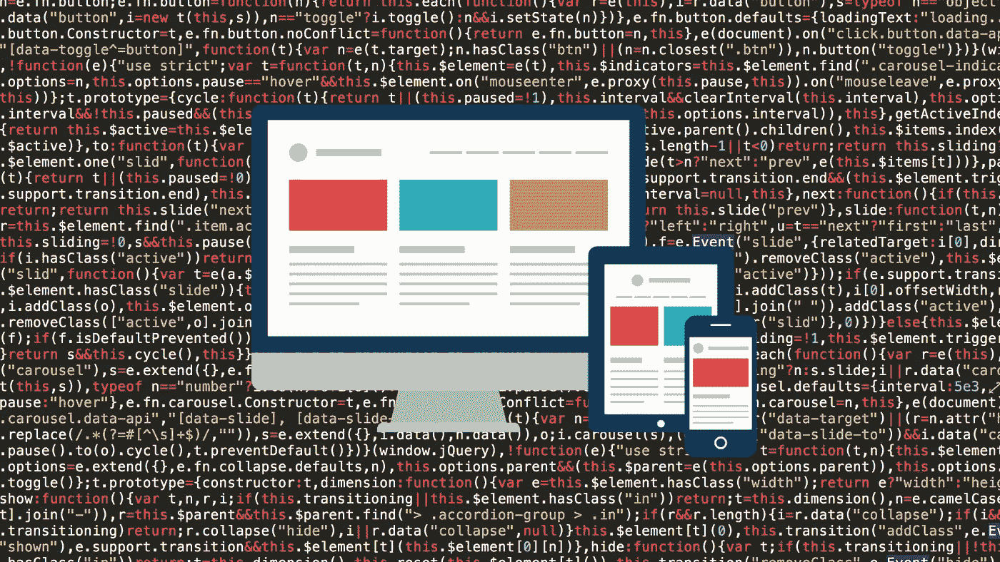
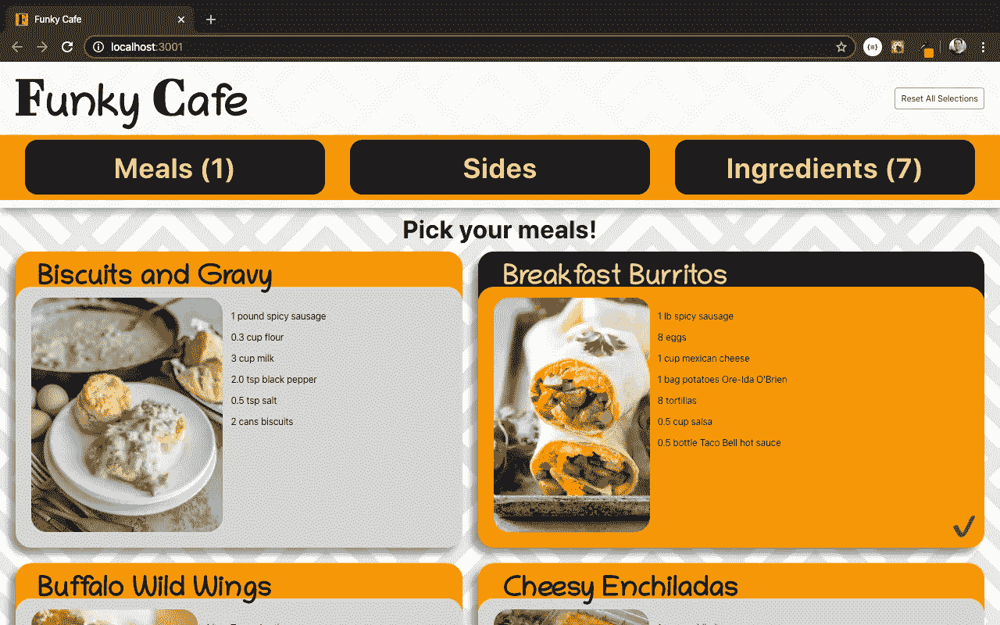
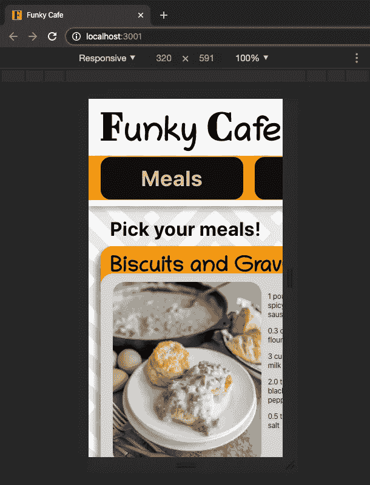
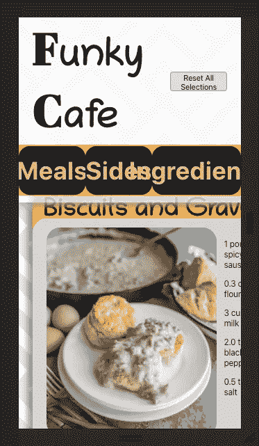
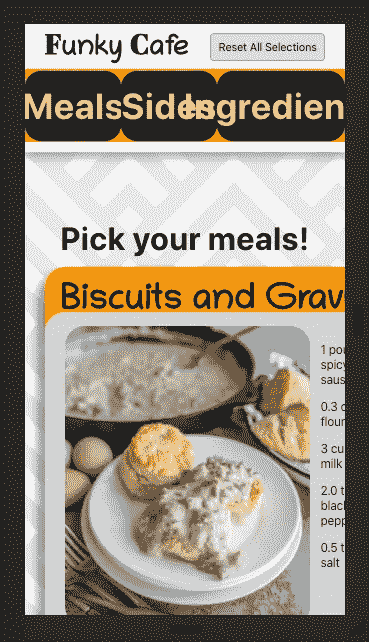
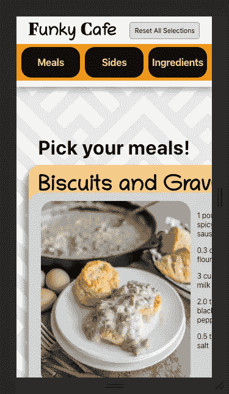
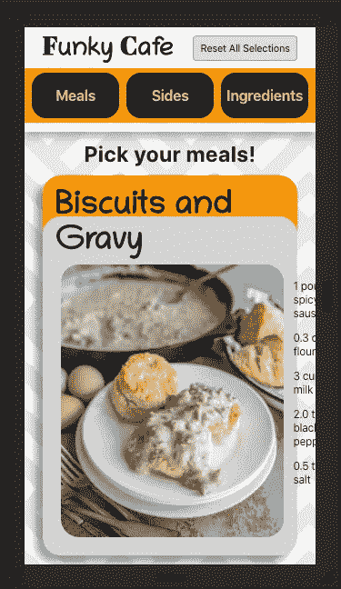
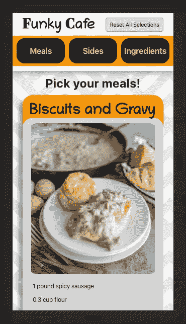

# 修改项目以响应媒体询问

> 原文：<https://blog.devgenius.io/modifying-a-project-to-become-responsive-with-media-queries-e555971d4098?source=collection_archive---------4----------------------->



最近，我花了很多时间在我的一个名为“时髦咖啡馆”的兼职项目上。这款应用的要点很简单。它允许我和我的妻子从我们最喜欢的食物列表中选择食物，然后我们为这些食物选择配菜，它在最终屏幕上显示出一页可打印的配料。

看一看:



不算太差！

我知道，我知道，永远首先为移动设计。我看到和听到了很多，但我没有听，现在我想让我的网站在每个屏幕尺寸上都好看。我一直在开发和设计 Funky Cafe，完全基于该应用的全屏渲染，这是一个在台式机或笔记本电脑上全屏显示的非常好的用户体验。然而，当我开始缩小屏幕尺寸时，我们可以开始看到问题的出现。

如果在移动设备上打开，下面是 Funky Cafe 的样子。



不太好！

我们可以看到样式没有改变，但这就是问题所在。我应用于桌面版本的样式并不能很好地应用于小屏幕。我在指定不同元素的大小时使用了像素，所以我的元素对于屏幕来说太大了。

那么我们能做什么呢？

**使用媒体查询断点！**

我将演示如何通过修改我的非响应性应用程序 Funky Cafe 来使用媒体查询，这样即使它在移动设备上打开也会很好看。这篇文章将审视我在尝试将桌面 web 应用程序转换为移动浏览器大小时的思维过程(说实话，这主要是 CSS 的修补)。我们将使标题和导航更好地适应，然后也解决上面图像中显示的“用餐”标签。

我了解到最常见的屏幕尺寸是 320 像素(手机)、768 像素(平板电脑)和 1200 像素(笔记本电脑)。通过修改手机版的 Funky Cafe，它将展示平板电脑所需的核心原则。

如果你想在阅读过程中看到应用的结构，这里的[是 Github 库。让我们在开始之前做一些计划。](https://github.com/tfunk2/funky_cafe)

## 开放式头脑风暴

以下是我认为需要解决的问题:

—所有内容都需要调整大小，我们将使用的断点(屏幕宽度)是 320px，因此所有内容都需要在这个小空间内很好地适应。

—许多元素的方向需要改变。例如，我们将把每一餐的配料表移到图片下面，并且我们将使所有的餐都流入一列而不是两列。

我认为，在牢记这两点后修改应用程序，我们将有一个更好看的移动设计，我们将在我们的道路上做出时髦的咖啡馆响应。

# 页眉

从最顶端开始，我们将使用类名`app-header`设置我们的头，其中包含标题、导航和重置按钮，以具有一个`max-width: 320px`。然后我们需要缩小标题，让我们的导航标签更合适。

下面是媒体查询本身的样子。我们需要把我们所有的手机样式放在里面，以便它只在屏幕尺寸小于或等于`320px`时使用:

```
@media only screen and (max-width: 320px) {

}
```

这允许我们为小设备改变我们的样式，但是为我们的大设备保持我们原来的样式。让我们从简单地使标题适合屏幕开始，看看我们得到了什么:

```
@media only screen and (max-width: 320px) {
  .app-header {
    max-width: 320px;
  }
}
```



我们让它改变了！现在我们可以看到标题的所有元素，它们大得不可思议，而且是连在一起的！让我们通过修改标题来实现下一个目标:

```
@media only screen and (max-width: 320px) {
  .app-header {
    max-width: 320px;
  } .title, .letter-f-and-c {
    font-size: 28px;
  }
}
```



标题的顶部在缩小后变得更大了。

让我们来谈谈我发现对媒体提问很重要的一些事情。如果你不把你的媒体查询放在样式表的底部****，你会在设置一些属性时遇到一个奇怪的问题，对我来说是`font-size`。我陷入了一个兔子洞，最终通过在我给`font-size`的值后添加关键字`!important`解决了我的问题。****

**我知道`!important`是不好的练习，我也知道它没那么糟糕。以不示范不良做法的名义，我们就不用`!important`了。幸运的是，我发现有人写的关于媒体查询需要在样式表底部的评论，一旦我这样做了，我根本不需要任何神奇的关键字。**

# **航行**

**继续向前，下一个看起来需要帮助的部分是导航栏，所以我将移到那个样式表，通过使文本变小，然后减少每个选项卡的`height`，并添加一些`padding`以在选项卡的上方和下方显示一个小橙色来进行调整:**

```
@media only screen and (max-width: 320px) {
  .navbar-h1 {
    font-size: 16px;
    margin: 0px;
  } .navbar-li {
    height: 50px;
  } .navbar-ul {
    padding-top: 5px;
    padding-bottom: 5px;
  }
}
```

****

**事情已经有了眉目！让我们继续到下半身部分，完成这个演示！**

# **船体分段**

**我认为这是一个很好的第一步，让所有的餐盒出现在一列。我还会改变“挑你的饭！”文本，并减少它和标题/导航之间的空白。移动到正确的样式表后:**

```
@media only screen and (max-width: 320px) {
  .meal-boxes-div {
    display: flex;
    flex-direction: column;
  } .meal-page-h1 {
    font-size: 24px;
    margin: 125px 0px 10px 0px; 
    //previously 195px 0px 10px 0px;
  }
}
```

****

**这将引导我们进入最后的步骤，减少餐名的大小，防止食材换行，并将配料表移到图片下方:**

```
@media only screen and (max-width: 320px) {
  .meal-name-h2 {
    font-size: 30px;
  } .img-and-ingredients {
    flex-direction: column;
    margin: 8px 10px 0px 10px;
  }.ingredients-ul {
    flex-wrap: nowrap;
    height: auto; //height changes with amount of ingredients
    margin-bottom: 0px;
  }
}
```

****

**这总结了我在这个页面上看到的问题！实际上，所有内容都适合在屏幕上显示！这是一张完成后的效果图:**

# **最终注释**

**现在，我想提到的是，我使用了`max-width: 320px`作为移动屏幕断点，但如果我想为平板电脑创建断点，我使用了`max-width: 768px`，我们会看到平板电脑的样式显示出来，即使屏幕大小是`300px`。为什么？因为`300px`不仅小于我们的移动断点，而且现在也小于平板断点的`768px`，所以平板样式适用。**

****如何避免这种情况:****

**如果我们不在媒体查询中使用`max-width`，而是使用`min-width`并将该值设置为我们希望该样式版本的最小屏幕而不是最大屏幕，我们可以避免对每个断点使用`max-width`所带来的混乱陷阱。**

**示例:**

```
@media only screen and (max-width: 320px) {
  //styling for small mobile devices (what we just did)
}@media only screen and (min-width: 321px) {
  //styling for medium to large mobile devices
}@media only screen and (min-width: 768px) {
  //styling for tablets 
}@media only screen and (min-width: 1200px) {
  //styling for laptops and larger
}
```

# **结论**

**在这一点上，我认为我们已经充分证明了媒体查询是使您的 web 应用程序适合多种尺寸的设备的一种简单方法，也许它会激励您将您的旧的无响应应用程序转变为值得在移动设备或平板电脑上打开的东西。**

**虽然我意识到这篇文章的大部分是专门关于如何设计我的应用程序，Funky Cafe，但我的目标是通过解释我的思维过程来提供教育价值，同时从头到尾让一个 web 应用程序响应。**

**希望这是有见地的，和往常一样，快乐的黑客！**