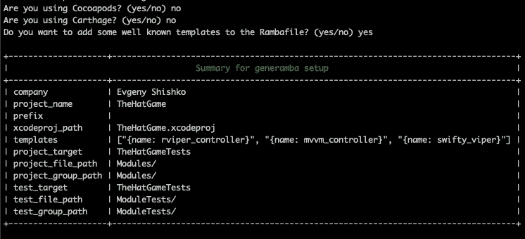
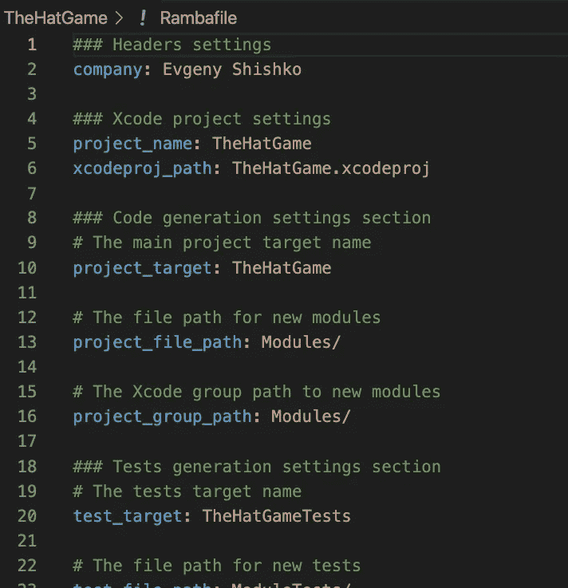
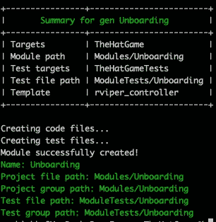
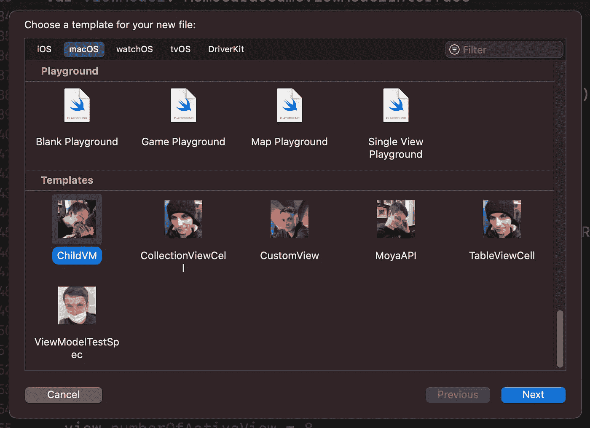
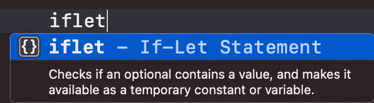
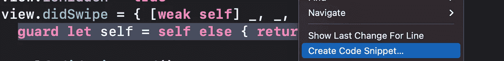
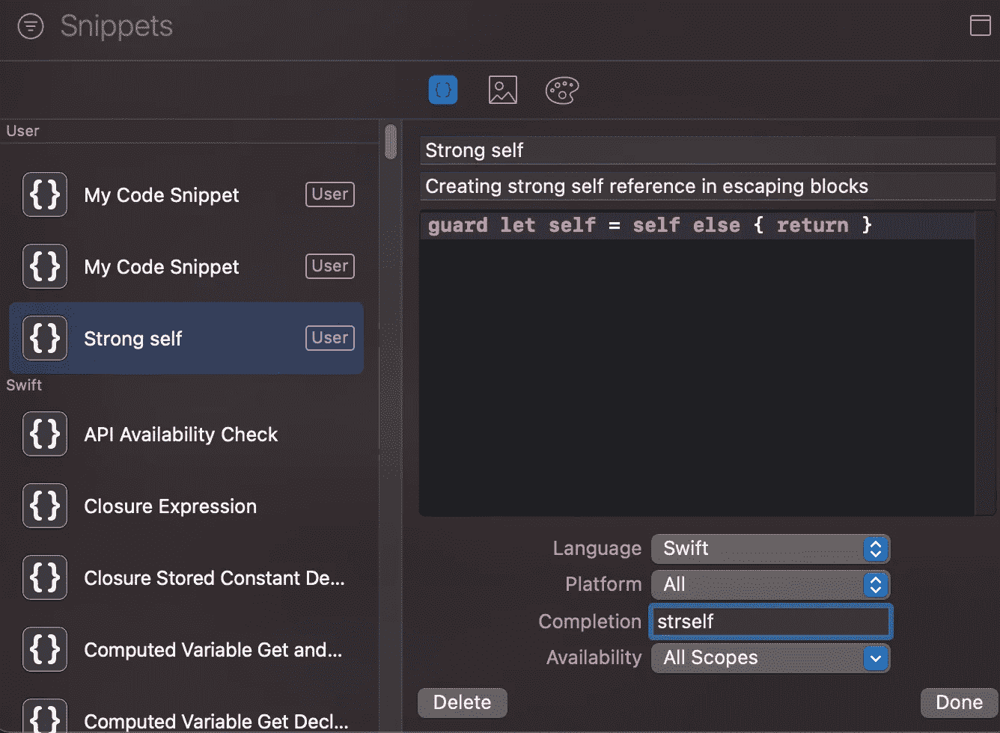
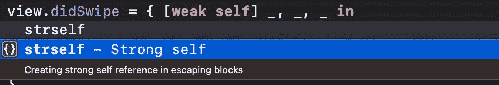

# iOS 开发中的模块代码生成

> 原文：<https://blog.devgenius.io/module-code-generation-in-ios-development-c2d998272ff8?source=collection_archive---------3----------------------->

[https://www . shutterstock . com/video/clip-1460239-mechanism-motion](https://www.shutterstock.com/video/clip-1460239-mechanism-motion)

优秀的程序员——避免多次编写相同代码的程序员。想象一下，如果程序员手动创建 [VIPER](https://www.google.com/url?sa=t&rct=j&q=&esrc=s&source=web&cd=&cad=rja&uact=8&ved=2ahUKEwib0I-b0Iz4AhUDQvEDHWj4CuoQFnoECAYQAQ&url=https%3A%2F%2Fwww.objc.io%2Fissues%2F13-architecture%2Fviper%2F&usg=AOvVaw2qUYV6vglF7jK2W3Z0FewL) 模块，会耗费多少时间——这意味着你要为每个新模块一次又一次地编写所有的类和样板代码(希望你不要这样做)。这里我将谈谈通过创建模板代码帮助我们节省大量时间的工具，特别是 **Generamba** *，* **Xcode 模板**和 **Xcode 片段**

希望大家能在下面找到有用的信息。如果你喜欢我的文章，别忘了点击鼓掌按钮👋

# 我们有什么工具来生成代码？

有很多，让我们快速浏览一下最受欢迎的:

*   [SwiftGen](https://github.com/SwiftGen/SwiftGen) 最受欢迎，它允许自动生成静态代码来访问您的公共资源— **资产，Localizable.strings** 。一旦资源名称被更改，它可以让我们避免在运行时损坏应用程序的错误。此外，它还提供了一个选项，可以使用 IDE 的自动完成功能选择合适的资源，并根据需要配置资产和可本地化资源的结构。
*   [Sourcery](https://github.com/krzysztofzablocki/Sourcery) 帮助我们根据您编写的规则和代码自动创建样板代码。就我个人而言，我和许多其他开发人员使用它来创建模拟，只是通过指定需要模拟的类型。这里有一篇很棒的文章介绍如何实现这一点— [用 Sourcery 生成快速模拟代码](https://www.vadimbulavin.com/mocking-in-swift-using-sourcery/)

上面的工具在描述的用例中是有帮助的。然而，对于创建空的模块屏幕(几个文件同时存在)，我更喜欢使用最方便和流行的工具——Generamba 和 Xcode 模板

需要提到的是，其他开发人员创建了他们自己的脚本和工具来生成代码，但显然这也有其缺点——每个工具都有其独特的格式语言，需要得到支持。

# 杰纳巴

由漫步者公司开发的在独联体国家公司中广为人知的工具。他们推广他们使用的 VIPER 架构，因此他们开发了自己的工具来创建预装了 VIPER 模板的样板 iOS 代码。

## 设置和快速启动

你可以在他们的 [Generamba](https://github.com/strongself/Generamba) 库查看完整的说明和文档。在这里，我将快速重复主要步骤:

*   通过运行`$ gem install generamba`在您的机器上安装它
*   跳转到您的项目根文件夹并运行`$ generamba setup`。回答这些问题，您将看到*随机文件*，其中包含项目模板生成和已安装模板的一般设置:

如果您在答案中填写了一些错误的字段，请不要担心，您可以稍后在 *Rambafile* 中更改它们:

通过运行 *$generamba 模板安装*来安装默认模板。创建 **Rambafile** 中指定的模板文件，并保存在 **Templates** 文件夹中。结果应该是这样的:

## 如何创建自己的模板？

为了这个目标，你可以用两件东西来操作——Generamba wiki 和预装的模板。这足以让你编写自己的模板了。格式语言非常直接，参数目的也很容易理解。

## 赞成的意见

*   易于安装和使用
*   为特定目标和特定文件夹添加测试文件
*   代码库是开源的——你可以按照自己的方式派生和调整它
*   简单易读的格式
*   可从项目文件夹管理—所有模板都在一个位置

## 骗局

*   最后一次代码更改是在三年前。既然它依赖于`.xcodeproj`，那么面对它显著变化的结构，它就可以被打破。
*   没有用户界面，只能从控制台工作(对我来说，更多的是向上而不是向下)

# Xcode 模板

Xcode 模板很久以前就发布了，尽管我只是最近才开始广泛使用它。首先，我为单独的样板文件类型创建了模板:CustomUIView、CustomTableViewCell、APITargetType(用于 [Moya](https://github.com/Moya/Moya) )等。

当您为新文件选取模板时，它们会出现在滚动条的底部:

自定义模板图标是我选择的，说来话长…

## 如何开始使用？

我不想在这里重复，所以我只给[留了一个链接](https://www.raywenderlich.com/26582967-xcode-project-and-file-templates)到相当不错的指南，它非常详细地描述了它。

## 赞成的意见

*   它直接在 Xcode 的用户界面上工作
*   您可以让用户配置每个模板创建，因为他想通过创建各种字段来填充

## 骗局

*   您不能为模板中的每个文件设置不同的文件
*   模板可能会因为更新或移除 Xcode 而丢失

# 关于 Xcode 片段的一些话

你可能已经注意到 Xcode 有时会建议为你填充一些结构，例如— *if let 语句*:

对于一些小的样板代码，您可以创建和使用自己的代码片段。它非常容易使用和创建—您只需选择要从中创建代码片段的代码，然后右键单击以创建代码片段:

之后，您会看到一个窗口，在这里您可以编辑新创建的代码片段的参数:

*另外，在创建一个片段之前，检查它是否已经出现在列表中，这样你就不会浪费时间去创建现有的东西了:)*

因此，您只需通过编写您指定的完成提示，将它用作默认代码片段:

# 那还有什么值得用的呢？

在我看来，在大多数情况下，我会选择 **Xcode 模板**，因为它们更容易使用，而且苹果自己也支持。尽管如果你想对你正在使用的乐器进行一些定制和控制，你也应该看看 **Generamba** 👍