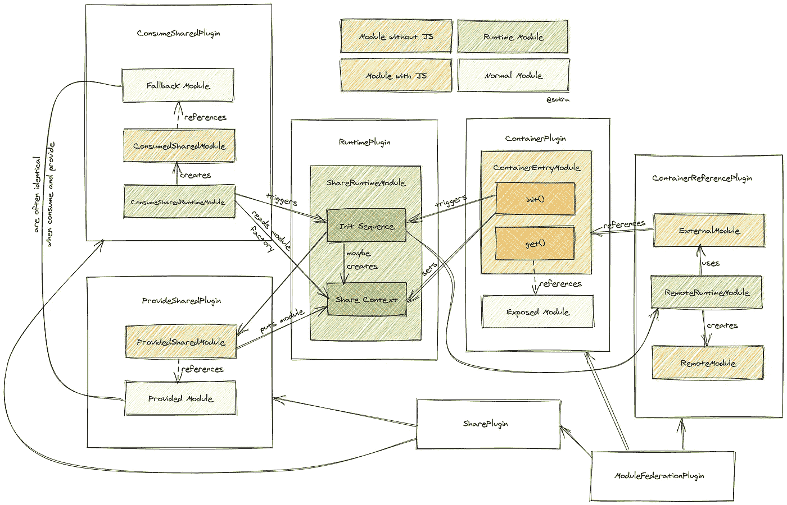

# 模块联盟。Webpack 5.0.0-beta.17 中的高级 API

> 原文：<https://blog.devgenius.io/module-federation-advanced-api-inwebpack-5-0-0-beta-17-71cd4d42e534?source=collection_archive---------0----------------------->


伊利亚·巴甫洛夫在 [Unsplash](https://unsplash.com?utm_source=medium&utm_medium=referral) 拍摄的照片

模块联盟已经很强大了。因此，我们通过引入先进的 API 使其功能加倍。这项技术显然是 javascript 架构中的游戏规则改变者

Beta 17 已经出来一周左右了。它具有强大的冲击力。尽管最新版本中引入了强大的功能。我们离完成还有**远**。

> 模块联合才刚刚开始。

# 有什么变化？

一些主要的工作进入这个版本。重写了外部插件，改变了 webpack 运行时的工作方式，改变了 webpack 图，改变了分块系统，以及 webpack 的启动顺序。还有很多，但对这篇文章来说并不重要。

Tobias(web pack 的创始人)帮助可视化了 beta.17 升级的一部分，这也是本文的大部分内容所基于的。一如既往 Tobias 的投资是改进该系统并对 Webpack core 进行实质性更改以支持该技术的主要因素。感谢您对模块联盟的投资和关注。



驱动全向主机的机制。托拜厄斯·科珀斯的功劳

ExternalsPlugin 专门为模块联合进行了重新构建。在 beta.18 中，遥控器将能够使用 URL 和自定义承诺。现在外部可以做以下事情。

Jay Kariesch 已经为 beta 21 写了一篇更新文章，也值得一看！

[](https://link.medium.com/msElH5ioY7) [## 将模块联合从 web pack 5 . 0 . 0-beta 16 迁移到 web pack 5 . 0 . 0-beta 21

### 未捕获的 ScriptExternalLoadError:加载脚本失败。希望我们能在下面解决这个问题。从我来看…

link.medium.com](https://link.medium.com/msElH5ioY7) 

```
externals: {
  react: "import http://someurl.com/react.js",
  lodash: "promise new Promise(()=>{...some async code})"}
```

获取最新发布的图书！

[](https://module-federation.myshopify.com/products/practical-module-federation) [## 实用模块联盟

### 《实用模块联盟》是第一本，也是唯一一本关于 Webpack 5 创新的实时代码共享机制的书。它…

module-federation.myshopify.com](https://module-federation.myshopify.com/products/practical-module-federation) 

## 高级 API 简介

在 beta.16 中，我创建了`AutomaticVendorFederationPlugin`这个想法是为了在共享供应商代码时支持一些版本控制功能。它运行良好，但还可以做得更好。

在 beta.17 中，该功能内置于 Webpack core 中。共享版本化的供应商代码——然而，它被大大地改进了。

*   语义版本控制
*   热切的卖主
*   严格版本
*   最低要求版本
*   共享群组
*   别名共享模块。
*   异步、基于承诺或基于 URL 的外部

这里有一些例子。

【package.json 内所有模块的标准共享

```
// adds all your dependencies as shared modules
// version is inferred from package.json in the dependencies
// requiredVersion is used from your package.json
// dependencies will automatically use the highest available package
// in the federated app, based on version requirement in package.json
// multiple different versions might coexist in the federated app
// Note that this will not affect nested paths like "lodash/pluck"
// Note that this will disable some optimization on these packages
// with might lead the bundle size problems
shared: require("./package.json").dependencies
```

**共享时覆盖/指定附加参数**

在某些情况下，你可能需要声明一些库，比如 react 或者 Rx.js 作为一个单体。这在高级 API 下是很容易做到的

```
const deps = require("./package.json").dependencies;
// use object spread to change single entries
shared: {
  ...deps,
  react: {
    requiredVersion: deps.react,
    singleton: true
  }
}
```

**在其他情况下，你可能想要重新命名一个共享模块**

```
shared: {
  "my-vue": { // can be referenced by import "my-vue"
    import: "vue", // the "vue" package will be used a provided and fallback module
    shareKey: "shared-vue", // under this name the shared module will be placed in the share scope
    shareScope: "default", // share scope with this name will be used
    singleton: true, // only a single version of the shared module is allowed
    strictVersion: true, // don't use shared version when version isn't valid. Singleton or modules without fallback will throw, otherwise fallback is used
    version: "1.2.3", // the version of the shared module
    requiredVersion: ^1.0.0" // the required version of the shared module
  }
}
```

> 对于`requiredVersion` : `^`，`~`，`>=`，允许精确匹配。不支持复杂范围，因为它需要大量的运行时代码来覆盖该逻辑。

# 支持动态遥控器

Beta 16 有一些功能，但并不令人愉快，也不直接。在这个版本中，我们创建了一个提供所有功能的简单模式。而是以一种完全动态的方式。初始化阶段允许您在运行时将动态远程连接到共享范围。

```
function loadComponent(scope, module) {
  return async () => {
    // Initializes the share scope. This fills it with known provided modules from this build and all remotes
    await __webpack_init_sharing__("default");
    const container = ***window***[scope]; // or get the container somewhere else
    // Initialize the container, it may provide shared modules
    await container.init(__webpack_share_scopes__.default);
    const factory = await ***window***[scope].get(module);
    const Module = factory();
    return Module;
  };
}
```

# 全方位主机

我们有主机、远程和双向主机。现在…我们也有全向主机

除了我想出来的新术语，这是什么意思？

一个全向主机同时作为主机**和**遥控器工作…让我解释一下。

在 beta.16 中，你可以和遥控器共享代码。但是有一个缺点。

假设我们有三个应用程序。App A 是主机，App B，App C 是主机加载的 remotes。b 和 C 都依赖 lodash，但是主机根本不共享或使用 lodash。当下载 B 和 C 时，它们都会下载自己的 lodash 副本——导致双重下载，因为主机是提供覆盖的一方。遥控器之间无法相互通话。

自然，这就成了问题。

在 beta.17 中，遥控器可以相互协调，它们可以决定谁卖什么。现在，当我们将这与语义版本化和全方位主机结合起来时，我们获得了一些强大的功能。

**示例**

Apps A，B，C 都有 lodash 共享。然而，B 安装了一个更新的版本，并且根据 A & C 的 SemVer 规范，它们与 lodash 的一个更新的次要版本兼容。此时， **remote B 将向主机和所有其他符合要求并能消费稍新版本的 lodash 的 remote 出售其 lodash 版本。**

除此之外，遥控器可以独立地与其他遥控器协调。

概括地说，远程设备可以向主机和网络中满足永远要求的其他设备出售节点模块。如果出现故障，任何连接到网络的应用程序都可以查询它，以查看是否有任何远程设备具有兼容版本的依赖关系。这种强大的功能允许系统自我修复，并可以通过任何其他应用程序重新路由依赖关系请求，这些应用程序将下载其自己的依赖关系，并将其出售给无法独立完成此操作的有问题的应用程序。您仍然可以完全控制您的依赖规范，并且可以锁定到一个特定的版本，但是，您可以使用 npm 风格的 SemVer 来保持最新，并避免同一供应商的略有不同的版本的多个副本被反复加载。

引入了一些突破性的变化。全向主机同时作为远程和主机运行，这意味着需要记住一些注意事项。

# 解决纷争

我们看到模块联合中的一些常见错误。如果你看到他们中的一个，这就是正在发生的事情。

1.  **未捕获错误:共享模块不可用于急切消费**

这是一个简单的问题。你急切地执行一个全向模式的应用程序。您有几个选项可供选择:

您可以在模块联合的高级 API 内将依赖关系设置为 eager，它不会将模块放在异步块中，而是同步提供它们。
这允许我们在初始块中使用这些共享模块。但是要小心，因为所有提供的和后备模块将总是被下载。明智的做法是只在应用程序的一个地方提供，比如外壳。

```
shared: {
  ...deps,
  react: {
    eager: true,
    singleton: true,
    requiredVersion: deps.react,
  },
  "react-dom": {
    eager: true,
    singleton: true,
    requiredVersion: deps["react-dom"],
  },
```

如果您不想将依赖项设置为“急切”，那么您可以利用`bundle-loader`

在 webpack 配置中。添加此加载程序

```
module: {
  rules: [
    {
      test: /bootstrap\.js$/,
      loader: "bundle-loader",
      options: {
        lazy: true,
      },
    },
  ]
}
```

然后把你的**入口点**改成这样。

```
//index.js
import bootstrap from "./bootstrap";
bootstrap();
```

创建一个`bootstrap.js`文件，并将入口点代码的内容移动到该文件中

```
//bootstrap.js
import React from "react";
import ReactDOM from "react-dom";
import App from "./App";
ReactDOM.render(<App />, ***document***.getElementById("root"));
```

这样做的目的是在开始执行应用程序之前，为 webpack 创造一个与其他遥控器协调的机会，并决定谁将出售什么。这种方法将增加 RTT，因为 webpack 无法在一次往返中异步加载所有内容。

## 针对急切导入的推荐解决方案

上面提到的方法可以工作，但是可能有一些限制或缺点。

在 Webpack，我们强烈建议动态导入引导文件。这样做不会产生任何额外的往返，而且由于初始化代码是从一个更大的块中分离出来的，所以总体来说性能更好。

```
ìmport('./bootstrap')
```

**2。未捕获的错误:模块。容器中不存在“/Button”。**

它可能没有显示按钮，但错误消息看起来类似。

如果您从 beta.16 升级到 beta.17，通常会出现此问题

在 ModuleFederationPlugin 内。将公开内容从:

```
exposes: {
  "Button": "./src/Button",
},
```

对此:

```
exposes: {
  "./Button": "./src/Button",
},
```

进行更改是为了让我们可以遵循节点 14 中的 ESM 语法

**3。未捕获的类型错误:fn 不是函数**

您可能缺少 remoteEntry.js，请确保添加了它。如果您已经为尝试使用的远程加载了 remoteEntry，但仍然会看到此错误。将主机的 remoteEntry.js 文件也添加到 HTML 中。

这取决于您的应用程序如何公开、共享和构建。当协调发生时，全向主机可以利用**它自己的遥控器**。这没有性能缺陷。Webpack 只是全方位地利用自己。因为它同时是主机和远程设备。它可以使用自己的遥控器。这可能看起来很奇怪，但是这种架构非常强大，全向主机允许以非常简单的方式引入 AB 测试，而无需编写功能标志或删除功能标志。

# 接下来会发生什么

支持 URL 数组的模块联合，承诺作为远程的后备。

共享模块的重新导出(树摇动功能)

将 SemVer 深入应用到嵌套节点模块中。

# 模块联盟组织会带来什么

虽然我是模块联盟的创建者，但并不是所有我想做的事情都属于 webpack 的范围。因此，我为模块联合创建了一个单独的组织，托管工具、增强功能和其他实用程序。这些工具是在我的组织下拥有和创建的，是来自模块联盟创建者的可信解决方案

*   仪表板服务。通过基于 UI 的工具实现零部署命令和控制，该工具允许远程版本控制、即时回滚和汇总、代码冻结。除此之外，它还提供了联邦系统的高度可见性和可视化，使得跨多个代码仓库查看“谁在哪里使用什么”变得容易。
*   测试工具。我们正在进行联合单元测试。联邦系统应该能够防止任何人破坏其他人。
*   自动化错误处理和远程回滚。这将利用将作为托管服务提供的控制面板。检测到严重错误时，webpack 将尝试加载遥控器的以前版本，以进行自我修复。
*   故事书集成。Storybook 构建了内部和外部的模块联盟。在运行时实时发布故事书=产品版本。与 CMS 集成相结合，实现实时预览和页面生成器功能，使用生产代码来反映后端 UI
*   锁定文件技术。想象一下运行时模块联合的 yarn.lock。
*   浮动节点 _ 模块。没有远程，只是共享所有应用程序可以简单地共享任何供应商的任何东西，有或没有先进的 API SemVer 规则应用。
*   与谷歌 Chrome 和谷歌框架团队进行对话——因为这项技术已经获得了很大的发展势头。我们有机会与谷歌合作，看看 V8 和浏览器如何更好地支持这一新架构。最终目标是更好的 web 技术和对 v8 和浏览器规范的可能改变，以及寻找模块联盟组织、Webpack 和 Google 可以为了互联网的更大利益而合作的潜在机会。

[](https://github.com/module-federation) [## 模块联盟

### 此时您不能执行该操作。您已使用另一个标签页或窗口登录。您已在另一个选项卡中注销，或者…

github.com](https://github.com/module-federation) 

考虑帮助我和这个组织。这项技术很复杂，需要大量的时间投入。目前，为适当的工具和资源提供资金是一个挑战。虽然我想在模块联盟上投入更多的时间，但我的运营受到了❤的限制。该组织还提供咨询服务，并提供付费支持层。如果你对这项技术感兴趣，你并不孤单，你可以直接接触到这个系统的创造者。

[](https://github.com/sponsors/ScriptedAlchemy) [## GitHub 赞助商上的赞助商@ScriptedAlchemy

### 我是 Webpack 的核心维护者，Webpack 5 的旗舰功能——模块联邦的创造者。我保持几个…

github.com](https://github.com/sponsors/ScriptedAlchemy) 

在 Twitter 上关注我，了解最新最好的消息。

https://twitter.com/ScriptedAlchemy

一个伟大的阅读和窥视仪表板服务。我们已经悄悄地以只读模式发布了它。

[](https://medium.com/expedia-group-tech/using-webpack-module-federation-to-share-an-app-shell-7d23633510e) [## 使用 Webpack 模块联盟共享应用程序外壳

### 大规模保持不同 web 应用程序之间的模块同步

medium.com](https://medium.com/expedia-group-tech/using-webpack-module-federation-to-share-an-app-shell-7d23633510e)