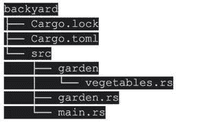
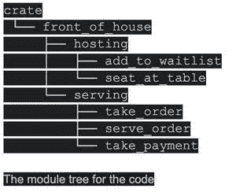

# 生锈的模块

> 原文：<https://blog.devgenius.io/modules-in-rust-6b9722cd5dc9?source=collection_archive---------4----------------------->

当你编写更大的程序时，组织你的代码将变得越来越重要。通过将相关功能分组并将代码与不同的功能分开，您可以清楚地知道在哪里可以找到实现特定功能的代码，以及在哪里可以更改功能的工作方式。

到目前为止，我们所有的程序都包含在一个模块和一个文件中。随着项目的增长，你应该通过将代码分解成模块和文件来组织代码。一个包可能包含多个二进制板条箱以及一个或多个库板条箱。随着一个包的增长，部件可以被分成单独的板条箱，这些板条箱成为外部依赖项。本章涵盖了所有这些技术。Cargo 为非常大的项目提供工作空间，这些项目由一组相互连接的包组成，这些包一起发展。

我们还将讨论封装实现细节，它允许其他代码通过其公共接口调用您的代码，而无需知道实现是如何工作的，从而允许您在更高的层次上重用代码。您编写代码的方式决定了哪些部分是供其他代码使用的公共部分，哪些是您保留更改权利的私有实现细节。这是限制你必须记住的信息量的另一种方法。

范围是一个相关的概念:编写代码的嵌套上下文有一组定义为“在范围内”的名称在读取、编写和编译代码时，程序员和编译器必须了解特定位置的特定名称是否引用了变量、函数、结构、枚举、模块、常数或其他项，以及该项的含义。您可以定义范围，并更改范围中包含或排除的名称。同一范围内不能存在两个同名的项目；有解决名称冲突的工具。

Rust 提供了许多管理代码组织的特性，比如哪些细节是公开的，哪些细节是私有的，以及在程序的每个作用域中有哪些名字。这些功能有时统称为模块系统，包括:

包装是一种货物功能，允许您创建、测试和共享板条箱。

板条箱:产生库或可执行文件的模块集合。

模块和应用:允许你控制路径的组织，范围和隐私。

路径:一种命名对象的方法，如结构、函数或模块。

板条箱和包装

我们要看的第一个模块系统组件是包装和板条箱。

一箱是 Rust 编译器在任何给定时间考虑的最小数量的代码。即使你使用 rustc 而不是 cargo 并传递一个单独的源代码文件(就像我们在第 1 章的“编写和运行 Rust 程序”一节中所做的那样)，编译器也会认为那个文件是一个箱子。模块可以包含在板条箱中，模块可以定义在与板条箱一起编译的其他文件中，我们将在下面的章节中看到。

板条箱分为二进制板条箱或库板条箱。二进制箱是可以编译成可执行文件的程序，例如命令行程序或服务器。每个都必须包含一个 main 函数，它定义了执行可执行文件时会发生什么。到目前为止，我们建造的所有板条箱都是二进制的。

库箱缺少主函数，不能编译成可执行文件。相反，它们定义了将由几个项目共享的功能。

当 Rustaceans 人说“板条箱”时，他们指的是库板条箱，他们将“板条箱”与“库”的一般编程概念互换。

机箱根是一个源文件，Rust 编译器从这个文件中生成机箱的根模块。

包装是一个或多个提供一组特定功能的板条箱的集合。包中的 Cargo.toml 文件描述了如何构建这些板条箱。Cargo 是一个包，其中包含用于构建代码的命令行工具的二进制文件。货物包还包括二进制板条箱所依赖的库板条箱。其他项目可以依靠 Cargo library crate 来实现 Cargo 命令行工具所使用的逻辑。

一个包可以有任意多的二进制板条箱，但是只能有一个库板条箱。一个包必须包括至少一个板条箱，它可以是库或二进制板条箱。

让我们回顾一下当我们制作一个包时会发生什么。首先，我们添加一个新的命令货物:

我们使用 ls 来查看运行 cargo new 后 Cargo 创建了什么。项目目录中的一个 Cargo.toml 文件为我们提供了一个包。还有一个 src 目录，里面有 main.rs。当您在文本编辑器中打开 Cargo.toml 时，您会注意到没有提到 src/main.rs。Cargo 遵循这样的约定:与包同名的二进制板条箱的板条箱根是 src/main . RS。类似地，如果包目录包含 src/lib.rs，Cargo 知道包包含与包同名的库板条箱，src/lib.rs 是它的板条箱根。Cargo 将板条箱根文件发送给 rustc，后者生成库或二进制文件。

我们有一个只有 src/main.rs 的包，这意味着它只有一个名为 my-project 的二进制文件。如果一个包包含 src/main.rs 和 src/lib.rs，那么它包含两个板条箱:一个二进制文件和一个与包同名的库。通过将文件放在 src/bin 目录中，一个包可以有多个二进制文件箱:每个文件是一个单独的二进制文件箱。

模块备忘单

这里有一个快速指南，介绍模块、路径、use 关键字和 pub 关键字如何在编译器中工作，以及大多数开发人员如何组织他们的代码。

编译机箱时，编译器会在机箱根文件中查找要编译的代码(对于库机箱通常是 src/lib.rs，对于二进制机箱通常是 src/main.rs)。

模块声明:你可以在机箱根文件中声明新的模块；比如 mod 花园；声明一个“花园”模块。编译器将在以下位置查找模块代码:

在代替 mod garden 后面分号的花括号内

在 src/garden.rs 文件中

在目录 src/garden/mod.rs 中

声明子模块:子模块可以在除了板条箱根目录之外的任何文件中声明。例如，在 src/garden.rs 中，您可以声明 mod 蔬菜。编译器将在父模块目录的以下位置查找子模块的代码:

不要用分号，直接在 mod vegetables 后面使用内联的花括号。

在 src/garden/vegetables.rs 文件中

在目录 src/garden/vegetables/mod.rs 中

模块中代码的路径:一旦一个模块在你的机箱中，只要隐私规则允许，你可以使用代码的路径从同一个机箱中的任何地方引用该模块中的代码。例如，在菜园蔬菜模块中，可以在 crate::garden::vegetables::芦笋中找到芦笋类型。

私有与公共:默认情况下，模块中的代码对其父模块是私有的。要使模块成为公共的，请使用 pub mod 而不是 mod。在公共模块内的项声明之前使用 pub，使它们也成为公共的。

use 关键字:use 关键字为范围内的项目创建快捷方式，以减少长路径的重复。您可以在任何可以引用 crate::garden::vegetables::芦笋的范围内使用 crate::garden::vegetables::芦笋创建快捷方式，然后您只需编写芦笋以在该范围内使用该类型。

我们将制作一个名为后院的二进制箱子来演示这些规则。以下文件和目录位于板条箱目录中，也称为后院目录:

在本例中，机箱根文件是 src/main.rs，它包含:

src/main.rs 是文件名。

锈

用板条箱::花园::蔬菜::芦笋；

pub mod 花园；

fn main() {

let plant =芦笋{ }；

println！(“我在成长{:？}!"，植物)；

}

酒吧现代花园；行指示编译器包含 src/garden.rs 中的代码，如下所示:

src/garden.rs 是文件名。

锈

酒馆 mod 蔬菜；

在这种情况下，pub mod 蔬菜；参考 src/garden/vegetables 中的代码。rs 也包括在内。这是代码:

锈

#[派生(调试)]

酒吧结构芦笋{}

让我们深入这些规则的细节，看看它们是如何工作的！

对相关代码进行分组的模块

模块允许我们在一个箱子里组织代码，以便于阅读和重用。因为默认情况下模块中的代码是私有的，所以模块允许我们控制项目的隐私。私有项目是不公开的内部实现细节。我们可以将模块和模块中包含的项公开，这样就可以公开它们，并允许外部代码使用和依赖它们。

例如，考虑创建一个执行餐馆功能的图书馆板条箱。我们将定义函数签名，但让它们的主体为空，以便专注于代码组织而不是餐厅实现。

在餐饮业中，餐馆的某些部分被称为前厅，而另一些部分被称为后厅。前厅是指顾客就座、服务员点菜和付款、调酒师调酒的地方。房子的后面是厨师和厨师在厨房工作的地方，洗碗工自己收拾，经理做行政工作。

我们可以将板条箱的功能组织成嵌套的模块，以这种方式构建它。运行 cargo new restaurant-lib 创建一个名为 restaurant 的新库，然后将清单 7–1 中的代码复制到 src/lib.rs 中，以定义一些模块和函数签名。以下是前屋部分:

src/lib.rs 是文件名。

锈

mod front_of_house {

mod 主机{

fn add_to_waitlist() {}

fn seat_at_table() {}

}

mod 服务

fn take_order() {}

fn serve_order() {}

fn take_payment() {}

}

}

包含其他模块的前台模块，每个模块都包含函数。

mod 关键字后跟模块名(在本例中是 house 的前面)来定义一个模块。然后，模块的主体被括在花括号中。其他模块可以放在模块中，就像宿主和服务模块一样。模块也可以存储其他类型对象的定义，比如结构、枚举、常量、特征和函数，如清单 7–1 所示。

我们可以将相关的定义组合在一起，并通过使用模块来命名它们为什么相关。程序员可以根据组来导航代码，而不必通读所有的定义，这样更容易找到与他们相关的定义。为代码添加新功能的程序员会知道把它放在哪里，以保持程序有条理。

我们已经提到 src/main.rs 和 src/lib.rs 是机箱根。这两个文件中的任何一个文件的内容在 crate 的模块结构(称为模块树)的根处形成了一个名为 crate 的模块。

清单中代码的模块树

这个树描述了一些模块如何嵌套在另一个模块中，例如在房子前面托管嵌套。该树还揭示了一些模块是兄弟模块，这意味着它们在同一个模块中定义；例如，hosting 和 serving 是在 house front 中定义的兄弟。如果模块 A 包含在模块 B 中，我们说模块 A 是它的子模块，模块 B 是它的父模块。值得注意的是，整个模块树植根于隐式模块箱。

模块树可能会让你想起你的计算机文件系统的目录树；这是一个极好的类比！像文件系统中的目录一样，模块是用来组织你的代码的。而且，就像目录中的文件一样，我们必须能够定位我们的模块。