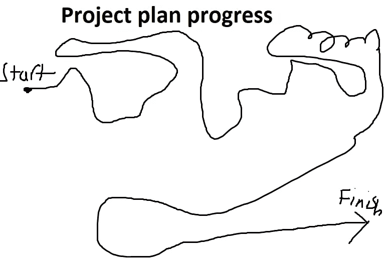

# 软件开发的势头就像一个醉汉跌跌撞撞地走向烤肉店

> 原文：<https://blog.devgenius.io/momentum-in-software-development-is-like-a-drunk-stumbling-towards-the-kebab-shop-5fcd4cd4151d?source=collection_archive---------0----------------------->

## 项目不是直线前进的，项目计划也很少是准确的

> 发展不会像军乐队一样有目的地前进。它像一个醉汉走向烤肉店#HoskWisdom 一样，摇摇晃晃地走着

软件开发充满了从未有人预测过的惊喜、新需求和变化。只有最简单的项目，有明确的范围，少于 5 个人参与，才进行计划。它们就像五片叶子的三叶草一样普通。

# 他们为什么错了？

> 成功的秘诀:承诺不足，兑现过度。[凯文·凯利](https://kk.org/thetechnium/99-additional-bits-of-unsolicited-advice/)

项目则相反，它们承诺过多，交付不足，因为项目/工作被低估，团队的交付能力被高估

每个人都想听到更低的交货天数和成本，所以这就是他们听到的。

出价最低者胜出，赢家的诅咒是在一个不可能的期限内完成项目。项目范围如何从最初的需求增长了这么多？

需求不被理解，随着细节变得更加清晰，许多缺失的需求和批次将会改变。不可能从高层次需求中识别出所有低层次需求[例如](/e.g.)当你深入细节并使用已构建的内容时，你会发现更多。

> 如果一个人首先记录下所有未知的列表，那么完美的项目计划是可能的。比尔·兰利

软件开发使用内部视图来评估工作和创建项目计划。这些估计几乎没有安全边际，并且没有假设错误、问题或需求的变化..

大多数软件开发项目都是迟到的。每个从事软件项目的人都知道很少会按计划进行，然而所有的计划都是使用乐观的估计制定的，假设没有问题，没有思想上的变化，没有需求上的变化。

为什么这个新项目会有所不同？不会的，只是大家想听的，希望的。

> 只有在童话故事里，皇帝才会被告知他们是裸体的，而这项工程将会比预计的时间更长。

如果你怀疑这一点，那么想想

*   需求在项目结束时和开始时有所不同吗？
*   需求在范围和规模上增长了吗？
*   该项目是否有意想不到的问题(技术、人员、政治)？
*   项目是否改变了主意或优先级？
*   有什么设计错误吗？

人越多，送货时间越长，范围越广，都增加了不可预见的延误的概率。项目越大，他们能产生的影响就越大。

# **到底发生了什么**

每个人都忘记了从需求中创建软件有多难。创造性的过程并不顺利，总会有失误、蹒跚、错误和错误的转折。

每一个被替换的旧系统都是通过许多 bug、反馈和讨论被塑造成现在的状态，直到团队计算出系统需要如何工作。因此，大多数重写所花费的时间比估计的要长，因为它们删除了许多它们认为不需要的代码，而添加这些代码是为了修复错误。

切斯特顿的篱笆说，在你知道篱笆的作用之前，千万别把它移走。篱笆是用来挡东西的，还是用来挡东西的？

[切斯特顿的栅栏:二阶思维的一个教训](https://fs.blog/2020/03/chestertons-fence/)

代码充满了切斯特顿的栅栏，但它被开发人员在不理解其目的的情况下使代码变得高效而移除了。很少有人了解系统的所有部分，这就是为什么更改它通常会导致修复一个 bug，而在系统的不同部分创建另一个 bug。

要建立一个复杂的系统，你必须专注于细节，一旦达到了那个阶段，你就会发现，原来从高层看问题的时候，你并没有发现其中的复杂之处。

这就是它的工作原理，这就是过程。就像喝醉了的人跌跌撞撞地走向烤肉串店一样，这不是一条直线，而是一部曲折的探索之作，充满了惊喜。

项目上的势头要不断，稳步推进。问题、疑问和新需求变成了它们是你创建所需要的系统的方法的方式，这与我们在开始时认为所需要的系统不同。

就像瑞安·霍利迪所说的那样— [障碍在于道路](https://amzn.to/3nL0w5o)

# **有什么问题**

问题在于计划给了项目一种错误的控制感，计划对交付时间表和成本给出了不正确的预期。

计划被低估了，延长会带来痛苦。以小增量重新规划多次会浪费时间，并导致错误项目计划的迭代。对紧迫的截止日期的常见响应是走得更快，降低质量，但这加快了代码的创建，但需要更长的时间才能投入生产。

*   [为什么 IT 项目被低估](/why-it-projects-are-underestimated-eefa97b680af)
*   [我们如何加快 IT 项目的速度，以及为什么这样做不管用](https://thehosk.medium.com/how-we-try-to-speed-up-it-projects-and-why-it-doesnt-work-ca3bdc5d7413)——降低质量会减慢代码的生产速度
*   [创作软件是开始，而不是结束](/creating-software-is-the-start-not-the-end-795bc75b1f48)——解释了创作软件是一种误导，因为软件的成本在于维护。
*   软件开发是失败者的游戏 —软件开发应该专注于减少 bug 并在开发中找到它们。
*   [为什么在一个项目中增加更多的人并不能使它进展得更快](/why-adding-more-people-to-a-project-doesnt-make-it-go-faster-703f9f56eea5)——每个人都增加了沟通，使合作变得更加困难。

高质量的代码可以更快地进入生产环境，并降低复杂性，从而减少维护时间。

**简单的例子**
一家公司希望案例管理和门户网站能够与他们的电话系统集成。

Dataverse 和 Powerapps 门户是明智的选择

需求迅速增长

*   电话弹出发展成网络聊天，聊天机器人的可能性被提及
*   案例管理适用于 4 个团队
*   4 种不同的 SLA
*   不同领域都有专家
*   升级过程
*   有些情况需要批准
*   我们需要发出信件，他们需要整合
*   文件需要储存
*   需要从门户网站上传文档
*   某些文档只能由特定用户查看

随着越来越多的细节被发现，看似简单的工作不断增加。在高层次上，开箱即用的解决方案满足了需求，但是高层次的需求并不是真正的需求。

# **结论**

项目不会沿着一条直线向他们的目标前进，随着高层需求被分解成低层需求，并且每个人都理解系统需要如何工作，范围会扩大。

血、汗和泪被投入到创建软件和任何大型项目中。我回顾项目，惊叹于这个痛苦的过程，但我为我们取得的成就以及每个人如何作为一个团队工作而自豪。

创建软件是你所能尝试的最令人沮丧和最有收获的活动之一，它们很少是一条直线或按计划进行的。