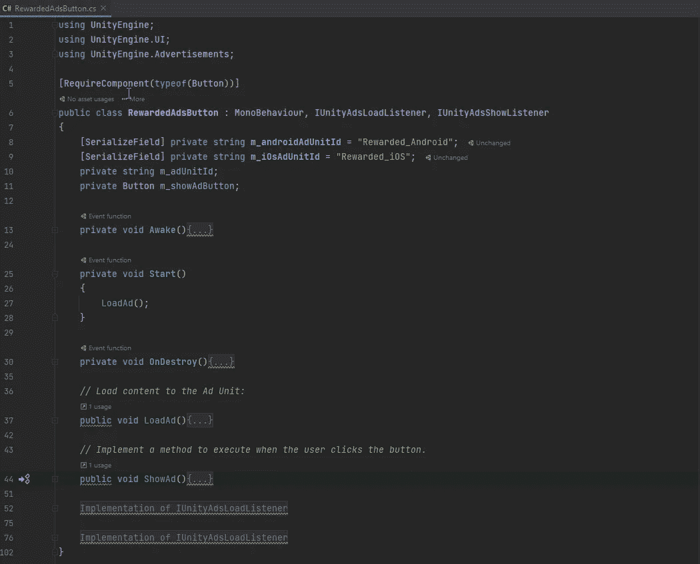

# 用广告赚钱你的 Unity 游戏。

> 原文：<https://blog.devgenius.io/monetizing-your-unity-game-with-ads-f6925e663eb7?source=collection_archive---------2----------------------->

## 在 Unity 中创建奖励视频广告。

我的商店面板上有一个按钮，可以观看 100 G 的添加

 [## 欢迎来到 Unity 移动商务解决方案

### Unity 不仅仅是一个创作游戏的地方。这也是一个平台，为经营和赚钱，你的游戏，以确保…

docs.unity3d.com](https://docs.unity3d.com/Packages/com.unity.ads@3.7/manual/index.html) 

# 启用广告

首先，我需要确保我已经在软件包管理器中安装了广告。

接下来，我需要确保我在项目设置中打开了广告服务。

为了使用这个服务，我还必须创建一个项目 ID。然后我打开了广告。

接下来，我必须通过单击仪表板链接转到货币化仪表板。

我选择项目。选择广告单元，完成激活。然后我添加广告单元。我将使用奖励广告单元，我给它一个名字，并选择平台。

现在我需要启用测试模式，这样我就可以测试我的广告，这对于测试时避免被标记为欺诈非常重要。一旦游戏准备好发布，我将不得不回来把它关掉。

# 代码

## 初始化 Ads SDK

既然我已经设置了使用 ads 的项目，我需要确保初始化 SDK。

 [## Unity 集成指南

### 本指南涵盖了在你的自制游戏中实现 Unity 广告的集成。如果你是 iOS 开发者…

unityads.unity3d.com](https://unityads.unity3d.com/help/unity/integration-guide-unity#initializing-the-sdk) 

为了使用广告，我需要使用`UnityEngine.Avertisements`名称空间。

我将它作为一个单独的类来使用，它将在第一个场景中被加载，并且不会被破坏。这将允许它在我的游戏中跨多个场景工作。

我需要一些变量来跟踪游戏的 Id

*   游戏 Id——这是不同的，取决于这是为 Android 还是 IOS 构建的，我是为 Android 构建的，但我会在这里保留代码，以防我以后想为 IOS 构建，我不必在游戏中做任何更改。游戏的 Id 在编辑->项目设置->服务->广告->游戏 Id 中。它们也可以在广告单元或项目设置下的货币化仪表板中找到。
*   Android 游戏 id——这是 Android 的 Id，见上文。
*   IOS 游戏 ID——这是 IOS 的 ID，见上文。
*   测试模式—我是否处于测试模式。
*   按位置启用模式—是否应在加载 API 生命周期中启用 SDK。

为了初始化广告，我根据平台是 IOS 还是 Android 来设置游戏 Id。然后我把我所有的设置传递给 [**广告。初始化**](https://unityads.unity3d.com/help/unity/api-unity#initialize) 的方法。

现在我有一个错误，因为 Initialize 方法的最后一个参数是一个 [**接口 Unity Ads 初始化监听器**](https://unityads.unity3d.com/help/unity/api-unity#iunityadsinitializationlistener) 。我还没有实现。这需要在初始化完成和初始化失败时回调方法

现在我需要做的就是在我的游戏中添加这个经理，并填写参数。

## 展示广告

现在有三种类型的广告我可以使用。

*   ****—全屏添加通常在游戏开始时使用。****
*   ****[**奖励视频广告**](https://unityads.unity3d.com/help/unity/integration-guide-unity#rewarded-video-ads) —使用一个按钮，允许玩家选择观看一个广告，通常是为了某种游戏内奖励。****
*   ****[**横幅广告**](https://unityads.unity3d.com/help/unity/integration-guide-unity#banner-ads)**—在游戏过程中显示的专用横幅。******

******我将使用奖励广告。******

******首先，我使用了来自 [**奖励视频广告**](https://unityads.unity3d.com/help/unity/integration-guide-unity#rewarded-video-ads) 的代码，开始显示广告，并做了一些小改动。我在 Awake 方法中添加了获取奖励按钮，我还使行为需要一个按钮组件。******

********

****接下来，我添加了 Start 方法并加载了广告。一旦广告加载，按钮将使自己可点击，并将显示广告方法添加到按钮。我可以从一个简单的计时器中实现任何类型的逻辑，该计时器只允许每天查看一次添加，或者在这么多分钟后或每次商店面板被启用时，我决定只在 Start 方法中加载一次。****

********

****现在我可以把这个加到我的奖励按钮上了。我还确保我想要的 Unity 广告有正确的 ID。****

********

****在我的设备上测试后，我获得了广告加载的 Unity 日志，广告完成后，我可以单击奖励按钮，退出广告。奖励广告完成的消息显示在 Unity 日志中。****

****************

## ****奖励玩家观看****

****一切都设置好了，我现在所剩下的就是给玩家观看添加的奖励。我添加了我将使用的 Gem ScriptableObject 引用。在显示完成事件中，我给玩家宝石加 100。****

********

****回到 Unity，我将 ScriptableObject 添加到奖励按钮。****

********

****现在我的玩家看完广告后奖励 100 宝石。****

********