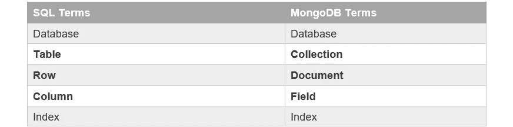
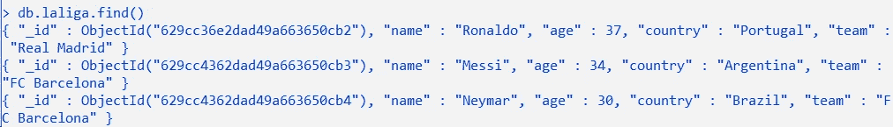

# MongoDB

> 原文：<https://blog.devgenius.io/mongodb-b282b781cd4?source=collection_archive---------9----------------------->

MongoDB

在本文中，我们将讨论 NoSQL、mongoDB 的基础知识以及如何在 mongoDB 中进行 CRUD 操作。MongoDB

什么是 NoSQL？

NoSQL 也被称为“不仅仅是 SQL”。它们是非表格数据库。它们存储数据的方式与 SQL 数据库不同。这些类型的数据库基于它们的数据模型有不同的类型，比如文档、键值、宽列和图形。它们是更加灵活、可伸缩的分布式数据库。大多数 NoSQL 数据库都是开源的。

现有的 NoSQL 数据库系统主要有四种类型。它们都使用不同类型的数据模型。

*   文档数据库
*   图形数据库
*   键值存储
*   宽栏商店

**NoSQL 的优势**

*   交互式实时 web 应用程序的工作量得到了简化。
*   NoSQL 迎合了非规范化数据的灵活性，需要灵活的数据模型。
*   它们为大型数据集提供了巨大的可伸缩性。
*   它们非常适合云应用、移动和大数据需求。

**NoSQL 的缺点**

*   NoSQL 有自己的查询语言。这与 SOL 相反。
*   由于 NoSQL 数据库较新，所以没有关系数据库的标准。
*   没有像关系数据库那样的模式。

**什么是 MongoDB？**

MongoDB 是一个**无 SQL 数据库**。它是一个用 C++编写的开源、跨平台、面向文档的数据库。

MongoDB 是由纽约的一个名为 10gen 的组织开发的，现在称为 MongoDB Inc .它最初是作为一个 PAAS(平台即服务)开发的。在 2009 年晚些时候，它作为由 MongoDB Inc .维护和支持的开源数据库服务器被引入市场。

MongoDB 中的每条记录都存储在集合中，而不是像 SQL 那样将数据存储在表中。关系数据库和 MongoDB 之间的术语略有不同，如下所示。

这里有一个来自 MongoDB 集合的样本文档。

**构建 MongoDB 的主要目的**

*   可量测性
*   表演
*   高可用性
*   提供高性能。
*   从单服务器部署扩展到大型复杂的多站点架构。
*   MongoDB 的要点
*   发展更快
*   更容易部署

**MongoDB 的特性**

1.  支持即席查询
2.  索引
3.  分身术
4.  数据复制
5.  负载平衡
6.  数据库触发器

**MongoDB 优势**

*   **MongoDB 是 schema less** 。它是一个文档数据库，其中一个集合包含不同的文档。
*   文件的字段数量、内容和大小可能会有**差异。**
*   在 MongoDB 中，单个对象的结构是清晰的。
*   MongoDB 中没有复杂的连接。
*   MongoDB 提供了深度查询的**工具，因为它支持对文档进行强大的动态查询。**
*   很容易扩展的**。**
*   它**使用内存存储工作集**，这是它快速访问的原因。

**MongoDB 数据类型**

**让我们转到 mongoDB 中的 CRUD 函数…**

**创建操作**

有两种方法可以将数据插入 MongoDB。在这个例子中，我们将使用 **RecordsDB** 集合。

1.  **insertOne()** = >向集合中添加单个数据

2. **insertMany()** = >向集合中添加多个数据。

**读取操作**

和 Create 一样，有两种方法可以从 MongoDB 中检索数据。

1.  **find()** = >从集合中获取所有数据。

db。RecordsDB.find()

输出

2. **findone()** = >获取满足搜索条件的单个数据。

**语法** : db。{收藏}。findOne({查询}，{投影})

当我们运行这段代码时，我们将得到下面的输出。db.laliga.find({"age":34})

输出

**更新操作**

在 MongoDB 中有 3 种方法可以更新数据。

1.  **updateOne()** = >更新已有单一数据

输出

2. **updateMany()** = >更新现有的多个数据

输出

3. **replaceOne()** = >替换 MongoDB 中的单个数据

输出

**删除操作**

从 MongoDB 中删除数据有两种方法。

1.  **deleteOne()** = >用于删除单个数据

db . la liga . delete one({ name:" ky Lian MBA PPE " })

输出

2. **deleteMany()** = >用于删除多个数据

db。recordsdb . delete many({ team:" FC Barcelona " })

输出

**结论**

通过这篇文章，您了解了 NoSQL 和使用 mongoDB 的 CRUD 操作的符号以及 mongoDB 的特性。

非常感谢你阅读我的文章，我希望你从这篇文章中有更好的想法。

谢谢你。