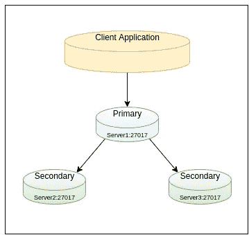
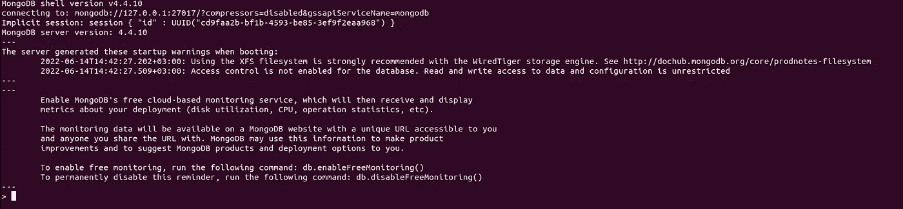

# Ubuntu 上的 MongoDB 复制

> 原文：<https://blog.devgenius.io/mongodb-replication-on-ubuntu-40d9c81714ac?source=collection_archive---------8----------------------->


[https://www.mongodb.com/](https://www.mongodb.com/)

副本集是一个实现主从复制的 MongoDB 数据库服务器集群。副本集的最低建议配置是三成员副本集，具有三个数据承载成员:一个主要成员和两个辅助成员。

主节点是副本集中接收写操作的唯一成员。辅助节点维护主节点数据集的副本。

辅助节点可以成为主节点。如果当前的主服务器变得不可用，副本集将举行一次选举，选择哪个辅助服务器成为新的主服务器。



MongoDB 复制要求集群中至少有 3 个节点，在我的例子中，我有以下节点。

*   127.0.0.0 服务器 1 IP
*   服务器 2-ip
*   服务器 3-ip

## 在您将使用的每台服务器上安装 MongoDB:

[](https://www.mongodb.com/docs/v4.4/tutorial/install-mongodb-on-ubuntu/) [## 在 Ubuntu 上安装 MongoDB 社区版

### MongoDB Atlas 是一个托管在云中的 MongoDB 服务选项，不需要安装开销，并提供免费的…

www.mongodb.com](https://www.mongodb.com/docs/v4.4/tutorial/install-mongodb-on-ubuntu/) 

# 部署步骤

1.  为每台服务器配置/etc/mongod.conf 文件
2.  重新启动 mongod.service
3.  初始化副本集

# 1.在所有服务器上配置配置文件

使用以下命令打开 mongod.conf 文件:

> $ *须藤纳米/etc/mongod.conf*

```
# mongod.conf# for documentation of all options, see:
#   [http://docs.mongodb.org/manual/reference/configuration-options/](http://docs.mongodb.org/manual/reference/configuration-options/)# Where and how to store data.
storage:
  dbPath: /var/lib/mongodb
  journal:
    enabled: true
#  engine:
#  mmapv1:
#  wiredTiger:# where to write logging data.
systemLog:
  destination: file
  logAppend: true
  path: /var/log/mongodb/mongod.log# network interfaces
net:
  port: 27017
  bindIp: <bindIp>         #write ip of server# how the process runs
processManagement:
  timeZoneInfo: /usr/share/zoneinfo#security:#operationProfiling:#replication:
replication:
  replSetName: "<replsetname>"   #example ReplSet#sharding:## Enterprise-Only Options:#auditLog: #snmp:
```

更改以下几行:

**replSetName** :对于 replSetName，对作为副本成员的所有服务器使用相同的 ***replsetname*** 。我用了 **ReplSet。**

完成后，保存并关闭文件。

# 2.在每台服务器上重新启动 mongod.service

重启 MongoDB

> $ sudo systemctl 重新启动 mongod.service

验证 MongoDB 已经成功启动

> $ sudo 系统状态 mongod.service

# 3.启动副本集

选择一台服务器启动副本集并连接到 mongo。我选择了服务器 1。

> $ mongo 服务器 1-ip:27017

该命令的结果将如下图所示:



通过运行以下命令初始化服务器 1 上的副本集:

```
rs.initiate({   _id : "ReplSet",   
members: [{ _id: 0, host: "server1-ip:27017" },      
          { _id: 1, host: "server2-ip:27017" }, 
          { _id: 2, host: "server3-ip:27017" }]})
```

如果你看到**“ok”:1**，说明你安装成功。