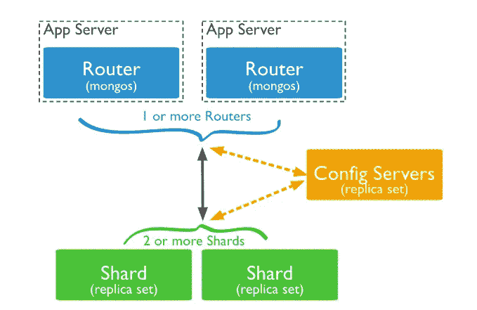
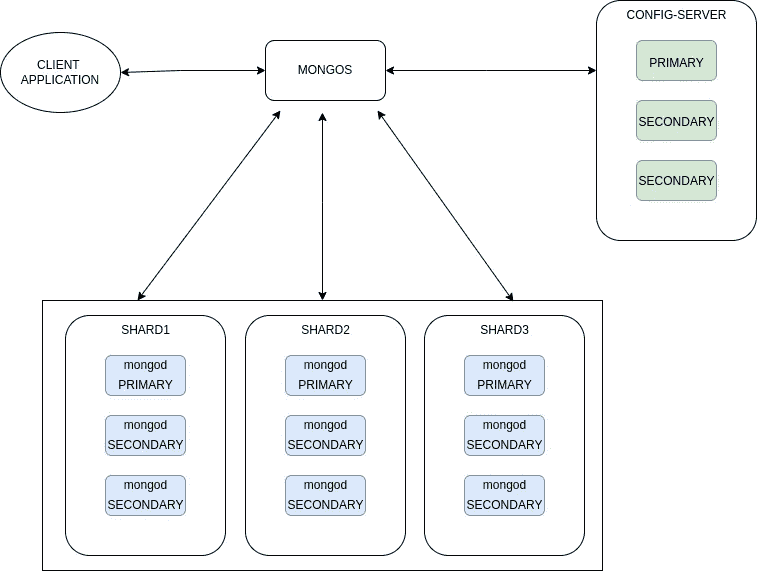

# Ubuntu 上的 MongoDB 分片集群

> 原文：<https://blog.devgenius.io/mongodb-sharded-cluster-on-ubuntu-7522f20c9c6d?source=collection_archive---------3----------------------->

在这篇博客中，我将解释 MongoDB 分片集群。

# 那么，什么是 MongoDB 呢？


[https://www.mongodb.com/](https://www.mongodb.com/)

MongoDB 是一个开源的[跨平台](https://en.wikipedia.org/wiki/Cross-platform) [面向文档的数据库](https://en.wikipedia.org/wiki/Document-oriented_database)程序。被归类为一个 [NoSQL](https://en.wikipedia.org/wiki/NoSQL) 数据库程序，MongoDB 使用带有可选模式的 [JSON](https://en.wikipedia.org/wiki/JSON) 类文档。

# 什么是 MongoDB 分片，我们什么时候必须使用？

随着时间的推移，你在 Mongodb 中的数据会开始大量增长。当你在大数据上查询时，你会观察到它使用了大量的 CPU。要消除这个问题，需要使用 MongoDB 分片。

# MongoDB 分片集群架构



在 MongoDB 中，分片集群包括:

*   陶瓷或玻璃碎片
*   蒙哥斯
*   配置服务器

碎片是包含集群数据子集的副本集。

mongos 充当客户端应用程序的查询路由器，处理读写操作。它将客户端请求分派给相关的碎片，并将碎片的结果聚合成一致的客户端响应。

> 注意:客户端连接到 mongos，而不是单独的碎片。

配置服务器是分片元数据的权威来源。分片元数据反映了分片数据的状态和组织。元数据包含分片集合列表、路由信息等。

# 让我们使用 Ubuntu 开始部署 MongoDb 分片集群



在这次试验中，我将使用 3 台服务器:

*   127.0.0.1
*   127.0.0.2
*   127.0.0.3

在每台服务器上安装 MongoDB:

[](https://www.mongodb.com/docs/v4.4/tutorial/install-mongodb-on-ubuntu/) [## 在 Ubuntu 上安装 MongoDB 社区版

### MongoDB Atlas 是一个托管在云中的 MongoDB 服务选项，不需要安装开销，并提供免费的…

www.mongodb.com](https://www.mongodb.com/docs/v4.4/tutorial/install-mongodb-on-ubuntu/) 

[设置 MongoDB 分片的步骤](https://hevodata.com/learn/mongodb-sharding/#steps)

*   *第一步:配置 MongoDB 配置服务器*
*   *第二步:MongoDB 分片服务器的配置*
*   *步骤 MongoDB 查询路由器(Mongos)的配置*

# MongoDB 配置服务器集群的配置

对所有服务器重复这些步骤

## 1-转到/var/lib/mongodb 并运行下面的命令:

> sudo mkdirmongoConfigServer

## 2-转到/var/log/mongodb 并运行下面的命令:

> *sudo touch*mongoconfigserver . log

## 3-转到/etc/systemd/system 并运行下面的命令:

> *sudo nano mongoconfigserver . service*

```
[Unit]
Description=MongoDB Database Server
Documentation=[https://docs.mongodb.org/manual](https://docs.mongodb.org/manual)
After=network-online.target
Wants=network-online.target[Service]
User=mongodb
Group=mongodb
EnvironmentFile=-/etc/default/mongod
ExecStart=/usr/bin/mongod --config /etc/*mongoConfigServer*.conf
PIDFile=/var/run/mongodb/mongod.pid
# file size
LimitFSIZE=infinity
# cpu time
LimitCPU=infinity
# virtual memory size
LimitAS=infinity
# open files
LimitNOFILE=64000
# processes/threads
LimitNPROC=64000
# locked memory
LimitMEMLOCK=infinity
# total threads (user+kernel)
TasksMax=infinity
TasksAccounting=false# Recommended limits for mongod as specified in
# [https://docs.mongodb.com/manual/reference/ulimit/#recommended-ulimit-settings](https://docs.mongodb.com/manual/reference/ulimit/#recommended-ulimit-settings)[Install]
WantedBy=multi-user.target
```

## 4-转到/etc 并运行下面的命令:

> *$ sudo nano/etc/mongoconfigserver . conf*

```
storage:
  dbPath: /var/lib/mongodb/mongoConfigServer
  journal:
    enabled: true
#  engine:
#  mmapv1:
#  wiredTiger:
# where to write logging data.systemLog:
  destination: file
  logAppend: true
  path: /var/log/mongodb/mongoConfigServer.log# network interfaces
net:
  port: 27018 #same on all server
  bindIp: 127.0.0.1  ***#NOTE: Change Ip***

#write ip of server
# how the process runsprocessManagement:
  timeZoneInfo: /usr/share/zoneinfo
#security:
#operationProfiling:
replication:
  replSetName: replsharding:
  clusterRole: configsvr
```

## 5-在所有 mongoDB 服务器上重新启动 mongoConfigServer 服务。

> *$ sudo systemctl 重启 mongoConfigServer*

## 6-连接到 mongo

> 【172.0.0.1:27018 $蒙戈

是时候发出集群配置服务器集的命令了。这意味着，MongoDB 配置服务器是集群化的，共享主要和次要成员。在这里，您可以使用与上面定义的相同的副本集名称。

```
rs.initiate(
{
_id: "repl",
configsvr: true,
members: [
{ _id : 0, host : "127.0.0.1:27018" },
{ _id : 1, host : "127.0.0.2:27018" },
{ _id : 2, host : "127.0.0.3:27018" }]
}
)
```

**注:执行此 6。只踩 1 台服务器**

# MongoDB 分片服务器的配置

对所有服务器重复这些步骤

## 1-转到/var/lib/mongodb 并运行下面的命令:

> sudo mkdirmongoshard 01 mongoshard 02 mongoshard 03

## 2-转到/var/log/mongodb 并运行下面的命令:

> *sudo touch*mongoshard 01 . log mongoshard 02 . log mongoshard 03 . log

## 3-转到/etc/systemd/system 并运行下面的命令:

> *须藤纳米* mongoShard01.service

```
[Unit]
Description=MongoDB Database Server
Documentation=[https://docs.mongodb.org/manual](https://docs.mongodb.org/manual)
After=network-online.target
Wants=network-online.target[Service]
User=mongodb
Group=mongodb
EnvironmentFile=-/etc/default/mongod
ExecStart=/usr/bin/mongod --config /etc/*mongoShard01*.conf
PIDFile=/var/run/mongodb/mongod.pid
# file size
LimitFSIZE=infinity
# cpu time
LimitCPU=infinity
# virtual memory size
LimitAS=infinity
# open files
LimitNOFILE=64000
# processes/threads
LimitNPROC=64000
# locked memory
LimitMEMLOCK=infinity
# total threads (user+kernel)
TasksMax=infinity
TasksAccounting=false# Recommended limits for mongod as specified in
# [https://docs.mongodb.com/manual/reference/ulimit/#recommended-ulimit-settings](https://docs.mongodb.com/manual/reference/ulimit/#recommended-ulimit-settings)[Install]
WantedBy=multi-user.target
```

> sudo nano mongoshard 02 . service

```
[Unit]
Description=MongoDB Database Server
Documentation=[https://docs.mongodb.org/manual](https://docs.mongodb.org/manual)
After=network-online.target
Wants=network-online.target[Service]
User=mongodb
Group=mongodb
EnvironmentFile=-/etc/default/mongod
ExecStart=/usr/bin/mongod --config /etc/*mongoShard02*.conf
PIDFile=/var/run/mongodb/mongod.pid
# file size
LimitFSIZE=infinity
# cpu time
LimitCPU=infinity
# virtual memory size
LimitAS=infinity
# open files
LimitNOFILE=64000
# processes/threads
LimitNPROC=64000
# locked memory
LimitMEMLOCK=infinity
# total threads (user+kernel)
TasksMax=infinity
TasksAccounting=false# Recommended limits for mongod as specified in
# [https://docs.mongodb.com/manual/reference/ulimit/#recommended-ulimit-settings](https://docs.mongodb.com/manual/reference/ulimit/#recommended-ulimit-settings)[Install]
WantedBy=multi-user.target
```

> sudo nano mongoshard 03 . service

```
[Unit]
Description=MongoDB Database Server
Documentation=[https://docs.mongodb.org/manual](https://docs.mongodb.org/manual)
After=network-online.target
Wants=network-online.target[Service]
User=mongodb
Group=mongodb
EnvironmentFile=-/etc/default/mongod
ExecStart=/usr/bin/mongod --config /etc/*mongoShard03*.conf
PIDFile=/var/run/mongodb/mongod.pid
# file size
LimitFSIZE=infinity
# cpu time
LimitCPU=infinity
# virtual memory size
LimitAS=infinity
# open files
LimitNOFILE=64000
# processes/threads
LimitNPROC=64000
# locked memory
LimitMEMLOCK=infinity
# total threads (user+kernel)
TasksMax=infinity
TasksAccounting=false# Recommended limits for mongod as specified in
# [https://docs.mongodb.com/manual/reference/ulimit/#recommended-ulimit-settings](https://docs.mongodb.com/manual/reference/ulimit/#recommended-ulimit-settings)[Install]
WantedBy=multi-user.target
```

## 4-转到/etc 并运行下面的命令:

> *$ sudo nano/etc/mongoshard 01 . conf*

```
storage:
  dbPath: /var/lib/mongodb/mongoShard01
  journal:
    enabled: true
#  engine:
#  mmapv1:
#  wiredTiger:
# where to write logging data.systemLog:
  destination: file
  logAppend: true
  path: /var/log/mongodb/mongoShard01.log# network interfaces
net:
  port: 27019 #same on all server
  bindIp: 127.0.0.1  ***#NOTE: Change Ip***

# how the process runsprocessManagement:
  timeZoneInfo: /usr/share/zoneinfo
#security:
#operationProfiling:
replication:
  replSetName: shardreplica01sharding:
  clusterRole: shardsvr
```

> *$ sudo nano/etc/mongoshard 02 . conf*

```
storage:
  dbPath: /var/lib/mongodb/mongoShard02
  journal:
    enabled: true
#  engine:
#  mmapv1:
#  wiredTiger:
# where to write logging data.systemLog:
  destination: file
  logAppend: true
  path: /var/log/mongodb/mongoShard02.log# network interfaces
net:
  port: 27020 #same on all server
  bindIp: 127.0.0.1  ***#NOTE: Change Ip***

#write ip of server
# how the process runsprocessManagement:
  timeZoneInfo: /usr/share/zoneinfo
#security:
#operationProfiling:
replication:
  replSetName: shardreplica02sharding:
  clusterRole: shardsvr
```

> *$ sudo nano/etc/mongoshard 03 . conf*

```
storage:
  dbPath: /var/lib/mongodb/mongoShard03
  journal:
    enabled: true
#  engine:
#  mmapv1:
#  wiredTiger:
# where to write logging data.systemLog:
  destination: file
  logAppend: true
  path: /var/log/mongodb/mongoShard03.log# network interfaces
net:
  port: 27021 #same on all server
  bindIp: 127.0.0.1  ***#NOTE: Change Ip***

# how the process runsprocessManagement:
  timeZoneInfo: /usr/share/zoneinfo
#security:
#operationProfiling:
replication:
  replSetName: shardreplica03sharding:
  clusterRole: shardsvr
```

## 5-重启所有 mongoDB 服务器上的服务。

> *$ sudo system CTL restart mongoshard 01 mongoshard 02 mongoshard 03*

## 6-连接到碎片

> *$蒙戈 172.0.0.1:27019*

```
rs.initiate(
{
_id : shardreplica01,
members: [
{ _id : 0, host : "172.0.0.1:27019" },
{ _id : 1, host : "172.0.0.2:27019" },
{ _id : 2, host : "172.0.0.3:27019" }]
}
)
```

> *$蒙戈 172.0.0.2:27020*

```
rs.initiate(
{
_id : shardreplica02,
members: [
{ _id : 0, host : "172.0.0.1:27020" },
{ _id : 1, host : "172.0.0.2:27020" },
{ _id : 2, host : "172.0.0.3:27020" }]
}
)
```

> *$蒙戈 172.0.0.3:27021*

```
rs.initiate(
{
_id : shardreplica03,
members: [
{ _id : 0, host : "172.0.0.1:27021" },
{ _id : 1, host : "172.0.0.2:27021" },
{ _id : 2, host : "172.0.0.3:27021" }]
}
)
```

# MongoDB 查询路由器(MONGOS)的配置

对所有服务器重复这些步骤

部署多个 mongos 路由器支持高可用性和可伸缩性

## 1-转到/var/log/mongodb 并运行下面的命令:

> *sudo touch mongos.log*

## 2-转到/etc/systemd/system 并运行下面的命令:

> *须藤纳米* mongos.service

```
[Unit]
Description=MongoDB Database Server
Documentation=[https://docs.mongodb.org/manual](https://docs.mongodb.org/manual)
After=network-online.target
Wants=network-online.target[Service]
User=mongodb
Group=mongodb
EnvironmentFile=-/etc/default/mongod
ExecStart=/usr/bin/mongos --config /etc/*mongos*.conf
PIDFile=/var/run/mongodb/mongod.pid
# file size
LimitFSIZE=infinity
# cpu time
LimitCPU=infinity
# virtual memory size
LimitAS=infinity
# open files
LimitNOFILE=64000
# processes/threads
LimitNPROC=64000
# locked memory
LimitMEMLOCK=infinity
# total threads (user+kernel)
TasksMax=infinity
TasksAccounting=false# Recommended limits for mongod as specified in
# [https://docs.mongodb.com/manual/reference/ulimit/#recommended-ulimit-settings](https://docs.mongodb.com/manual/reference/ulimit/#recommended-ulimit-settings)[Install]
WantedBy=multi-user.target
```

## 3-转到/etc 并运行下面的命令:

> *$ sudo nano/etc/mongos . conf*

```
#  engine:
#  mmapv1:
#  wiredTiger:
# where to write logging data.systemLog:
  destination: file
  logAppend: true
  path: /var/log/mongodb/mongos.log# network interfaces
net:
  port: 27017 #same on all server
  bindIp: 127.0.0.1  ***#NOTE: Change Ip***

# how the process runsprocessManagement:
  timeZoneInfo: /usr/share/zoneinfo
#security:
#operationProfiling:sharding:
  configDB: repl/172.0.0.1:27018,172.0.0.2:27018,172.0.0.3:27018
# configDB: <configReplSetName>/cfg1.example.net:27019, cfg2.example.net:27019,
```

## 4-重启 Mongos 服务

> *$ sudo systemctl 重启 mongos*

## 5-给 Mongos 添加碎片

> *$蒙戈 172.0.0.1:27017*

sh . addshard(" shardreplica 01/172 . 0 . 0 . 1:27019，172.0.0.2:27019，172.0.0.3:27019 ")

sh . addshard(" shardreplica 02/172 . 0 . 0 . 1:27020，172.0.0.2:27020，172.0.0.3:27020 ")

sh . addshard(" shardreplica 03/172 . 0 . 0 . 1:27021，172.0.0.2:27021，172.0.0.3:27021 ")

完成后，您就部署了分片集群。