# Mongoose 鉴别器:一种继承模式属性的简单方法

> 原文：<https://blog.devgenius.io/mongoose-discriminator-an-easy-way-to-inherit-schema-properties-6c6e89c3795?source=collection_archive---------3----------------------->


[凸轮](https://unsplash.com/@cmrnrd?utm_source=medium&utm_medium=referral)在[上的照片](https://unsplash.com?utm_source=medium&utm_medium=referral)

# 介绍

如今，服务器结构的构建怎么强调都不为过，由于为满足客户需求而提供的高服务，这种结构往往会随着时间的推移而变得更大，因此，需要一个精通如何为应用程序设计良好模型的后端工程师。

我是一名 Mern 堆栈工程师，相信我，我知道如果处理不当，随着需求的增加，这种情况会让人发疯。

作为后端工程师，您可能希望克服双重/多重模式结构中相同属性的重复，以提高服务器性能。是的，我知道你会说，模式的 ref 属性可以做到这一点。

此外，您可能试图创建一个用户模式— client/admin，并希望将它们保存为一个集合，但使用不同的属性。

你是使用 restful API 构建 API 结构，使用 MongoDB 管理数据的后端工程师吗？如果您一直在寻找一种解决方案来减少上述问题，从而提高性能、更聪明地工作并学习最佳代码实践，那么这篇文章就是为您准备的。

# 要学习的东西

在本文中，我将指导您完成以下工作:

*   处理应该具有相似属性的模式结构的构建
*   使用 mongoose 鉴别器轻松继承另一个模式的属性，
*   构建 API 网关
*   对 API 请求使用 vscode

# 先决条件

*   了解 Javascript
*   Know NodeJs/Expressjs
*   安装节点/npm

# 设置您的环境

首先，让我们导航到终端，并在下面的代码片段中安装以下内容:

```
cd desktopmkdir mongoose_discriminatorcd mongoose_discriminatornpm init -ynpm i express cors dotenv mongooseCode .
```

我进入桌面文件夹并创建了一个名为 mongoose _ descriminator 的文件夹，在其中，我用默认条目初始化 package.json 文件，安装我将使用的包，最后用 vs 代码打开该文件夹。

让我们进入 package.json 文件并调整脚本属性，如下所示:

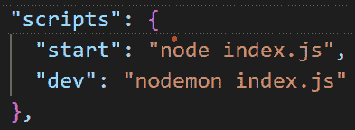

在上面的代码片段中，start 属性将使用服务器的当前更改启动服务器，而不寻找后续的更改，而 dev 属性使用在前面的代码片段中安装的 nodemon 来处理服务器的后续更改。

Index.js 文件是我启动服务器的地方。请注意，这些属性是为了让我们不要在终端中运行属性值。

# 启动服务器

在根文件夹中，我将创建 index.js 文件作为脚本属性的值，并向其中添加以下代码片段:

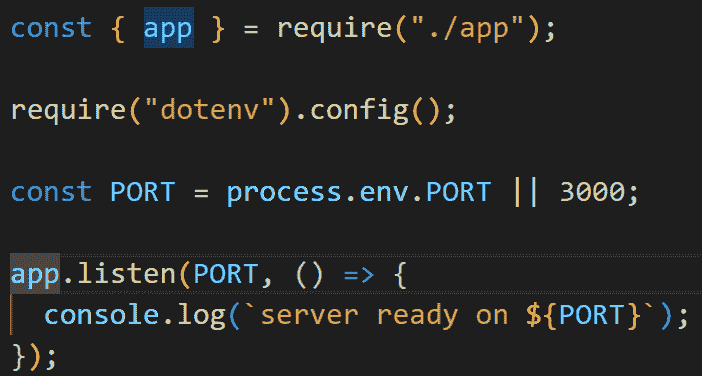

我导入了 app 文件，它将保存其他所有不委托启动和连接服务器与数据库(MongoDB)的配置。我将把所有重要的变量放在 env 环境中。我需要 dotenv 配置来访问需要的 env 变量。

端口被设置为包含我希望服务器在其上运行的端口，或者由托管公司 Heroku 指定的任何端口。最后，我设置了一个监听器来知道服务器何时启动并运行。

# 连接到 MongoDB 数据库

要将我们的应用程序连接到数据库，请将以下代码片段添加到 index.js 中:

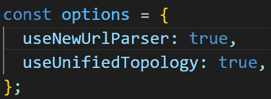

在上面的代码片段中，我设置了使用 mongoose 建立到 MongoDB 的连接所需的选项。该选项被设置为 mongoose connect 方法的参数，如下所示:

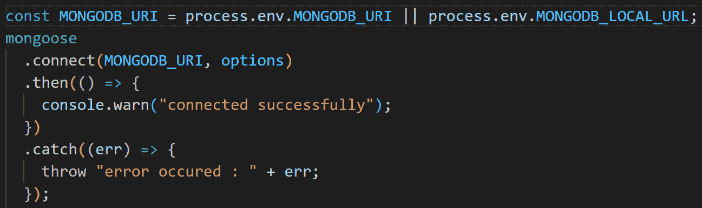

我访问了环境变量，并获得了 MongoDB 连接的开发和生产 URI。mongoose connect 方法接受两个参数，options 和 Uri。我按照 mongoose connect 方法的要求传递了两个参数。

它返回一个承诺，在被解决后，在我的例子中，一旦连接成功，我就打印一个成功消息，如果连接失败，就捕捉任何错误。

请注意，我为将服务器连接到 MongoDB 而添加的所有内容都在上面的“app.listen”方法之前。

# 添加标准

现在我已经连接到数据库并启动了服务器，让我们创建一个名为 app.js 的文件，并添加如下所示的标准:

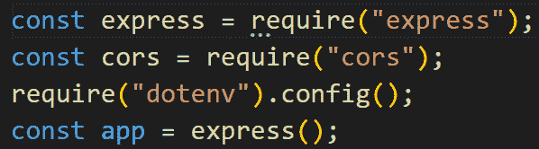

我定义了我的全局变量， [express](https://expressjs.com/en/starter/installing.html) 和 [cors](https://developer.mozilla.org/en-US/docs/Web/HTTP/CORS) ，并声明了 app 变量来保存 express 方法。注意，app 变量是我在上面的 index.js 文件中导入的。

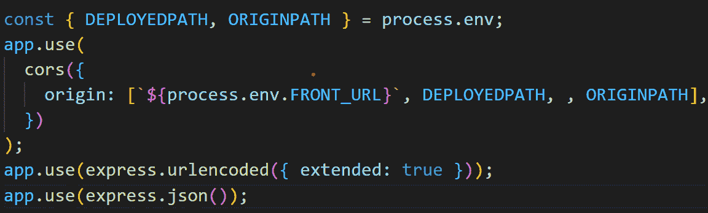

在上面的代码片段中，我析构了环境变量，使用 app.use(cors())方法设置了可以向服务器执行请求的允许 URL(client)，并使用 express.urlencoded 和 express.json()解析了请求的主体。

如果您同意我的观点，请转到终端，让我们启动服务器，如下所示:

```
npm run dev
```

如果您看到下面的代码片段，那么您已经成功启动了一个服务器并连接到 MongoDB 数据库。

```
server ready on 3000connected successfully
```

# 文件夹结构

让我们进入根文件夹，创建一个名为 src 的文件夹，在其中，我们创建另外三个名为:

*   模型
*   控制器
*   途径

在模型文件夹中，我们创建一个名为 model.user 的文件，在控制器中，我们创建一个名为 controller.user 的文件，在 Routes 文件夹中，我们创建一个名为 route.user 的文件，如下所示:

```
mkdir srccd srcmkdir Model Controller Routescd Modeltouch model.user.js _coreUser.js model.admin.jscd ..cd Controllertouch controller.usercd ..cd Routestouch routes.user
```

# 模式设计

在开始模式设计之前，我将创建一个名和姓相同的用户和管理员模式。让我们进入 _coreUser 文件，并向其中添加以下内容:

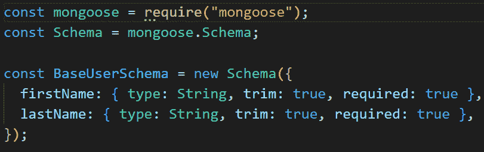

我导入了 mongose，访问了 mongose 的 schema 属性，并创建了一个包含名字和姓氏的基本模式。请注意，coreUser 文件包含用户和管理员将共享的公共属性。

当使用 mongoose 鉴别器时，它允许我们添加一个键和一个默认的集合名称——可选的，如下所示:

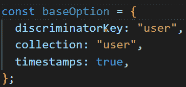

所以在这里，我声明了一个 baseOption 变量，它保存一个具有属性的对象；discriminatoryKey，用作区分两个模式的惟一键——user/admin，collection，用于覆盖添加的模型名称，以及 timeStamp，用于捕获集合的创建和更新时间。

让我们在模式的选项参数处添加 baseOption，如下所示:


BaseUserSchema 设计现在看起来像上面的代码片段。最后，我将导出模式以供其他模式继承，如下所示:

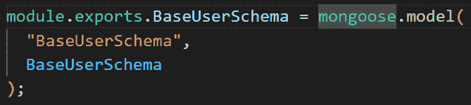

在上面的代码片段中，我创建了模式和 MongoDB 数据库之间的通信，并将模式名指定为 base user schema——它将被我在上面的选项变量中设置的集合属性覆盖，模式本身作为第二个参数。

# 设计用户模式

让我们进入我在上面创建的 model.user 文件，并向其中添加以下内容:

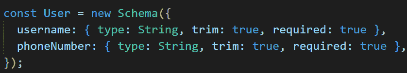

我创建了一个模式，保存用户应该拥有的其他属性，就像 baseSchema 一样，mongoose 和 schema 也是以同样的方式添加的。

因此，为了继承在上面的 baseUser 模式中创建的名字和姓氏，我将首先向您展示您可能在网上看到的内容。为了演示这一点，我必须对基本模式进行一点调整，删除 baseOption 并传入一个只保存时间戳的对象，如下所示:

```
{timeStamp: true}
```

在 userSchema 中，我将添加一个新的 Schema 属性，如下所示:

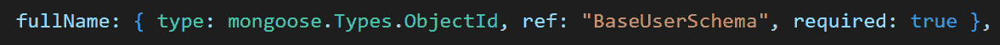

在上面的代码片段中，我使用用于在数据库中保存用户数据的 id 作为对 baseUserSchema 的引用，并将我想要访问其集合的模式的模型名称设置为 ref 值。

因此，当您使用 ref 方法时，会发生以下情况:

*   在数据库中创建一个单独的集合，
*   在创建其他引用属性之前，首先创建 baseUser 数据
*   将全名作为 objectId
*   不会是统一的

上面的代码片段将显示下面的代码片段:

```
{username:"username",phoneNumber: "+2348169543479",fullName: ObjectId("Id");}
```

同时，您想要的可能是类似下面的代码片段:

```
{username:"username",phoneNumber: "+2348169543479",firstName: “princewill”,lastName:”chime”}
```

因此，我将继续向您展示如何继承 baseschema 属性，而不是在下面的代码片段中引用它们:

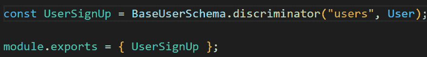

与使用 mongoose.model()方法的 baseUser 模式不同，我导入了 baseUser schema，访问了包含两个参数的 discriminator 属性，第一个参数是用于保存用户集合的键，第二个参数是用户的属性，最后，我导出了 userSignup 模型，以便在我即将创建的控制器函数中使用。

# 创建管理模式

在我之前创建的 model.admin 文件中，我们添加以下代码片段:

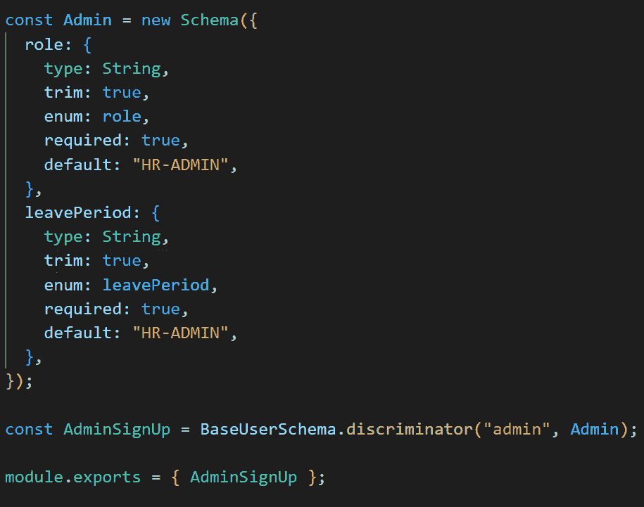

在上面的代码片段中，管理员被设置为具有两个不同于用户模式的属性。与上面的用户模式一样，我将一个管理文本设置为一个键，用于引用数据库中的管理集合。role 和 leavePeriod 枚举在模式上方声明，如下所示:

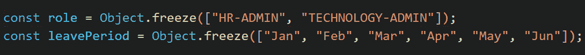

角色拥有管理员的角色，leavePeriod 拥有管理员休假的月份。

# 控制器的创建

在我上面创建的 controller.user 文件中，添加以下代码片段:

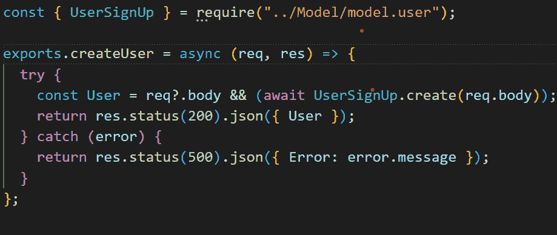

我创建了 createUser 函数来处理用户的新实例。为了确保保存用户数据，我必须导入 UserSignUp，以便 baseschema 将数据保存到用户集合中，而不是管理集合中。

req.body 保存我将传递给 HTTP 请求的 req 主体的内容。我进行了检查以验证 req.body 不为空，我使用了 try 和 catch 方法来监视将数据保存到数据库的过程，以防出现任何错误。如果成功，我将创建的用户对象返回给客户机，如果错误，我将错误消息返回给客户机。

仍然在 controller.user 文件中，让我们创建将处理 admin 创建的控制器，如下所示:

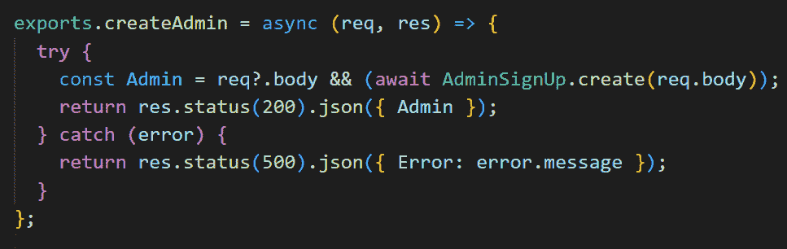

更像前面的代码片段，我导入了 AdminSignUp 而不是 userSignUp。

# 创建路线

在我上面创建的 route.user 文件中，让我们添加如下所示的代码片段:

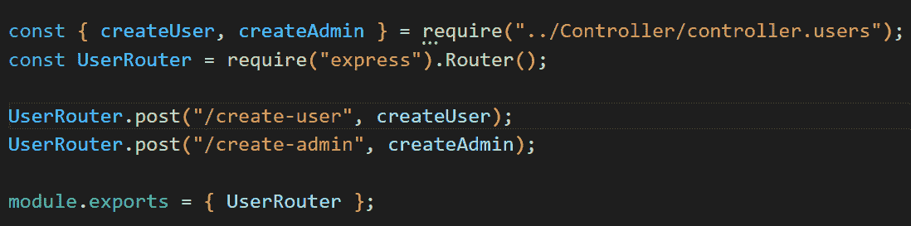

我从 controller.user 文件中导入了 createUser 和 createAdmin 控制器。UserRouter 拥有一个 Router 对象，我可以用它来引用任何 HTTP 请求方法，我使用 userRouter 的 post 方法来创建一个路径，并根据路径执行控制器函数，最后导出 UserRouter，以便在我前面创建的 app 文件中使用。

因此，在应用程序文件中，让我们用下面的代码片段来调整它:

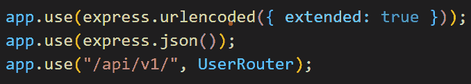

上面的代码片段将使我能够在任何分配的路径上观察用户请求。app.use()方法接受两个参数，第一个是 API 网关的前缀，第二个是路由器方法。

# 在 VsCode 中发出请求

接下来，我将使用一个名为:

```
httpYac - Rest Clientv5.5.6By Andreas Weber
```

要开始使用这个扩展，只需要创建一个带有 http-extension 的文件(filename.http ),然后按照[指南](https://marketplace.visualstudio.com/items?itemName=anweber.vscode-httpyac)开始

在文件 request.http 中，我们创建一个新用户和一个新管理员，如下所示:

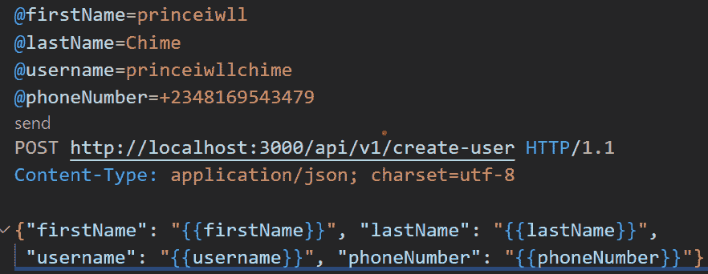

HttpYac 允许我们声明一个全局变量并使用它们，如上面的代码片段所示。我发出了一个 post 请求，设置了头部并在请求体中传递了全局变量。

让我们看看在下面的代码片段中创建的数据是什么样子的:

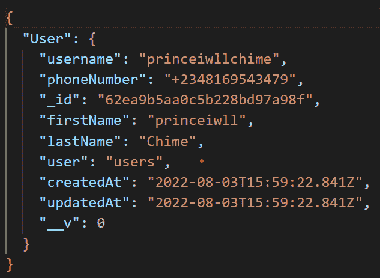

一旦请求成功，它就像上面的代码片段一样保存用户数据。请注意，firstName 和 lastName 没有保存为 ObjectId，而是保存为用户集合的属性。

此外，我还谈到了鉴别器键，在我的例子中，我为用户和管理模型分配了不同的键，即 users 和 admin。在数据库中，两个集合保存为一个用户，即在模式选项模型中分配给集合的值。

还要注意，我在集合中添加了一个新属性——“user”，这是我在 baseSchema 模型中分配的鉴别器键，这个键现在将作为值保存；不同型号的型号名称。

在下面的代码片段中，让我们看看管理集合的结构是怎样的:

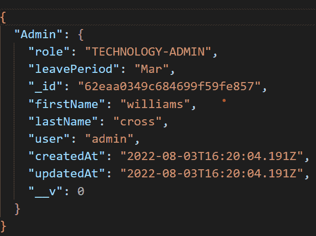

与用户数据结构不同，添加的属性“user”现在是 admin，即管理模型的名称。因为这是管理数据，所以角色和休假期是数据的一部分。

# 结论

最后，您可以看到我发出的 API 请求的结果。接下来，我希望您将开始使用 express.js 编写自己的服务器代码，构建 restful API，设计模式结构，处理来自服务器的请求，将 express 服务器连接到 MongoDB 数据库，最后，开始使用 mongoose 鉴别器继承属性，而不是使用 ref。

如果这篇文章对你有帮助，请在我的 [Linkedin](https://www.linkedin.com/in/chime-princewill-3a2b1b192/) 和 [Medium](https://princewillchime43.medium.com/) 上赞、评论、分享和关注我，以查看我的文章的更多内容。点击以下链接访问[源代码](https://github.com/chibuike07/mongoose-discriminator)。

请随意提出任何建议/意见。如果你有一个基于 Javascript/React.js 生态系统的主题，请联系我，我很乐意就此进行写作。谢谢