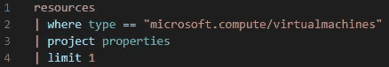
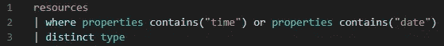
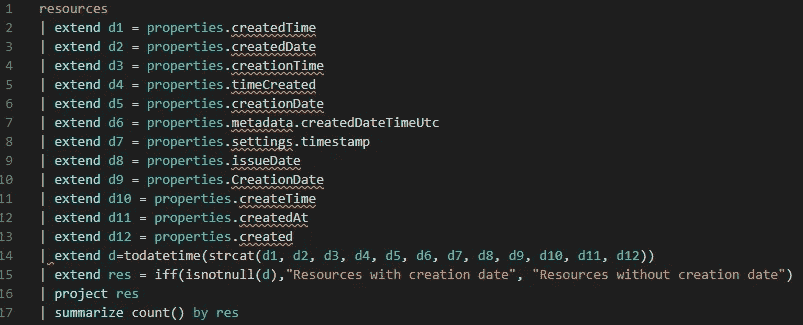
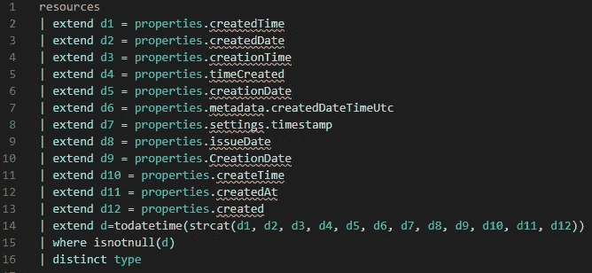
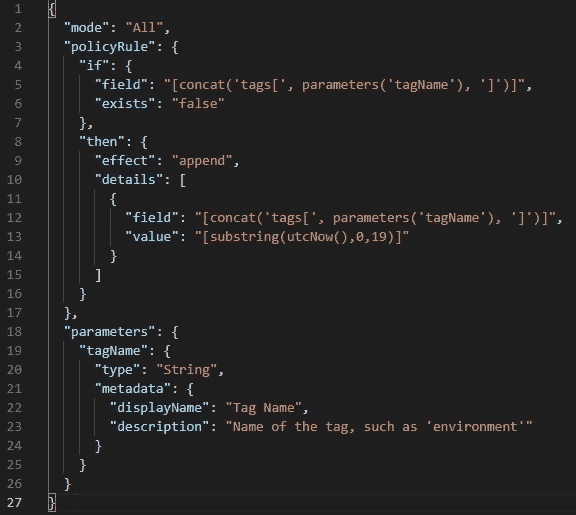
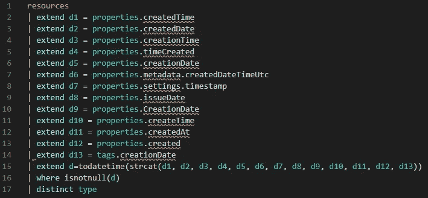
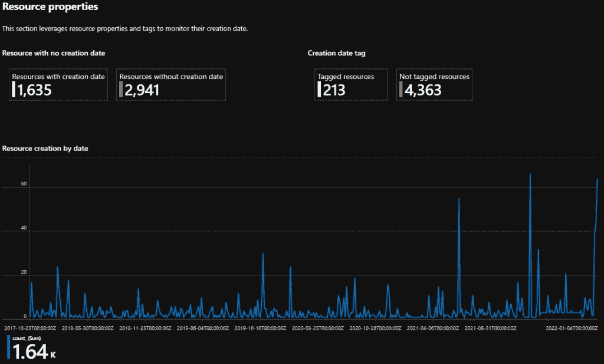

# 监控 Azure 资源创建

> 原文：<https://blog.devgenius.io/monitor-azure-resources-creation-and-deletion-fd841d514889?source=collection_archive---------7----------------------->

你可能已经注意到 Azure 中的一些资源类型不提供任何创建日期属性。例如，如果您查看虚拟机属性，您将看不到任何创建日期字段。您可以通过打开 *Azure Resource Explorer* 服务并运行以下查询来检查这一点。当查看结果时，您不会发现任何创建日期。

仅返回一个虚拟机属性的查询。

## 那么哪些资源类型包含创建日期呢？

答案很简单:必须为每种资源类型分析资源属性。例如，VMs 属性记录在[微软文档](https://docs.microsoft.com/en-us/azure/templates/microsoft.compute/virtualmachines?tabs=bicep#virtualmachineproperties)中，正如您所见，没有创建日期字段！

文档是很棒的，但是有许多资源类型，所以更快的方法是使用 *Azure Resource Graph* 服务，并寻找包含这两个字符串之一的资源属性:“日期”或“时间”。这不是一个 100%可靠的方法，因为，例如，**microsoft.web/sites/slots**资源类型具有 **runtimeAvailabilityState** 属性，但是很明显，它不是一个创建日期字段。但是这个查询仍然是有用的，因为它过滤了所有没有“日期”或“时间”字符串的资源*，也就是说*可能没有创建日期字段。

属性中包含“时间”或“日期”的所有资源类型。

对于剩余的资源，我们需要手动检查是否确实有一个创建日期字段。通过手动检查多个资源的属性，我检索了创建日期字段的列表。

该查询返回具有这 12 个创建日期字段之一的资源量，以及没有创建日期字段的资源量。

令人惊讶吧？至少有 12 个不同的创建日期字段！为了回答我们最初的问题，我们可以修改这个请求来返回资源类型。

该查询返回在其属性中具有创建日期字段的资源类型。

## 我如何监控其他资源？

对于属性中没有任何创建日期字段资源，您可以使用 Azure 策略。这是一项免费服务，允许您定义和应用多个策略。例如，您可以使用此类策略强制管理员仅部署特定规模的虚拟机，以优化成本。

在我们的例子中，我们可以创建一个策略，在资源创建时动态地创建一个标签:当将我们的策略分配给一个范围时(例如将 T1 分配给一个订阅)，我们将我们的标签命名为 **creationDate** 。因此，每当我部署选定范围内的资源时，我的 Azure 策略将添加一个名为 **creationDate** 的标签，其值将是当前日期时间(多亏了 **utcNow()** 函数)。

然后，我们可以修改前面的查询来收集所有的创建日期，包括存储在标记中的创建日期。在这个例子中，我将标签命名为 **creationDate** 。您可以看到在*行的第 14* 行上，列 **d13** 存储了我的 **creationDate** 标签。

## 我能找到一本工作手册来监控这个吗？

是的，但我目前正在建设它可能会定期更改。可以在我的 Github 上找到:[这里](https://github.com/Molx32/AwesomeAzureWorkbooks/blob/main/Workbooks/CreationDate)。

感谢您的阅读，希望对您有所帮助！