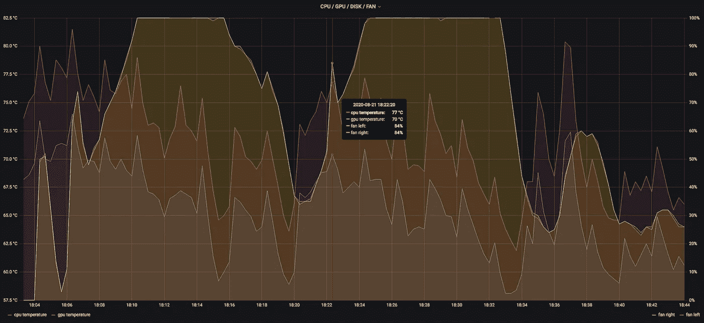
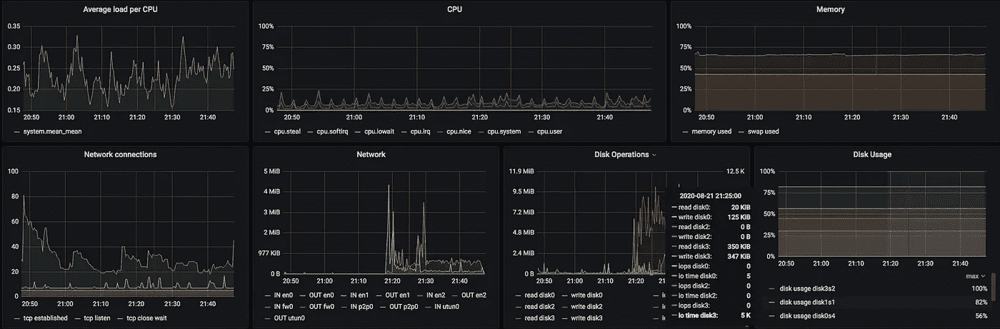
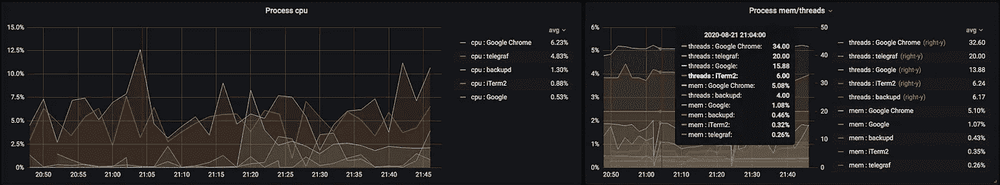

# 在 macOS 上使用 Telegraf 监控温度

> 原文：<https://blog.devgenius.io/monitor-temperatures-with-telegraf-on-macos-4a0eae03549d?source=collection_archive---------1----------------------->

## 温度| macOS | Telegraf | InfluxDB |监控

## 在 macOS 上使用 Telegraf 可以监控的内容:适用于书呆子、开发人员和 devops 初学者…



Mac Book Pro 的 CPU 和 GPU 温度以及风扇使用情况

# 这本小指南将涵盖

*   安装 Telegraf
*   配置 Telegraf(假设 InfluxDB 为输出)
*   配置高级插件`procstat`和自定义脚本
*   监控 macOS 温度和风扇
*   监控 macOS 电池状态

# 安装 Telegraf

基本上有两种安装 Telegraf 的方法:

*   从 Telegraf 下载或发布页面下载`tar.gz`:[https://portal.influxdata.com/downloads/](https://portal.influxdata.com/downloads/)
    [https://github.com/influxdata/telegraf/releases](https://github.com/influxdata/telegraf/releases)
*   **(首选)**通过[自制](https://brew.sh/) : `brew install telegraf`安装

无论哪种方式，您都应该得到一个包含示例`telegraf.conf`文件的现成安装。

# 配置电话嫁接

## 基本设置

您可以添加自己的`[global_tags]`,然后添加到发送到 InfluxDB 的所有指标中。

除此之外，您只需在`[agent]`类别中更改几项设置:

```
[agent]
  interval = "30s" # may want to lower it from default 10s...
  metric_buffer_limit = 10000 # if your InfluxDB can be aways for a few minutes, increase the local metrics buffer
  collection_jitter = "2s" # spread plugin execution randomly within 0-2 seconds
  debug = true # useful for the first run to check what gets sent
  logfile = "/usr/local/var/log/telegraf.log" # check here for errors
  hostname = host # value of the `host` tag
```

啊！不要忘记配置您的输出，在我们的例子中是一个本地运行的 docker InfluxDB 容器:

```
[[outputs.influxdb]]
  urls = ["http://localhost:8086"]
```

我的前一篇文章介绍了如何在几分钟内设置和运行 InfluxDB 和 Grafana:

[](https://medium.com/dev-genius/monitoring-your-machine-s-with-tig-a9ef39cd0eec) [## 使用 TIG 监控您的机器

### TIG = Telegraf，InfluxDB，Grafana。受众:开发人员、书呆子、devops 初学者…

medium.com](https://medium.com/dev-genius/monitoring-your-machine-s-with-tig-a9ef39cd0eec) 

## 标准输入插件

首先，打开你想要的标准插件:

*   `cpu, mem, disk, diskio, processes, swap, system, net, netstat`



来自标准输入插件的图形。

## 高级输入插件

还包括一些需要配置的插件，比如`procstat`。

我这里有一个*不寻常的*例子，它展示了你**可以**做什么，但是也会导致很大的负载。监控**所有**进程！

> 你不应该这样做！

```
[[input.procstat]]
  interval = "120s" # only every 2 minutes!
  exe = "." # EVERY program
  pid_finder = "native"
```

这个指标将有一个很高的基数(下面会有更多)，因为它将把曾经在我的机器上运行过的每一个程序名作为一个标记值写入`procstat`数据库……但是我想尝试一下，并检查哪些程序使用了我的 MAC 的大部分功能。原来 Telegraf 是一个重要的贡献者(由于这个插件！)



Procstats —每隔几分钟收集一次！

## 自定义脚本或二进制执行

这就是有趣的地方，因为你几乎可以做任何你想做的事情。根据我的经验，你需要考虑几件事:

*   该命令必须**只返回指标**。对于`influxdb`协议，每行一个。
*   该命令应**快速退出或失败**。确保在任何网络调用中配置合理的超时！例如:五秒钟对于一个 API 或 HTTP 调用的返回来说已经足够了(通常情况下)。
*   因此，在收集指标时，不要试图做复杂的事情。**保持简单**或“离线”收集指标，并在 Telegraf 执行命令时返回。
*   **不要混合度量**，创建通用度量(例如每秒请求数)或使用专用度量。
*   保持低基数。基数基本上就是标签不同组合的数量。这个数字越大，你的测量变得越大越慢，查询也越多。比较一下这两种情况:
    a) `host`标签:10 个值* `cpu-core`标签:~16 个值= **160 个**组合
    b) `host`标签:10 个值* `pid`标签:~2000 = **20000** 组合(如果不是更多)
    → **标签不使用唯一值。** `Pid`(进程 ID)是个坏主意，UUIDs 和生成的 docker 容器名也是——基本上是可以有很多不同值的任何东西。只对标签使用“类别”。
*   **规格化标签值**。小写或大写或任何其他已定义的大小写，不要混合大小写

我将在另一篇文章中介绍更多关于 InfluxDB 维护和有用查询的内容...

## 示例配置

```
[[inputs.exec]]
  commands = ["/my/script/metrics"]
  timeout = "5s"
  data_format = "influx"
```

## 示例指标输出:

```
my_measurement,host=foo,mytag=measure onevalue=5,val2=3234.34 1609459200000000000
```

*   `my_measurement`是一个“表格”(InfluxDB 称之为“测量”)，在这个表格中可以写入指标
*   `host=foo,mytag=measure`是可以用来分组和过滤的标签
*   `onevalue=5,val2=3234.34`是数值，可以用图形显示
*   `1609459200000000000`是当前的 unix 时间戳+9x“0”——使它成为一个纳秒时间戳。现在是`01/01/2021` UTC。

关于 InfluxDB 文档中协议的更多信息:

[](https://docs.influxdata.com/influxdb/v1.8/write_protocols/line_protocol_reference/) [## InfluxDB 线路协议参考| InfluxData 文档

### InfluxDB 线路协议是一种基于文本的格式，用于向 InfluxDB 写入指针。线路协议接受换行符…

docs.influxdata.com](https://docs.influxdata.com/influxdb/v1.8/write_protocols/line_protocol_reference/) 

# 监控 macOS 温度和风扇

为此，我写了一个小脚本。它使用`osx-cpu-temp`从 macOS SMC 读取数据。有一些其他的程序也可以做到这一点，但是我喜欢`osx-cpu-temp`的简单性，这是这种情况下的理想选择。

[](https://github.com/lavoiesl/osx-cpu-temp) [## lavoeisl/OS x-CPU-temp

### 输出 OSX 的当前 CPU 温度。在…上创建一个帐户，为 lavoeisl/OS x-CPU-temp 开发做贡献

github.com](https://github.com/lavoiesl/osx-cpu-temp) 

用`brew install osx-cpu-temp`安装。

在`/usr/local/bin/osx_stats`中创建文件并使其可执行:`chmod +x /usr/local/bin/mymetrics`。

然后在里面粘贴以下脚本:

```
#!/bin/bashtimestamp=$(date +%s)000000000
hostname=$(hostname | tr "[:upper:]" "[:lower:]")cpu=$(osx-cpu-temp -c | sed -e 's/\([0-9.]*\).*/\1/')
fans=$(osx-cpu-temp -f | grep '^Fan' | sed -e 's/^Fan \([0-9]\) - \([a-zA-Z]*\) side *at \([0-9]*\) RPM (\([0-9]*\)%).*/\1,\2,\3,\4/')echo "cpu_temp,tag=$hostname temp=$cpu $timestamp"for f in $fans; do
  side=$(echo "$f" | cut -d, -f2 | tr "[:upper:]" "[:lower:]")
  rpm=$(echo "$f" | cut -d, -f3)
  pct=$(echo "$f" | cut -d, -f4)
  echo "fan_speed,host=$hostname,side=$side rpm=$rpm,percent=$pct $timestamp"
done
```

现在，您可以通过执行脚本来测试它:

```
/usr/local/bin/osx_statscpu_temp,host=host temp=52.6 1609459200000000000
fan_speed,host=host,side=left rpm=1500,percent=43 1609459200000000000
fan_speed,host=host,side=right rpm=1500,percent=43 1609459200000000000 
```

## 你的作业(DIY)

*   扩展脚本，使其也报告 GPU 温度…

## 更多温度、功率、电流…

我已经为`osx-cpu-temp`库创建了一个拉请求。它允许您传递一个“SMC 键”来查询 SMC 中的单个值，以探索您的机器可以报告什么。给它一个👍如果你想看到它被合并(通过自制程序变得可用)。

如果你想试一试，你可以下载并自己构建它:

```
git clone [https://github.com/lavoiesl/osx-cpu-temp.git](https://github.com/lavoiesl/osx-cpu-temp.git)
cd osx-cpu-temp
git fetch origin pull/36/head:add-options
git checkout add-options
make
./osx-cpu-temp -c TCXC
```

[](https://github.com/lavoiesl/osx-cpu-temp/pull/36) [## 添加选项，允许通过 DrPsychick Pull 请求# 36 lavoeisl/OS x-CPU-temp 传递 SMC 密钥

### 保持默认行为允许可选传递 SMC 键添加选项转储所有或个别 SMC 键推理:有…

github.com](https://github.com/lavoiesl/osx-cpu-temp/pull/36) 

# 监控电池状态

我还不能用像`osx-cpu-temp`这样简单的控制台命令来解决这个问题。帮我一下，我会更新文章与大家分享。使用`osx-cpu-temp`似乎只能查询电池的功耗。

*   你知道一个在 macOS 上报告电池状态的简单(快速)控制台程序吗？

如果没有，而你正在寻找类似的东西，伸出手。我开始使用这个名为`sensei`的小工具，我非常感谢大家的帮助:

[](https://github.com/DrPsychick/homebrew-sensei) [## 心理学博士/家酿大师

### 在 macOS 上读取传感器信息。通过在…上创建帐户，为 DrPsychick/homebrew-sensei 开发做出贡献

github.com](https://github.com/DrPsychick/homebrew-sensei) 

# 你得到了什么

如果你不想自己设置一个仪表板，你可以简单地导入我从 Grafana 制作的仪表板，然后从那里开始。

[](https://grafana.com/grafana/dashboards/12918) [## Grafana 的 macOS 主机仪表板

### 温度的 macOS telegraf 指标和 osx-cpu-temp

grafana.com](https://grafana.com/grafana/dashboards/12918) 

运行您的 Telegraf，当安装了 Homebrew 时，您可以将它作为服务运行(并且它会在机器启动时启动)。

```
brew services (re)start telegraf
```


Mac Book Pro 的 CPU 和 GPU 温度以及风扇使用情况

# 快乐监控！

…感谢您的阅读！

请在评论中告诉我，我应该在下一篇文章中涵盖哪些内容。
或者用 macOS 上的自定义脚本分享你正在监控的内容！

[也很酷:监控推特粉丝](https://www.civo.com/learn/using-civo-kubernetes-to-gamify-twitter-with-prometheus-and-grafana)

[](https://www.civo.com/learn/using-civo-kubernetes-to-gamify-twitter-with-prometheus-and-grafana) [## 使用 Civo Kubernetes 与普罗米修斯和格拉法纳-Civo.com 一起游戏化 Twitter

### 这是从朱利安·皮沃托(@roidelapluie)的一条推文开始的:他创建了一个系统，可以让你绘制你的…

www.civo.com](https://www.civo.com/learn/using-civo-kubernetes-to-gamify-twitter-with-prometheus-and-grafana)