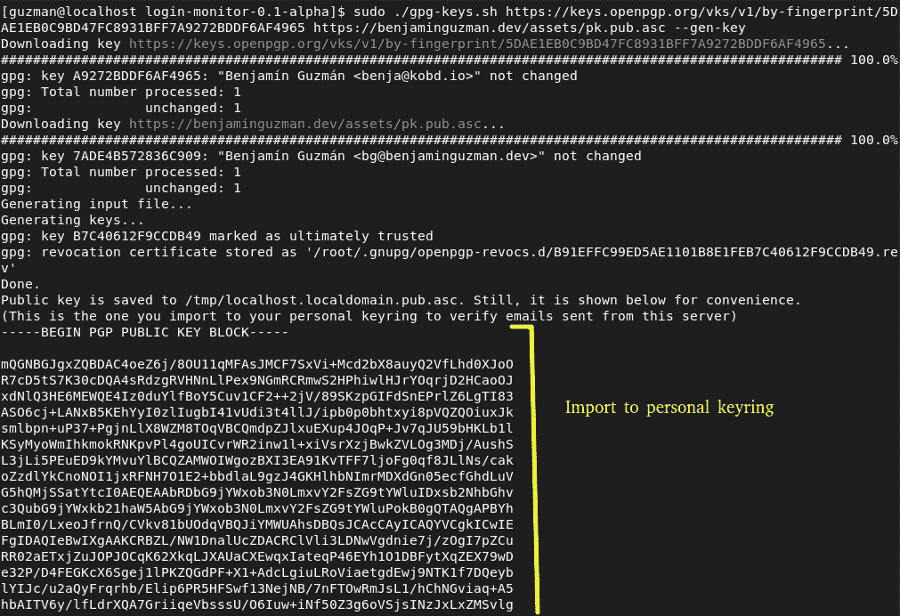

# 监控服务器登录

> 原文：<https://blog.devgenius.io/monitoring-logins-to-a-server-4cbd1515a4b9?source=collection_archive---------11----------------------->

斯诺登向美国国家安全局和全世界展示了**监控你的资产和保护它们一样重要**。因此，在这篇文章中，我们将看到如何监控登录到 Linux 服务器，并在每次成功登录后发送电子邮件。

为此，我在 https://github.com/BenjaminGuzman/login-monitor[创建了一个 GitHub 库，在那里你可以找到这里提到的所有脚本和代码。](https://github.com/BenjaminGuzman/login-monitor)

我假设你使用的是基于 RHEL 的发行版，并且你知道一些关于 PAM(查看 [RHEL 文档](https://web.mit.edu/rhel-doc/5/RHEL-5-manual/Deployment_Guide-en-US/ch-pam.html))和 audit(查看 [RHEL 文档](https://access.redhat.com/documentation/en-us/red_hat_enterprise_linux/7/html/security_guide/sec-defining_audit_rules_and_controls))的知识，以及像 JSON、非对称加密、CLI 用法等基础知识。然而，我的 GiHub repo 包含了各种脚本，可以帮助你，使它不那么困难。

为了简单起见，这篇文章分为三个部分:

1.  服务器配置
2.  发送带有系统信息的加密和签名电子邮件的脚本配置，以供进一步分析
3.  PAM 配置，以便在任何成功登录后执行脚本

# 服务器配置

(我假设服务器已经有了用户、SSH、权限等的基本配置。互联网上有大量的文档)

首先，我们需要安装`[audit](https://access.redhat.com/documentation/en-us/red_hat_enterprise_linux/8/html/security_hardening/auditing-the-system_security-hardening)`来记录服务器中的活动，安装`gnupg2`是因为我们需要管理密钥来签名和加密我们的数据

`sudo dnf install audit gnupg2 && sudo systemctl enable --now auditd`

现在将源代码下载并解压到一个临时位置，例如`/tmp`。

```
curl -L -O [https://github.com/BenjaminGuzman/login-monitor/archive/refs/tags/v0.4.tar.gz](https://github.com/BenjaminGuzman/login-monitor/archive/refs/tags/v0.1-alpha.tar.gz) && tar xf v0.4.tar.gz && cd login-monitor-0.4
```

(请务必下载最新的稳定版本，即将`v0.4`替换为可用的最新版本)

## 审计规则配置

默认情况下`audit`记录基本信息，所以如果你想记录更具体的事件，你需要编写新的规则。脚本`[download-audit-rules.sh](https://github.com/BenjaminGuzman/login-monitor/blob/master/download-audit-rules.sh)`下载一些常用的。要了解有关审计规则的更多信息，请参见附录 A 和 [RHEL 文件](https://access.redhat.com/documentation/en-us/red_hat_enterprise_linux/7/html/security_guide/sec-defining_audit_rules_and_controls)。

该脚本不接收任何参数，并且需要 root 权限，因为规则保存在`/etc/audit/rules.d`中


建议您**阅读下载的规则**，并根据需要进行修改。完成后，**重启**机器。

## PGP 密钥配置

让我们下载所需的收件人密钥来加密电子邮件(因为它可能包含敏感信息)，并为服务器生成一个 PGP 密钥对，以便对电子邮件进行签名(在这种情况下需要不可否认性)。如果你不知道 PGP 是什么，就去查[这个](https://protonmail.com/blog/what-is-pgp-encryption/)帖子。

脚本`[gpg-keys.sh](https://github.com/BenjaminGuzman/login-monitor/blob/v0.1-alpha/gpg-keys.sh)`将帮助我们做到这一点。它接收作为位置参数的 URL，从这些 URL 可以下载公钥，并且可以提供`--gen-key`来生成新的密钥对。



为服务器生成的公钥以黄色突出显示


密码文件以黄色突出显示

您需要记住**密码文件位置**和**密钥 id** ，因为我们稍后会用到。

现在将生成的公钥导入到您的**个人**钥匙圈(从您将打开电子邮件的机器)中，以便您可以验证电子邮件签名。

***注*** :雷鸟等一些邮件客户端无法处理单收件人加密邮件，所以你需要为两个或两个以上的收件人加密邮件，即使你只发给一个。所以我下载了两个公钥。

# 发送电子邮件的脚本

我不会深入脚本的细节，因为我宁愿解释它的配置。但是，当然，你可以查看[源代码](https://github.com/BenjaminGuzman/login-monitor)。

建议将所有配置文件保存在`/root/.login-monitor`目录下。这可能看起来很奇怪，因为它违反了最小特权原则，但这样做是因为您不会手动运行脚本，相反，PAM 将使用 uid=0 (root 用户)来运行它。

## 脚本配置

您可以在 [schema.json](https://github.com/BenjaminGuzman/login-monitor/blob/v0.1-alpha/schema.json) 中检查所有的配置选项。我将使用以下配置并将其存储在`config.json`中

```
{
  "$schema": "https://raw.githubusercontent.com/BenjaminGuzman/login-monitor/master/schema.json",
  "sender": {
    "email": "bg@benjaminguzman.dev",
    "pgpKeyId": "0xB7C40612F9CCDB49"
  },
  "recipient": {
    "email": "bg@benjaminguzman.dev",
    "pgpKeyId": "bg@benjaminguzman.dev"
  },
  "cc": [{
    "email": "",
    "pgpKeyId": "benja@kobd.io"
  }],
  "subject": "New login on %h at %t RFC822Z t%",
  "textMessage": "./message.txt",
  "htmlMessage": "./message.html",
  "senderPassFile": "/root/localhost.localdomain-17687.txt",
  "attachments": ["/var/log/audit"]
}
```

这里有几件事值得注意:

*   发送者的`pgpKeyId`是我们之前生成的密钥的 id。这可能会导致问题，因为电子邮件 *bg@benjaminguzman.dev* 与该键没有关联。我找到的唯一解决方法是[编辑 pgp 密钥](https://docs.github.com/en/authentication/managing-commit-signature-verification/associating-an-email-with-your-gpg-key)并添加真实的发件人邮件。
*   `0xB7C40612F9CCDB49`是我们之前用`gpg-keys.sh`脚本生成的密钥的 id。
*   抄送收件人电子邮件为空，这表明该电子邮件将对 *bg@benjaminguzman.dev* 和 *benja@kobd.io* 进行加密，但该电子邮件实际上将只发送到 *bg@benjaminguzman.dev* 。当然，如果你设置了抄送收件人的邮箱，那个人也会收到邮件。
*   在主题字符串`New login on %h at %t RFC822Z t%`中，`%h`是主机名的占位符，`%t RFC822Z t%`是当前时间的占位符(将根据`RFC822Z`格式化，查看[源代码](https://github.com/BenjaminGuzman/login-monitor/blob/master/helpers.go#L38)了解更多)
*   `/root/localhost.localdomain-17687.txt`是之前为我们生成的密码文件。
*   因为`attachments`中的唯一条目指向一个目录，所以`/var/log/audit`中的所有文件都将被附加到电子邮件中。

`message.txt`的内容有:

```
New login on %h at %t RFC822Z t%.
Details are provided as attachments.
Remember this information is confidential and please, RESPECT THE PRIVACY of other users
System users:
%f /etc/passwd f%
```

`message.html`的内容有:

```
<html lang="es">
    <body>
        <p>New login on <b>%h</b> at <b>%t RFC822Z t%</b></p><br/>
        <p>Details are provided as attachments</p><br/>
        <p><i>Remember this information is confidential and please, RESPECT THE PRIVACY of other users</i></p>
        <p>System users:</p>
        <pre>%f /etc/passwd f%</pre>
    </body>
</html>
```

您可能已经注意到，您可以在消息中包含占位符，例如用`%h`表示主机名，`%f <filename> %f`表示文件内容，或者`%t <format> %t`表示当前时间。

## Gmail 客户端配置

这段代码的一个优点是它使用了**策略模式**来发送电子邮件。因此，很容易改变发送电子邮件的实际服务(Gmail、SendGrid、postfix 等)。

我更喜欢使用 Gmail，因为它是免费的(当然，就像免费啤酒一样)，设置有点简单，它有很好的声誉，它经过了很好的测试，因此它的交付问题较少。

说了这么多，还是先从配置说起吧。

1.  打开 https://console.cloud.google.com/projectcreate[并创建一个项目](https://console.cloud.google.com/projectcreate)
2.  启用 Gmail API(菜单> API 和服务>启用的 API 和服务>启用 API 和服务，搜索 Gmail 并启用它)


现在让我们创建脚本将用来访问 Gmail API 的凭证。我试着用一个服务账号，但是好像不行([相关 GitHub 问题](https://github.com/googleapis/google-api-go-client/issues/645))。因此，我们必须使用 OAuth2 凭据。

3.配置 OAuth2 同意屏幕(菜单> API 和服务> OAuth 同意屏幕)。配置由你决定，只需考虑[令牌过期原因](https://developers.google.com/identity/protocols/oauth2#expiration)。

4.创建 OAuth2 凭据(菜单> API 和服务>凭据>创建凭据> OAuth 客户端 ID)。选择“网络应用”作为应用类型，并将[https://developers.google.com/oauthplayground](https://developers.google.com/oauthplayground)添加到“授权重定向 URIs”中。

创建 OAuth2 凭据后，将出现一个包含您的客户端 id、客户端密码和下载按钮的弹出窗口。点击下载，将文件保存为配置目录`/root/.login-monitor`中的`oauth2-config.json`。

5.前往[https://developers.google.com/oauthplayground](https://developers.google.com/oauthplayground)创建您的代币。

5.1.单击配置按钮(绿色)并填写步骤 4 中的信息(黄色)。


5.2.在“选择&授权 API”下选择[https://www.googleapis.com/auth/gmail.send](https://www.googleapis.com/auth/gmail.send)，点击授权 API，并在同意屏幕中给出您的同意。

5.3.现在转到“步骤 2 用授权码交换令牌”并获得两个令牌，一个刷新令牌和一个访问令牌。

5.4.将您的令牌保存在名为`oauth2-token.json`的文件中。它应该是这样的:

```
{
  "refresh_token": "<the refresh token you obtained previously>",
  "access_token": "<the access token you obtained previously>",
  "token_type": "Bearer",
  "expiry": "2022-04-17T15:48:25.348449415-05:00"
}
```

而且…我们**快完成了**。也许这是更繁琐/困难的一步，但这里的优点是只需做一次，即使你想监控各种机器。

## 脚本测试

现在，配置目录`/root/.login-monitor`应该包含:

*   `config.json`:脚本配置
*   `message.txt`:文本/纯文本格式的电子邮件
*   `message.html`:文本/html 格式的电子邮件
*   `oauth2-config.json` : Gmail API OAuth2 客户端配置
*   `oauth2-token.json` : Gmail API OAuth2 令牌

这是运行脚本所需的所有配置。现在我们需要完成大部分魔术的编译二进制文件。

可以通过编译源代码(需要安装`go`或者从 [GitHub 版本](https://github.com/BenjaminGuzman/login-monitor/releases/download/v0.4/login-monitor)下载预编译的二进制文件来获得(前提是你信任我。我向你保证这不是恶意软件)。

无论以何种方式获得可执行文件，都必须将它移动到配置目录`/root/.login-monitor`(一旦运行，所有者和权限将自动改变)。

现在让我们测试一下是否一切正常。

```
./login-monitor --config config.json --gmail-oauth2-config oauth2-config.json --gmail-oauth2-token oauth2-token.json --log-level debug
```

检查你的电子邮件。您应该会收到如下所示的电子邮件。


请注意，几乎一切正常，占位符被替换(忽略服务器的异常用户)，附件被附加，电子邮件被加密，但签名似乎有问题。

这是因为在`config.json`中，发件人的电子邮件与发件人的 pgpKeyId 没有关联。要解决这个问题，你可以将电子邮件与该键相关联，或者在电子邮件中“伪造”来自的*标题(我试过，但 Gmail 不允许，并覆盖了该标题。如果您使用另一个提供商，您可以尝试在您的配置中设置`fakeSender`。*

## 解决纷争

**用户的委托被拒绝**

如果您遇到这样的错误

```
Delegation denied for <user>@<gmail/google workspace>, forbidden
```

这可能是因为发件人与链接到您的 GCP(谷歌云平台)帐户的电子邮件不同，或者如消息所示，您拒绝了[委托](https://developers.google.com/admin-sdk/directory/v1/guides/delegation)(仅适用于谷歌工作区用户)。

例如，在我的例子中，我输入发件人 *bg@benjaminguzman.dev* ，但是我有一个链接到我的 GCP 的 gmail.com 电子邮件，所以我得到了那个错误。要解决这个问题，只需将发件人的电子邮件替换为链接到你的 GCP 的电子邮件(就我而言，就是我的 gmail.com 电子邮件)。

**邮件已发送，但无法解密**

您收到了电子邮件，但是您的电子邮件客户端说*解密此邮件所需的密钥不可用*但是您的钥匙圈中有密钥。

这可能是因为您的电子邮件客户端无法处理它(例如，如果这是一封为单个收件人加密的电子邮件)。不过不用担心，如果你取邮件源，提取 PGP 消息，用`gpg`手动解密，还是可以看到解密的邮件。

# PAM 配置

现在我们已经看到了这个脚本的神奇之处，让我们配置 PAM 在成功登录后执行它。

配置实际上非常简单，因为我们唯一要做的就是运行脚本。

```
sudo ./pam-config.sh --optional --config-path /etc/pam.d/sshd "--config config.json --gmail-oauth2-config oauth2-config.json --gmail-oauth2-token oauth2-token.json"
```

在我的案例中，我提供了以下论据:

*   `--optional`:所以不需要成功退出 pam_exec.so 模块就可以登录(即即使可执行文件失败，用户也可以登录)
*   `--config-path /etc/pam.d/sshd`:我只想监控 ssh 登录
*   `"--config config.json ..."`:这些都是提供给`login-monitor`的相同论据。

检查[源代码](https://github.com/BenjaminGuzman/login-monitor/blob/master/pam-config.sh)或提供`--help`标志以了解更多关于配置选项的信息。

现在我们完成了，当任何人通过 ssh 🥳.登录时，您应该会收到一封电子邮件您只需重新启动系统即可应用更改。

# 附录 A:添加审计规则

假设我想审计用`sudo`运行的所有命令。为此，我可以通过使用命令`[auditctl](https://linux.die.net/man/8/auditctl)`(临时更改)或者将该命令将接收到的相同参数写入文件`/etc/audit/audit.rules`(持久更改)来添加审计规则。因为我需要持久规则，所以我将把下面的内容添加到审计规则文件中。

```
-a exit,always -F arch=b64 -F euid=0 -S execve
-a exit,always -F arch=b32 -F euid=0 -S execve
```

现在，让我们看看这意味着什么:

*   `-a exit,always`:添加一个规则，在每次系统调用退出时创建一个审计事件。
*   `-F arch=b64/b32`:审计 x86 (32 位)和 x86_64 (64 位)的系统调用。
*   `-F euid=0`:只审计 root 调用的系统调用(用`sudo`运行的命令 euid = 0)。阅读[本](https://mudongliang.github.io/2020/09/17/ruid-euid-suid-usage-in-linux.html)了解更多信息)。
*   `-S execve`:只审计系统调用`execve`。它是一个系统调用，程序使用它来实际执行一个命令(更多信息请参见附录 B)

详细的解释超出了这篇文章的范围。我只是想简单介绍一下如何添加审计规则，以备不时之需。如果你想了解更多，我推荐你阅读 [RHEL 文件](https://access.redhat.com/documentation/en-us/red_hat_enterprise_linux/7/html/security_guide/chap-system_auditing)。

# 附录 B: execve 和 execveat

在阅读 [sudo](https://github.com/sudo-project/sudo/blob/967bcab4dbfa79bc7b47233861b97710841d82c5/src/exec_common.c#L112) 的源代码时，我发现它可能会调用类似于`execve`或`[fexecv](https://code.woboq.org/userspace/glibc/sysdeps/unix/sysv/linux/fexecve.c.html#43)`的 C 函数，而这些函数又可能会使用`execveat`或`execve`系统调用，这些系统调用实际上是执行给定命令的。

所以似乎也应该增加一个审计`execveat`的规则(或者至少我是这么想的)。但实际上并不需要。尝试执行以下 C 代码:

```
#include <unistd.h>

*int* main() {
       *char** args[] = {"/usr/bin/echo", "Hello World!", **NULL**};
       *if* (fork() == 0)
              execve(args[0], args, **NULL**);
       execveat(0, args[0], args, **NULL**, **NULL**); *//dirfd is ignored
       return* 0;
}
```

您将看到审计记录了这两个呼叫。所以我想审计`execve`的单一规则就足够了。尽管如此，您已经知道如何添加审计规则，但是要注意性能，为了提高效率，我建议您在一个规则中添加多个系统调用。

# 结论

现在，您可以监控您的服务器登录，但请记住**您可以定制此配置以服务于其他目的**，例如，您可以为每次不成功的登录尝试发送电子邮件，在每次特定用户从服务器注销时发送短信，等等……这由您决定。

最后但同样重要的是，我想重申两件重要的事情:

1.  使用该脚本时要小心，因为在发送用户信息(IP 地址、SSH 客户端信息等)时，您可能会侵犯用户的隐私。)通过电子邮件。此外，发送大文件时要小心，因为你可能会超过配额限制或类似的限制。使用某种形式的日志旋转。
2.  保持合法和尊重。正如简介中所说，斯诺登教给我们的一件重要事情是要意识到内部威胁，但我们也学到了重要的是要有**道德**，不要在用户背后做任何事情，更不要说没有他们的同意。所以，**只有当用户知道你在使用这个工具的时候才使用它**。

如果你有任何疑问或想给我反馈，请随时留下评论，我很乐意。